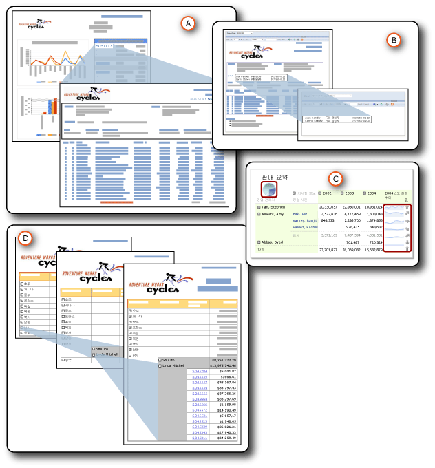

# 드릴스루, 드릴다운, 하위 보고서 및 중첩 데이터 영역
  일반 데이터와 세부 데이터 간의 관계를 표시하기 위해 여러 가지 방법으로 데이터를 구성할 수 있습니다.  보고서에 데이터를 모두 넣을 수 있지만 사용자가 세부 사항을 표시하기 위해 클릭( *드릴다운* 동작)할 때까지 표시되지 않도록 설정할 수 있습니다. 데이터 영역에 테이블이나 행렬처럼 다른 데이터 영역에 *중첩된* 테이블이나 차트와 같은 데이터를 데이터 영역에 표시할 수 있습니다. 주 보고서 내에 포함되어 있는 *하위 보고서* 에 데이터를 표시할 수 있습니다. 또는 사용자가 링크를 클릭했을 때 표시되는 별도의 보고서인 *드릴스루* 보고서에 세부 데이터를 지정할 수 있습니다.  
  
   
  
 1. 드릴스루 보고서  
  
 2. 하위 보고서  
  
 3. 중첩된 데이터 영역  
  
 4. 드릴다운 동작  
  
 이러한 항목 모두 공통점이 있지만 목적과 기능이 다릅니다. 이 중 드릴스루 보고서와 하위 보고서는 실제로 별도의 보고서입니다. 중첩이란 한 데이터 영역을 다른 데이터 영역 내에 지정하는 것을 말합니다. 드릴다운은 특정 보고서 항목을 숨기고 표시하기 위해 다른 보고서 항목에 적용할 수 있는 동작입니다. 이러한 방법으로 사용자가 보고서를 더 잘 이해할 수 있도록 데이터를 구성하고 표시할 수 있습니다.  
  
> [!NOTE]  
>  [!INCLUDE[ssRBRDDup](../../includes/ssrbrddup-md.md)]  
  
##   특징 요약  
 다음은 이러한 여러 특징을 요약한 표입니다. 세부 정보는 이 항목 뒷부분의 다른 섹션에서 설명합니다. 모든 보고서 항목에 표시 및 숨기기 동작을 적용할 수 있으므로 드릴다운은 이러한 비교에 포함되지 않았습니다.  
  
|특징|하위 보고서|드릴스루|중첩된|  
|-----------|---------------|------------------|------------|  
|주 보고서의 데이터 세트 사용|같거나 다른 데이터 집합|같거나 다른 데이터 집합|같은 데이터 집합|  
|데이터 검색|주 보고서와 같은 시간에 데이터 검색|한 번에 한 드릴스루 보고서에서 데이터 검색|주 보고서와 같은 시간에 모든 데이터 검색|  
|처리 및 렌더링|주 보고서를 통해|링크 클릭 시|주 보고서를 통해|  
|성능|느림(하지만 주 보고서를 통해 모든 데이터 검색)|빠름(하지만 주 보고서를 통해 일부 데이터만 검색)|빠름(그리고 주 보고서를 통해 모든 데이터 검색)|  
|매개 변수 사용|사용자 계정 컨트롤|예|아니오|  
|재사용 가능성|보고서로 또는 다른 보고서의 하위 보고서나 드릴스루 보고서로|보고서로 또는 다른 보고서의 하위 보고서나 드릴스루 보고서로|재사용 불가능|  
|할당|주 보고서 외부, 같거나 다른 보고서 서버|주 보고서 외부, 같은 보고서 서버|주 보고서 내부|  
|표시|주 보고서에|다른 보고서에|주 보고서에|  
  
  
##   특징 세부 정보  
  
###   사용하는 데이터 집합  
 하위 보고서 및 드릴스루 보고서에는 주 보고서에서 같은 데이터 세트나 다른 데이터 세트를 사용할 수 있습니다. 중첩된 데이터 영역에서는 같은 데이터 세트를 사용합니다.  
  
###   데이터 검색  
 하위 보고서와 중첩된 데이터 영역은 주 보고서와 같은 시간에 데이터를 검색하지만 드릴스루 보고서는 그렇지 않습니다. 각 드릴스루 보고서는 사용자가 각 링크를 클릭할 때 데이터를 검색합니다. 이 기능은 주 보고서와 종속된 보고서의 데이터를 동시에 검색해야 하는 경우 중요합니다.  
  
###   처리 및 렌더링  
 하위 보고서는 주 보고서의 일부로 처리됩니다. 예를 들어 주문 세부 정보를 표시하는 하위 보고서가 정보 행의 테이블 셀에 추가되는 경우 하위 보고서는 테이블의 행당 한 번만 처리되면 주 보고서의 일부로 렌더링됩니다. 드릴스루 보고서는 사용자가 요약 주 보고서의 드릴스루 링크를 클릭할 때 한 번만 처리되고 렌더링됩니다.  
  
###   성능  
 사용할 항목을 결정할 때 특히 하위 보고서가 여러 보고서에서 사용되지 않는 경우에는 하위 보고서 대신 데이터 영역을 사용하는 것이 좋습니다. 보고서 서버에서는 하위 보고서의 각 인스턴스를 개별 보고서로 처리하기 때문에 성능에 영향을 줄 수 있습니다. 데이터 영역은 하위 보고서와 같은 기능과 유연성을 제공하면서도 성능은 보다 우수합니다. 드릴스루 보고서는 주 보고서와 같은 시간에 모든 데이터를 검색하지 않으므로 하위 보고서보다 성능이 우수합니다.  
  
###   매개 변수 사용  
 일반적으로 드릴스루 보고서와 하위 보고서에는 표시할 보고서 데이터를 지정하는 보고서 매개 변수가 있습니다. 예를 들어 주 보고서에서 판매 주문 번호를 클릭하면 판매 주문 번호를 매개 변수로 사용한 다음 해당 판매 주문의 모든 데이터를 표시하는 드릴스루 보고서가 열립니다. 주 보고서에서 링크를 만들 때는 드릴스루 보고서에 매개 변수로 전달될 값을 지정합니다.  
  
 드릴스루 보고서나 하위 보고서를 만들려면 대상 드릴스루 보고서나 하위 보고서를 먼저 디자인한 다음 드릴스루 동작을 만들거나 주 보고서에 대한 참조를 추가해야 합니다.  
  
###   재사용 가능성  
 하위 보고서 및 드릴스루 보고서는 별도의 보고서입니다. 따라서 이러한 보고서를 여러 보고서에서 사용하거나 독립 실행형 보고서로 표시할 수 있습니다. 중첩된 데이터 영역은 재사용할 수 없습니다. 중첩된 데이터 영역은 데이터 영역에 중첩되어 있으므로 보고서 파트로 저장할 수 없습니다. 중첩된 데이터 영역을 보고서 파트로 포함하는 데이터 영역은 저장할 수 있지만 중첩된 데이터 영역은 저장할 수 없습니다.  
  
###   위치  
 하위 보고서와 드릴스루 보고서는 모두 별도의 보고서이므로 주 보고서 외부에 저장됩니다. 하위 보고서는 같거나 다른 보고서 서버에 있을 수 있지만 드릴스루 보고서는 같은 보고서 서버에 있어야 합니다. 중첩된 데이터 영역은 주 보고서의 파트입니다.  
  
###   디스플레이  
 하위 보고서 및 중첩된 데이터 영역은 주 보고서에 표시됩니다. 드릴스루 보고서는 자체적으로 표시됩니다.  
  
  
##   섹션 내용  
 [드릴스루 보고서&#40;보고서 작성기 및 SSRS&#41;](../../reporting-services/report-design/drillthrough-reports-report-builder-and-ssrs.md)  
 사용자가 주 보고서에서 링크를 클릭할 때 열리는 보고서를 설명합니다.  
  
 [하위 보고서&#40;보고서 작성기 및 SSRS&#41;](../../reporting-services/report-design/subreports-report-builder-and-ssrs.md)  
 주 보고서 본문 내에 표시되는 이러한 보고서를 설명합니다.  
  
 [중첩된 데이터 영역&#40;보고서 작성기 및 SSRS&#41;](../../reporting-services/report-design/nested-data-regions-report-builder-and-ssrs.md)  
 행렬 내에 중첩된 차트와 같이 한 데이터 영역을 다른 데이터 영역에 중첩시키는 작업에 대해 설명합니다.  
  
 [드릴다운 동작&#40;보고서 작성기 및 SSRS&#41;](../../reporting-services/report-design/drilldown-action-report-builder-and-ssrs.md)  
 드릴다운 동작을 사용하여 보고서 항목을 숨기고 표시하는 방법을 설명합니다.  
  
 [외부 항목에 대한 경로 지정&#40;보고서 작성기 및 SSRS&#41;](../../reporting-services/report-design/specifying-paths-to-external-items-report-builder-and-ssrs.md)  
 보고서 정의 파일 외부에 있는 항목을 참조하는 방법을 설명합니다.  
  
## 참고 항목  
 [보고서 매개 변수&#40;보고서 작성기 및 보고서 디자이너&#41;](../../reporting-services/report-design/report-parameters-report-builder-and-report-designer.md)  
  
  
