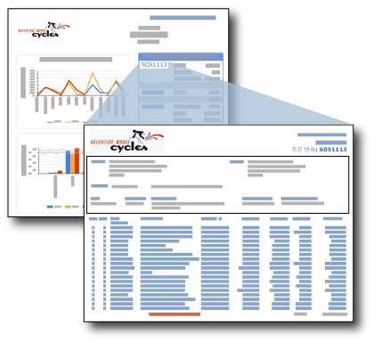

# 드릴스루 보고서(보고서 작성기 및 SSRS)
  드릴스루 보고서는 다른 보고서 내에서 링크를 클릭했을 때 열리는 보고서입니다. 드릴스루 보고서는 원본 요약 보고서에 포함된 항목에 대한 세부 정보를 포함합니다. 예를 들어 아래 그림의 판매 요약 보고서에는 판매 주문과 판매 총액이 나열되는데, 요약 목록에서 주문 번호를 클릭하면 해당 주문에 대한 세부 정보가 들어 있는 다른 보고서가 열립니다.  
  
   
  
 드릴스루 보고서의 데이터는 사용자가 주 보고서에서 드릴스루 보고서를 여는 링크를 클릭하기 전에는 검색되지 않습니다. 주 보고서와 드릴스루 보고서의 데이터를 동시에 검색해야 하는 경우에는 하위 보고서를 사용하는 것이 좋습니다. 자세한 내용은 [하위 보고서&#40;보고서 작성기 및 SSRS&#41;](../../reporting-services/report-design/subreports-report-builder-and-ssrs.md)를 참조하세요.  
  
> [!NOTE]  
>  보고서 작성기에서 작업할 때 주 보고서에서 드릴스루 링크를 클릭하면 열리는 드릴스루 보고서를 보려면 보고서 서버에 연결되어 있어야 합니다.  
  
 드릴스루 보고서를 빠르게 시작하려면 [자습서: 드릴스루 보고서 및 주 보고서 만들기&#40;보고서 작성기&#41;](../../reporting-services/tutorial-creating-drillthrough-and-main-reports-report-builder.md)를 참조하세요. 
   
## 드릴스루 보고서의 매개 변수  
 드릴스루 보고서는 일반적으로 요약 보고서에 의해 전달되는 매개 변수를 포함합니다. 판매 요약 보고서의 예에서 요약 보고서에는 테이블 셀의 입력란에 [OrderNumber] 필드가 포함됩니다. 드릴스루 보고서는 주문 번호를 값으로 사용하는 매개 변수를 포함합니다. [OrderNumber]에 대한 입력란에 드릴스루 보고서 링크를 설정하는 경우 대상 보고서의 매개 변수도 [OrderNumber]로 설정합니다. 사용자가 요약 보고서에서 주문 번호를 클릭하면 대상 정보 보고서가 열리고 해당 주문 번호에 대한 정보가 표시됩니다. 매개 변수 값을 기반으로 드릴스루 보고서를 사용자 지정하는 지침은 [보고서 매개 변수&#40;보고서 작성기 및 보고서 디자이너&#41;](../../reporting-services/report-design/report-parameters-report-builder-and-report-designer.md) 및 [InScope 함수&#40;보고서 작성기 및 SSRS&#41;](../../reporting-services/report-design/report-builder-functions-inscope-function.md)를 참조하세요.  
  
## 드릴스루 보고서 디자인  
 드릴스루 보고서를 만들려면 주 보고서에서 드릴스루 동작을 만들기 전에 먼저 드릴스루 보고서를 디자인해야 합니다.  
  
 모든 보고서를 드릴스루 보고서로 만들 수 있습니다. 일반적으로 드릴스루 보고서는 주 보고서의 링크를 기준으로 표시할 데이터를 지정하는 매개 변수를 하나 이상 사용합니다. 예를 들어 주 보고서의 링크가 판매 주문에 대해 정의된 경우에는 판매 주문 번호가 드릴스루 보고서에 전달됩니다.  
  
## 주 보고서에서 드릴스루 동작 만들기  
 입력란(테이블 또는 행렬의 셀에 있는 텍스트 포함), 이미지, 차트, 계기 또는 동작 속성 페이지가 있는 다른 모든 보고서 항목에 드릴스루 링크를 추가할 수 있습니다. 자세한 내용은 [보고서에 드릴스루 동작 추가&#40;보고서 작성기 및 SSRS&#41;](../../reporting-services/report-design/add-a-drillthrough-action-on-a-report-report-builder-and-ssrs.md)를 참조하세요.  
  
 주 보고서에서 드릴스루 동작을 보고서 동작 또는 URL 동작으로 만들 수 있습니다. 보고서 동작으로 만들려면 드릴스루 보고서가 주 보고서와 같은 보고서 서버에 있어야 하고, URL 동작으로 만들려면 드릴스루 보고서가 정규화된 URL 위치에 있어야 합니다. 보고서 서버 또는 보고서 서버와 통합된 SharePoint 사이트에 대해 보고서를 지정하는 방법은 서로 다를 수 있습니다. 보고서 서버가 SharePoint 통합 모드로 구성되어 있으면 URL 동작만 지원됩니다.  
  
 자세한 내용은 [보고서에 드릴스루 동작 추가&#40;보고서 작성기 및 SSRS&#41;](../../reporting-services/report-design/add-a-drillthrough-action-on-a-report-report-builder-and-ssrs.md) 및 [외부 항목에 대한 경로 지정&#40;보고서 작성기 및 SSRS&#41;](../../reporting-services/report-design/specifying-paths-to-external-items-report-builder-and-ssrs.md)을 참조하세요.  
  
## 드릴스루 보고서 보기  
 드릴스루 링크가 있는 요약 보고서를 게시한 후 보려면 드릴스루 보고서가 요약 보고서와 같은 보고서 서버에 있어야 합니다. 어떤 경우에도 사용자는 드릴스루 보고서에 대한 권한이 있어야 드릴스루 보고서를 볼 수 있습니다.  
  
## 참고 항목  
 [드릴스루, 드릴다운, 하위 보고서 및 중첩 데이터 영역&#40;보고서 작성기 및 SSRS&#41;](../../reporting-services/report-design/drillthrough-drilldown-subreports-and-nested-data-regions.md)  
  
  
