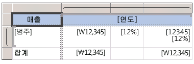

# 식(보고서 작성기 및 SSRS)
  식은 데이터를 검색, 계산, 표시, 그룹화, 정렬, 필터링, 매개 변수화 및 서식 지정하기 위해 [!INCLUDE[ssRSnoversion_md](../../includes/ssrsnoversion-md.md)] 에서 페이지를 매긴 보고서 전체에서 광범위하게 사용됩니다. 
  
  많은 보고서 항목 속성을 식으로 설정할 수 있으므로 식을 사용하면 보고서의 내용, 디자인 및 상호 작용을 제어할 수 있습니다. 식은 [!INCLUDE[msCoName](../../includes/msconame-md.md)] [!INCLUDE[vbprvb](../../includes/vbprvb-md.md)]으로 작성되고 보고서 정의에 저장되며 보고서를 실행할 때 보고서 처리기에서 계산됩니다.  
  
 워크시트에서 데이터에 대해 직접 작업하는 [!INCLUDE[msCoName](../../includes/msconame-md.md)] Office Excel 등의 애플리케이션과는 달리, 보고서에서는 데이터의 자리 표시자인 식을 사용하여 작업합니다. 계산된 식을 사용하여 실제 데이터를 보려면 보고서 미리 보기를 수행해야 합니다. 보고서를 실행하면 보고서 처리기가 보고서 데이터와 보고서 레이아웃 요소(예: 테이블 및 차트)가 결합될 때 각 식을 계산합니다.  
  
 보고서를 디자인할 때 보고서 항목에 대한 여러 식이 설정됩니다. 예를 들어 데이터 창의 필드를 보고서 디자인 화면의 테이블 셀로 끌어서 놓으면 입력란 값이 필드의 간단한 식으로 설정됩니다. 다음 그림에서는 보고서 데이터 창에 데이터 집합 필드 ID, Name, SalesTerritory, Code 및 Sales가 표시됩니다. [Name], [Code] 및 [Sales]라는 세 개의 필드가 테이블에 추가되었습니다. 디자인 화면에서 표기법 [Name]은 기본 식 `=Fields!Name.Value`를 나타냅니다.  
  
   
  
 보고서를 미리 볼 때 보고서 처리기는 테이블 데이터 영역을 데이터 연결의 실제 데이터와 결합하고 결과 집합의 각 행마다 하나의 테이블 행을 표시합니다.  
  
 식을 수동으로 입력하려면 디자인 화면에서 항목을 선택하고 바로 가기 메뉴 및 대화 상자를 사용하여 항목의 속성을 설정합니다. ***(fx)*** 단추나 `<Expression>` 값이 드롭다운 목록에 표시되면 해당 속성을 식으로 설정할 수 있다는 것입니다. 자세한 내용은 [식 추가&#40;보고서 작성기 및 SSRS&#41;](../../reporting-services/report-design/add-an-expression-report-builder-and-ssrs.md)를 나타냅니다.  
  
 복잡한 식이나 사용자 지정 코드 또는 사용자 지정 어셈블리를 사용하는 식을 개발하려면 [!INCLUDE[ssBIDevStudioFull](../../includes/ssbidevstudiofull-md.md)]에서 보고서 디자이너를 사용하는 것이 좋습니다. 자세한 내용은 [보고서 디자이너의 식에 포함된 사용자 지정 코드 및 어셈블리 참조&#40;SSRS&#41;](../../reporting-services/report-design/custom-code-and-assembly-references-in-expressions-in-report-designer-ssrs.md)를 나타냅니다.  
  
> [!NOTE]  
>  [!INCLUDE[ssRBRDDup](../../includes/ssrbrddup-md.md)]  
  
##   간단한 식 및 복잡한 식 이해  
 식은 등호(=)로 시작하며 [!INCLUDE[msCoName](../../includes/msconame-md.md)] [!INCLUDE[vbprvb](../../includes/vbprvb-md.md)]으로 작성됩니다. 식에는 상수, 연산자, 기본 제공 값(필드, 컬렉션 및 함수)에 대한 참조, 외부 또는 사용자 지정 코드에 대한 참조의 조합이 포함될 수 있습니다.  
  
 식을 사용하여 여러 보고서 항목 속성 값을 지정할 수 있습니다. 가장 일반적인 속성은 입력란 및 자리 표시자 텍스트에 대한 값입니다. 일반적으로 입력란에 식이 하나만 포함되어 있는 경우 식은 입력란 속성 값입니다. 입력란에 여러 개의 식이 포함되어 있으면 각 식은 입력란의 자리 표시자 텍스트 값입니다.  
  
 기본적으로 식은 보고서 디자인 화면에서 *간단한 식* 이나 *복잡한 식*으로 나타납니다.  
  
-   **간단한 식** 간단한 식에는 데이터 집합 필드, 매개 변수 또는 기본 제공 필드와 같은 기본 제공 컬렉션에 있는 단일 항목에 대한 참조가 포함됩니다. 디자인 화면에서 간단한 식은 대괄호 안에 나타납니다. 예를 들어 `[FieldName]` 은 기본 식 `=Fields!FieldName.Value`에 해당합니다. 보고서 레이아웃을 만들고 보고서 데이터 창의 항목을 디자인 화면으로 끌어서 놓으면 간단한 식이 자동으로 만들어집니다. 여러 다른 기본 제공 컬렉션을 나타내는 기호에 대한 자세한 내용은 [간단한 식의 접두사 기호 이해](#DisplayText)를 참조하세요.  
  
-   **복잡한 식** 복잡한 식에는 여러 개의 기본 제공 참조, 연산자 및 함수 호출에 대한 참조가 포함됩니다. 식 값에 간단한 참조 이상이 포함되어 있으면 복잡한 식이 <\<Expr>>로 나타납니다. 식을 보려면 식 위로 마우스를 이동하여 도구 설명을 사용합니다. 식을 편집하려면 **식** 대화 상자에서 식을 엽니다.  
  
 다음 그림에서는 입력란과 자리 표시자 텍스트 모두에 대한 일반적인 간단한 식과 복잡한 식을 보여 줍니다.  
  
   
  
 식에 대한 텍스트 대신 예제 값을 표시하려면 입력란 또는 자리 표시자 텍스트에 서식을 적용합니다. 다음 그림에서는 예제 값을 표시하도록 전환된 보고서 디자인 화면을 보여 줍니다.  
  
   
  
 자세한 내용은 [텍스트 및 자리 표시자 서식 지정&#40;보고서 작성기 및 SSRS&#41;](../../reporting-services/report-design/formatting-text-and-placeholders-report-builder-and-ssrs.md)에 대해 자세히 알아봅니다.  
  
### 보고서 모델 수식  
 보고서 모델을 데이터 원본으로 사용하는 데이터 집합에 대한 쿼리를 디자인할 때 *수식*을 만들 수 있습니다. 수식은 보고서 모델의 데이터를 기반으로 하는 보고서의 값에 대해 수행되는 계산입니다.  
  
 자세한 내용은 [보고서 모델 쿼리의 수식&#40;보고서 작성기 및 SSRS&#41;](../../reporting-services/report-design/formulas-in-report-model-queries-report-builder-and-ssrs.md)을 참조하세요.  
   
##   간단한 식의 접두사 기호 이해  
 간단한 식은 기호를 사용하여 참조가 필드, 매개 변수, 기본 제공 컬렉션 또는 ReportItems 컬렉션 중 어느 항목에 대한 것인지를 나타냅니다. 다음 표에서는 표시 텍스트 및 식 텍스트의 예를 보여 줍니다.  
  
|항목|표시 텍스트 예|식 텍스트 예|  
|----------|--------------------------|-----------------------------|  
|데이터 집합 필드|`[Sales]`   `[SUM(Sales)]`   `[FIRST(Store)]`|`=Fields!Sales.Value`   `=Sum(Fields!Sales.Value)`   `=First(Fields!Store.Value)`|  
|보고서 매개 변수|`[@Param]`   `[@Param.Label]`|`=Parameters!Param.Value`   `=Parameters!Param.Label`|  
|기본 제공 필드|`[&ReportName]`|`=Globals!ReportName.Value`|  
|표시 텍스트에 사용되는 리터럴 문자|`\[Sales\]`|`[Sales]`|  
  
##   복잡한 식 작성  
 식에는 함수, 연산자, 상수, 필드, 매개 변수, 기본 제공 컬렉션의 항목 및 포함된 사용자 지정 코드나 사용자 지정 어셈블리에 대한 참조가 포함될 수 있습니다.  
  
> [!NOTE]  
>  복잡한 식이나 사용자 지정 코드 또는 사용자 지정 어셈블리를 사용하는 식을 개발하려면 [!INCLUDE[ssNoVersion](../../includes/ssnoversion-md.md)][!INCLUDE[ssBIDevStudioFull](../../includes/ssbidevstudiofull-md.md)]에서 보고서 디자이너를 사용하는 것이 좋습니다. 자세한 내용은 [보고서 디자이너의 식에 포함된 사용자 지정 코드 및 어셈블리 참조&#40;SSRS&#41;](../../reporting-services/report-design/custom-code-and-assembly-references-in-expressions-in-report-designer-ssrs.md)를 나타냅니다.  
  
 다음 표에서는 식에 포함할 수 있는 참조의 종류를 보여 줍니다.  
  
|참조|설명|예제|  
|----------------|-----------------|-------------|  
|[상수](../../reporting-services/report-design/constants-in-expressions-report-builder-and-ssrs.md)|글꼴 색과 같은 상수 값을 요구하는 속성에 대해 대화형으로 액세스할 수 있는 상수에 대해 설명합니다.|`="Blue"`|  
|[연산자](../../reporting-services/report-design/operators-in-expressions-report-builder-and-ssrs.md)|식에서 참조를 조합하는 데 사용할 수 있는 연산자에 대해 설명합니다. 예를 들어 **&** 연산자는 문자열을 연결하는 데 사용됩니다.|`="The report ran at: " & Globals!ExecutionTime & "."`|  
|[기본 제공 컬렉션](../../reporting-services/report-design/built-in-collections-in-expressions-report-builder.md)|식에 포함할 수 있는 기본 제공 컬렉션(예: `Fields`, `Parameters`및 `Variables`)에 대해 설명합니다.|`=Fields!Sales.Value`   `=Parameters!Store.Value`   `=Variables!MyCalculation.Value`|  
|[기본 제공 보고서 및 집계 함수](../../reporting-services/report-design/report-builder-functions-aggregate-functions-reference.md)|`Sum` 또는 `Previous`와 같이 식에서 액세스할 수 있는 기본 제공 함수에 대해 설명합니다.|`=Previous(Sum(Fields!Sales.Value))`|  
|[보고서 디자이너의 식에 포함된 사용자 지정 코드 및 어셈블리 참조&#40;SSRS&#41;](../../reporting-services/report-design/custom-code-and-assembly-references-in-expressions-in-report-designer-ssrs.md)|기본 제공 CLR 클래스 <xref:System.Math> 및 <xref:System.Convert>, 다른 CLR 클래스, [!INCLUDE[vbprvb](../../includes/vbprvb-md.md)] 런타임 라이브러리 함수 또는 외부 어셈블리의 메서드에 액세스할 수 있는 방법에 대해 설명합니다.   보고서에 포함된 사용자 지정 코드 또는 컴파일하여 사용자 지정 어셈블리로 보고서 클라이언트와 보고서 서버에 설치한 사용자 지정 코드에 액세스할 수 있는 방법에 대해 설명합니다.|`=Sum(Fields!Sales.Value)`   `=CDate(Fields!SalesDate.Value)`   `=DateAdd("d",3,Fields!BirthDate.Value)`   `=Code.ToUSD(Fields!StandardCost.Value)`|  
   
##   식 유효성 검사  
 특정 보고서 항목 속성에 대한 식을 만들 때 식에 포함할 수 있는 참조는 보고서 항목 속성에 허용될 수 있는 값 및 속성이 계산되는 범위에 따라 달라집니다. 예를 들어 다음과 같이 사용할 수 있습니다.  
  
-   기본적으로 [Sum] 식은 식이 계산될 때 범위 내에 있는 데이터의 합계를 계산합니다. 테이블 셀의 경우 범위는 행 및 열 그룹 멤버 자격에 따라 달라집니다. 자세한 내용은 [합계, 집계 및 기본 제공 컬렉션의 식 범위&#40;보고서 작성기 및 SSRS&#41;](../../reporting-services/report-design/expression-scope-for-totals-aggregates-and-built-in-collections.md)를 나타냅니다.  
  
-   Font 속성 값은 글꼴 이름으로 계산되어야 합니다.  
  
-   식 구문은 디자인 타임에 유효성이 검사됩니다. 보고서를 게시할 때 식 범위 유효성 검사가 수행됩니다. 실제 데이터에 따라 달라지는 유효성 검사의 경우 런타임에만 오류가 검색될 수 있습니다. 이 식 중 일부는 렌더링된 보고서에 #Error를 오류 메시지로 생성합니다. 이러한 종류의 오류에 대한 문제를 확인하려면 [!INCLUDE[ssBIDevStudioFull](../../includes/ssbidevstudiofull-md.md)]에서 보고서 디자이너를 사용해야 합니다. 보고서 디자이너에는 이 오류에 대한 자세한 정보를 제공하는 출력 창이 있습니다.  
  
 자세한 내용은 [식 참조&#40;보고서 작성기 및 SSRS&#41;](../../reporting-services/report-design/expression-reference-report-builder-and-ssrs.md)를 나타냅니다.  
  
##   섹션 내용  
 [식 추가&#40;보고서 작성기 및 SSRS&#41;](../../reporting-services/report-design/add-an-expression-report-builder-and-ssrs.md)  
  
 [보고서에 사용되는 식&#40;보고서 작성기 및 SSRS&#41;](../../reporting-services/report-design/expression-uses-in-reports-report-builder-and-ssrs.md)  
  
 [합계, 집계 및 기본 제공 컬렉션의 식 범위&#40;보고서 작성기 및 SSRS&#41;](../../reporting-services/report-design/expression-scope-for-totals-aggregates-and-built-in-collections.md)  
  
 [식 참조&#40;보고서 작성기 및 SSRS&#41;](../../reporting-services/report-design/expression-reference-report-builder-and-ssrs.md)  

## 참고 항목
 자세한 내용 및 예제는 다음 항목을 참조하십시오.  
  
-   [보고서에 사용되는 식&#40;보고서 작성기 및 SSRS&#41;](../../reporting-services/report-design/expression-uses-in-reports-report-builder-and-ssrs.md)  
-   [식 예&#40;보고서 작성기 및 SSRS&#41;](../../reporting-services/report-design/expression-examples-report-builder-and-ssrs.md)  
-   [필터 수식 예&#40;보고서 작성기 및 SSRS&#41;](../../reporting-services/report-design/filter-equation-examples-report-builder-and-ssrs.md)  
-   [그룹 식 예&#40;보고서 작성기 및 SSRS&#41;](../../reporting-services/report-design/group-expression-examples-report-builder-and-ssrs.md)  
-   [자습서: 식 소개](Tutorial:%20Introducing%20Expressions.md)
-   [보고서 예제(보고서 작성기 및 SSRS)](https://go.microsoft.com/fwlink/?LinkId=198283)  
  
