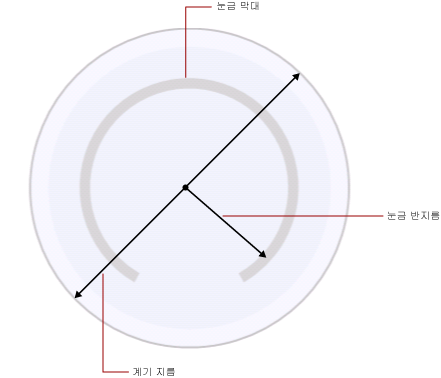

# 계기의 눈금 서식 지정(보고서 작성기 및 SSRS)
  페이지가 매겨진 [!INCLUDE[ssRSnoversion_md](../../includes/ssrsnoversion-md.md)] 계기 눈금은 계기에 표시되는 최대값과 최소값에 바인딩된 숫자 범위입니다. 일반적으로 계기 눈금에는 계기 포인터가 표시하는 값을 정확하게 판독할 수 있도록 계기 레이블과 눈금 표시가 포함됩니다. 계기 눈금은 일반적으로 하나 이상의 계기 포인터와 연결됩니다. 동일한 계기에 둘 이상의 눈금이 있을 수 있습니다.  
  
   
  
 여러 그룹이 정의되는 차트와 달리 계기에는 하나의 값만 표시됩니다. 눈금의 최소값과 최대값을 정의해야 합니다. 간격 수는 최소값과 최대값으로 지정된 값을 기반으로 자동으로 계산됩니다.  
  
 이미 하나의 눈금이 포함된 계기에 두 번째 눈금을 추가하면 첫 번째 눈금의 모양 속성이 두 번째 눈금에 복사됩니다.  
  
 눈금 레이블이나 눈금 표시를 마우스 오른쪽 단추로 클릭하고 **방사형 눈금 속성** 또는 **선형 눈금 속성**을 선택하여 눈금의 속성을 설정할 수 있습니다. 각 계기 유형마다 동일한 속성 집합을 가진 눈금이 최소 하나 이상 있습니다. 각 계기 유형에 고유한 속성도 있습니다.  
  
-   방사형 계기에서는 방사형 눈금의 반지름, 시작 각도 및 스윕 각도를 지정할 수 있습니다.  
  
-   선형 계기에서는 선형 계기의 엔드포인트에 상대적인 시작 여백 및 끝 여백의 너비를 지정할 수 있습니다.  
  
 눈금 서식 지정을 빠르게 시작하려면 [계기의 최소값 또는 최대값 설정&#40;보고서 작성기 및 SSRS&#41;](../../reporting-services/report-design/set-a-minimum-or-maximum-on-a-gauge-report-builder-and-ssrs.md)을 참조하세요.  
  
##   눈금의 최소값, 최대값 및 간격 정의  
 계기는 0부터 100까지의 백분율로 측정된 KPI를 표시하는 데 자주 사용되므로 이러한 값은 계기의 최소값 및 최대값 속성에 지정되는 기본값입니다. 하지만 이러한 값이 표시하려고 하는 눈금 값을 나타내지 않을 수 있습니다. KPI 데이터 필드가 나타내는 대상을 확인하는 기본 제공 논리가 없기 때문에 계기는 최소값과 최대값을 자동으로 계산하지 않습니다. KPI 데이터 필드가 0부터 100 사이의 값이 아닌 경우 계기에 표시되는 값에 컨텍스트를 부여하기 위해 최소값 및 최대값 속성에 대한 값을 명시적으로 설정해야 합니다.  
  
 눈금에는 주 눈금 표시와 보조 눈금 표시가 있습니다. 또한 눈금에는 일반적으로 주 눈금 표시와 연결되는 레이블이 있습니다. 예를 들어 눈금의 0, 20, 40, 60, 80, 100 위치에 주 눈금 표시가 있을 수 있습니다. 레이블은 이러한 눈금 표시에 대응되어야 합니다. 레이블 값 사이의 차이를 눈금 간격이라고 합니다. 이 예제의 눈금 간격은 20으로 설정되었습니다. 간격 속성은 **방사형 눈금 속성** 또는 **선형 눈금 속성** 대화 상자에서 설정할 수 있습니다.  
  
 애플리케이션에서는 다음 단계에 따라 눈금 간격을 계산합니다.  
  
1.  최소값 및 최대값을 지정합니다. 이 값은 데이터 세트에 따라 자동으로 계산되지 않으므로 계기의 **속성** 대화 상자에서 값을 제공해야 합니다.  
  
2.  간격에 대한 값을 지정하지 않은 경우 기본값은 자동입니다. 기본값을 사용하면 애플리케이션은 첫 번째 단계에서 지정한 최소값과 최대값을 기반으로 간격의 등거리 수를 계산합니다. 간격에 대한 값을 지정하면 계기는 최대값과 최소값 사이의 차이를 계산한 다음 이 수를 간격 속성에 지정한 값으로 나눕니다.  
  
 레이블과 눈금 표시 간격을 정의하는 속성도 있습니다. 이 속성의 값을 지정하면 지정한 값이 눈금 간격 속성에 지정된 값 대신 사용됩니다. 예를 들어 눈금 간격을 자동으로 지정했더라도 레이블 간격으로 4를 지정하면 레이블은 0, 4, 8 등으로 표시됩니다. 하지만 주 눈금 표시는 여전히 자체 계산에 따라 계기에 의해 계산됩니다. 이로 인해 레이블이 눈금 표시와 동기화되지 않는 문제가 발생할 수 있습니다. 따라서 레이블 간격을 설정할 경우에는 눈금 표시를 숨기는 것을 고려하십시오.  
  
 간격 오프셋에 따라 첫 번째 레이블을 표시하기 전에 건너뛸 단위 수가 결정됩니다. 눈금에 표시되는 모든 연속되는 주 눈금 표시와 레이블에는 지정된 간격이 사용됩니다. 레이블 또는 눈금 표시 간격으로 0 값을 지정하면 간격을 자동 값으로 재설정하는 것과 같습니다.  
  
##   승수를 사용하여 레이블 겹침 방지  
 값의 자릿수가 많으면 계기를 쉽게 판독할 수 없습니다. 이와 같은 경우 눈금 승수를 사용하여 눈금 값을 늘리거나 줄일 수 있습니다. 눈금 승수를 지정하면 눈금의 원래 값에 승수를 곱한 후 눈금에 표시합니다. 눈금 값을 줄이려면 소수를 지정해야 합니다. 예를 들어 눈금의 범위가 0부터 10000까지일 때 0부터 10까지의 숫자를 계기에 표시하려면 0.001의 승수 값을 사용할 수 있습니다.  
  
> [!NOTE]  
>  승수를 사용하는 경우 승수 값을 계기가 사용하는 집계 필드의 실제 값에 곱하는 것이 아니라, 최소값, 최대값 및 간격이 정의된 후 계기에 표시되는 레이블의 값에 곱하게 됩니다. 승수를 사용할 때 간격 계산을 자동으로 유지하는 것을 고려하십시오.  
  
##   방사형 눈금의 눈금 막대 너비, 반지름 및 각도 지정  
 **방사형 눈금 속성** 대화 상자의 **레이아웃** 페이지를 사용하여 눈금 막대 너비, 눈금 반지름, 시작 각도 및 눈금의 스윕 각도를 지정합니다. 이들 속성을 사용하여 눈금의 크기와 형태를 사용자 지정할 수 있습니다. 예를 들어 눈금 레이블을 눈금 바깥쪽에 배치한 경우에는 레이블이 계기 안쪽에 올바르게 표시되도록 눈금 반지름의 크기를 조정해야 합니다.  
  
> [!NOTE]  
>  계기의 눈금을 클릭하면 눈금 주위에 점선 윤곽선이 나타납니다. 이 윤곽선은 눈금 막대가 아닙니다. 또한 계기에서 측정 값을 계산할 때 사용되지 않으며, 디자인 타임에 눈금 속성에 액세스하기 위해 눈금을 선택할 때 사용할 수 있습니다.  
  
 모든 측정은 눈금 막대를 기반으로 합니다. 계기를 선택하면 눈금 막대 너비가 표시되지 않습니다. 눈금 막대에 값을 지정하면 다른 모든 측정을 눈금에 상대적으로 수행할 수 있습니다. 눈금 막대를 표시하려면 **방사형 눈금 속성** 대화 상자의 **레이아웃** 페이지에서 **눈금 막대 너비** 속성을 0보다 큰 값으로 설정합니다. 방사형 계기에서 눈금 막대는 계기 지름의 백분율로 측정됩니다. 선형 계기에서 눈금 막대는 계기 너비 또는 높이의 백분율 중 가장 작은 것으로 측정됩니다.  
  
 눈금 반지름은 계기 중심에서 눈금 막대 중심까지의 거리입니다. 눈금 반지름의 값은 계기 지름의 백분율로 측정됩니다. 반지름 값은 35 미만으로 유지하는 것이 좋습니다. 35보다 큰 값을 지정하면 눈금이 계기 경계 바깥쪽에 그려질 수 있습니다. 다음 그림은 눈금 막대에서 계기 지름에 상대적인 눈금 반지름을 측정하는 방법을 보여 줍니다.  
  
   
  
 시작 각도는 눈금이 시작되는 값으로, 0부터 360 사이의 회전 각도입니다. 계기의 맨 아래 부분이 위치 0이며 시작 각도는 시계 방향으로 회전합니다. 예를 들어 시작 각도가 90도이면 9시 위치에서 눈금이 시작됩니다.  
  
 스윕 각도는 원에서 눈금이 스윕되는 각도(0부터 360 사이)입니다. 스윕 각도가 360도면 완전한 원 모양의 눈금이 만들어집니다. 시계 모양의 계기를 디자인할 때 유용합니다.  
  
##   선형 또는 방사형 눈금에 레이블 배치  
 레이블의 위치를 결정하는 두 개의 속성이 있습니다. 레이블 배치 속성은 레이블을 눈금 막대의 안쪽에 표시할지, 바깥쪽에 표시할지 또는 눈금 막대를 가로질러 표시할지를 지정합니다. 거리 속성은 눈금 막대에서 시작하여 눈금부터 레이블까지의 거리를 설정합니다. 레이블을 눈금 막대 안에 배치하려면 음수를 지정합니다. 예를 들어 레이블이 눈금 바깥쪽에 있을 때 눈금으로부터의 거리를 10으로 설정하면, 레이블은 일반적으로 레이블이 표시되는 위치에서 10단위 바깥쪽에 표시됩니다. 여기서 1단위는 다음 중 하나입니다.  
  
-   방사형 계기에서 계기 지름의 1%  
  
-   선형 계기에서 계기 높이나 너비 값 중 가장 작은 값의 1%  
  
## 참고 항목  
 [계기에서 범위 서식 지정&#40;보고서 작성기 및 SSRS&#41;](../../reporting-services/report-design/formatting-ranges-on-a-gauge-report-builder-and-ssrs.md)   
 [계기의 포인터 서식 지정&#40;보고서 작성기 및 SSRS&#41;](../../reporting-services/report-design/formatting-pointers-on-a-gauge-report-builder-and-ssrs.md)   
 [축 레이블의 서식을 날짜 또는 통화로 지정&#40;보고서 작성기 및 SSRS&#41;](../../reporting-services/report-design/format-axis-labels-as-dates-or-currencies-report-builder-and-ssrs.md)   
 [차트의 축 레이블 서식 지정&#40;보고서 작성기 및 SSRS&#41;](../../reporting-services/report-design/formatting-axis-labels-on-a-chart-report-builder-and-ssrs.md)   
 [계기&#40;보고서 작성기 및 SSRS&#41;](../../reporting-services/report-design/gauges-report-builder-and-ssrs.md)  
  
  
