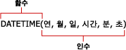

# 보고서 모델 쿼리의 수식(보고서 작성기 및 SSRS)
  수식은 보고서 모델을 데이터 원본으로 사용하는 보고서의 값에 대해 수행되는 계산입니다. 보고서 모델 데이터 원본의 쿼리를 정의할 때 보고서 모델 쿼리 디자이너의 **수식 정의 대화 상자** 에서 수식을 정의합니다. 수식에는 함수, 연산자, 상수 그리고 필드나 엔터티에 대한 참조가 포함될 수 있습니다. 수식을 사용하면 숫자 데이터 및 텍스트 데이터를 결합, 집계, 필터링 및 계산할 수 있습니다. 수식을 만들어 새 필드로 저장하거나 기존 필드의 수식을 수정할 수 있습니다.  
  
 수식은 RDL 식이 아니며 등호(=)로 시작하지 않습니다. RDL 식에 대한 자세한 내용은 [식&#40;보고서 작성기 및 SSRS&#41;](../../reporting-services/report-design/expressions-report-builder-and-ssrs.md)을 참조하세요.  
  
 수식은 다음과 유사한 형태를 띨 수 있습니다.  
  
-   **라인 총 합계**  
  
-   6+12  
  
-   **SUM**(**IF**(**Finished Goods Flag**, "Finished", "Unfinished"))  
  
> [!NOTE]  
>  [!INCLUDE[ssRBRDDup](../../includes/ssrbrddup-md.md)]  
  
## References  
 참조는 필드 이름입니다. 이는 엔터티 내의 기존 필드 이름이거나 사용자가 만들어 필드 목록에 추가한 계산 필드 이름일 수 있습니다. 참조는 보고서 작성기에게 수식 내에서 사용하려는 값이나 데이터를 어디서 찾아야 할지 알려 줍니다. 같은 컨텍스트의 엔터티에 있는 필드뿐 아니라 다른 엔터티에 있는 필드도 하나의 수식에서 참조할 수 있으며 한 필드의 값을 여러 수식에서 사용할 수도 있습니다.  
  
 참조를 사용하면 보고서 처리기가 필드 내의 각 값에 대해 수식을 실행합니다. 예를 들어 어떤 필드에 과거 5년간 연간 매출액 합계가 들어 있다고 가정합니다. 이 필드에는 5개의 값이 있고 각 값은 해당 연도의 총 판매액을 나타냅니다. 수식에 이 필드에 대한 참조가 포함되어 있는 경우 수식은 각 개별 값을 사용하여 새 값을 계산합니다.  
  
## 연산자  
 연산자는 수식의 값에 대해 수행하려는 계산의 유형을 지정합니다. 계산 연산자에는 산술 연산자, 비교 연산자 및 텍스트 연산자라는 3가지 유형이 있습니다. 더하기 기호(+)와 같은 기호를 사용하여 연산자를 나타냅니다.  
  
 **산술 연산자.** 산술 연산자는 더하기, 빼기 또는 곱하기와 같은 기본 수치 연산을 수행하고, 숫자를 결합하고, 숫자 결과를 산출합니다.  
  
 **비교 연산자.** 비교 연산자를 사용하여 두 값을 비교할 수 있습니다. 이러한 연산자를 사용하여 두 값을 비교하면 그 결과는 TRUE 또는 FALSE 중 하나의 논리 값이 됩니다.  
  
 **텍스트 연결 연산자.** 앰퍼샌드(&)를 사용하여 하나 이상의 텍스트 문자열을 결합 또는 연결하여 단일 텍스트로 만들 수 있습니다.  
  
##   상수  
 상수는 계산되지 않는 값이므로 변경되지 않습니다. 보고서 작성기에서는 **True**, **False**, 및 **Empty**같은 상수를 사용합니다. 부울 필드를 평가할 때 이러한 상수를 사용합니다. 예를 들어 IsDiscontinued라는 필드가 있다고 가정합니다. 이 필드에 대해 유일하게 유효한 값은 True, False 또는 Empty(" ")입니다.  
  
##   함수  
 함수는 특정한 순서로 지정된 *인수*라고 하는 특정한 값을 사용하여 계산을 수행하는 미리 정의된 수식입니다. 인수는 리터럴 값 또는 필드이거나 둘을 결합한 것일 수 있습니다. 수식에 필드를 사용하는 경우 필드 이름은 필드의 각 인스턴스를 나타냅니다. 인수가 리터럴 값인 경우 특정 문자를 사용하여 그 인수가 리터럴 값임을 나타내야 할 수 있습니다.  
  
 함수를 사용하여 간단하거나 복잡한 계산을 수행할 수 있습니다. 함수의 구조는 함수 이름으로 시작되고 그 뒤로 여는 괄호, 쉼표로 구분된 함수에 대한 인수, 닫는 괄호로 되어 있습니다.  
  
   
  
 인수는 필드 참조, 숫자, 텍스트 그리고 **TRUE** 또는 **FALSE**와 같은 논리 값이 될 수 있습니다. 또한 상수, 수식 또는 다른 함수가 될 수도 있습니다. 입력하는 인수는 반드시 그 인수에 대해 유효한 값을 생성해야 합니다. 예를 들어 수식이 두 정수를 곱하는 식인 경우 결과가 텍스트 문자열이 될 수는 없습니다.  
  
 보고서 작성기에는 공통적으로 사용되는 다음 9가지 범주의 함수가 제공됩니다.  
  
|||  
|-|-|  
|집계 함수|**AVG**, **COUNT**, **COUNTDISTINCT**, **MAX**, **MIN**, **STDEV**, **STDEVP**, **SUM**, **VAR**, **VARP**|  
|조건부 함수|**IF**, **IN**, **SWITCH**|  
|변환 함수|**INT**, **DECIMAL**, **FLOAT**, **TEXT**|  
|날짜 및 시간 함수|**DATE**, **DATEADD**, **DATEDIFF**, **DATETIME**, **DATEONLY**, **DAY**, **DAYOFWEEK**, **DAYOFYEAR**, **HOUR**, **MINUTE**, **MONTH**, **NOW**, **QUARTER**, **SECOND**, **TIMEONLY**, **TODAY**, **WEEK**, **YEAR**|  
|정보 함수|**GETUSERCULTURE**, **GETUSERID**|  
|논리 함수|**AND**, **NOT**, **OR**|  
|수치 연산 함수|**MOD**, **ROUND**, **TRUNC**|  
|연산자|더하기(+), 나누기(/), 같음(=), 지수(^), 큼(>), 크거나 같음(>=), 작음(<), 작거나 같음(<=), 곱하기(*), 부정(-), 같지 않음(<>), 빼기(-)|  
|텍스트 함수|**CONCAT**, **FIND**, **LEFT**, **LENGTH**, **LOWER**, **LTRIM**, **REPLACE**, **RIGHT**, **RTRIM**, **SUBSTRING**, **UPPER**|  
  
  
