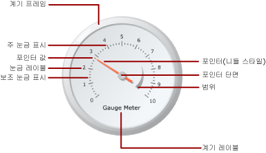

# 계기(보고서 작성기 및 SSRS)
  페이지가 매겨진 [!INCLUDE[ssRSnoversion_md](../../includes/ssrsnoversion-md.md)] 보고서의 계기 데이터 영역에는 데이터 집합의 단일 값이 표시됩니다. 개별 계기는 항상 자식 또는 인접 계기를 추가할 수 있는 계기 패널 안에 배치됩니다. 필터링, 그룹화, 정렬 등 일반적인 기능을 공유하는 여러 계기를 한 계기 패널 안에 만들 수 있습니다.  
  
 계기는 보고서에서 여러 태스크를 수행할 수 있습니다.  
  
-   단일 방사형 또는 선형 계기에 KPI(핵심 성과 지표)를 표시합니다.  
  
-   테이블 또는 행렬 안에 계기를 넣어 각 셀 안의 값을 보여 줍니다.  
  
-   한 계기 패널에 여러 계기를 사용하여 필드 간의 데이터를 비교합니다.  
  
 방사형 및 선형이라는 두 가지 계기 유형이 있습니다. 다음 그림은 계기 패널에서 단일 방사형 계기의 기본 요소를 보여 줍니다.  
  
   
  
 계기를 KPI로 사용하는 방법에 대한 자세한 내용은 [자습서: 보고서에 KPI 추가&#40;보고서 작성기&#41;](../../reporting-services/tutorial-adding-a-kpi-to-your-report-report-builder.md)를 참조하세요.  
  
> [!NOTE]  
>  계기를 보고서와는 별도로 보고서 파트로 게시할 수 있습니다. [보고서 파트](../../reporting-services/report-design/report-parts-report-builder-and-ssrs.md)에 대해 자세히 알아봅니다.  
  
##   계기 유형  
 [!INCLUDE[ssRSnoversion](../../includes/ssrsnoversion-md.md)] 에서는 방사형 및 선형이라는 두 가지 계기 유형을 제공합니다. 방사형 계기는 일반적으로 데이터를 속도로 표시하려는 경우 사용하고, 선형 계기는 데이터를 온도나 눈금 값으로 표시하려는 경우 사용합니다.  
  
 이 두 유형 간의 가장 큰 차이는 계기의 전체적인 모양과 사용 가능한 계기 포인터입니다. 방사형 계기는 전체 또는 부분적으로 원형이며 자동차의 주행 기록기와 비슷한 모양입니다. 계기 포인터는 대개 니들이지만 표식이나 막대인 경우도 있습니다.  
  
 선형 계기는 가로 또는 세로 방향의 사각형이며 눈금자와 비슷한 모양입니다. 계기 포인터는 대개 온도계 모양이지만 표식이나 막대인 경우도 있습니다. 이 계기는 이러한 모양으로 인해 테이블 또는 행렬 데이터 영역에 통합되어 진행률 데이터를 보여 주는 데 유용합니다.  
  
 이러한 차이 외는 두 계기 유형이 유사하므로 서로 바꿔 사용할 수 있습니다. 그러나 보고서에서 단순한 계기를 사용해야 하는 경우에는 계기 대신 표시기 사용을 고려해야 합니다. 자세한 내용은 [표시기&#40;보고서 작성기 및 SSRS&#41;](../../reporting-services/report-design/indicators-report-builder-and-ssrs.md)를 참조하세요.  
  
 다음 그림에서는 방사형 및 선형 계기를 보여 줍니다. 방사형 계기는 둥근 모양이며 니들 포인터를 사용하고, 선형 계기는 가로 모양이며 온도계 포인터를 사용합니다.  
  
 **방사형 계기**  
  
   
  
 방사형 계기 옵션: 방사형, 미니 계기가 있는 방사형, 두 개의 눈금, 북동쪽 90도, 북서쪽 90도, 남서쪽 90도, 남동쪽 90도, 북쪽 180도, 남쪽 180도, 서쪽 180도, 동쪽 180도 및 측정기  
  
 **선형 계기**  
  
   
  
 선형 계기 옵션: 가로, 세로, 여러 막대 포인터, 두 개의 눈금, 세 개의 색 범위, 로그, 온도계, 온도계 화씨/섭씨 및 블릿(Bullet) 그래프  
  
##   계기에 데이터 추가  
 디자인 화면에 계기를 추가한 후에 데이터 집합 필드를 계기 데이터 창으로 끕니다. 기본적으로 계기에서는 필드 값을 하나의 값으로 집계하여 계기에 표시합니다. Value 속성을 사용하여 이 값을 포인터에 연결합니다. 필드의 데이터 형식에 따라 계기에서는 SUM 또는 COUNT 집계를 사용합니다. 덧셈이 가능한 숫자 데이터를 사용할 때는 계기에서 SUM 함수를 사용하고 그렇지 않은 경우에는 COUNT 집계를 사용합니다. 포인터 값은 다른 집계를 사용하거나 집계를 사용하지 않을 수도 있습니다.  
  
 그룹화를 계기에 추가하면 계기에 개별 그룹 또는 개별 행을 표시할 수 있습니다. 계기에서는 그룹화와 필터링을 적용할 때 포인터 값을 사용해 반환된 데이터 집합의 마지막 그룹이나 행을 표시합니다.  
  
 다른 포인터를 추가하여 개별 계기에 여러 값을 추가할 수 있습니다. 이 포인터는 같은 눈금에 속할 수 있으며 다른 눈금을 추가한 다음 포인터를 해당 눈금과 연결할 수도 있습니다.  
  
 **차트 종류 선택** 대화 상자에서 사용할 수 있는 차트 종류와 달리 **계기 유형 선택** 대화 상자에서 사용할 수 있는 계기 유형은 계기 속성의 조합을 사용하여 생성됩니다. 따라서 차트 종류를 변경하는 방법으로 계기 유형을 변경할 수는 없습니다. 계기 유형을 변경하려면 계기를 제거하고 디자인 화면에 다시 추가해야 합니다. 계기에는 적어도 하나의 눈금과 하나의 포인터가 있습니다. 계기를 마우스 오른쪽 단추로 클릭하고 **눈금 추가**를 선택하여 여러 눈금을 사용할 수 있습니다. 기본적으로 이 방법은 첫 번째 눈금 안에 보다 작은 눈금을 만듭니다. 눈금에는 눈금 표시와 레이블이 표시됩니다. 주 눈금 표시 및 보조 눈금 표시의 두 가지 눈금 표시 집합이 있습니다.  
  
 계기를 마우스 오른쪽 단추로 클릭하고 **포인터 추가**를 선택하여 여러 포인터를 사용할 수 있습니다. 그러면 같은 눈금에 또 다른 포인터가 생성되지만, 눈금이 여러 개인 경우에는 계기에 있는 아무 눈금에나 포인터를 연결할 수 있습니다.  
  
### 계기에 데이터를 추가할 때의 고려 사항  
 다른 모든 데이터 영역과 마찬가지로 계기 데이터 영역도 하나의 데이터 집합에만 바인딩할 수 있습니다. 데이터 집합이 여러 개인 경우에는 JOIN 또는 UNION을 사용하여 하나의 데이터 집합으로 만들거나 데이터 집합별로 다른 계기를 사용하는 방법을 고려해 보십시오.  
  
 숫자 데이터 형식은 SUM 함수를 사용하여 집계합니다. 숫자가 아닌 데이터 형식은 데이터 집합 또는 그룹 내의 특정 값이나 필드의 인스턴스 수를 세는 COUNT 함수로 집계합니다.  
  
 데이터가 추가된 후 포인터를 마우스 오른쪽 단추로 클릭하면 포인터 값 지우기 및 포인터 삭제 옵션이 나타납니다. 포인터 값 지우기 옵션을 사용하면 계기에 연결된 필드가 제거되지만 포인터는 계기에 계속 나타납니다. 포인터 삭제 옵션은 계기에서 필드를 제거한 후 보기에서 포인터를 삭제합니다. 계기에 필드를 다시 추가하면 기본 포인터가 다시 나타납니다. 계기에 필드를 추가한 뒤 계기의 값에 컨텍스트를 부여하려면 해당 눈금에 대한 최대값과 최소값을 설정해야 합니다. 또한 범위의 최소값과 최대값을 설정하여 눈금의 주요 영역을 나타낼 수도 있습니다. 계기는 값을 인식하는 방법을 알지 못하므로 눈금 또는 범위의 최소값이나 최대값을 자동으로 설정할 수 없습니다.  
  
### 계기에 데이터를 추가하는 방법  
 보고서의 데이터 집합을 정의한 후에는 다음 방법 중 하나를 사용하여 계기에 데이터 필드를 추가할 수 있습니다.  
  
-   데이터 집합의 필드를 데이터 창으로 끕니다. 계기를 클릭하고 필드를 계기로 끕니다. 계기를 클릭하거나 계기로 필드를 끄는 방법으로 데이터 창을 열 수 있습니다. 계기에 포인터가 없는 경우 포인터가 추가되고 새로 추가한 필드에 바인딩됩니다.  
  
-   데이터 창을 표시하고 필드 자리 표시자를 가리킵니다. 필드 자리 표시자 옆에 있는 아래쪽 화살표를 클릭하고 사용할 필드를 선택합니다. 이미 선택된 필드가 있을 경우에는 아래쪽 화살표를 클릭한 다음 다른 필드를 선택합니다.  
  
    > [!NOTE]  
    >  계기에 포인터가 없거나 보고서에 여러 개의 데이터 집합이 포함되어 있고 계기 패널이 데이터 집합과 연결되지 않은 경우에는 이 방법을 사용할 수 없습니다.  
  
-   계기 포인터를 마우스 오른쪽 단추로 클릭하고 **포인터 속성**을 선택합니다. **값**에 대해서는 드롭다운 목록에서 필드를 선택하거나 **식** (*fx*) 단추를 클릭하여 필드 식을 정의합니다.  
  
### 필드를 단일 값으로 집계  
 계기에 필드를 추가하면 기본적으로 [!INCLUDE[ssRSnoversion](../../includes/ssrsnoversion-md.md)] 에서 필드의 집계 값을 계산합니다. 숫자 데이터 형식은 SUM 함수를 사용하여 집계합니다. 숫자가 아닌 데이터 형식은 데이터 집합 또는 그룹 내의 특정 값이나 필드의 인스턴스 수를 세는 COUNT 함수로 집계합니다. 값 필드의 데이터 형식이 문자열이면 필드에 숫자가 있더라도 계기에서 숫자 값을 표시할 수 없습니다. 대신 계기에서는 COUNT 함수를 사용하여 문자열 필드를 집계합니다. 이러한 현상을 방지하려면 필드에 서식 지정된 숫자가 포함된 문자열이 아니라 숫자 데이터 형식이 지정되어야 합니다. Visual Basic 식을 사용하여 CDbl 또는 CInt 상수로 문자열 값을 숫자 데이터 형식으로 변환할 수 있습니다. 예를 들어 다음 식은 MyField라는 문자열 필드를 숫자 값으로 변환합니다.  
  
 `=Sum(CDbl(Fields!MyField.Value))`  
  
 집계 식에 대한 자세한 내용은 [집계 함수 참조&#40;보고서 작성기 및 SSRS&#41;](../../reporting-services/report-design/report-builder-functions-aggregate-functions-reference.md)를 참조하세요.  
  
### 계기에서 그룹 정의  
 계기에 필드를 추가한 후에는 하나의 데이터 그룹을 추가할 수 있습니다. 계기는 하나의 데이터 영역에 여러 그룹을 표시할 수 있는 [!INCLUDE[ssRSnoversion](../../includes/ssrsnoversion-md.md)]의 다른 모든 데이터 영역과 다릅니다. 계기에서 그룹 식을 정의하여 그룹을 추가하는 것은 테이블릭스 데이터 영역에 행 그룹을 추가하는 것과 같습니다. 하지만 그룹이 추가되면 마지막 그룹의 값만이 계기에서 포인터 값으로 표시됩니다. 예를 들어 연도에 대한 그룹화 식을 추가하면 포인터는 데이터 집합의 마지막 연도에 대한 집계 판매 값을 나타내는 값을 가리킵니다. 그룹에 대한 자세한 내용은 [그룹 이해&#40;보고서 작성기 및 SSRS&#41;](../../reporting-services/report-design/understanding-groups-report-builder-and-ssrs.md)를 참조하세요.  
  
 예를 들어 여러 계기가 표시되는 테이블이나 목록에서 그룹별로 집계된 데이터를 표시하려는 경우 계기에 그룹을 추가할 수 있습니다. 자세한 내용은 [데이터 영역에서 그룹 추가 또는 삭제&#40;보고서 작성기 및 SSRS&#41;](../../reporting-services/report-design/add-or-delete-a-group-in-a-data-region-report-builder-and-ssrs.md)를 참조하세요.  
  
##   계기에 요소 배치  
 계기 패널은 하나 이상의 계기가 포함되는 최상위 컨테이너입니다. 계기 바깥쪽을 클릭하면 **계기 패널 속성** 대화 상자를 표시할 수 있습니다. 각 계기에는 계기 눈금, 계기 범위 및 계기 포인터와 같은 여러 가지 계기 요소가 포함됩니다. 계기를 사용할 때 이러한 요소의 크기와 위치를 수정하려면 계기 패널에서 요소를 측정하는 방식을 이해해야 합니다.  
  
### 크기 및 위치 측정 방식 이해  
 계기에서 모든 크기와 위치 측정 값은 부모 요소에 대한 백분율로 계산됩니다. 부모 요소에 서로 다른 너비 및 높이 값이 있는 경우 계기 요소의 크기는 두 값 중 작은 값의 백분율로 계산됩니다. 예를 들어 선형 계기에서 모든 포인터 측정 값은 선형 계기의 너비 또는 높이 중 작은 값의 백분율로 계산됩니다.  
  
 위치 측정 역시 좌표 시스템을 사용하여 부모 요소의 백분율로 계산됩니다. 이 좌표 시스템의 X축은 오른쪽을 가리키고 Y축은 아래쪽을 가리키며 원점은 왼쪽 위 모서리에 있습니다. 좌표 값은 0부터 100 사이에 있어야 하며 모든 측정 값은 백분율로 표현됩니다. 예를 들어 선형 계기의 X 및 Y 위치가 모두 50으로 설정된 경우 선형 계기는 계기 패널의 가운데 배치됩니다.  
  
### 계기 패널 안에 여러 개의 계기 배치  
 이미 하나의 계기가 포함된 계기 패널에 새 계기를 추가하는 방법에는 두 가지가 있습니다. 계기를 첫 번째 계기의 자식으로 추가하거나 다른 계기를 첫 번째 계기에 인접하여 추가할 수 있습니다.  
  
 계기 패널에 추가된 새 계기는 계기 패널에 있는 다른 모든 계기와 동일한 비율로 크기 조정되어 배치됩니다. 예를 들어 이미 방사형 계기가 포함된 계기 패널에 방사형 계기를 추가하면 두 계기의 크기는 자동으로 패널의 절반씩 차지하도록 조정됩니다.  
  
 이미 하나의 계기가 포함된 계기 패널에 새 계기를 추가할 수 있습니다. 이렇게 하려면 계기 패널의 아무 곳이나 마우스 오른쪽 단추로 클릭하고 **새 계기 추가** 를 가리킨 다음 **자식**을 선택합니다. **계기 유형 선택** 대화 상자가 나타납니다. 새 계기가 자식으로 추가되면 해당 계기는 두 방법 중 하나로 추가됩니다. 방사형 계기에서 자식 계기는 첫 번째 계기의 왼쪽 위 모퉁이에 배치됩니다. 선형 계기에서 자식 계기는 첫 번째 계기의 가운데에 배치됩니다. 위치 속성을 사용하여 자식 계기를 부모 계기에 상대적으로 배치할 수 있습니다. 다른 모든 요소와 마찬가지로 위치 측정 값은 부모 요소의 백분율로 계산됩니다.  
  
### 계기 눈금 레이블 및 계기 범위 배치  
 계기 눈금의 레이블 위치를 결정하는 두 개의 속성이 있습니다. 계기 눈금의 **배치** 속성을 설정하여 레이블을 눈금 막대 안쪽에 표시할지, 바깥쪽에 표시할지 또는 눈금 막대를 가로질러 표시할지 여부를 지정할 수 있습니다. 레이블 위치를 결정하기 위해 배치에서 더하거나 빼는 단위 수를 지정하는 **눈금에서의 거리** 속성에도 숫자 값을 지정할 수 있습니다. 예를 들어 **배치** 를 **바깥쪽** 으로 설정하고 **눈금에서의 거리** 를 10으로 설정하면 레이블은 계기 눈금 바깥쪽 가장자리에서 10단위 떨어진 위치에 배치됩니다. 여기서 1단위는 다음 중 하나입니다.  
  
-   방사형 계기에서 계기 지름의 1%  
  
-   선형 계기에서 계기 높이나 너비 값 중 가장 작은 값의 1%  
  
 **위치** 및 **눈금에서의 거리** 속성은 계기 범위에도 적용됩니다.  
  
### 선형 계기에서 가로 세로 비율 유지  
 방사형 계기는 원형으로 간주되므로 이 계기 유형에서는 일반적으로 너비 값과 높이 값이 동일하게 유지됩니다. 하지만 사각형으로 간주되는 선형 계기에서는 너비와 높이 간 비율이 일반적으로 균등하지 않습니다. 계기의 가로 세로 비율은 계기의 크기를 조정할 때 유지해야 하는 너비 대 높이의 비율입니다. 예를 들어 이 값을 2로 설정하면 계기의 크기를 조정할 때 계기의 너비는 항상 계기 높이의 두 배가 됩니다. 가로 세로 비율을 설정하려면 **선형 계기 속성** 대화 상자에서 AspectRatio 속성을 설정합니다.  
  
##   방법 도움말 항목  
 이 섹션에는 보고서에서 계기를 사용하여 작업하는 방법, 데이터를 가져와 계기에서 효율적으로 표시하는 방법 및 계기와 해당 요소를 추가/구성하는 방법을 단계별로 보여 주는 절차가 나열되어 있습니다.  
  
-   [보고서에 계기 추가&#40;보고서 작성기 및 SSRS&#41;](../../reporting-services/report-design/add-a-gauge-to-a-report-report-builder-and-ssrs.md)  
  
-   [계기의 최소값 또는 최대값 설정&#40;보고서 작성기 및 SSRS&#41;](../../reporting-services/report-design/set-a-minimum-or-maximum-on-a-gauge-report-builder-and-ssrs.md)  
  
-   [계기의 맞춤 간격 설정(보고서 작성기 및 SSRS)](https://msdn.microsoft.com/0ece7297-6e2f-47fb-835d-b9e9cce53fe2)  
  
-   [이미지를 계기의 포인터로 지정(보고서 작성기 및 SSRS)](https://msdn.microsoft.com/9d73b3c3-a068-4868-a2be-0cd261b6e92b)  
  
##   섹션 내용  
 다음 항목에서는 계기 작업에 대한 추가 정보를 제공합니다.  
  
|||  
|-|-|  
|용어|정의|  
|[계기의 눈금 서식 지정&#40;보고서 작성기 및 SSRS&#41;](../../reporting-services/report-design/formatting-scales-on-a-gauge-report-builder-and-ssrs.md)|계기 눈금 서식 지정에 대한 일반적인 정보와 방사형/선형 계기 눈금의 서식 옵션에 대한 자세한 정보를 제공합니다.|  
|[계기의 포인터 서식 지정&#40;보고서 작성기 및 SSRS&#41;](../../reporting-services/report-design/formatting-pointers-on-a-gauge-report-builder-and-ssrs.md)|계기 포인터 서식 지정에 대한 일반적인 정보와 방사형/선형 계기에서 사용할 수 있는 포인터 스타일의 서식 옵션에 대한 자세한 정보를 제공합니다.|  
|[계기에서 범위 서식 지정&#40;보고서 작성기 및 SSRS&#41;](../../reporting-services/report-design/formatting-ranges-on-a-gauge-report-builder-and-ssrs.md)|계기에서 중요한 값 하위 섹션을 나타내거나 포인터 값이 특정 값 범위에 속하는지를 시각적으로 나타내기 위해 계기의 범위 서식을 지정하는 방법에 대한 정보를 제공합니다.|  
  
## 참고 항목  
 [식&#40;보고서 작성기 및 SSRS&#41;](../../reporting-services/report-design/expressions-report-builder-and-ssrs.md)   
 [데이터 필터링, 그룹화 및 정렬&#40;보고서 작성기 및 SSRS&#41;](../../reporting-services/report-design/filter-group-and-sort-data-report-builder-and-ssrs.md)   
 [보고서 매개 변수&#40;보고서 작성기 및 보고서 디자이너&#41;](../../reporting-services/report-design/report-parameters-report-builder-and-report-designer.md)   
 [차트&#40;보고서 작성기 및 SSRS&#41;](../../reporting-services/report-design/charts-report-builder-and-ssrs.md)   
 [테이블, 행렬 및 목록&#40;보고서 작성기 및 SSRS&#41;](../../reporting-services/report-design/tables-matrices-and-lists-report-builder-and-ssrs.md)  
  
  
