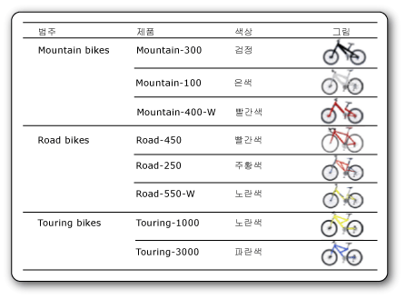

# 이미지(보고서 작성기 및 SSRS)
  이미지는 보고서에 포함되어 있거나, 데이터베이스에 저장되어 있거나, 보고서 서버에 저장되어 있거나, 웹의 기타 위치에 저장되어 있는 이미지에 대한 참조를 포함하는 보고서 항목입니다. 이미지는 데이터 행이 반복되는 그림이 될 수 있습니다 특정 보고서 항목의 배경으로 이미지를 사용할 수도 있습니다.  
  
 로고를 서버에 저장하면 같은 로고를 여러 보고서에 사용할 수 있으므로 유용합니다.  
  
> [!NOTE]  
>  [!INCLUDE[ssRBRDDup](../../includes/ssrbrddup-md.md)]  
  
##   외부 이미지, 포함 이미지 및 데이터 바인딩된 이미지 비교  
 보고서에서 서버 기반 이미지나 기타 외부 이미지를 사용하면 이미지 항목은 보고서 서버 또는 웹의 이미지를 가리키는 경로를 포함합니다. 하지만 포함 이미지를 사용하면 이미지 데이터가 별도의 파일로 존재하지 않고 보고서 정의 안에 저장됩니다.  
  
 서버 기반 이미지는 여러 보고서 또는 웹 페이지가 공유하는 로고 및 정적 그림에 적합합니다. 포함 이미지를 사용하면 이미지를 항상 보고서에서 사용할 수 있지만 공유할 수는 없습니다. 외부 이미지가 포함된 보고서 정의는 포함 이미지가 있는 정의보다 크기가 작습니다.  
  
 데이터베이스에 저장된 이진 데이터로부터 데이터 바인딩된 이미지를 표시할 수도 있습니다. 예를 들어 제목 목록에 제품 이름과 함께 표시되는 그림은 데이터베이스 이미지입니다. 다음 그림에서는 자전거 이미지를 데이터베이스에 저장하고 보고서에서 검색하여 각 제품을 보여 줍니다.  
  
   
  
  
##   보고서 파트인 이미지  
 이미지를 보고서와는 별도로 보고서 파트로 저장할 수 있습니다. [!INCLUDE[ssRBrptparts](../../includes/ssrbrptparts-md.md)]  
  
  
##   포함 이미지  
 모든 이미지 데이터가 보고서 정의 안에 저장되도록 보고서에 이미지를 포함할 수 있습니다. 이미지를 포함하면 이미지가 MIME로 인코딩되어 보고서 정의에 텍스트로 저장됩니다. 포함 이미지를 사용하면 보고서에서 항상 이미지를 사용할 수 있지만 보고서 정의의 크기도 늘어납니다.  
  
 이미지 포함에 대한 자세한 내용은 [보고서에 이미지 포함&#40;보고서 작성기 및 SSRS&#41;](../../reporting-services/report-design/embed-an-image-in-a-report-report-builder-and-ssrs.md)을 참조하세요.  
  
  
##   외부 이미지  
 이미지에 URL을 지정하여 저장된 이미지를 보고서에 포함할 수 있습니다. 보고서에 외부 이미지를 사용하는 경우 이미지 원본은 **External** 로 설정되고 이미지 값은 이미지에 대한 URL 주소 또는 경로가 됩니다.  
  
 자세한 내용은 [외부 항목에 대한 경로 지정&#40;보고서 작성기 및 SSRS&#41;](../../reporting-services/report-design/specifying-paths-to-external-items-report-builder-and-ssrs.md)을 참조하세요.  
  
 보고서 작성기 또는 보고서 디자이너에서 보고서를 실행하면 미리 보기 기능은 사용자의 자격 증명을 사용하여 이미지를 표시합니다. 보고서 서버에서 보고서를 실행할 경우 이미지에 액세스하는 데 필요한 서버 자격 증명이 없으면 보고서의 이미지가 표시되지 않을 수 있습니다. 이 경우 시스템 관리자에게 문의하십시오.  
  
 보고서에 외부 이미지를 추가하는 방법은 [외부 이미지 추가&#40;보고서 작성기 및 SSRS&#41;](../../reporting-services/report-design/add-an-external-image-report-builder-and-ssrs.md)을 참조하세요.  
  
  
##   배경 이미지  
 보고서의 본문이나 사각형, 입력란, 목록, 행렬 또는 테이블의 배경 이미지로 이미지를 사용할 수 있습니다. 배경 이미지와 이미지는 속성이 유사합니다. 또한 항목의 배경을 채울 때 이미지가 반복되는 방법을 지정할 수 있습니다.  
  
> [!NOTE]  
>  HTML 렌더링 확장 프로그램과 같은 일부 렌더링 확장 프로그램은 본문, 페이지 머리글 및 페이지 바닥글에 보고서 본문의 배경 이미지를 렌더링합니다. 페이지 머리글 및 바닥글에 각각 배경 이미지를 정의할 수 있지만 이미지를 정의하지 않으면 보고서에서 본문의 배경 이미지를 사용합니다. 이미지 렌더링 확장 프로그램과 같은 기타 렌더링 확장 프로그램은 페이지 머리글 및 바닥글에 본문의 배경 이미지를 렌더링하지 않습니다.  
  
 배경 이미지 추가에 대한 자세한 내용은 [배경 이미지 추가&#40;보고서 작성기 및 SSRS&#41;](../../reporting-services/report-design/add-a-background-image-report-builder-and-ssrs.md)을 참조하세요.  
  
  
##   데이터 바인딩된 이미지  
 데이터베이스에 저장된 이미지를 보고서에 추가할 수 있습니다. 정적 이미지에 사용된 것과 같은 이미지 보고서 항목을 이미지가 데이터베이스에 저장되어 있음을 나타내는 속성 집합과 함께 사용합니다. 데이터 바인딩된 이미지를 사용하는 방법은 [데이터 바인딩된 이미지 추가&#40;보고서 작성기 및 SSRS&#41;](../../reporting-services/report-design/add-a-data-bound-image-report-builder-and-ssrs.md)을 참조하세요.  
  
  
##   방법 도움말 항목  
 [외부 이미지 추가&#40;보고서 작성기 및 SSRS&#41;](../../reporting-services/report-design/add-an-external-image-report-builder-and-ssrs.md)  
  
 [보고서에 이미지 포함&#40;보고서 작성기 및 SSRS&#41;](../../reporting-services/report-design/embed-an-image-in-a-report-report-builder-and-ssrs.md)  
  
 [배경 이미지 추가&#40;보고서 작성기 및 SSRS&#41;](../../reporting-services/report-design/add-a-background-image-report-builder-and-ssrs.md)  
  
 [데이터 바인딩된 이미지 추가&#40;보고서 작성기 및 SSRS&#41;](../../reporting-services/report-design/add-a-data-bound-image-report-builder-and-ssrs.md)  
  
  
## 참고 항목  
 [이미지 파일로 내보내기&#40;보고서 작성기 및 SSRS&#41;](../../reporting-services/report-builder/exporting-to-an-image-file-report-builder-and-ssrs.md)   
 [렌더링 동작&#40;보고서 작성기 및 SSRS&#41;](../../reporting-services/report-design/rendering-behaviors-report-builder-and-ssrs.md)  
  
  
