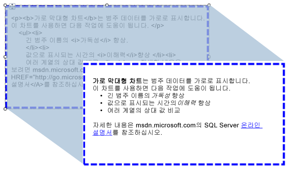

# 보고서로 HTML 가져오기(보고서 작성기 및 SSRS)
  입력란을 사용하면 데이터 세트의 필드에서 검색한 HTML 서식의 텍스트를 보고서에 삽입할 수 있습니다. 텍스트는 올바른 형식의 HTML로 평가되는 단순 또는 복합 식에서 가져올 수 있습니다. 서식이 지정된 텍스트는 PDF를 비롯한 모든 지원되는 출력 형식으로 렌더링될 수 있습니다.  
  
   
  
 다음 그림에서는 보고서 디자인 뷰의 HTML 서식을 사용한 텍스트와 보고서가 실행될 때 렌더링되는 것과 동일한 텍스트를 보여 줍니다.  
  
> [!NOTE]  
>  HTML 태그가 들어 있는 텍스트를 가져오면 입력란에서 항상 데이터 구문을 분석합니다. HTML 태그의 하위 집합만 지원되기 때문에 렌더링된 보고서에 표시되는 HTML이 원래 HTML과 다를 수 있습니다.  
  
 빠르게 시작하려면 [자습서: 텍스트 서식 지정&#40;보고서 작성기&#41;](../../reporting-services/tutorial-format-text-report-builder.md)을 참조하세요.  
  
## 지원되는 HTML 태그  
 다음은 자리 표시자 텍스트로 정의될 때 HTML로 렌더링될 전체 태그 목록입니다.  
  
-   하이퍼링크: \<A HREF>  
  
-   글꼴: \  
  
-   머리글, 스타일 및 블록 요소: \<H{n}>, \
, \,\
, \
, \<LI>, \<HN>  
  
-   텍스트 서식: \<B>, \<I>, \<U>, \<S>  
  
-   목록 처리: \<OL>, \<UL>, \<LI>  
  
 나머지 모든 HTML 태그는 보고서를 처리하는 동안 무시됩니다. 자리 표시자 텍스트에 있는 식이 나타내는 HTML의 형식이 잘못된 경우에는 자리 표시자가 일반 텍스트로 렌더링됩니다. 모든 HTML 태그는 대소문자를 구분하지 않습니다.  
  
 입력란에 있는 텍스트가 한 텍스트 블록만 포함하는 경우 블록 요소를 정의하는 자리 표시자의 HTML은 올바르게 렌더링됩니다. 그러나 입력란에 여러 텍스트 블록이 있는 경우에는 HTML 태그가 무시되고 텍스트 구조가 텍스트 블록에 의해 정의됩니다.  
  
 텍스트에 태그가 여러 개 정의되어 있고 [!INCLUDE[ssRSnoversion](../../includes/ssrsnoversion-md.md)] 에서 HTML과 기존 보고서 제약 조건 사이에 충돌을 발견한 경우에는 가장 안쪽의 HTML 태그만 HTML로 취급됩니다.  
  
 자세한 내용은 [보고서에 HTML 추가&#40;보고서 작성기 및 SSRS&#41;](../../reporting-services/report-design/add-html-into-a-report-report-builder-and-ssrs.md)를 참조하세요.  
  
## CSS 특성의 제한  
 CSS 특성을 사용할 때는 기본적인 태그 집합만 정의됩니다. 다음은 지원되는 특성의 목록입니다.  
  
-   text-align, text-indent  
  
-   font-family  
  
-   font-size  
  
    -   절대 CSS 길이 단위의 유효한 RDL 크기 값만 지원됩니다. 지원되는 단위는 in, cm, mm, pt, pc 입니다.  
  
    -   상대 CSS 길이 단위는 무시되고 지원되지 않습니다. 지원되지 않는 단위에는 em, ex, px, %, rem이 있습니다.  
  
-   색  
  
-   padding, padding-bottom, padding-top, padding-right, padding-left  
  
-   font-weight  
  
 다음은 CSS를 사용할 때 고려해야 할 몇 가지 사항입니다.  
  
-   형식이 잘못된 CSS 값은 형식이 잘못된 HTML과 마찬가지로 무시됩니다.  
  
-   같은 태그에 특성 및 CSS 스타일 특성이 모두 있는 경우에는 CSS 속성의 우선 순위가 더 높습니다. 예를 들어 텍스트가 **\
** 인 경우에는 text-align 특성만 적용되고 텍스트가 오른쪽에 맞춰집니다.  
  
-   특성 및 CSS 스타일에 대해 속성이 여러 번 지정된 경우에는 속성의 마지막 인스턴스만 적용됩니다. 예를 들어 텍스트가 **\
** 인 경우에는 텍스트가 오른쪽에 맞춰집니다.  
  
## 참고 항목  
 [HTML로 렌더링&#40;보고서 작성기 및 SSRS&#41;](../../reporting-services/report-builder/rendering-to-html-report-builder-and-ssrs.md)  
  
  
