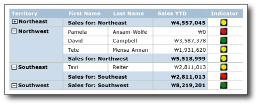

# 표시기(보고서 작성기 및 SSRS)
  페이지가 매겨진 [!INCLUDE[ssRSnoversion_md](../../includes/ssrsnoversion-md.md)] 보고서에서 표시기는 단일 데이터 값의 상태를 한눈에 볼 수 있는 작은 계기입니다. 표시기 및 해당 상태를 나타내는 아이콘은 단순하며 작은 크기로 설정해도 효율적으로 해당 내용을 표시합니다.  
  
 보고서에 상태 표시기를 사용해 다음 내용을 표시할 수 있습니다.  
  
-   **추세** (상향 추세, 옆쪽(변화 없음) 또는 하향 추세 화살표 사용)  
  
-   **상태** (선택 표시, 느낌표 등의 널리 알려진 기호 사용)  
  
-   **조건** (신호등, 부호 등의 널리 알려진 모양 사용)  
  
-   **등급** (별표나 사각형의 사분면에서 차지하는 수를 표시하는 것과 같이 널리 알려진 모양 및 기호 사용)  
  
 표시기는 대시보드나 자유형 보고서에서 단독으로 사용할 수도 있지만 테이블이나 행렬에서 행 또는 열의 데이터를 표시하는 데 가장 일반적으로 사용됩니다. 다음 다이어그램에는 영업 사원 및 지역별 연간 누계 판매 실적을 나타내는 신호등 표시기가 있는 테이블을 보여 줍니다.  
   
   
  
 [!INCLUDE[ssRSnoversion](../../includes/ssrsnoversion-md.md)] 에서는 그대로 사용 가능한 기본 제공 표시기 집합 및 표시기 아이콘을 제공하며, 개별 표시기 아이콘 및 표시기 집합을 필요에 따라 사용자 지정할 수도 있습니다.  
  
 표시기를 KPI로 사용하는 방법에 대한 자세한 내용은 [자습서: 보고서에 KPI 추가&#40;보고서 작성기&#41;](../../reporting-services/tutorial-adding-a-kpi-to-your-report-report-builder.md)를 참조하세요.  
  
> [!NOTE]  
>  표시기를 보고서와는 별도로 보고서 파트로 게시할 수 있습니다. [보고서 파트](../../reporting-services/report-design/report-parts-report-builder-and-ssrs.md)에 대해 자세히 알아봅니다.  
  
##   표시기와 계기 비교  
 계기와 표시기는 매우 다르게 보이지만 표시기 역시 단순한 버전의 계기입니다. 표시기와 계기에는 모두 단일 데이터 값이 표시됩니다. 계기와 표시기의 가장 큰 차이는 계기의 경우 프레임, 포인터 등의 요소가 있지만 표시기에는 상태, 아이콘 및 레이블(선택적)만 있다는 것입니다. 표시기 상태는 계기 범위와 비슷합니다.  
  
 계기와 마찬가지로 표시기도 계기 패널 내에 배치됩니다. **표시기 속성** 대화 상자나 속성 창을 사용하여 표시기를 구성할 때 패널 대신 표시기를 선택해야 합니다. 그렇지 않으면 사용 가능한 옵션이 계기 패널 옵션에 적용되며 표시기를 구성할 수 없습니다. 다음 그림에서는 계기 패널에서 선택된 표시기를 보여 줍니다.  
  
   
  
 데이터 값을 표시하려는 방법에 따라 표시기보다 계기를 사용하는 것이 더 효율적일 수 있습니다. 자세한 내용은 [계기&#40;보고서 작성기 및 SSRS&#41;](../../reporting-services/report-design/gauges-report-builder-and-ssrs.md)를 참조하세요.  
  
##   사용할 표시기 유형 선택  
 데이터가 테이블이나 행렬에서 정보 행에 있든 행 또는 열 그룹에 있든, 보고서 본문이나 대시보드에 데이터만 있든 관계없이 데이터의 의미를 명확하게 전달하려면 적절한 표시기 집합을 사용해야 합니다. 기본 제공 표시기 집합에는 아이콘이 3개 이상 있습니다. 각 아이콘마다 모양이나 색 또는 둘 다 다를 수 있으며 각 아이콘마다 다른 데이터 상태를 전달합니다.  
  
 다음 표에는 기본 제공 표시기 집합과 이들 표시기의 일반적인 용도에 대한 설명이 나와 있습니다.  
  
|표시기 집합|표시기 유형|  
|-------------------|--------------------|  
||방향: 위쪽, 아래쪽, 옆쪽(변화 없음), 상향 추세 또는 하향 추세 화살표를 사용하여 추세를 나타냅니다.|  
||기호: 확인 표시, 느낌표 등의 널리 알려진 기호를 사용하여 상태를 표시합니다.|  
||셰이프: 신호등, 다이아몬드형 등의 널리 알려진 모양을 사용하여 조건을 표시합니다.|  
||등급: 사각형의 사분면 수와 같이 점진적인 값을 나타내는 널리 알려진 모양 및 기호를 사용하여 등급을 표시합니다.|  
  
 표시기 집합을 선택한 후에는 표시기 대화 상자 또는 속성 창에서 속성을 설정하여 집합의 각 표시기 아이콘 모양을 사용자 지정할 수 있습니다. 기본 제공 색, 아이콘, 크기 또는 식을 사용하여 표시기를 구성할 수 있습니다.  
  
##   표시기 사용자 지정  
 표시기는 필요에 맞게 사용자 지정할 수 있습니다. 다음과 같은 방법으로 표시기 집합뿐 아니라 집합 내의 개별 표시기 아이콘도 수정할 수 있습니다.  
  
-   표시기 아이콘 색을 변경합니다. 예를 들어 표시기 집합의 색 구성표를 흑백으로 지정하거나 기본 색이 아닌 색을 사용할 수 있습니다.  
  
-   표시기 집합 아이콘을 변경합니다. 예를 들어 한 표시기 집합에서 별표, 원형 및 사각형 아이콘을 사용할 수 있습니다.  
  
-   표시기의 시작 값과 끝 값을 지정합니다. 예를 들어 표시기 값의 75%에 대해 단일 아이콘을 사용하여 데이터가 해당 아이콘을 중심으로 표시되도록 할 수 있습니다.  
  
-   표시기 집합에 아이콘을 추가합니다. 예를 들어 표시기 값을 더 자세하게 지정하기 위해 표시기 집합에 아이콘을 더 추가할 수 있습니다.  
  
-   아이콘을 몇 개만 사용해 데이터를 보다 간단하게 표시하도록 표시기 집합에서 아이콘을 삭제합니다.  
  
 자세한 내용은 [표시기 아이콘 및 표시기 집합 변경&#40;보고서 작성기 및 SSRS&#41;](../../reporting-services/report-design/change-indicator-icons-and-indicator-sets-report-builder-and-ssrs.md)를 참조하세요.  
  
##   테이블 및 행렬에서 표시기 사용  
 모양이 단순한 표시기는 테이블 및 행렬에 사용하기에 적합합니다. 표시기는 크기가 작아도 효율적이므로 보고서의 그룹 행이나 정보 행에서 유용합니다.  
  
 다음 다이어그램에서는 방향 표시기 집합인 **4방향 화살표(컬러)** 를 사용하여 판매량을 나타내는 테이블이 있는 보고서를 보여 줍니다. 보고서의 표시기 아이콘은 기본 색(빨강, 노랑, 녹색)이 아닌 파란색 음영을 사용하도록 구성되어 있습니다.  
  
   
  
 표시기를 추가, 변경 및 삭제하는 방법에 대한 자세한 내용은 [표시기 추가 또는 삭제&#40;보고서 작성기 및 SSRS&#41;](../../reporting-services/report-design/add-or-delete-an-indicator-report-builder-and-ssrs.md)를 참조하세요.  
  
 보고서에 표시기를 처음 추가하면 기본값을 사용하도록 구성됩니다. 나중에 표시기가 원하는 데이터를 나타내도록 값을 변경할 수 있습니다. 표시기 아이콘의 모양, 표시기가 사용할 아이콘을 선택하는 방식 및 표시기 집합에 사용되는 아이콘을 변경할 수 있습니다. 자세한 내용은 [표시기 아이콘 및 표시기 집합 변경&#40;보고서 작성기 및 SSRS&#41;](../../reporting-services/report-design/change-indicator-icons-and-indicator-sets-report-builder-and-ssrs.md)를 참조하세요.  
  
 기본적으로 표시기는 백분율을 측정 단위로 사용하도록 구성되며 데이터의 최소값 및 최대값을 자동으로 검색합니다. 표시기 집합의 각 아이콘에는 백분율 범위가 있습니다. 백분율 범위 수는 아이콘 집합의 아이콘 수에 따라 달라지지만 범위는 크기가 같고 순차적입니다. 예를 들어 아이콘 집합에 아이콘이 5개 있는 경우 백분율 범위가 5개 있으며 범위 크기는 각각 20%입니다. 첫 번째 범위는 0에서 시작하여 20에서 끝나고 두 번째 범위는 20에서 시작하여 40에서 끝나는 식입니다. 보고서의 표시기가 표시기 집합에서 사용하는 아이콘에는 표시기 데이터 값이 포함되는 백분율 범위가 들어 있습니다. 집합의 각 아이콘에 대한 백분율 범위를 변경할 수 있습니다. 값이나 식을 제공하여 최소값과 최대값을 명시적으로 설정할 수 있습니다. 대신 측정 단위를 숫자 값이 되도록 변경할 수 있습니다. 이 경우에는 데이터의 최소값이나 최대값을 지정하지 않습니다. 대신 표시기에 사용되는 각 아이콘의 시작 값과 끝 값만 제공하면 됩니다. 자세한 내용은 [단위 설정 및 구성&#40;보고서 작성기 및 SSRS&#41;](../../reporting-services/report-design/set-and-configure-measurement-units-report-builder-and-ssrs.md)를 참조하세요.  
  
 표시기는 지정된 범위 내에서 전체 표시기 데이터 값을 동기화하여 데이터 값을 나타냅니다. 이 범위는 기본적으로 표시기가 포함된 테이블, 행렬 등 표시기의 상위 컨테이너입니다. 보고서 레이아웃에 따라 다른 범위를 선택하여 표시기 동기화를 변경할 수 있습니다. 표시기는 동기화를 생략할 수 있습니다. 자세한 내용은 [동기화 범위 설정&#40;보고서 작성기 및 SSRS&#41;](../../reporting-services/report-design/set-synchronization-scope-report-builder-and-ssrs.md)를 참조하세요.  
  
 보고서 내의 범위를 이해하고 설정하는 방법에 대한 일반적인 내용은 [합계, 집계 및 기본 제공 컬렉션의 식 범위&#40;보고서 작성기 및 SSRS&#41;](../../reporting-services/report-design/expression-scope-for-totals-aggregates-and-built-in-collections.md)을 참조하세요.  
  
 표시기는 단일 값만 사용합니다. 여러 데이터 값을 표시해야 하는 경우에는 표시기가 아닌 스파크라인이나 데이터 막대를 사용하십시오. 스파크라인과 데이터 막대는 표시기처럼 단순하면서도 여러 데이터 값을 표시할 수 있고 작은 크기에서도 쉽게 파악할 수 있으며 테이블 및 행렬에서도 효율적으로 사용할 수 있습니다. 자세한 내용은 [스파크라인 및 데이터 막대&#40;보고서 작성기 및 SSRS&#41;](../../reporting-services/report-design/sparklines-and-data-bars-report-builder-and-ssrs.md)를 참조하세요.  
  
##   표시기 크기를 조정하여 시각적 효과 최대화  
 색, 방향 및 모양 외에 크기도 표시기의 시각적 효과를 최대화하는 데 사용할 수 있습니다. 표시기를 사용하여 다양한 자전거 제품에 대한 고객 만족도를 표시하는 보고서의 경우, 고객 만족도에 따라 표시기에서 사용하는 아이콘의 크기를 각각 다르게 구성할 수 있습니다. 즉, 만족도가 높을수록 보고서에 아이콘을 더 크게 표시할 수 있습니다. 다음 그림에서는 자전거 판매 보고서와 판매량을 반영하는 아이콘 크기를 보여 줍니다.  
  
 식을 사용하여 표시기가 사용하는 필드 값에 따라 별표 크기를 동적으로 설정합니다. 자세한 내용은 [식을 사용하여 표시기 크기 지정&#40;보고서 작성기 및 SSRS&#41;](../../reporting-services/report-design/specify-the-size-of-an-indicator-using-an-expression-report-builder-and-ssrs.md)를 참조하세요.  
  
 식 작성 및 사용 방법에 대한 자세한 내용은 [식&#40;보고서 작성기 및 SSRS&#41;](../../reporting-services/report-design/expressions-report-builder-and-ssrs.md)을 참조하세요.  
  
##   계기 패널에 계기 및 표시기 포함  
 표시기는 항상 계기 패널 내에 배치됩니다. 계기 패널은 하나 이상의 계기와 상태 표시기가 포함될 수 있는 최상위 컨테이너로, 하위 또는 인접 계기나 표시기를 포함할 수 있습니다. 계기의 하위 항목으로 표시기를 사용하는 경우에는 계기에 표시되는 데이터 값의 상태를 표시하여 데이터를 보다 자세하게 표시할 수 있습니다. 예를 들어 계기 내의 표시기에 녹색 원을 표시하여 계기의 값이 값 범위의 상위 33%를 가리킨다는 것을 나타낼 수 있습니다. 계기와 표시기를 함께 사용하면 데이터를 다른 방식으로 표시할 수 있습니다. 어떤 경우든 계기 및 표시기가 사용하는 데이터 필드는 같을 수도 있고 다를 수도 있습니다.  
  
 다음 다이어그램에서는 계기 내에 포함된 표시기와, 계기와 나란히 배치된 표시기를 보여 줍니다.  
  
   
  
 자세한 내용은 [계기 패널에 표시기 및 계기 포함&#40;보고서 작성기 및 SSRS&#41;](../../reporting-services/report-design/include-indicators-and-gauges-in-a-gauge-panel-report-builder-and-ssrs.md)를 참조하세요.  
  
 계기 사용 방법에 대한 자세한 내용은 [계기&#40;보고서 작성기 및 SSRS&#41;](../../reporting-services/report-design/gauges-report-builder-and-ssrs.md)를 참조하세요.  
  
##   표시기 상태의 시퀀스  
 **표시기 속성** 대화 상자의 **값 및 상태** 탭에 있는 표시기 상태의 시퀀스는 표시기 상태의 시작과 끝 값이 겹칠 때 데이터 값에 대해 표시하는 표시기 아이콘에 영향을 미칩니다.  
  
 이것은 백분율 또는 숫자 상태 단위 사용에 따라 발생할 수 있습니다. 이 측정값에 대한 구체적인 값을 제공하므로 숫자 측정 단위를 사용할 때 이러한 상황이 발생할 가능성이 높습니다. 불연속 값이 될 가능성이 적으므로 보고서 데이터 값을 반올림할 때 이러한 상황이 발생할 가능성이 또한 높습니다.  
  
 다음 시나리오에서는 **3 방향 화살표(컬러)** 방향 표시기의 세 가지 상태 순서를 변경할 경우 데이터 시각화에 어떤 영향을 주는지를 설명합니다. 기본 시퀀스:  
  
1.  빨간색 아래쪽 화살표  
  
2.  노란색 옆쪽 화살표  
  
3.  녹색 위쪽 화살표  
  
 다음 시나리오에서는 네 개의 다른 상태 시퀀스, 해당 값 범위 및 시퀀스가 데이터 시각화에 영향을 미치는 방법을 보여 줍니다.  
  
 이 시나리오에서 **3 방향 화살표(컬러)** 표시기는 숫자 상태 측정값을 사용합니다.  
  
|상태 시퀀스|시작 값|끝 값|  
|--------------------|-----------------|---------------|  
|빨강|0|3500|  
|노란색|3500|5000|  
|녹색|5000|10000|  
  
 빨간색 아래쪽 화살표는 값 3500을 표시하고 노란색 옆쪽 화살표는 5000을 표시합니다.  
  
|상태 시퀀스|시작 값|끝 값|  
|--------------------|-----------------|---------------|  
|녹색|5000|10000|  
|노란색|3500|5000|  
|빨강|0|3500|  
  
 노란색 옆쪽 화살표는 값 3500을 표시하고 녹색 위쪽 화살표는 5000을 표시합니다.  
  
|상태 시퀀스|시작 값|끝 값|  
|--------------------|-----------------|---------------|  
|녹색|5000|10000|  
|빨강|0|3500|  
|노란색|3500|5000|  
  
 빨간색 아래쪽 화살표는 값 3500을 표시하고 녹색 위쪽 화살표는 5000을 표시합니다.  
  
|상태 시퀀스|시작 값|끝 값|  
|--------------------|-----------------|---------------|  
|노란색|3500|5000|  
|빨강|0|3500|  
|녹색|5000|10000|  
  
 노란색 아래쪽 화살표는 이제 값 3500과 5000을 모두 표시합니다.  
  
 요약하면, 평가가 시작되어 표시기 상태 목록의 최상위 및 보고서에 데이터에 맞는 값 범위를 가지는 첫 번째 하나의 표시기 상태와 연결된 표시기 아이콘이 표시됩니다. 표시기 상태 시퀀스를 변경하여 데이터 값의 시각화에 영향을 줄 수 있습니다.  
  
##   방법 도움말 항목  
 이 섹션에는 표시기를 추가/변경/삭제하는 방법, 표시기를 구성/사용자 지정하는 방법 및 계기에서 표시기를 사용하는 방법을 보여 주는 절차가 나열되어 있습니다.  
  
-   [표시기 추가 또는 삭제&#40;보고서 작성기 및 SSRS&#41;](../../reporting-services/report-design/add-or-delete-an-indicator-report-builder-and-ssrs.md)  
  
-   [표시기 아이콘 및 표시기 집합 변경&#40;보고서 작성기 및 SSRS&#41;](../../reporting-services/report-design/change-indicator-icons-and-indicator-sets-report-builder-and-ssrs.md)  
  
-   [단위 설정 및 구성&#40;보고서 작성기 및 SSRS&#41;](../../reporting-services/report-design/set-and-configure-measurement-units-report-builder-and-ssrs.md)  
  
-   [동기화 범위 설정&#40;보고서 작성기 및 SSRS&#41;](../../reporting-services/report-design/set-synchronization-scope-report-builder-and-ssrs.md)  
  
-   [식을 사용하여 표시기 크기 지정&#40;보고서 작성기 및 SSRS&#41;](../../reporting-services/report-design/specify-the-size-of-an-indicator-using-an-expression-report-builder-and-ssrs.md)  
  
-   [계기 패널에 표시기 및 계기 포함&#40;보고서 작성기 및 SSRS&#41;](../../reporting-services/report-design/include-indicators-and-gauges-in-a-gauge-panel-report-builder-and-ssrs.md)  
  
## 참고 항목  
 [계기&#40;보고서 작성기 및 SSRS&#41;](../../reporting-services/report-design/gauges-report-builder-and-ssrs.md)   
 [스파크라인 및 데이터 막대&#40;보고서 작성기 및 SSRS&#41;](../../reporting-services/report-design/sparklines-and-data-bars-report-builder-and-ssrs.md)   
 [차트&#40;보고서 작성기 및 SSRS&#41;](../../reporting-services/report-design/charts-report-builder-and-ssrs.md)  
  
  
