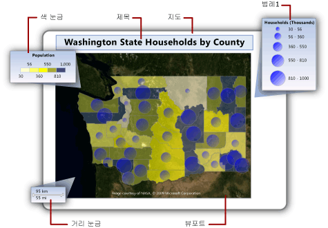
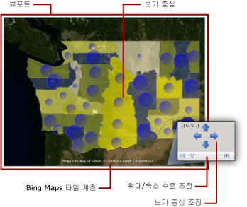
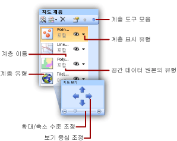

# 지도(보고서 작성기 및 SSRS)
  지리적 배경에 대해 비즈니스 데이터를 시각화하기 위해 [!INCLUDE[ssRSnoversion_md](../../includes/ssrsnoversion-md.md)] 페이지를 매긴 보고서에 지도를 추가할 수 있습니다. 선택하는 지도 유형은 보고서에 나타낼 정보에 따라 다릅니다. 위치만 표시하는 지도, 지역의 세대 수에 따라 거품 크기가 달라지는 거품형 지도, 각 상점에서 이윤이 가장 높은 제품에 따라 표식 스타일이 달라지는 표식 지도 또는 상점 간 경로를 표시하는 선 지도 등을 추가할 수 있습니다.  
  
 지도에는 제목, 중심점 및 눈금을 지정하는 뷰포트, 뷰포트의 선택적 Bing Maps 타일 배경, 공간 데이터를 표시하는 하나 이상의 계층, 사용자가 데이터 시각화를 해석하는 데 유용한 다양한 범례가 포함됩니다. 다음 그림에서는 지도의 기본 부분을 보여 줍니다.  
  
   
  
 지도 사용을 즉시 시작하려면 [자습서: 지도 보고서&#40;보고서 작성기&#41;](../../reporting-services/tutorial-map-report-report-builder.md) 또는 [보고서 예제(보고서 작성기 및 SSRS)](https://go.microsoft.com/fwlink/?LinkId=198283)를 참조하세요.  
  
> [!NOTE]  
>  보고서와는 별도로 지도를 보고서 파트로 저장할 수 있습니다. [보고서 파트](../../reporting-services/report-design/report-parts-report-builder-and-ssrs.md)에 대해 자세히 알아봅니다.  
  
##   보고서에 지도 추가  
 보고서에 지도를 추가하기 위해 수행할 일반 단계의 목록은 다음과 같습니다.  
  
-   표시할 분석 데이터와 필요한 공간 데이터 형식을 결정합니다. 예를 들어 거품형 지도에서 상대적 연간 상점 판매량을 표시하려면 분석 데이터에 상점 이름과 상점 판매량이 필요하고 공간 데이터에 위도와 경도로 상점 위치와 상점 이름이 필요합니다.  
  
-   원하는 지도의 스타일을 결정합니다. 기본 지도에는 위치만 표시됩니다. 거품형 지도에서는 단일 분석 값에 따라 거품 크기가 변경됩니다. 분석 색 지도에서는 분석 데이터의 범위에 따라 지도 요소가 변경됩니다. 선택하는 스타일에 따라 시각화할 데이터와 사용할 공간 데이터 형식이 결정됩니다.  
  
-   공간 데이터 원본, 공간 데이터, 분석 데이터 원본 및 분석 데이터를 지정하는 데 필요한 정보를 수집합니다. 여기에는 공간 데이터 원본에 대한 연결 문자열, 필요한 공간 데이터 형식을 지정하는 작업 및 보고서 데이터에 공간 데이터와 분석 데이터를 연결하는 일치 필드가 포함되어 있는지 확인하는 작업이 포함됩니다.  
  
-   지도 마법사를 실행하여 보고서에 지도를 추가합니다. 그러면 첫 번째 지도 계층이 지도에 추가됩니다. 지도 계층 마법사를 실행하여 추가 계층을 만들거나 기존 계층을 수정합니다. 마법사를 사용하면 작업을 쉽게 시작할 수 있습니다. 자세한 내용은 [지도 마법사 및 지도 계층 마법사&#40;보고서 작성기 및 SSRS&#41;](../../reporting-services/report-design/map-wizard-and-map-layer-wizard-report-builder-and-ssrs.md)를 참조하세요.  
  
-   보고서에서 지도를 미리 본 후 지도 보기를 조정하고, 데이터에 따라 각 계층의 표시가 달라지는 방식을 변경하고, 사용자의 데이터 해석을 돕기 위해 범례를 제공하고, 사용자가 잘 볼 수 있도록 해상도를 조정할 수 있습니다.  
  
 자세한 내용은 [지도 보고서 계획&#40;보고서 작성기 및 SSRS&#41;](../../reporting-services/report-design/plan-a-map-report-report-builder-and-ssrs.md)를 참조하세요.  
  
##   지도에 데이터 추가  
 지도에서는 공간 데이터와 분석 데이터라는 두 가지 데이터 형식을 사용합니다. 공간 데이터는 지도의 모양을 정의하는 반면 분석 데이터는 지도와 연결된 값을 제공합니다. 예를 들어 공간 데이터는 한 지역의 도시 위치를 정의하는 반면 분석 데이터는 각 도시의 인구를 제공합니다.  
  
 지도에는 공간 데이터가 반드시 있어야 하며 분석 데이터는 없어도 됩니다. 예를 들어 도시에 있는 상점 위치만 표시되는 지도를 추가할 수 있습니다.  
  
 지도에서 데이터를 시각화하려면 분석 데이터와 공간 데이터가 관계를 맺고 있어야 합니다. 공간 데이터와 분석 데이터가 같은 원본에서 제공되면 관계가 알려집니다. 공간 데이터와 분석 데이터가 서로 다른 원본에서 제공되면 두 데이터를 연결하기 위해 일치 필드를 지정해야 합니다.  
  
### 공간 데이터  
 공간 데이터는 좌표 집합으로 구성되어 있습니다. 데이터 원본의 공간 데이터는 한 점, 여러 점, 한 선, 여러 선 또는 다각형 집합일 수 있습니다. 각 좌표 집합은 군의 경계를 나타내는 다각형, 도로를 나타내는 선 또는 도시의 위치를 나타내는 점 등의 *지도 요소*를 정의합니다.  
  
 공간 데이터는 다음 좌표계 중 하나를 기반으로 합니다.  
  
-   **지리.** 경도 및 위도를 사용하여 구형 표면의 측지 좌표를 지정합니다. 공간 데이터가 지리이면 도법을 지정해야 합니다. 도법은 구형 좌표를 갖는 개체를 평면 표면에 그리는 방법을 지정하는 규칙의 집합입니다. 동일한 도법의 지리 데이터만 비교하거나 결합할 수 있습니다.  
  
-   **평면.** X 및 Y를 사용하여 평면 표면의 지리 좌표를 지정합니다.  
  
 각 지도 계층에는 다각형, 선 또는 점 형식의 공간 데이터가 표시됩니다. 여러 공간 데이터 형식을 표시하려면 지도에 여러 계층을 추가합니다. Microsoft Bing Maps 타일의 계층을 추가할 수도 있습니다. 타일 계층은 공간 데이터에 의존하지 않습니다. 타일 계층에는 지도 뷰포트의 좌표에 해당하는 이미지 타일이 표시됩니다.  
  
#### 공간 데이터 원본  
 다음과 같은 공간 데이터 원본이 지원됩니다.  
  
-   **지도 갤러리 보고서.** 지도 갤러리에 있는 보고서에 공간 데이터가 포함되어 있습니다. 기본적으로 지도 갤러리는 *\<drive>*:\Program Files\Microsoft SQL Server\Report Builder \MapGallery에 설치됩니다.  
  
    > [!NOTE]  
    >  이 [!INCLUDE[ssRSnoversion](../../includes/ssrsnoversion-md.md)] 지도 제작 기능은 미 통계국([https://www.census.gov/](https://www.census.gov/)). TIGER/Line Shapefile은 Census MAF/TIGER 데이터베이스에서 선택한 지리 및 지도 정보를 추출한 것입니다. TIGER/Line Shapefile은 미 통계국에 요금을 지불하지 않고 사용할 수 있습니다. TIGER/Line Shapefile에 대한 자세한 내용은 [https://www.census.gov/geo/www/tiger](https://www.census.gov/geo/www/tiger)를 참조하십시오. TIGER/Line Shapefile의 경계 정보는 통계 데이터 수집 및 집계 목적으로만 사용되며 통계 목적의 설명 및 지정은 사법권이나 소유권 또는 수급권의 판결에 영향을 미치지 않고 법적인 토지 설명이 아닙니다. Census TIGER 및 TIGER/Line은 미 통계국의 등록 상표입니다.  
  
-   **ESRI 셰이프 파일.** ESRI 셰이프 파일은 ESRI(Environmental Systems Research Institute, Inc.) 셰이프 파일 공간 데이터 형식을 따르는 데이터를 포함합니다. ESRI 셰이프 파일은 파일 집합입니다. .shp 파일의 데이터는 지리적 또는 기하학적 모양을 지정합니다. .dbf 파일의 데이터는 모양의 특성을 제공합니다. 디자인 뷰에서 지도를 보거나 보고서 서버에서 지도를 실행하려면 두 파일이 모두 같은 폴더에 있어야 합니다. 로컬 파일 시스템에서 .shp 파일의 공간 데이터를 추가하면 이 공간 데이터가 보고서에 포함됩니다. 런타임에 동적으로 공간 데이터를 검색하려면 셰이프 파일을 보고서 서버로 업로드한 다음 공간 데이터 원본으로 지정합니다. 자세한 내용은 [Finding ESRI Shapefiles for a Map](https://go.microsoft.com/fwlink/?linkid=178814)을 참조하십시오.  
  
-   **데이터베이스에 저장된 SQL Server 공간 데이터.** **관계형 데이터베이스에서** SQLGeometry **또는** SQLGeography [!INCLUDE[ssNoVersion](../../includes/ssnoversion-md.md)] 데이터 형식을 지정하는 쿼리를 사용할 수 있습니다. 자세한 내용은 [공간 데이터 형식 개요](../../relational-databases/spatial/spatial-data-types-overview.md)를 참조하세요.  
  
     쿼리 디자이너에 나타나는 결과 집합에서 각 공간 데이터 행은 하나의 단위로 처리되고 단일 지도 요소에 저장됩니다. 예를 들어 결과 집합에서 한 행에 여러 개의 점이 정의되어 있으면 표시 속성이 해당 지도 요소의 모든 점에 적용됩니다.  
  
-   **만드는 사용자 지정 위치.** 위치를 포함된 점 계층에 포함된 점으로 직접 추가할 수 있습니다. 자세한 내용은 [지도에 사용자 지정 위치 추가&#40;보고서 작성기 및 SSRS&#41;](../../reporting-services/report-design/add-custom-locations-to-a-map-report-builder-and-ssrs.md)를 참조하세요.  
  
#### 디자인 뷰의 공간 데이터  
 디자인 뷰에서 보고서 처리기는 지도 계층을 디자인하는 데 도움이 되는 예제 공간 데이터를 표시합니다. 표시되는 데이터는 공간 데이터의 사용 가능 여부에 따라 달라집니다.  
  
-   **포함된 데이터.** 샘플 데이터가 보고서의 지도 계층에 포함된 지도 요소에서 검색됩니다.  
  
-   **ESRI 셰이프 파일에 연결.** ESRI 셰이프 파일(.shp) 및 지원 파일(.dbf)을 사용할 수 있으면 예제 데이터가 셰이프 파일에서 로드되고, 그렇지 않으면 보고서 처리기가 예제 데이터를 생성하고 **사용 가능한 공간 데이터가 없습니다.** 라는 메시지를 표시합니다.  
  
-   **SQL Server 공간 데이터.** 데이터 원본을 사용할 수 있고 자격 증명이 유효하면 예제 데이터가 데이터베이스의 공간 데이터에서 로드되고, 그렇지 않으면 보고서 처리기가 예제 데이터를 생성하고 **사용 가능한 공간 데이터가 없습니다.** 라는 메시지를 표시합니다.  
  
#### 보고서 정의에 공간 데이터 포함  
 분석 데이터와 달리 보고서 정의에 지도 계층의 공간 데이터를 포함하는 옵션이 있습니다. 공간 데이터를 포함하는 경우 지도 계층에서 사용되는 지도 요소를 포함합니다.  
  
 포함된 요소가 있으면 보고서 정의의 크기가 증가하지만 보고서가 실행될 때 미리 보기나 보고서 서버에서 공간 데이터를 항상 사용할 수 있습니다. 데이터가 많을수록 더 많은 스토리지가 필요하고 처리 시간이 길어집니다. 다른 보고서 데이터뿐만 아니라 공간 데이터를 보고서에 필요한 정보로만 제한하는 것이 항상 가장 좋은 방법입니다.  
  
#### 런타임에 지도 해상도 제어  
 공간 데이터의 해상도를 변경하는 경우 지도에 선을 얼마나 자세하게 그릴 것인지를 지정하게 됩니다. 예를 들어 지역의 경우 백 미터의 지표면으로 세분성을 낮춰야 합니까, 아니면 1마일이면 충분합니까?  
  
 공간 데이터가 보고서에 포함된 경우 사용하는 해상도는 보고서 정의의 지도 요소 수에 영향을 미칩니다. 해상도가 높을수록 해당 해상도에서 테두리를 그리는 데 필요한 요소의 수가 늘어납니다. 공간 데이터가 보고서에 포함되지 않는 경우에는 보고서를 볼 때마다 보고서 서버가 해당 해상도에서 테두리를 그리는 데 필요한 선을 계산합니다. 표시 해상도와 적합한 보고서 렌더링 시간 간의 균형이 맞는 보고서를 디자인하려면 보고서에서 분석 데이터를 시각화하는 데 필요한 세부 수준으로 지도 해상도를 단순화합니다.  
  
### 분석 데이터  
 분석 데이터는 도시의 인구나 상점의 판매량 합계 등, 지도에서 시각화할 데이터입니다. 분석 데이터가 제공되는 원본은 다음 중 하나일 수 있습니다.  
  
-   **데이터 세트 필드.** 보고서 데이터 창에 있는 데이터 세트의 필드입니다.  
  
-   **공간 데이터 원본 필드.** 공간 데이터에 포함된 공간 데이터 원본의 필드입니다. 예를 들어 ESRI 셰이프 파일에는 공간 데이터와 분석 데이터가 모두 포함되어 있는 경우가 많습니다. 공간 데이터 원본의 필드 이름은 #으로 시작하고 계층에 대한 규칙의 데이터 필드를 지정하는 경우 필드의 드롭다운 목록에 나타납니다.  
  
-   **지도 요소의 포함된 데이터.** 다각형, 선 또는 점을 보고서에 포함한 후 개별 지도 요소의 데이터 필드를 무시하고 사용자 지정 값을 설정할 수 있습니다.  
  
 계층에 대한 규칙을 지정하고 분석 데이터 필드를 선택하는 경우 데이터 형식이 숫자이면 보고서 처리기가 자동으로 기본 함수 Sum을 사용하여 지도 요소의 집계 값을 계산합니다. 필드가 숫자가 아니면 집계 함수가 지정되지 않고 암시적 집계 함수 First가 사용됩니다. 기본 식을 변경하려면 계층에 대한 규칙의 옵션을 변경합니다. 자세한 내용은 [규칙 및 분석 데이터를 사용하여 다각형, 선 및 점 표시 변경&#40;보고서 작성기 및 SSRS&#41;](../../reporting-services/report-design/vary-polygon-line-and-point-display-by-rules-and-analytical-data.md)를 참조하세요.  
  
### 일치 필드  
 분석 데이터를 계층의 지도 요소에 연결하려면 *일치 필드*를 지정해야 합니다. 일치 필드는 지도 요소와 분석 데이터 간의 관계를 만드는 데 사용됩니다. 각 공간 위치에 고유한 분석 값을 지정하는 경우 하나 이상의 필드를 사용하여 일치시킬 수 있습니다.  
  
 예를 들어 도시 인구에 따라 거품 크기가 달라지는 거품형 지도의 경우 다음과 같은 데이터가 필요합니다.  
  
-   공간 데이터 원본에서:  
  
    -   **공간 데이터.** 도시의 위도와 경도를 지정하는 공간 데이터가 있는 필드입니다.  
  
    -   **이름.** 도시의 이름이 있는 필드입니다.  
  
    -   **지역.** 지역의 이름이 있는 필드입니다.  
  
-   분석 데이터 원본에서:  
  
    -   **인구.** 도시 인구가 있는 필드입니다.  
  
    -   **도시.** 도시의 이름이 있는 필드입니다.  
  
    -   **지역.** 영토, 주 또는 지역의 이름이 있는 필드입니다.  
  
 이 예에서 도시 이름만으로는 인구를 고유하게 식별할 수 없습니다. 예를 들어 미국에는 올버니라는 도시가 많습니다. 특정 도시의 이름을 지정하려면 도시 이름뿐만 아니라 지역을 지정해야 합니다.  
  
##   지도 뷰포트 이해  
 보고서의 지도 데이터를 지정한 후 지도 *뷰포트*를 지정하여 지도의 표시 영역을 제한할 수 있습니다. 기본적으로 뷰포트는 전체 지도와 동일한 영역입니다. 지도를 자르려면 보고서에 포함할 지역을 정의하는 최대 및 최소 좌표, 확대/축소 수준 및 중심을 지정하면 됩니다. 보고서에서 지도의 표시를 향상시키기 위해 범례, 거리 눈금 및 색 눈금을 뷰포트 밖으로 이동할 수 있습니다. 다음 그림에서는 뷰포트를 보여 줍니다.  
  
   
  
##   Bing Maps 타일 계층 추가  
 뷰포트에서 정의하는 대로 현재 지도 보기의 지리적 배경을 제공하는 Bing Maps 타일의 계층을 추가할 수 있습니다. 타일 계층을 추가하려면 좌표계에 **지리** , 도법 종류에 **메르카토르**를 지정해야 합니다. 선택한 뷰포트 중심 및 확대/축소 수준과 일치하는 타일이 Bing Maps 웹 서비스에서 자동으로 검색됩니다.  
  
 다음 옵션을 지정하여 계층을 사용자 지정할 수 있습니다.  
  
-   타일 유형. 지원되는 스타일은 다음과 같습니다.  
  
    -   **도로.** 흰색 배경, 도로 및 레이블 텍스트가 있는 도로 지도 스타일을 표시합니다.  
  
    -   **항공.** 텍스트 없이 항공 이미지 스타일을 표시합니다.  
  
    -   **혼합.** **도로** 및 **항공** 스타일의 조합을 표시합니다.  
  
-   타일의 표시 텍스트 언어  
  
-   보안 연결을 사용하여 Bing Maps 웹 서비스의 타일을 검색할지 여부  
  
 단계별 지침은 [지도 또는 지도 계층 추가, 변경 또는 삭제&#40;보고서 작성기 및 SSRS&#41;](../../reporting-services/report-design/add-change-or-delete-a-map-or-map-layer-report-builder-and-ssrs.md)를 참조하세요.  
  
 타일에 대한 자세한 내용은 [Bing 지도 타일 시스템(Bing Maps Tiles System)](https://go.microsoft.com/fwlink/?linkid=147315)을 참조하십시오. 보고서에서 Bing 지도 타일을 사용하는 방법은 [추가 사용 조건(Additional Terms of Use)](https://go.microsoft.com/fwlink/?LinkId=151371)를 참조하세요.  
  
##   지도 계층 및 지도 요소 이해  
 지도 하나에 계층이 여러 개 있을 수 있습니다. 세 가지 계층 유형이 있으며, 각 계층에는 한 가지 공간 데이터 형식이 표시됩니다.  
  
-   **다각형 계층.** 각 다각형에 대해 자동으로 계산되는 다각형 중심점의 표식이나 영역의 윤곽선을 표시합니다.  
  
-   **선 계층.** 경로의 선을 표시합니다.  
  
-   **점 계층.** 점 위치의 표식을 표시합니다.  
  
 계층의 공간 데이터 원본을 지정하는 경우 마법사는 공간 데이터 필드를 확인하고 해당 필드 유형에 따라 계층 유형을 설정합니다. 지도 요소는 데이터 원본의 각 값에 대한 계층에 추가됩니다.  
  
 예를 들어 중앙 창고에서 상점까지의 배달 경로를 표시하려면 상점 위치를 표시하는 압정 표식이 있는 점 계층과 창고에서 각 상점까지의 배달 경로를 표시하는 선 계층을 추가할 수 있습니다. 점 계층에는 상점 위치를 지정하는 점 공간 데이터가 필요하고 선 계층에는 배달 경로를 지정하는 선 공간 데이터가 필요합니다.  
  
 네 번째 계층 유형은 타일 계층입니다. 타일 계층은 지도 뷰포트 보기 중심 및 확대/축소 수준에 해당하는 Bing Maps 타일의 배경을 추가합니다.  
  
 계층을 사용하여 작업하려면 보고서 디자인 화면에서 지도를 선택하여 지도 창을 표시합니다. 지도 창에 지도에 대해 정의된 계층의 목록이 표시됩니다. 이 창에서 계층을 선택하여 옵션을 변경하고, 계층의 그리기 순서를 변경하고, 계층을 추가하거나 지도 계층 마법사를 실행하고, 계층을 숨기거나 표시하고, 지도 뷰포트의 보기 중심 및 확대/축소 수준을 변경할 수 있습니다. 다음 그림에서는 뷰포트를 보여 줍니다.  
  
   
  
 지도 계층에 대한 자세한 내용은 [지도 또는 지도 계층 추가, 변경 또는 삭제&#40;보고서 작성기 및 SSRS&#41;](../../reporting-services/report-design/add-change-or-delete-a-map-or-map-layer-report-builder-and-ssrs.md)를 참조하세요.  
  
### 점, 선 및 다각형의 표시 속성 변경  
 지도 요소의 표시 옵션은 계층에 대한 규칙을 사용하여 계층 수준에서 설정하거나 개별 요소에서 설정할 수 있습니다. 예를 들어 계층의 모든 점에 대한 표시 속성을 설정하거나, 포함되었는지 여부와 관계없이 계층의 모든 점에 대한 표시 속성을 제어하는 규칙을 설정하거나, 특정 포함된 점에 대한 표시 속성 설정을 무시할 수 있습니다.  
  
 보고서를 볼 때 표시되는 표시 값은 오름차순으로 나열된 이 계층 구조에 의해 제어됩니다. 숫자가 클수록 우선 순위가 높습니다.  
  
1.  **계층 속성.** 전체 계층에 적용되는 속성입니다. 예를 들어 계층 속성을 사용하여 분석 데이터의 원본이나 전체 계층의 표시 유형을 설정합니다.  
  
2.  **다각형, 선, 점 속성 및 포함된 다각형, 선, 점 속성.** 지도 요소가 동적 공간 데이터에서 제공되든, 포함된 공간 데이터에서 제공되든 간에 계층의 모든 지도 요소에 적용되는 속성입니다. 예를 들어 다각형 중심점 속성을 사용하여 진한 파랑부터 연한 파랑까지 위에서 아래로 거품 영역을 채우는 그라데이션으로 거품의 채우기 색을 설정합니다.  
  
3.  **색 규칙, 크기 규칙, 두께 규칙 및 표식 유형 규칙.** 규칙은 계층에 분석 데이터와 관계가 있는 지도 요소가 있는 경우 계층에 속성을 적용합니다. 규칙 유형은 계층 유형에 따라 다릅니다. 예를 들어 점 크기 규칙을 사용하여 인구에 따라 거품 크기를 변경합니다.  
  
4.  **포함된 다각형, 선 또는 점 속성의 무시.** 포함된 지도 요소의 경우 무시 옵션을 선택하고 속성 또는 데이터 값을 변경할 수 있습니다. 개별 요소에 대한 규칙을 무시하기 위해 변경하는 모든 내용은 되돌릴 수 없습니다. 예를 들어 압정 표식을 사용하여 특정 상점을 강조 표시할 수 있습니다.  
  
 자세한 내용은 [규칙 및 분석 데이터를 사용하여 다각형, 선 및 점 표시 변경&#40;보고서 작성기 및 SSRS&#41;](../../reporting-services/report-design/vary-polygon-line-and-point-display-by-rules-and-analytical-data.md)를 참조하세요.  
  
 지도 요소의 모양을 변경하는 것 외에 다음과 같은 방식으로 점, 선 및 다각형이나 계층에 상호 작용 기능을 추가할 수 있습니다.  
  
-   사용자가 지도를 포인터로 가리키면 지도 요소에 대한 자세한 정보를 제공하는 도구 설명을 만듭니다.  
  
-   드릴스루 동작을 보고서의 다른 위치, 다른 보고서 또는 웹 페이지에 대한 링크에 추가합니다.  
  
-   사용자가 특정 지도 계층을 표시하거나 숨길 수 있도록 하는 계층 표시 유형을 정의하는 매개 변수를 식에 추가합니다.  
  
 자세한 내용은 [대화형 정렬, 문서 구조 및 링크&#40;보고서 작성기 및 SSRS&#41;](../../reporting-services/report-design/interactive-sort-document-maps-and-links-report-builder-and-ssrs.md)를 참조하세요.  
  
##   지도 범례, 색 눈금 및 거리 눈금 이해  
 사용자가 지도를 해석하는 데 도움이 되도록 다양한 범례를 보고서에 추가할 수 있습니다. 지도에는 다음 항목이 포함될 수 있습니다.  
  
-   **범례.** 여러 범례를 만들 수 있습니다. 범례에 나열되는 항목은 각 계층의 지도 요소에 대해 지정하는 규칙에 따라 자동으로 생성됩니다. 각 규칙의 경우 관련 항목을 표시하는 데 사용할 범례를 지정할 수 있습니다. 이런 식으로 여러 계층의 항목을 동일한 범례나 서로 다른 범례에 할당할 수 있습니다.  
  
-   **색 눈금.** 색 눈금을 한 개 만들 수 있습니다. 색 규칙에 대한 범례를 제공하는 대신 색 눈금에 색 규칙의 항목을 표시할 수 있습니다. 여러 색 규칙이 색 눈금에 적용될 수 있습니다.  
  
-   **거리 눈금.** 거리 눈금을 한 개 표시할 수 있습니다. 거리 눈금에는 킬로미터와 마일 단위로 현재 지도 보기의 눈금이 표시됩니다.  
  
 범례, 색 눈금 및 거리 눈금을 뷰포트 내부나 외부의 서로 다른 위치에 배치할 수 있습니다. 자세한 내용은 [지도 범례, 색 눈금 및 관련 규칙 변경&#40;보고서 작성기 및 SSRS&#41;](../../reporting-services/report-design/change-map-legends-color-scale-and-associated-rules-report-builder-and-ssrs.md)를 참조하세요.  
  
##   지도 문제 해결  
 지도 보고서에서는 다양한 데이터 원본에서 공간 데이터와 분석 데이터를 사용합니다. 각 지도 계층에서 서로 다른 데이터 원본을 사용할 수 있습니다. 각 계층의 표시 속성은 계층 속성, 규칙, 지도 요소 속성에 따라 특정 우선 순위를 따릅니다.  
  
 지도 보고서를 볼 때 원하는 결과가 표시되지 않으면 근본 원인은 다양한 문제에서 비롯될 수 있습니다. 각 문제를 확인하고 이해하려면 한 번에 한 계층에서 작업하는 것이 유용합니다. 지도 창을 사용하여 계층을 선택하고 계층의 표시 유형을 쉽게 설정/해제할 수 있습니다.  
  
 지도 보고서 문제에 대한 자세한 내용은 [보고서 문제해결: 지도 보고서&#40;보고서 작성기 및 SSRS&#41;](../../reporting-services/report-design/troubleshoot-reports-map-reports-report-builder-and-ssrs.md)  
  
##   방법 도움말 항목  
 이 섹션에는 보고서에서 지도와 지도 계층을 사용하여 작업하는 방법을 단계별로 보여 주는 절차가 나열되어 있습니다.  
  
-   [지도 또는 지도 계층 추가, 변경 또는 삭제&#40;보고서 작성기 및 SSRS&#41;](../../reporting-services/report-design/add-change-or-delete-a-map-or-map-layer-report-builder-and-ssrs.md)  
  
-   [지도 범례, 색 눈금 및 관련 규칙 변경&#40;보고서 작성기 및 SSRS&#41;](../../reporting-services/report-design/change-map-legends-color-scale-and-associated-rules-report-builder-and-ssrs.md)  
  
-   [지도에 사용자 지정 위치 추가&#40;보고서 작성기 및 SSRS&#41;](../../reporting-services/report-design/add-custom-locations-to-a-map-report-builder-and-ssrs.md)  
  
##   섹션 내용  
 [지도 보고서 계획&#40;보고서 작성기 및 SSRS&#41;](../../reporting-services/report-design/plan-a-map-report-report-builder-and-ssrs.md)  
  
 [지도 마법사 및 지도 계층 마법사&#40;보고서 작성기 및 SSRS&#41;](../../reporting-services/report-design/map-wizard-and-map-layer-wizard-report-builder-and-ssrs.md)  
  
 [지도 또는 지도 계층의 데이터 및 표시 사용자 지정&#40;보고서 작성기 및 SSRS&#41;](../../reporting-services/report-design/customize-the-data-and-display-of-a-map-or-map-layer-report-builder-and-ssrs.md)  
  
 [규칙 및 분석 데이터를 사용하여 다각형, 선 및 점 표시 변경&#40;보고서 작성기 및 SSRS&#41;](../../reporting-services/report-design/vary-polygon-line-and-point-display-by-rules-and-analytical-data.md)  
  
 [지도 또는 지도 계층 추가, 변경 또는 삭제&#40;보고서 작성기 및 SSRS&#41;](../../reporting-services/report-design/add-change-or-delete-a-map-or-map-layer-report-builder-and-ssrs.md)  
  
 [지도 범례, 색 눈금 및 관련 규칙 변경&#40;보고서 작성기 및 SSRS&#41;](../../reporting-services/report-design/change-map-legends-color-scale-and-associated-rules-report-builder-and-ssrs.md)  
  
 [지도에 사용자 지정 위치 추가&#40;보고서 작성기 및 SSRS&#41;](../../reporting-services/report-design/add-custom-locations-to-a-map-report-builder-and-ssrs.md)  
  
 [보고서 문제해결: 지도 보고서&#40;보고서 작성기 및 SSRS&#41;](../../reporting-services/report-design/troubleshoot-reports-map-reports-report-builder-and-ssrs.md)  
  
  
