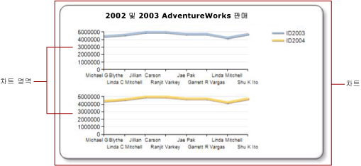

# 차트의 여러 계열(보고서 작성기 및 SSRS)
  차트에 여러 개의 계열이 있는 경우에는 계열을 비교할 최선의 방법을 결정해야 합니다. 각 계열의 상대적인 비율을 표시하려면 누적 차트를 사용할 수 있습니다. 공통 범주(x) 축을 공유하는 두 개의 계열만 비교할 때는 보조 축을 사용합니다. 이 방법은 가격과 볼륨, 수입과 세금 같은 두 개의 관련된 데이터 계열을 표시할 때 유용합니다. 차트를 알아보기 어려울 때는 여러 개의 차트 영역을 사용하여 각 계열을 시각적으로 분리하는 방법을 고려하십시오.  
  
 차트 기능을 사용하는 것 외에 데이터에 사용할 차트 유형을 결정하는 것도 중요합니다. 데이터 세트의 필드가 서로 관련된 경우에는 범위형 차트 사용을 고려해 보세요.  
  
> [!NOTE]  
>  [!INCLUDE[ssRBRDDup](../../includes/ssrbrddup-md.md)]  
  
## 누적 및 100% 누적 차트 사용  
 누적 차트는 일반적으로 하나의 차트 영역에 여러 계열을 표시할 때 사용됩니다. 밀접하게 연관된 데이터를 표시할 때는 누적 차트 사용을 고려하십시오. 누적 차트에는 4개 이하의 계열을 표시하는 것이 좋습니다. 전체에서 각 계열이 차지하는 비율을 비교하려면 100% 누적 차트, 가로 막대형 또는 세로 막대형 차트를 사용하십시오. 이러한 차트는 범주에서 각 계열이 차지하는 상대적인 비율을 계산합니다. 자세한 내용은 [영역형 차트&#40;보고서 작성기 및 SSRS&#41;](../../reporting-services/report-design/area-charts-report-builder-and-ssrs.md), [막대형 차트&#40;보고서 작성기 및 SSRS&#41;](../../reporting-services/report-design/bar-charts-report-builder-and-ssrs.md) 및 [세로 막대형 차트&#40;보고서 작성기 및 SSRS&#41;](../../reporting-services/report-design/column-charts-report-builder-and-ssrs.md)를 참조하세요.  
  
## 보조 축 사용  
 새로 차트에 추가한 계열은 기본 x축과 y축을 사용하여 표시됩니다. 측정 단위가 서로 다른 값을 비교하려면 두 계열을 별도의 축에 표시할 수 있도록 *보조 축* 을 사용하는 방법을 고려하십시오. 보조 축은 측정 단위가 다른 값을 비교할 때 유용합니다. 보조 축은 기본 축의 반대쪽에 그려집니다. 차트는 하나의 기본 축과 하나의 보조 축만 지원합니다. 보조 축의 속성은 기본 축의 속성과 동일합니다. 자세한 내용은 [보조 축에 데이터 표시&#40;보고서 작성기 및 SSRS&#41;](../../reporting-services/report-design/plot-data-on-a-secondary-axis-report-builder-and-ssrs.md)를 참조하세요.  
  
 데이터 범위가 서로 다른 계열을 세 개 이상 표시하려면 계열을 별도의 차트 영역에 배치하는 것을 고려하십시오.  
  
## 차트 영역 사용  
 차트는 외부 테두리, 차트 제목 및 범례를 포함하는 최상위 컨테이너입니다. 기본적으로 차트에는 한 개의 기본 차트 영역이 포함됩니다. 차트 영역은 차트 화면에는 표시되지 않지만 하나 이상 계열에 대한 축 레이블, 축 제목 및 그리기 영역만을 포함하는 컨테이너로 생각할 수 있습니다. 다음 그림에서는 단일 차트 내 차트 영역의 개념을 보여 줍니다.  
  
   
  
 **차트 영역 속성** 대화 상자를 사용하면 차트 영역에 포함된 모든 계열의 2D 및 3D 방향을 지정하고, 여러 차트 영역을 같은 차트 안에 정렬하고, 그리기 영역의 색에 서식을 지정할 수 있습니다. 기본 차트 영역이 하나만 포함된 차트에서 새 차트 영역을 정의하면 차트 영역에 사용할 수 있는 공간은 가로 방향으로 둘로 나뉘고 새 차트 영역은 첫 번째 차트 영역 아래에 배치됩니다.  
  
 각 계열은 하나의 차트 영역에만 연결할 수 있으며 기본적으로 모든 계열이 기본 차트 영역에 추가됩니다. 영역형, 세로 막대형, 꺾은선형 또는 분산형 차트를 사용할 때는 이러한 계열을 조합하여 같은 차트 영역에 표시할 수 있습니다. 예를 들어 동일한 차트 영역에 가로 막대형 계열과 선 계열을 표시할 수 있습니다. 여러 계열에 동일한 차트 영역을 사용할 때의 장점은 최종 사용자가 쉽게 비교할 수 있다는 점입니다.  
  
 가로 막대형, 방사형 및 셰이프 차트는 동일한 차트 영역의 다른 차트 종류와 결합할 수 없습니다. 가로 막대형, 방사형 또는 셰이프 유형의 여러 계열과 비교하려는 경우에는 다음 중 하나를 수행해야 합니다.  
  
-   차트 영역의 모든 계열을 동일한 차트 종류로 변경합니다.  
  
-   새 차트 영역을 만들고 기본 차트 영역의 계열을 새로 생성된 차트 영역으로 옮깁니다.  
  
 단일 차트에 여러 차트 영역을 사용하는 기능은 값 눈금이 서로 다른 데이터를 비교하려는 경우에도 유용합니다. 예를 들어 첫 번째 계열에 10부터 20까지 범위의 데이터가 포함되고 두 번째 계열에는 400부터 800까지 범위의 데이터가 포함된 경우에는 첫 번째 계열의 값을 알아보기 힘들 수 있습니다. 이런 경우에는 각 계열을 별도의 차트 영역으로 분리하는 것을 고려하십시오. 자세한 내용은 [계열에 대한 차트 영역 지정&#40;보고서 작성기 및 SSRS&#41;](../../reporting-services/report-design/specify-a-chart-area-for-a-series-report-builder-and-ssrs.md)을 참조하세요.  
  
## 범위형 차트 사용  
 범위형 차트에는 데이터 요소마다 두 개의 값이 있습니다. 차트에 동일한 범주(x) 축을 공유하는 두 개의 계열이 있는 경우에는 범위형 차트를 사용하여 두 계열 간의 차이를 표시할 수 있습니다. 범위형 차트는 고-저 또는 상-하 정보를 표시할 때 가장 적합합니다. 예를 들어 첫 번째 계열에는 1월의 각 날짜에 대한 최고 판매량이 포함되고 두 번째 계열에는 1월의 각 날짜에 대한 최저 판매량이 포함된 경우, 범위형 차트를 사용하여 각 날짜의 최고 판매량과 최저 판매량 간의 차이를 표시할 수 있습니다. 자세한 내용은 [범위형 차트&#40;보고서 작성기 및 SSRS&#41;](../../reporting-services/report-design/range-charts-report-builder-and-ssrs.md)를 참조하세요.  
  
## 참고 항목  
 [차트&#40;보고서 작성기 및 SSRS&#41;](../../reporting-services/report-design/charts-report-builder-and-ssrs.md)   
 [차트에 데이터 범위가 여러 개 있는 계열 표시&#40;보고서 작성기 및 SSRS&#41;](../../reporting-services/report-design/displaying-a-series-with-multiple-data-ranges-on-a-chart.md)   
 [차트 종류&#40;보고서 작성기 및 SSRS&#41;](../../reporting-services/report-design/chart-types-report-builder-and-ssrs.md)  
  
  
