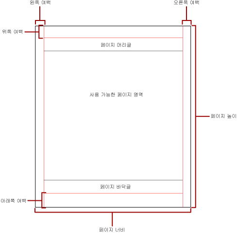
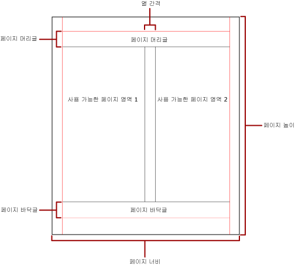

# 보고서 페이지 매김(보고서 작성기 및 SSRS)
  페이지 매김이란 페이지가 매겨진 보고서 내의 페이지 수와 이러한 페이지에 보고서 항목이 정렬되는 방식을 의미합니다. [!INCLUDE[ssRSnoversion](../../includes/ssrsnoversion-md.md)] 에서의 페이지 매김은 보고서를 보거나 배달하는 데 사용하는 렌더링 확장 프로그램에 따라 다릅니다. 보고서 서버에서 보고서를 실행하는 경우 보고서에는 HTML 렌더러가 사용됩니다. HTML은 페이지 매김과 관련하여 일련의 특별한 규칙을 따릅니다. 예를 들어 동일한 보고서를 PDF로 내보내면 PDF 렌더러가 사용되고 다른 규칙 집합이 적용되므로 보고서의 페이지가 다른 방식으로 매겨집니다. 보고서를 배달하는 데 사용할 렌더러에 최적화되고 사용자가 쉽게 읽을 수 있는 보고서를 성공적으로 디자인하려면 [!INCLUDE[ssRSnoversion](../../includes/ssrsnoversion-md.md)]에서 페이지 매김을 제어하는 데 사용되는 규칙을 이해할 필요가 있습니다.  
  
 이 항목에서는 하드 페이지 나누기 렌더러를 통해 보고서를 렌더링하는 방식에 물리적 페이지 크기와 보고서 레이아웃이 미치는 영향을 설명합니다. **보고서 속성** 창, **속성** 창 또는 **페이지 설정** 대화 상자를 통해 속성을 설정하여 물리적 페이지 크기 및 여백을 수정하고 보고서의 구획을 나눌 수 있습니다. 보고서 본문 외부의 파란색 영역을 클릭하여 **보고서 속성** 창에 액세스할 수 있습니다. 홈 탭에서 **실행** 을 클릭한 다음 실행 탭에서 **페이지 설정** 을 클릭하여 **페이지 설정** 대화 상자에 액세스할 수 있습니다.  
  
> [!NOTE]  
>  한 페이지 너비로 디자인한 보고서가 여러 페이지에 걸쳐 렌더링되는 경우 여백을 포함한 보고서 본문의 너비가 물리적 페이지 크기의 너비보다 더 크지 않은지 확인합니다. 보고서에 빈 페이지가 추가되지 않도록 하려면 컨테이너 모퉁이를 왼쪽으로 끌어 컨테이너 크기를 줄입니다.  
  
> [!NOTE]  
>  [!INCLUDE[ssRBRDDup](../../includes/ssrbrddup-md.md)]  
  
## 보고서 본문  
 보고서 본문은 디자인 화면에 흰 공간으로 표시되는 사각형 컨테이너입니다. 이 컨테이너는 그 안에 포함된 보고서 항목을 모두 수용하기에 적합한 크기로 확대하거나 축소할 수 있습니다. 보고서 본문은 물리적 페이지 크기를 반영하지 않으며, 사실상 물리적 페이지 크기의 경계를 넘어 여러 보고서 페이지에 걸쳐 확장될 수 있습니다. [!INCLUDE[ofprexcel](../../includes/ofprexcel-md.md)], Word, HTML 및 MHTML 같은 일부 렌더러에서는 페이지의 내용에 따라 확대 또는 축소되는 보고서를 렌더링합니다. 이러한 형식으로 렌더링한 보고서는 웹 브라우저 등과 같은 화면 중심의 보기 환경에 최적화됩니다. 이와 같은 렌더러를 사용하는 경우 필요에 따라 세로 방향 페이지 나누기가 추가됩니다.  
  
 보고서 본문의 서식을 지정하여 테두리 색, 테두리 스타일 및 테두리 두께를 설정할 수 있습니다. 배경색과 배경 이미지를 추가할 수도 있습니다.  
  
## 물리적 페이지  
 물리적 페이지 크기는 용지 크기를 의미합니다. 보고서에 대해 지정한 용지 크기에 따라 보고서의 렌더링 방식이 달라집니다. 하드 페이지 나누기 형식으로 렌더링한 보고서의 경우 하드 페이지 나누기 파일 형식으로 보고서를 인쇄하거나 볼 때 최적의 표시 환경을 제공할 수 있도록 물리적 페이지 크기에 따라 가로 및 세로로 페이지 나누기가 삽입됩니다. 소프트 페이지 나누기 형식으로 렌더링한 보고서의 경우 웹 브라우저에서 보고서를 볼 때 최적의 표시 환경을 제공할 수 있도록 물리적 페이지 크기에 따라 가로로 페이지 나누기가 삽입됩니다.  
  
 페이지 크기는 기본적으로 8.5 x 11인치이지만 **보고서 속성** 창, **페이지 설정** 대화 상자를 사용하거나 **속성** 창에서 PageHeight 및 PageWidth 속성을 변경하여 이 크기를 변경할 수 있습니다. 페이지 크기는 보고서 본문의 내용을 수용하는 데 필요한 정도로 확대 또는 축소되지 않습니다. 보고서를 한 페이지에 표시하려면 보고서 본문의 모든 내용이 물리적 페이지 크기에 맞아야 합니다. 보고서 본문 내용이 물리적 페이지 크기에 맞지 않을 경우 하드 페이지 나누기 형식을 사용하려면 보고서에 페이지가 추가로 필요합니다. 보고서 본문이 너무 커서 물리적 페이지의 오른쪽 가장자리를 벗어나면 가로 방향으로 페이지 나누기가 삽입됩니다. 보고서 본문이 너무 커서 물리적 페이지의 아래쪽 가장자리를 벗어나면 세로 방향으로 페이지 나누기가 삽입됩니다.  
  
 보고서에 정의된 물리적 페이지 크기를 다시 정의하려면 보고서를 내보내는 데 사용하려는 특정 렌더러의 디바이스 정보 설정을 사용하여 물리적 페이지 크기를 지정합니다. 자세한 내용은 [Reporting Services 디바이스 정보 설정(Reporting Services Device Information Settings)](../device-information-settings-for-rendering-extensions-reporting-services.md)을 참조하십시오.  
  
### 여백  
 여백은 물리적 페이지 치수의 가장자리에서 시작하여 지정된 여백 설정만큼 안쪽으로 들어간 지점까지의 공간을 차지합니다. 보고서 항목이 여백 영역까지 확장된 경우에는 여백 영역으로 넘어온 부분이 잘리고 그 중첩 영역이 렌더링되지 않습니다. 페이지의 가로 또는 세로 너비가 0이 되도록 여백 크기를 지정하면 오히려 여백 설정이 0으로 기본 지정됩니다. 여백을 지정하려면 **보고서 속성** 창, **페이지 설정** 대화 상자를 사용하거나 **속성** 창에서 TopMargin, BottomMargin, LeftMargin 및 RightMargin 속성을 변경합니다. 보고서에 정의된 여백 크기를 다시 정의하려면 보고서를 내보내는 데 사용하려는 특정 렌더러의 디바이스 정보 설정을 사용하여 여백 크기를 지정합니다.  
  
 여백, 단 간격, 페이지 머리글 및 바닥글에 공간을 할당한 후에 남는 물리적 페이지의 영역을 *사용 가능한 페이지 영역*이라고 합니다. 여백은 하드 페이지 나누기 렌더러 형식으로 보고서를 렌더링하고 인쇄할 때만 적용됩니다. 다음 그림에서는 물리적 페이지의 여백과 사용 가능한 페이지 영역을 보여 줍니다.  
  
   
  
### 회보 스타일 단  
 신문의 단과 같은 형식으로 보고서의 구획을 나눌 수 있습니다. 단은 동일한 물리적 페이지에 렌더링되는 논리적 페이지로 취급됩니다. 단은 왼쪽에서 오른쪽으로, 위쪽에서 아래쪽으로 배열되며 각 단 사이의 공백을 통해 서로 구분됩니다. 보고서를 여러 개의 단으로 나누면 물리적 페이지 각각이 세로 방향으로 구획 분할되어 단이 설정되고 각 단은 논리적 페이지로 간주됩니다. 예를 들어 물리적 페이지에 두 개의 단이 있는 경우를 생각해 봅시다. 보고서의 내용은 첫째 단을 먼저 채운 다음 둘째 단으로 이어집니다. 처음 두 개의 단 안에 보고서 내용을 모두 채울 수 없으면 다음 페이지의 첫째 단, 둘째 단 순으로 보고서 내용이 계속 이어집니다. 단은 모든 보고서 항목을 렌더링할 때까지 왼쪽에서 오른쪽으로, 위쪽에서 아래쪽으로 계속하여 채워집니다. 가로 너비나 세로 너비가 0이 되도록 단 크기를 지정하면 오히려 단 간격이 0으로 기본 설정됩니다.  
  
 열을 지정하려면 **보고서 속성** 창, **페이지 설정** 대화 상자를 사용하거나 **속성** 창에서 TopMargin, BottomMargin, LeftMargin 및 RightMargin 속성을 변경합니다. 정의되지 않은 여백 크기를 사용하려면 보고서를 내보내는 데 사용하려는 특정 렌더러의 디바이스 정보 설정을 사용하여 여백 크기를 지정합니다. 단은 PDF 또는 이미지 형식으로 보고서를 렌더링하고 인쇄할 때만 적용됩니다. 다음 그림에서는 단이 포함된 페이지의 사용 가능한 페이지 영역을 보여 줍니다.  
  
   
  
## 페이지 나누기 및 페이지 이름  
 보고서에 페이지 이름이 있으면 보고서를 보다 쉽게 읽을 수 있으며 해당 데이터를 쉽게 감사하고 내보낼 수 있습니다. Reporting Services에서는 보고서와 보고서의 테이블릭스 데이터 영역(테이블, 행렬 및 목록), 그룹 및 사각형에 대해 속성을 제공하여 페이지 매김을 제어하고, 페이지 번호를 다시 설정하고, 페이지 나누기 시 새로운 보고서 페이지 이름을 제공합니다. 이러한 기능은 보고서 렌더링 형식에 관계없이 보고서를 향상시킬 수 있으며, Excel 통합 문서로 보고서를 내보낼 때 특히 유용합니다.  
  
 InitialPageName 속성은 보고서의 초기 페이지 이름을 제공합니다. 보고서에 페이지 나누기에 대한 페이지 이름이 포함되어 있지 않으면 페이지 나누기를 통해 만들어지는 모든 새 페이지에 대해 초기 페이지 이름이 사용됩니다. 그러나 초기 페이지 이름을 반드시 사용할 필요는 없습니다.  
  
 렌더링된 보고서는 페이지 나누기로 인해 만들어지는 새 페이지에 대해 새 페이지 이름을 제공할 수 있습니다. 페이지 이름을 제공하려면 테이블, 행렬, 목록, 그룹 또는 사각형의 PageName 속성을 설정합니다. 나누기 시에 페이지 이름을 반드시 지정할 필요는 없습니다. 페이지 이름을 지정하지 않으면 InitialPageName의 값이 대신 사용됩니다. InitialPageName도 비어 있으면 새 페이지에 이름이 지정되지 않습니다.  
  
 테이블릭스 데이터 영역(테이블, 행렬 및 목록), 그룹 및 사각형은 페이지 나누기를 지원합니다.  
  
 페이지 나누기는 다음 속성을 포함합니다.  
  
-   BreakLocation은 페이지를 나눌 수 있는 보고서 요소에 대해 나누기 위치(시작, 끝, 시작과 끝)를 제공합니다. 그룹에서는 BreakLocation을 그룹 사이에 배치할 수 있습니다.  
  
-   Disabled는 페이지 나누기를 보고서 요소에 적용할지 여부를 나타냅니다. 이 속성 값이 True이면 페이지 나누기가 무시됩니다. 이 속성은 보고서를 실행할 때 식에 따라 페이지 나누기를 동적으로 비활성화하는 데 사용됩니다.  
  
-   ResetPageNumber는 페이지를 나눌 때 페이지 번호를 1로 다시 설정할지 여부를 나타냅니다. 이 속성 값이 True이면 페이지 번호가 다시 설정됩니다.  
  
 BreakLocation 속성은 **테이블릭스 속성**, **사각형 속성**또는 **그룹 속성** 대화 상자에서 설정할 수 있지만 Disabled, ResetPageNumber 및 PageName 속성은 보고서 작성기 속성 창에서 설정해야 합니다. 속성 창의 속성이 범주별로 구성되어 있는 경우에는 **PageBreak** 범주에서 이 속성을 찾을 수 있습니다. 그룹의 경우 **PageBreak** 범주는 **그룹** 범주 내에 있습니다.  
  
 상수 및 단순한 식이나 복잡한 식을 사용하여 Disabled 및 ResetPageNumber 속성의 값을 설정할 수 있습니다. 그러나 BreakLocation 속성에는 식을 사용할 수 없습니다. 식을 작성하고 사용하는 방법은 [식&#40;보고서 작성기 및 SSRS&#41;](../../reporting-services/report-design/expressions-report-builder-and-ssrs.md)를 참조하세요.  
  
 보고서에서 **Globals** 컬렉션을 사용하여 현재 페이지 이름 또는 페이지 번호를 참조하는 식을 작성할 수 있습니다. 자세한 내용은 [기본 제공 Globals 및 Users 참조&#40;보고서 작성기 및 SSRS&#41;](../../reporting-services/report-design/built-in-collections-built-in-globals-and-users-references-report-builder.md)를 참조하세요.  
  
### Excel 워크시트 탭 이름 지정  
 이러한 속성은 보고서를 Excel 통합 문서로 내보낼 때 유용합니다. InitialPage 속성을 사용하여 보고서를 내보낼 때 기본 워크시트 탭 이름을 지정하고, 페이지 나누기 및 PageName 속성을 사용하여 각 워크시트에 대해 다른 이름을 제공합니다. 그러면 페이지 나누기로 정의되는 각각의 새 보고서 페이지를 PageName 속성 값으로 이름이 지정된 서로 다른 워크시트로 내보냅니다. PageName은 비어 있지만 보고서에 초기 페이지 이름이 있으면 Excel 통합 문서의 모든 워크시트가 같은 이름(초기 페이지 이름)을 사용합니다.  
  
 보고서를 Excel로 내보낼 때 이러한 속성이 작동하는 방법은 [Microsoft Excel로 내보내기&#40;보고서 작성기 및 SSRS&#41;](../../reporting-services/report-builder/exporting-to-microsoft-excel-report-builder-and-ssrs.md)를 참조하세요.  
  
## 참고 항목  
 [페이지 레이아웃 및 렌더링&#40;보고서 작성기 및 SSRS&#41;](../../reporting-services/report-design/page-layout-and-rendering-report-builder-and-ssrs.md)  
  
  
