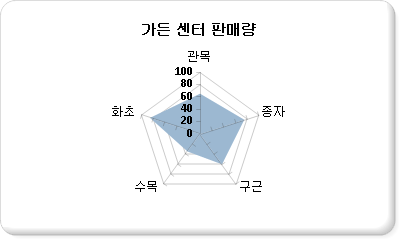

# 극좌표형 차트(보고서 작성기 및 SSRS)
  극좌표형 차트에서는 360도 원에서 범주별로 그룹화된 점의 집합으로 계열이 표시됩니다. 값은 원의 중심에서 측정한 점까지의 거리로 표현됩니다. 점이 중심에서 멀수록 더 큰 값을 의미합니다. 범주 레이블은 차트의 주위에 표시됩니다. 극좌표형 차트에 데이터를 추가하는 방법은 [차트&#40;보고서 작성기 및 SSRS&#41;](../../reporting-services/report-design/charts-report-builder-and-ssrs.md)를 참조하세요.  
  
> [!NOTE]  
>  [!INCLUDE[ssRBRDDup](../../includes/ssrbrddup-md.md)]  
  
## 변형  
  
-   **방사형 차트**. 방사형 차트에서는 계열이 원을 이루는 선이나 영역으로 표시됩니다. 극좌표형 차트와 달리 방사형 차트에서는 데이터를 표시하는 데 극좌표를 사용하지 않습니다.  
  
## 극좌표형 차트의 데이터 고려 사항  
  
-   방사형 차트는 여러 계열에 속하는 범주 데이터를 서로 비교하는 데 유용합니다.  
  
-   극좌표형 차트는 각 데이터 요소가 각도와 거리에 따라 결정되는 극좌표형 데이터를 그래프로 표현하는 데 가장 일반적으로 사용됩니다.  
  
-   극좌표형 차트는 동일한 차트 영역의 다른 어떠한 차트 종류와도 결합할 수 없습니다.  
  
## 예제  
 다음 예에서는 방사형 차트를 사용하는 방법을 보여 줍니다. 아래 표에는 이 차트에 사용한 데이터가 나와 있습니다.  
  
|이름|Sales|  
|----------|-----------|  
|Shrubs|61|  
|Seeds|78|  
|Bulbs|60|  
|Trees|38|  
|Flowers|81|  
  
 이 예에서 이름 필드는 범주 그룹 영역에 배치되고, 판매량 필드는 값 영역에 배치됩니다. 판매량 필드를 끌어다 놓으면 차트에서 해당 필드가 자동으로 집계 처리됩니다. 방사형 차트에서는 판매량 필드에 몇 개의 값이 있는지 확인한 후 이를 기준으로 레이블의 위치를 결정합니다. 이 예의 경우 판매량 필드에 다섯 개의 값이 포함되므로 레이블을 원에서 균등한 거리에 있는 다섯 지점에 배치합니다. 판매량 필드에 포함된 값이 세 개이면 레이블이 원에서 균등한 거리에 있는 세 지점에 배치됩니다.  
  
 다음 그림에서는 위의 데이터를 기준으로 생성된 방사형 차트의 예를 보여 줍니다.  
  
   
  
## 관련 항목:  
 [차트&#40;보고서 작성기 및 SSRS&#41;](../../reporting-services/report-design/charts-report-builder-and-ssrs.md)   
 [차트 서식 지정&#40;보고서 작성기 및 SSRS&#41;](../../reporting-services/report-design/formatting-a-chart-report-builder-and-ssrs.md)   
 [차트 종류&#40;보고서 작성기 및 SSRS&#41;](../../reporting-services/report-design/chart-types-report-builder-and-ssrs.md)   
 [꺾은선형 차트&#40;보고서 작성기 및 SSRS&#41;](../../reporting-services/report-design/line-charts-report-builder-and-ssrs.md)   
 [차트의 빈 데이터 요소 및 Null 데이터 요소&#40;보고서 작성기 및 SSRS&#41;](../../reporting-services/report-design/empty-and-null-data-points-in-charts-report-builder-and-ssrs.md)  
  
  
