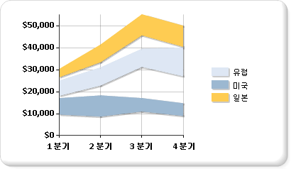

# 범위형 차트(보고서 작성기 및 SSRS)
  범위형 차트에서는 각각 동일한 범주의 여러 값으로 정의된 일련의 데이터 요소를 표시합니다. 값은 값 축을 기준으로 측정되는 표식의 높이로 표시됩니다. 범주 레이블은 범주 축에 표시됩니다. 일반 범위형 차트는 각 데이터 요소의 상위 값과 하위 값 사이 영역을 채웁니다.  
  
 다음 그림은 계열이 3개가 있는 일반 범위형 차트를 보여 줍니다.  
  
   
  
> [!NOTE]  
>  [!INCLUDE[ssRBRDDup](../../includes/ssrbrddup-md.md)]  
  
## 변형  
  
-   **곡선 범위형**. 곡선 범위형 차트는 직선보다는 곡선을 표시합니다.  
  
-   **세로 막대 범위형**. 세로 막대 범위형 차트는 영역 대신 세로 막대를 사용하여 범위를 표시합니다.  
  
-   **가로 막대 범위형**. 가로 막대 범위형 차트는 영역 대신 가로 막대를 사용하여 범위를 표시합니다.  
  
## 범위형 차트의 데이터 고려 사항  
  
-   범위형 차트 종류에는 데이터 요소마다 두 개의 값이 필요합니다. 이 값은 각 데이터 요소의 범위를 정의하는 상위 값과 하위 값에 해당합니다.  
  
-   범위형 차트는 상위 값이 하위 값보다 항상 큰 경우에만 분석에 유용하게 사용될 수 있습니다. 그렇지 않은 경우에는 꺾은선형 차트를 사용하는 것이 좋습니다. 상위 값이 하위 값보다 작으면 범위형 차트는 두 값의 차이에 대한 절대값을 표시합니다.  
  
-   하나의 값만 지정된 경우 범위형 차트는 데이터 요소당 값이 하나만 있는 일반적인 영역형 차트와 같이 표시됩니다.  
  
-   범위형 차트는 데이터 집합의 각 범주 그룹에 대한 최소값과 최대값을 포함하는 데이터를 그래프로 표시하는 데 많이 사용됩니다.  
  
-   범위형 차트에서는 각 데이터 요소에 표식을 표시할 수 없습니다.  
  
-   영역형 차트와 마찬가지로 일반 범위형 차트에서는 여러 계열의 값이 유사한 경우 계열이 겹쳐 표시될 수 있습니다. 이러한 경우 일반 범위형 차트 대신 세로 막대 범위형 차트 또는 가로 막대 범위형 차트를 사용하는 것이 좋습니다.  
  
-   Gantt 차트는 범위형 가로 막대 차트를 사용하여 만들 수 있습니다.  
  
## 관련 항목:  
 [차트 &#40; 보고서 작성기 및 SSRS &#41;](../../reporting-services/report-design/charts-report-builder-and-ssrs.md)   
 [차트 종류 &#40; 보고서 작성기 및 SSRS &#41;](../../reporting-services/report-design/chart-types-report-builder-and-ssrs.md)   
 [차트 &#40; 서식 지정 보고서 작성기 및 SSRS &#41;](../../reporting-services/report-design/formatting-a-chart-report-builder-and-ssrs.md)  
  
  
