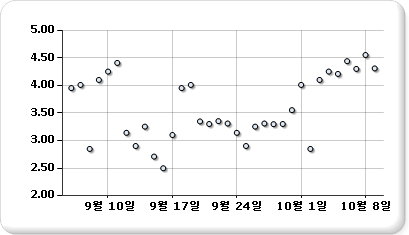

# 분산형 차트(보고서 작성기 및 SSRS)
  분산형 차트에서 계열은 일련의 점으로 표시됩니다. 값은 차트에서 점의 위치로 표시됩니다. 범주는 차트에서 여러 가지 표식으로 표시됩니다. 분산형 차트는 일반적으로 범주 간 집계 데이터를 비교하는 데 사용됩니다. 분산형 차트에 데이터를 추가하는 방법에 대한 자세한 내용은 [차트&#40;보고서 작성기 및 SSRS&#41;](../../reporting-services/report-design/charts-report-builder-and-ssrs.md)  
  
 다음 그림에서는 분산형 차트의 예를 보여 줍니다.  
  
   
  
> [!NOTE]  
>  [!INCLUDE[ssRBRDDup](../../includes/ssrbrddup-md.md)]  
  
## 변형  
  
-   **거품형.** 거품형 차트는 두 데이터 요소 값의 차이를 거품의 크기로 표시합니다. 거품이 클수록 두 값의 차이가 큰 것입니다.  
  
-   **3차원 거품형**. 3차원으로 표시되는 거품형 차트입니다.  
  
## 분산형 차트의 데이터 고려 사항  
  
-   분산형 차트는 과학, 통계 및 공학 데이터와 같은 숫자 값을 표시하고 비교하는 데 주로 사용됩니다.  
  
-   시간에 관계없이 많은 수의 데이터 요소를 비교하려면 분산형 차트를 사용하십시오. 분산형 차트에 포함되는 데이터가 많을수록 비교가 더 정확해집니다.  
  
-   거품형 차트에는 데이터 요소마다 두 개의 값(상위 값 및 하위 값)이 필요합니다.  
  
-   분산형 차트는 데이터 요소의 클러스터 및 값 분포를 처리하는 데 적합하며 데이터 집합에 요소가 많은 경우(예: 수천 개) 가장 적합한 차트 유형입니다. 점 차트에 여러 계열을 표시하는 것은 시각적인 혼란을 주므로 피하는 것이 좋습니다. 이런 경우에는 꺾은선형 차트를 사용하는 것이 좋습니다.  
  
-   기본적으로 분산형 차트에서는 데이터 요소가 원으로 표시됩니다. 분산형 차트에 여러 계열이 있는 경우에는 각 요소의 표식 모양을 사각형, 삼각형, 다이아몬드 등으로 바꾸어 보십시오.  
  
## 참고 항목  
 [차트&#40;보고서 작성기 및 SSRS&#41;](../../reporting-services/report-design/charts-report-builder-and-ssrs.md)   
 [차트 종류&#40;보고서 작성기 및 SSRS&#41;](../../reporting-services/report-design/chart-types-report-builder-and-ssrs.md)   
 [차트 서식 지정&#40;보고서 작성기 및 SSRS&#41;](../../reporting-services/report-design/formatting-a-chart-report-builder-and-ssrs.md)   
 [꺾은선형 차트&#40;보고서 작성기 및 SSRS&#41;](../../reporting-services/report-design/line-charts-report-builder-and-ssrs.md)  
  
  
