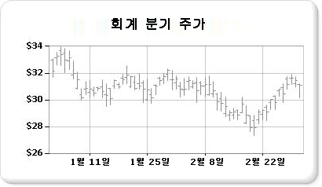

# 주식형 차트(보고서 작성기 및 SSRS)

  주식형 차트는 데이터 요소당 최대 4개의 값을 사용하는 재무 데이터 또는 과학적 데이터에 적합하도록 특별히 디자인되었습니다. 이러한 값은 고가, 저가, 시가, 종가 값으로 정렬되어 재무 주식 데이터를 나타냅니다. 이러한 종류의 차트에서는 일반적으로 선 또는 삼각형 표식을 사용하여 시가 및 종가 값을 표시합니다. 다음 예에서 시가 값은 왼쪽에 표식으로 표시되어 있고 종가 값은 오른쪽에 표식으로 표시되어 있습니다.  
  
   
  
 주식형 차트의 예는 보고서 작성기의 예제 보고서로 제공됩니다. 이 샘플 보고서 및 기타 보고서를 다운로드하는 방법은 [보고서 작성기 및 보고서 디자이너 샘플 보고서](http://go.microsoft.com/fwlink/?LinkId=198283).  
  
> [!NOTE]  
>  [!INCLUDE[ssRBRDDup](../../includes/ssrbrddup-md.md)]  
  
## 변형  
  
-   **원통형**. 원통형 차트는 시가와 종가 사이의 범위를 표시하는 상자가 사용되는 특수한 형태의 주식형 차트입니다. 주식형 차트와 마찬가지로 원통형 차트에서도 데이터 요소당 최대 4개의 값을 표시할 수 있습니다.  
  
## 주식형 차트의 데이터 고려 사항  
  
-   연간 주가 동향을 나타내는 경우처럼 여러 주식 데이터 요소를 나타내는 경우 각 데이터 요소의 시가, 종가, 고가 및 저가 값을 각각 구분하기는 어렵습니다. 이 시나리오에서는 주식형 차트 대신 꺾은선형 차트를 사용하는 것이 좋습니다.  
  
-   일반적으로 축 레이블은 생성 시 0에서부터 시작합니다.  주가의 변동 폭은 일반적으로 다른 데이터 집합의 변동 폭과 차이가 있습니다. 따라서 데이터를 보다 수월하게 파악하기 위해 축 레이블이 0부터 시작하지 않도록 할 수 있습니다. 이렇게 하려면 **축 속성** 대화 상자 또는 속성 창에서 **IncludeZero** 를 **false** 로 설정합니다. 차트가 축 레이블을 생성하는 방법은 [차트의 축 레이블 서식 지정&#40;보고서 작성기 및 SSRS&#41;](../../reporting-services/report-design/formatting-axis-labels-on-a-chart-report-builder-and-ssrs.md)을 참조하세요.  
  
-   [!INCLUDE[ssRSnoversion](../../includes/ssrsnoversion-md.md)] 에서는 주식형 차트에서 사용할 수 있는 가격 표시기, 상대 강도 지수, MACD 등의 여러 계산된 수식을 제공합니다.  

## 다음 단계

[범위형 차트](../../reporting-services/report-design/range-charts-report-builder-and-ssrs.md)   
[차트](../../reporting-services/report-design/charts-report-builder-and-ssrs.md)   
[차트 서식 지정](../../reporting-services/report-design/formatting-a-chart-report-builder-and-ssrs.md)   
[축 속성 대화 상자, 축 옵션](http://msdn.microsoft.com/library/b276e210-7a12-48ae-971b-7dabae51df11)  

추가 질문이 있으신가요? [Reporting Services 포럼에서 질문하기](http://go.microsoft.com/fwlink/?LinkId=620231)
