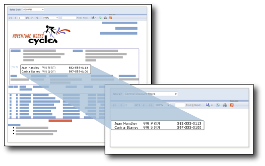

# 하위 보고서(보고서 작성기 및 SSRS)
  하위 보고서는 주 보고서의 본문 안에 다른 보고서를 표시하는 보고서 항목입니다. 보고서의 하위 보고서는 개념적 측면에서 웹 페이지의 프레임과 유사하며 보고서 내에 다른 보고서를 포함하는 데 사용됩니다. 모든 보고서를 하위 보고서로 사용할 수 있습니다. 하위 보고서로 표시되는 보고서는 보고서 서버에서 주로 부모 보고서와 같은 폴더에 저장됩니다. 하위 보고서에 부모 보고서가 매개 변수를 전달하도록 디자인할 수 있습니다. 하위 보고서의 각 인스턴스에 데이터 필터링 매개 변수를 사용하여 하위 보고서를 데이터 영역 내에서 반복할 수 있습니다.  
  
> [!NOTE]  
>  하위 보고서를 테이블릭스 데이터 영역에서 사용하는 경우 하위 보고서 및 해당 매개 변수는 모든 행에 대해 처리됩니다. 행이 많을 경우 드릴스루 보고서가 더 적합한지 여부를 고려해 보세요.  
  
   
  
 위의 그림에서 주 Sales Order 보고서에 표시된 연락처 정보는 실제로 Contacts 하위 보고서에서 가져온 것입니다.  
  
> [!NOTE]  
>  [!INCLUDE[ssRBRDDup](../../includes/ssrbrddup-md.md)]  
  
## 하위 보고서와 중첩된 데이터 영역 비교  
 하위 보고서를 사용하여 별도의 데이터 그룹을 표시하려는 경우 테이블, 행렬 또는 차트 같은 데이터 영역을 대신 사용하는 것이 좋습니다. 데이터 영역만 있는 보고서는 하위 보고서가 있는 보고서보다 성능이 나을 수 있습니다.  
  
 동일한 데이터 원본의 데이터 그룹을 단일 데이터 영역에 중첩하려면 데이터 영역을 사용합니다. 다른 데이터 원본의 데이터 그룹을 단일 데이터 영역에 중첩하거나, 여러 부모 보고서에서 하위 보고서를 다시 사용하거나, 다른 보고서 내부에 독립 실행형 보고서를 표시하려면 하위 보고서를 사용합니다. 예를 들어 다른 보고서의 본문 안에 하위 보고서를 여러 개 넣어 "요약 책"을 만들 수 있습니다.  
  
 데이터 영역은 하위 보고서와 같은 기능과 유연성을 제공하면서도 성능은 보다 우수합니다. 보고서 서버에서는 하위 보고서의 각 인스턴스를 개별 보고서로 처리하기 때문에 성능에 영향을 줄 수 있습니다. 자세한 내용은 [중첩된 데이터 영역&#40;보고서 작성기 및 SSRS&#41;](../../reporting-services/report-design/nested-data-regions-report-builder-and-ssrs.md)을 참조하세요.  
  
## 하위 보고서에서 매개 변수 사용  
 부모 보고서에서 하위 보고서로 매개 변수를 전달하려면 하위 보고서로 사용하는 보고서에 보고서 매개 변수를 정의합니다. 하위 보고서를 부모 보고서에 배치하면 부모 보고서에서 하위 보고서의 보고서 매개 변수에 전달할 값 및 보고서 매개 변수를 선택할 수 있습니다.  
  
> [!NOTE]  
>  하위 보고서에서 선택하는 매개 변수는 쿼리 매개 변수가 아닌 보고서 매개 변수입니다.  
  
 하위 보고서를 보고서의 본문이나 데이터 영역에 배치할 수 있습니다. 하위 보고서를 데이터 영역에 배치하면 하위 보고서는 데이터 영역에 있는 그룹 또는 행의 인스턴스마다 반복됩니다. 그룹 또는 행의 값을 하위 보고서에 전달하려면 하위 보고서 값 속성에서 하위 보고서 매개 변수에 전달하려는 값을 포함하는 필드의 식을 사용합니다.  
  
 하위 보고서 작업에 대한 자세한 내용은 [하위 보고서 및 매개 변수 추가&#40;보고서 작성기 및 SSRS&#41;](../../reporting-services/report-design/add-a-subreport-and-parameters-report-builder-and-ssrs.md)를 참조하세요.  
  
## 하위 보고서 이름 및 위치 지정  
 주 보고서가 같은 보고서 서버의 다른 폴더에 있는 하위 보고서를 지정하도록 디자인할 수 있습니다.  
  
 하위 보고서를 지정하는 데 사용하는 구문은 보고서 서버가 기본 모드에 있는지, 아니면 SharePoint 통합 모드에 있는지에 따라 달라집니다. 자세한 내용은 [외부 항목에 대한 경로 지정&#40;보고서 작성기 및 SSRS&#41;](../../reporting-services/report-design/specifying-paths-to-external-items-report-builder-and-ssrs.md)을 참조하세요.  
  
 보고서 작성기에서 주 보고서의 하위 보고서를 미리 보려면 두 보고서가 같은 보고서 서버에 있어야 합니다. 그렇지 않은 경우 하위 보고서의 전체 경로를 지정해야 합니다.  
  
## 관련 항목:  
 [드릴스루, 드릴다운, 하위 보고서 및 중첩 데이터 영역&#40;보고서 작성기 및 SSRS&#41;](../../reporting-services/report-design/drillthrough-drilldown-subreports-and-nested-data-regions.md)  
  
  
