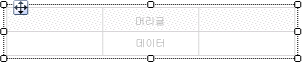
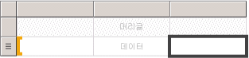
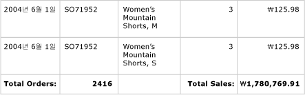
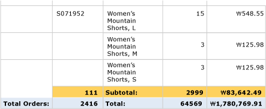
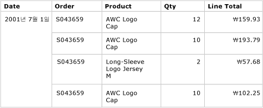
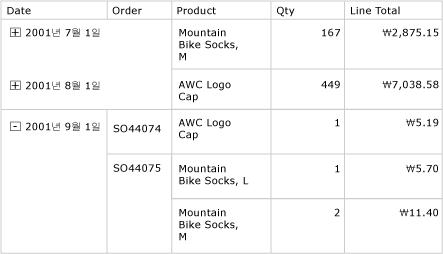

# 테이블(보고서 작성기 및 SSRS)
 [!INCLUDE[ssRSnoversion_md](../../includes/ssrsnoversion-md.md)]에서 테이블을 사용하여 정보 데이터나 그룹화된 데이터 또는 두 데이터의 조합을 페이지가 매겨진 보고서에 표시할 수 있습니다.   
   
 단일 필드, 여러 필드를 기준으로 하거나 사용자 고유의 식을 작성하여 데이터를 그룹화할 수 있습니다. 중첩 그룹 또는 독립적인 인접 그룹을 만들 수 있습니다. 그룹화된 데이터에 대해 집계된 값을 표시하려면 그룹에 합계를 추가합니다. 행 및 열의 서식을 지정하여 강조하려는 데이터를 강조 표시할 수 있습니다. 처음에 정보 데이터나 그룹화된 데이터를 숨길 수 있으며 드릴다운 토글을 포함하여 사용자가 표시할 데이터의 양을 대화형으로 선택하도록 할 수 있습니다.  
  
 테이블을 빠르게 시작하려면 [자습서: 기본 테이블 보고서 만들기&#40;보고서 작성기&#41;](../../reporting-services/tutorial-creating-a-basic-table-report-report-builder.md) 또는 [기본 테이블 보고서 만들기&#40;SSRS 자습서&#41;](../../reporting-services/create-a-basic-table-report-ssrs-tutorial.md)를 참조하세요.  
  
> [!NOTE]  
>  테이블을 보고서와는 별도로 보고서 파트로 게시할 수 있습니다. [보고서 파트](../../reporting-services/report-design/report-parts-report-builder-and-ssrs.md)에 대해 자세히 알아봅니다.  
  
  
##   테이블을 추가하여 세부 데이터 표시  
 리본 메뉴의 삽입 탭에서 디자인 화면에 테이블을 추가합니다. 테이블 또는 행렬 마법사를 사용하여 테이블을 추가할 수 있습니다. 이 마법사에서는 데이터 원본 연결 및 데이터 집합을 만들고 테이블을 구성하거나 수동으로 구성할 수 있는 테이블 템플릿을 기준으로 테이블을 만들 수 있습니다.  
  
> [!NOTE]  
>  마법사는 보고서 작성기에서만 사용할 수 있습니다.  
  
 이 항목에서는 테이블 템플릿을 사용하여 테이블을 구성하는 전체 방법을 설명합니다.  
  
 기본적으로 새 테이블에는 레이블에 대한 머리글 행과 세부 데이터에 대한 데이터 열이 있는 고정된 수의 열이 포함되어 있습니다. 다음 그림에서는 디자인 화면에 추가된 새 테이블을 보여 줍니다.  
  
   
  
 테이블을 선택할 때는 테이블 밖에 행 및 열 핸들이 표시되고 셀 안에는 대괄호가 표시됩니다. 행 핸들에는 각 행의 용도를 이해하는 데 도움이 되는 그래픽이 표시됩니다. 대괄호는 선택한 셀에 대한 그룹 멤버 자격을 나타냅니다. 다음 그림에서는 기본 테이블에서 선택된 빈 셀을 보여 줍니다.  
  
   
  
 데이터 행에 대한 행 핸들은 세부 정보 기호를 보여줍니다(). 이러한 행에서 데이터를 표시하려면 보고서 데이터 창의 필드를 머리글 행 또는 정보 행의 테이블 셀로 끌어옵니다. 두 행이 동시에 채워집니다. 열을 더 추가하려면 삽입 지점이 보일 때까지 해당 필드를 테이블로 끌어옵니다. 데이터 집합 필드를 테이블에 추가한 후에는 날짜 및 통화에 대한 기본 서식을 변경하여 보고서에 표시되는 방법을 제어할 수 있습니다. 다음 다이어그램에서는 Date, Order, Product, Qty 및 Line Total 필드가 있는 테이블 데이터 영역을 보여 줍니다.  
  
   
  
 미리 보기로 보고서를 보고 디자인을 확인합니다. 테이블은 필요에 따라 페이지 아래로 확장됩니다. 데이터 집합 쿼리 결과 집합의 모든 행에 대해 레이블 행 및 정보 행이 한 번씩 표시됩니다. 다음 그림과 같이 주문에서 판매된 각 제품이 품목에 대한 수량 및 라인 총합계와 함께 별도의 행으로 표시됩니다.  
  
   
  
 시작 테이블은 테이블릭스 데이터 영역을 기반으로 하는 템플릿입니다. 기본 테이블릭스 데이터 영역에서 지원하는 기능을 추가하여 테이블의 디자인을 향상시킬 수 있습니다. 자세한 내용은 [보고서 페이지에서 테이블릭스 데이터 영역 표시 제어&#40;보고서 작성기 및 SSRS&#41;](../../reporting-services/report-design/controlling-the-tablix-data-region-display-on-a-report-page.md)를 참조하세요. 행 그룹 또는 열 그룹을 추가하거나 세부 그룹을 추가 또는 제거하여 끊임없이 테이블을 개발할 수 있습니다. 자세한 내용은 [테이블릭스 데이터 영역의 유연성 살펴보기&#40;보고서 작성기 및 SSRS&#41;](../../reporting-services/report-design/exploring-the-flexibility-of-a-tablix-data-region-report-builder-and-ssrs.md)를 참조하세요.  
  
### 정보 데이터에 대한 합계 추가  
 합계를 추가하려면 숫자 데이터가 있는 셀을 선택한 다음 바로 가기 메뉴를 사용하여 숫자 필드의 정보 데이터에 대한 레이블 및 합계를 자동으로 추가합니다. 다른 레이블과 합계를 수동으로 지정할 수도 있습니다. 다음 그림에서는 자동 및 수동으로 지정된 합계를 모두 포함하는 일반적인 합계 행을 보여 줍니다.  
  
   
  
 미리 보기에서 보고서에는 데이터 집합 쿼리 결과 집합의 모든 행에 대해 머리글 행 및 정보 행이 한 번씩 표시되며 합계 행도 표시됩니다. 다음 그림에서는 합계 행을 포함한 마지막 몇 개 행을 보여 줍니다.  
  
   
  
 자세한 내용은 [그룹 또는 테이블릭스 데이터 영역에 합계 추가&#40;보고서 작성기 및 SSRS&#41;](../../reporting-services/report-design/add-a-total-to-a-group-or-tablix-data-region-report-builder-and-ssrs.md)를 참조하세요.  
  
##   테이블에 행 그룹 추가  
 필드를 보고서 데이터 창에서 셀로 끌어 와서 정보 데이터를 표시하는 것처럼 그룹화 창으로 필드를 끌어 그룹을 추가할 수 있습니다. 테이블의 경우 필드를 행 그룹 창으로 끌어옵니다. 그룹을 추가하면 테이블에서 그룹 값을 표시할 행 그룹 영역의 새 열로 셀이 자동으로 추가됩니다. 영역에 대한 자세한 내용은 [테이블릭스 데이터 영역&#40;보고서 작성기 및 SSRS&#41;](../../reporting-services/report-design/tablix-data-region-areas-report-builder-and-ssrs.md)를 참조하세요.  
  
 다음 그림에서는 두 개의 중첩된 행 그룹을 포함하는 테이블을 디자인 뷰에서 보여 줍니다. Order 필드와 Date 필드를 차례로 행 그룹 창으로 끌어 오고 각 그룹을 기존 그룹의 부모로 삽입하여 행 그룹을 만듭니다. 이 그림에서는 날짜 기반의 부모 그룹과 주문 번호 기반의 자식 그룹 및 기본값으로 정의된 세부 정보 그룹을 보여 줍니다.  
  
   
  
 미리 보기에서 보고서에는 다음 그림과 같이 날짜와 주문 순서로 그룹화된 주문 데이터가 표시됩니다.  
  
   
  
 그룹화된 데이터를 표시하는 다른 방법은 각 값을 고유한 열로 표시하지 않고 그룹 계층 구조를 들여쓰기하여 그룹의 중첩 관계를 표시하는 것입니다. 이러한 서식 지정 스타일을 단계별 보고서라고 합니다. 그룹 정보를 단계별 보고서로 서식을 지정하는 방법에 대한 자세한 내용은 [단계별 보고서 만들기&#40;보고서 작성기 및 SSRS&#41;](../../reporting-services/report-design/create-a-stepped-report-report-builder-and-ssrs.md)를 참조하세요.  
  
### 행 그룹에 합계 추가  
 그룹에 대한 합계를 표시하려면 상황에 맞게 작동하는 **합계 추가** 명령을 사용합니다. 행 그룹에 대해 합계 추가 명령을 사용하면 그룹 외부에 행이 추가되어 그룹에 대해 합계가 한 번만 반복됩니다. 중첩된 그룹의 경우 자식 그룹에 대한 합계 행은 자식 그룹의 외부에 있는 동시에 부모 그룹의 내부에 있습니다. 이러한 경우 자식 그룹에 대한 합계 행의 배경색을 설정하여 정보 행과 구분해 주는 것이 좋습니다. 다른 배경색을 사용하여 테이블 머리글과 바닥글 행을 구분할 수 있습니다. 다음 그림에서는 주문 번호 기반의 그룹에 대해 추가된 합계 행이 있는 테이블을 보여 줍니다.  
  
   
  
 보고서를 볼 때 주문 부분합을 표시하는 행이 주문 번호마다 한 번씩 반복됩니다. 테이블 바닥글에는 모든 날짜의 합계가 표시됩니다. 다음 그림에서 마지막 몇 개 행은 3개의 정보 행과 마지막 주문 번호인 SO71952에 대한 부분합 및 테이블의 모든 날짜에 대한 합계를 보여 줍니다.  
  
   
  
 자세한 내용은 [그룹 또는 테이블릭스 데이터 영역에 합계 추가&#40;보고서 작성기 및 SSRS&#41;](../../reporting-services/report-design/add-a-total-to-a-group-or-tablix-data-region-report-builder-and-ssrs.md)를 참조하세요.  
  
##   정보 행 제거 또는 숨기기  
 보고서에서 테이블을 미리 본 후 기존 정보 행을 제거할 수 있습니다. 또는 드릴다운 보고서처럼 기본적으로 정보 행을 숨기고 사용자가 정보 행 표시를 자세히 보기 또는 간략히 보기 간에 전환하도록 할 수 있습니다.  
  
 테이블에서 정보 행을 제거하려면 그룹화 창을 사용합니다. 세부 정보 그룹을 선택하고 바로 가기 메뉴를 사용하여 그룹 및 정보 데이터를 표시하는 행을 삭제합니다. 다음 그림에서는 날짜 및 주문 번호를 기준으로 그룹화되었지만 정보 행은 포함하지 않는 테이블의 디자인 뷰를 보여 줍니다. 이 테이블에는 합계 행이 추가되지 않았습니다.  
  
   
  
 정보 행을 삭제한 후에는 행 그룹으로 값의 범위가 한정됩니다. 정보 데이터가 더 이상 표시되지 않습니다.  
  
> [!NOTE]  
>  정보 행을 제거한 후 각 셀의 식에 적절한 집계 식이 지정되어 있는지 확인합니다. 필요한 경우 식을 편집하여 집계 함수를 원하는 대로 지정합니다.  
  
 다음 그림에서는 이러한 보고서를 미리 보기로 보여 줍니다.  
  
   
  
 테이블에서 행을 추가하거나 제거하려면 [행 삽입 또는 삭제&#40;보고서 작성기 및 SSRS&#41;](../../reporting-services/report-design/insert-or-delete-a-row-report-builder-and-ssrs.md)를 참조하세요.  
  
 보고서가 처음으로 표시될 때 정보 행을 숨길 수도 있습니다. 이렇게 하려면 부모 그룹 데이터만 표시되는 드릴다운 보고서를 만듭니다. 세부 정보 그룹을 포함한 각 내부 그룹에 대해 포함 그룹의 그룹화 셀에 표시 유형 설정/해제 항목을 추가합니다. 예를 들어 세부 정보 그룹의 경우 주문 번호 그룹 값이 표시되는 입력란에 표시 유형 설정/해제 항목을 추가합니다. 주문 번호 그룹의 경우 날짜 그룹 값이 표시되는 입력란에 표시 유형 설정/해제 항목을 추가합니다. 다음 그림에서는 2001년 9월 1일에 대한 행을 보여 주며 확장하면 처음 몇 개의 주문이 표시됩니다.  
  
   
  
 자세한 내용은 [항목에 확장 또는 축소 동작 추가&#40;보고서 작성기 및 SSRS&#41;](../../reporting-services/report-design/add-an-expand-or-collapse-action-to-an-item-report-builder-and-ssrs.md)를 참조하세요.  
  
## 참고 항목  
 [데이터 필터링, 그룹화 및 정렬&#40;보고서 작성기 및 SSRS&#41;](../../reporting-services/report-design/filter-group-and-sort-data-report-builder-and-ssrs.md)   
 [식&#40;보고서 작성기 및 SSRS&#41;](../../reporting-services/report-design/expressions-report-builder-and-ssrs.md)   
 [식 예&#40;보고서 작성기 및 SSRS&#41;](../../reporting-services/report-design/expression-examples-report-builder-and-ssrs.md)   
 [테이블, 행렬 및 목록&#40;보고서 작성기 및 SSRS&#41;](../../reporting-services/report-design/tables-matrices-and-lists-report-builder-and-ssrs.md)  
  
  
