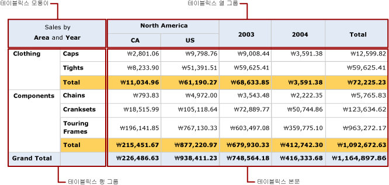

# 테이블릭스 데이터 영역(보고서 작성기 및 SSRS)
 [!INCLUDE[ssRSnoversion_md](../../includes/ssrsnoversion-md.md)] 페이지를 매긴 보고서에서 테이블릭스 데이터 영역에는 테이블릭스 셀을 포함하는 다음 네 개의 영역이 있습니다.   
* 모퉁이  
* 행 그룹 영역  
* 열 그룹 영역  
* 본문   
  
각 영역의 셀에는 고유의 기능이 있습니다. 테이블릭스 본문 영역에 셀을 추가하여 세부 데이터 및 그룹화된 데이터를 표시할 수 있습니다. 사용자가 그룹 인스턴스 값을 표시하기 위해 그룹을 만들 때 보고서 작성기 및 보고서 디자이너는 행 그룹 또는 열 그룹 영역에 셀을 추가합니다. 행 그룹 및 열 그룹이 모두 있으면 보고서 작성기 및 보고서 디자이너에서 테이블릭스 모퉁이 셀을 만듭니다.  
  
디자인 화면에서 점선은 선택한 테이블릭스 데이터 영역의 네 영역을 표시합니다. 다음 그림에서는 범주 및 하위 범주를 기준으로 하는 중첩된 행 그룹, 지리 및 국가/지역을 기준으로 하는 중첩된 열 그룹 그리고 연도를 기준으로 하는 인접한 열 그룹이 있는 테이블릭스 영역의 영역을 보여 줍니다.  
  
   
  
 다음 목록에서는 각 영역에 대해 설명합니다.  
  
-   **테이블릭스 모퉁이 영역**. (옵션) 테이블릭스 모퉁이는 왼쪽 위 모퉁이에 있습니다. RTL(오른쪽에서 왼쪽) 레이아웃의 경우에는 오른쪽 위 모퉁이에 있습니다. 이 영역은 테이블릭스 데이터 영역에 행 그룹과 열 그룹을 모두 추가하면 자동으로 생성됩니다. 이 영역에서는 셀을 병합하고, 레이블을 추가하거나 다른 보고서 항목을 포함시킬 수 있습니다. 그림에서는 모퉁이의 병합된 셀이 Sales by Area and Year 레이블을 표시합니다.  
  
-   **테이블릭스 열 그룹 영역**. (옵션) 테이블릭스 열 그룹은 오른쪽 위 모퉁이(RTL 레이아웃의 경우 왼쪽 위 모퉁이)에 있습니다. 이 영역은 열 그룹을 추가할 때 자동으로 생성됩니다. 이 영역의 셀은 열 그룹 계층 구조의 멤버를 나타내며 열 그룹 인스턴스 값을 표시합니다. 그림에서는 [Geography] 및 [CountryRegion]을 표시하는 셀이 중첩된 열 그룹이고 [Year]를 표시하는 셀이 인접한 열 그룹입니다. [Total] 열은 각 행의 집계된 합계를 표시합니다.  
  
-   **테이블릭스 행 그룹 영역**. (옵션) 테이블릭스 행 그룹은 왼쪽 아래 모퉁이(RTL 레이아웃의 경우 오른쪽 아래)에 있습니다. 이 영역은 행 그룹을 추가할 때 자동으로 생성됩니다. 이 영역의 셀은 행 그룹 계층 구조의 멤버를 나타내며 행 그룹 인스턴스 값을 표시합니다. 그림에서는 [Category] 및 [Subcat]을 표시하는 셀이 중첩된 행 그룹입니다. Subcat 아래의 Total 행은 각 범주 그룹에서 반복되어 각 열의 집계된 부분합을 보여 줍니다. 총합계 행은 모든 범주의 합계를 보여 줍니다.  
  
-   **테이블릭스 본문 영역**. 테이블릭스 본문은 오른쪽 아래 모퉁이(RTL 레이아웃의 경우 왼쪽 아래)에 있습니다. 테이블릭스 본문은 정보 데이터 및 그룹화된 데이터를 표시합니다. 이 예제에서는 집계된 데이터만 사용합니다. 식의 범위는 입력란이 속한 가장 안쪽의 그룹에 의해 결정됩니다. 테이블릭스 본문의 셀은 정보 행의 멤버일 경우 정보 데이터를 표시하고, 그룹과 연관된 행 또는 열의 멤버인 경우 집계 데이터를 나타냅니다. 기본적으로 집계 함수를 포함하고 있지 않은 간단한 식이 들어 있는 그룹 행 또는 열의 셀은 그룹에서 첫 번째 값으로 평가됩니다. 그림에서는 셀이 모든 판매 주문의 라인 합계에 대한 집계 합계를 표시합니다.  
  
 보고서를 실행하면 열 그룹이 고유한 그룹 식 값이 있는 열의 수만큼 오른쪽(테이블릭스 데이터 영역의 Direction 속성이 RTL로 설정되어 있는 경우 왼쪽)으로 확장됩니다. 행 그룹은 페이지 아래로 확장됩니다. 자세한 내용은 [테이블릭스 데이터 영역 셀, 행 및 열&#40;보고서 작성기 및 SSRS&#41;](../../reporting-services/report-design/tablix-data-region-cells-rows-and-columns-report-builder-and-ssrs.md)을 참조하세요.  
  
 다음 그림에서는 미리 보기에 있는 테이블릭스 데이터 영역을 보여 줍니다.  
  
   
  
 행 그룹 영역은 Clothing 및 Components의 두 범주 그룹 인스턴스를 표시합니다. 열 그룹은 North America의 지리 그룹 인스턴스를 Canada(CA) 및 United States(US)의 두 중첩된 국가/지역 그룹 인스턴스와 함께 표시합니다. 또한 인접 열은 2003 및 2004의 두 연도 그룹 인스턴스를 표시합니다. Total 열 행은 행 합계를 표시하고, 범주 그룹마다 반복되는 합계 행은 하위 범주 합계를 보여 주고, 총합계 행은 데이터 영역 전체의 범주 합계를 표시합니다.  
  
## 관련 항목:  
 [테이블, 행렬 및 목록&#40;보고서 작성기 및 SSRS&#41;](../../reporting-services/report-design/tables-matrices-and-lists-report-builder-and-ssrs.md)   
 [보고서 작성기 자습서](../../reporting-services/report-builder-tutorials.md)   
 [테이블&#40;보고서 작성기 및 SSRS&#41;](../../reporting-services/report-design/tables-report-builder-and-ssrs.md)   
 [행렬 만들기](../../reporting-services/report-design/create-a-matrix-report-builder-and-ssrs.md)   
 [목록을 사용하여 송장 및 양식 만들기](../../reporting-services/report-design/create-invoices-and-forms-with-lists-report-builder-and-ssrs.md)   
 [테이블릭스 데이터 영역&#40;보고서 작성기 및 SSRS&#41;](../../reporting-services/report-design/tablix-data-region-report-builder-and-ssrs.md)  
  
  
