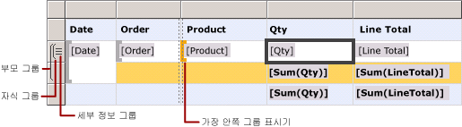
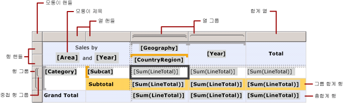
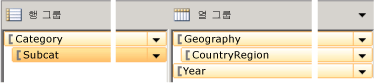

# 테이블릭스 데이터 영역 셀, 행 및 열(보고서 작성기 및 SSRS)
  페이지가 매겨진 [!INCLUDE[ssRSnoversion_md](../../includes/ssrsnoversion-md.md)] 보고서에서 테이블릭스 데이터 영역의 행 및 열 데이터가 표시되는 방식을 제어하려면 정보 데이터, 그룹 데이터 및 레이블과 합계에 대한 행 및 열을 지정하는 방법을 이해해야 합니다. 대부분의 경우 테이블, 행렬 또는 목록의 기본 구조를 사용하여 데이터를 표시할 수 있습니다. 자세한 내용은 [테이블&#40;보고서 작성기 및 SSRS&#41;](../../reporting-services/report-design/tables-report-builder-and-ssrs.md), [행렬](../../reporting-services/report-design/create-a-matrix-report-builder-and-ssrs.md) 또는 [목록](../../reporting-services/report-design/create-invoices-and-forms-with-lists-report-builder-and-ssrs.md)을 참조하세요.  
  
 테이블릭스 데이터 영역에는 정보 행 및 정보 열 기반의 정보 데이터와 그룹 행 및 그룹 열 기반의 그룹화된 데이터가 표시됩니다. 행 그룹과 열 그룹을 테이블릭스 데이터 영역에 추가하면 데이터가 표시되는 행 및 열이 자동으로 추가됩니다. 행 및 열을 수동으로 추가 및 제거하여 테이블릭스 데이터 영역을 사용자 지정하고 보고서에 데이터가 표시되는 방법을 제어할 수 있습니다.  
  
 테이블릭스 데이터 영역을 사용자 지정하는 방법을 이해하려면 먼저 디자인 화면에서 테이블릭스 데이터 영역을 선택할 때 나타나는 시각적 표시를 해석하는 방법을 알아야 합니다.  
  
> [!NOTE]  
>  [!INCLUDE[ssRBRDDup](../../includes/ssrbrddup-md.md)]  
  
## 테이블릭스 시각적 표시 이해  
 테이블릭스 데이터 영역의 시각적 표시를 이용하면 테이블릭스 데이터 영역에서 원하는 데이터가 표시되도록 작업할 수 있습니다.  
  
### 행 및 열 핸들  
 테이블릭스 데이터 영역을 선택할 때 행 및 열 핸들 그래픽은 각 행 및 열의 용도를 나타냅니다. 핸들은 행 및 열이 그룹 내부 또는 외부에 있음을 나타냅니다. 다음 표에서는 핸들의 다양한 표시 모양을 보여 줍니다.  
  
|아이콘|설명|  
|----------|-----------------|  
||행 그룹 계층에서 유일한 세부 정보 그룹|  
||한 개의 외부 그룹 및 자식 세부 정보 그룹|  
||한 개의 외부 그룹, 한 개의 내부 그룹, 세부 정보 그룹 없음|  
||한 개의 외부 그룹, 한 개의 내부 그룹 및 자식 세부 정보 그룹|  
||바닥글 행이 있는 한 개의 외부 그룹 및 한 개의 내부 그룹|  
||합계에 대한 바닥글 행이 있는 한 개의 외부 그룹, 합계에 대한 바닥글 행이 있는 한 개의 내부 그룹 및 한 개의 정보 행|  
||레이블에 대한 머리글과 합계에 대한 바닥글이 있는 한 개의 외부 그룹, 한 개의 내부 그룹, 자식 그룹 없음|  
  
### 그룹 행  
 그룹 내부에 있는 행은 고유한 그룹 값마다 한 번씩 반복되며 일반적으로 합계를 집계하는 데 사용됩니다. 그룹 외부에 있는 행은 그룹에 대해 한 번씩 반복되며 레이블이나 부분합을 구하는 데 사용됩니다. 테이블릭스 셀을 선택할 때 테이블릭스 데이터 영역 안의 대괄호와 행 및 열 핸들은 셀이 속하는 그룹을 나타냅니다. 이 그림에서는 다음과 같은 시각적 표시를 보여 줍니다.  
  
-   그룹 연결을 나타내는 행 및 열 핸들  
  
-   선택된 셀에서 가장 안쪽 그룹 멤버 자격을 보여 주는 강조 표시된 그룹 표시기  
  
-   선택된 셀에서 모든 그룹의 멤버 자격을 보여 주는 그룹 표시기  
  
   
  
### Total  Rows  
 행 및 열 그룹을 추가한 후 열에 대한 합계를 보여 주는 행과 행에 대한 합계를 보여 주는 열을 추가할 수 있습니다. 다음 그림에서는 행 및 열 그룹과 합계 행 및 열이 모두 있는 행렬을 보여 줍니다.  
  
   
  
### 그룹화 창  
 그룹화 창에는 디자인 화면에서 현재 선택한 테이블릭스 데이터 영역에 대한 행 그룹과 열 그룹이 표시됩니다. 다음 그림에서는 이러한 테이블릭스 데이터 영역에 대한 그룹화 창을 보여 줍니다.  
  
   
  
 행 그룹 창에는 부모 그룹인 Category와 자식 그룹인 Subcat이 표시됩니다. 열 그룹 창에는 부모 그룹인 Geography와 자식 그룹인 CountryRegion이 표시되고 Geography 그룹에 대한 인접 그룹인 Year 그룹도 표시됩니다. 행 그룹 창에서 Subcat 그룹을 선택하면 그룹 막대에서 주황색 음영이 진해지고 디자인 화면에서 해당 행 그룹 멤버 셀이 선택됩니다.  
  
## 행 및 열에 데이터 표시  
 행과 행 그룹 및 열과 열 그룹은 동일한 관계를 갖고 있습니다. 다음 섹션에서는 테이블릭스 데이터 영역에서 행 기반으로 정보와 그룹 데이터를 표시하기 위해 행을 추가하는 방법에 대해 설명합니다. 정보 및 그룹화된 데이터를 표시하는 열을 추가할 때도 방법은 동일하게 적용됩니다.  
  
 테이블릭스 데이터 영역의 각 행은 해당 행 그룹의 내부 또는 외부에 있습니다. 행이 행 그룹 내부에 있는 경우 이 행은 그룹의 고유한 값마다 한 번씩 반복되며 이를 *그룹 인스턴스*라고 합니다. 행이 행 그룹 외부에 있는 경우 이 행은 해당 그룹에 대해 한 번만 반복됩니다. 모든 행 그룹 외부에 있는 행은 정적이며 해당 데이터 영역에 대해 한 번만 반복됩니다. 예를 들어 테이블 머리글 또는 바닥글 행은 정적 행입니다. 적어도 한 개 이상의 그룹에 대해 반복되는 행은 동적입니다.  
  
 중첩된 그룹이 있는 경우 행은 자식 그룹의 외부에 있으면서 부모 그룹의 내부에 있을 수 있습니다. 이 행은 부모 그룹의 각 값에 대해 반복되지만 자식 그룹에 대해서는 한 번만 표시됩니다. 그룹에 대한 레이블이나 합계를 표시하려면 그룹 외부에 행을 추가합니다. 그룹 인스턴스마다 달라지는 데이터를 표시하려면 그룹 내부에 행을 추가합니다.  
  
 세부 정보 그룹이 있는 경우 각 정보 행은 세부 정보 그룹 내부에 있습니다. 이 행은 데이터 세트 쿼리 결과 집합의 각 값에 대해 반복됩니다.  
  
 그룹 계층 구조에 대한 자세한 내용은 [그룹 이해&#40;보고서 작성기 및 SSRS&#41;](../../reporting-services/report-design/understanding-groups-report-builder-and-ssrs.md)를 참조하세요.  
  
 다음 그림에서는 중첩된 행 그룹 및 세부 정보 그룹이 있는 테이블릭스 데이터 영역을 보여 줍니다.  
  
   
  
 정보 데이터가 표시되는 테이블릭스 데이터 영역에서 세부 정보 그룹은 가장 안쪽에 있는 자식 그룹입니다. 세부 정보 그룹에 추가한 행은 이 테이블릭스 데이터 영역에 연결된 데이터 세트에 대한 쿼리 결과 집합에서 행마다 한 번씩 반복됩니다. 다음 그림에서는 렌더링된 보고서의 마지막 페이지를 보여 줍니다. 이 그림에서 최근 주문에 대한 마지막 정보 행과 부분합 행을 볼 수 있습니다.  
  
   
  
 테이블릭스 데이터 영역의 각 열에 대해서도 동일한 원칙이 적용됩니다. 예를 들어 열은 각 열 그룹 내부 또는 외부에 있으며 합계를 표시하기 위해 그룹 외부에 열을 추가합니다.  
  
 그룹에 연결된 행 및 열을 제거하려면 그룹을 삭제합니다. 그룹을 삭제한 후에는 그룹 정의만 삭제하거나 그룹과 그룹에 연결된 모든 행 및 열을 삭제할 수 있습니다. 그룹만 삭제하면 데이터 영역에서 행 및 열 레이아웃이 유지됩니다. 그룹과 그룹에 연결된 행 및 열을 삭제하면 이 그룹과 연결된 모든 정적 행 및 열과 동적 행 및 열이 삭제됩니다.  
  
 행과 열을 추가하거나 삭제하는 방법에 대한 단계별 지침은 [행 삽입 또는 삭제&#40;보고서 작성기 및 SSRS&#41;](../../reporting-services/report-design/insert-or-delete-a-row-report-builder-and-ssrs.md) 및 [열 삽입 또는 삭제&#40;보고서 작성기 및 SSRS&#41;](../../reporting-services/report-design/insert-or-delete-a-column-report-builder-and-ssrs.md)를 참조하세요.  
  
## 테이블릭스 셀 이해  
 테이블릭스 셀은 테이블릭스 본문, 테이블릭스 행 또는 테이블릭스 열 그룹 영역, 테이블릭스 모퉁이라는 4개의 테이블릭스 영역 중 하나에 속합니다. 각 셀에는 데이터 세트의 값이 표시될 수 있지만 각 셀의 기본 기능은 그 위치에 따라 결정됩니다. 테이블릭스 영역에 대한 자세한 내용은 [테이블릭스 데이터 영역&#40;보고서 작성기 및 SSRS&#41;](../../reporting-services/report-design/tablix-data-region-areas-report-builder-and-ssrs.md)를 참조하세요.  
  
 기본적으로 테이블릭스 행 및 열 그룹 영역의 셀은 그룹 멤버를 나타냅니다. 그룹 멤버는 보고서 정의의 여러 트리 구조로 구성됩니다. 행 그룹 계층은 가로로 확장되며 열 그룹 구조는 세로로 확장됩니다. 이러한 셀은 그룹을 만들 때 자동으로 추가되며 런타임에 그룹에 대해 고유한 값을 표시합니다.  
  
 테이블릭스 모퉁이의 셀은 행 및 열 그룹 영역이 모두 있을 때 만들어집니다. 이 영역에서는 셀을 병합하여 레이블이나 포함된 다른 보고서 항목을 만들 수 있습니다.  
  
 테이블릭스 본문 영역의 셀에는 셀이 정보 행 또는 열에 있는 경우 정보 데이터가, 셀이 그룹 행이나 열에 있는 경우 집계된 그룹 데이터가 표시될 수 있습니다. 셀에서 데이터 범위는 셀이 속한 가장 안쪽 행 그룹과 가장 안쪽 열 그룹의 교차 지점입니다.  
  
> [!NOTE]  
>  각 셀에 대해 표시되는 실제 데이터는 셀에 포함된 보고서 항목(일반적으로 입력란)에 대해 계산된 식입니다. 정보 행 또는 열에 속하는 셀에서 식은 기본적으로 정보 데이터(예: **[LineTotal]**)로 설정됩니다. 정보 행 또는 열에 속하지 않는 셀에서 식은 기본적으로 집계 함수(예: **Sum[LineTotal]**)로 설정됩니다. 셀이 그룹 행이나 열에 속하지만 식에 집계 함수가 지정되지 않은 경우 그룹의 첫 번째 값이 표시됩니다. 집계에 대한 자세한 내용은 [합계, 집계 및 기본 제공 컬렉션의 식 범위&#40;보고서 작성기 및 SSRS&#41;](../../reporting-services/report-design/expression-scope-for-totals-aggregates-and-built-in-collections.md)를 참조하세요.  
  
### 셀 병합 및 분할  
 테이블릭스 영역 안에서 여러 인접 셀을 함께 병합할 수 있습니다. 예를 들어 여러 행 또는 열에 걸쳐 있는 레이블에 대한 셀을 만들 수 있습니다.  
  
 테이블릭스 모퉁이 영역에서 셀은 한 번에 한 방향으로만 결합할 수 있습니다. 즉 여러 행에 걸쳐 세로로 결합되거나 여러 열에 걸쳐 가로로 결합됩니다. 셀 블록을 병합하려면 셀을 먼저 가로로 병합합니다. 모든 셀을 각 행마다 단일 셀로 병합한 후 인접 셀을 선택하고 병합합니다. 이때 열에서 모든 인접 셀을 선택할 수 있습니다.  
  
 테이블릭스 본문 영역에서 셀은 가로로만 병합할 수 있습니다. 세로로 셀을 병합하는 것은 지원되지 않습니다.  
  
 자세한 내용은 [데이터 영역의 셀 병합&#40;보고서 작성기 및 SSRS&#41;](../../reporting-services/report-design/merge-cells-in-a-data-region-report-builder-and-ssrs.md)을 참조하세요.  
  
 이전에 병합했던 셀을 분할할 수 있습니다. 셀을 여러 행에 걸쳐 세로로 분할하거나 여러 열에 걸쳐 가로로 분할할 수 있습니다. 셀을 셀 블록으로 분할하려면 먼저 셀을 가로로 분할한 다음 필요한 만큼 세로로 분할합니다.  
  
## 참고 항목  
 [테이블릭스 데이터 영역&#40;보고서 작성기 및 SSRS&#41;](../../reporting-services/report-design/tablix-data-region-report-builder-and-ssrs.md)  
  
  
