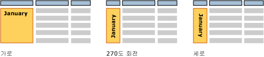

# 입력란(보고서 작성기 및 SSRS)
  일반적으로 입력란은 [!INCLUDE[msCoName](../../includes/msconame-md.md)] Office PowerPoint 같이 화면상에서 텍스트가 들어 있는 독립 실행형 상자로 인식되는 경우가 많습니다. [!INCLUDE[ssRSnoversion_md](../../includes/ssrsnoversion-md.md)] 페이지를 매긴 보고서에도 이와 같은 입력란이 있으며, 여기에는 제목, 설명 및 레이블이나 식 기반의 동적 텍스트와 같은 정적 텍스트를 표시할 수 있습니다. 그러나 테이블 또는 행렬(테이블릭스 데이터 영역)의 모든 셀에는 보고서의 독립 실행형 입력란과 같은 방법으로 서식을 지정할 수 있는 입력란도 포함되어 있습니다.  
  
> [!NOTE]  
>  보고서 데이터 집합 필드 값을 직접 보고서 디자인 화면이나 보고서 디자인 화면의 입력란으로 끌어서 놓으면 보고서를 실행할 때 결과 집합의 첫 번째 값만 표시됩니다. 필드의 모든 값을 보려면 먼저 테이블, 행렬 또는 목록 데이터 영역을 만든 다음 필드를 데이터 영역의 셀로 끌어 놓아야 합니다. 이렇게 하면 보고서를 실행할 때 해당 필드의 모든 값이 표시됩니다.  
  
 자유 형식 레이아웃으로 반복 텍스트를 표시하려면 목록 데이터 영역을 만든 다음 입력란을 배치합니다. 여러 값에 대해 이 형식을 반복하려면 목록을 사용합니다. 예를 들어 고객 송장 양식은 각 고객에 대해 한 번씩 반복됩니다. [목록을 사용하여 송장 및 양식 만들기](../../reporting-services/report-design/create-invoices-and-forms-with-lists-report-builder-and-ssrs.md)에 대해 자세히 알아봅니다.  
  
 입력란 레이아웃 및 마지막 입력란 아래 공백을 제어하려면 사각형 컨테이너를 사용합니다. 자세한 내용은 [사각형 및 선&#40;보고서 작성기 및 SSRS&#41;](../../reporting-services/report-design/rectangles-and-lines-report-builder-and-ssrs.md)을 참조하세요.  
  
 입력란의 식은 리터럴 텍스트를 포함하거나, 데이터베이스의 필드를 가리키거나, 데이터를 계산할 수 있습니다. 모든 식은 자리 표시자 텍스트로 표시되므로 숫자, 색 및 기타 모양 속성 서식을 지정할 수 있습니다. 또한 같은 입력란에서 자리 표시자와 리터럴 텍스트를 조합하여 사용할 수도 있습니다.  
  
 여러 글꼴, 색, 스타일 및 동작을 사용하여 단일 입력란의 텍스트 서식을 지정할 수 있습니다. 자세한 내용은 [텍스트 및 자리 표시자 서식 지정&#40;보고서 작성기 및 SSRS&#41;](../../reporting-services/report-design/formatting-text-and-placeholders-report-builder-and-ssrs.md)에 대해 자세히 알아봅니다.  
  
> [!NOTE]  
>  [!INCLUDE[ssRBRDDup](../../includes/ssrbrddup-md.md)]  
  
##   입력란 늘리기 및 줄이기  
 기본적으로 입력란은 고정된 크기를 가집니다. 입력란을 해당 내용에 따라 세로로 줄이거나 늘릴 수 있습니다. 자세한 내용은 [입력란을 늘리거나 줄이도록 허용&#40;보고서 작성기 및 SSRS&#41;](../../reporting-services/report-design/allow-a-text-box-to-grow-or-shrink-report-builder-and-ssrs.md)에 대해 자세히 알아봅니다.  
  
## 입력란 회전  
 입력란을 회전하면 보다 쉽게 읽을 수 있는 보고서를 만들고, 로캘별 텍스트 방향을 지원하고, 페이지 크기가 고정된 인쇄 보고서에 더 많은 열을 포함하고, 눈에 잘 띄는 그래픽을 포함하여 보고서를 만들 수 있습니다. 입력란의 방향을 가로 또는 세로(90도 회전)로 지정하거나 270도 회전할 수 있습니다. 세로 옵션은 위에서 아래로 쓰는 동아시아 언어에서 가장 일반적으로 사용됩니다. 대부분의 렌더러에서 세로 옵션은 문자 모양 회전을 적절히 처리하므로 텍스트를 위에서 아래로 써도 문자는 누워 있는 상태로 표시되지 않습니다. 그러나 기타 언어의 경우에는 세로 및 270도 옵션을 사용하면 텍스트를 쓸 때 누워 있는 상태로 표시됩니다.  
  
 정적 텍스트, 보고서 데이터 집합의 필드 또는 계산 데이터가 포함된 입력란을 회전할 수 있습니다. 입력란은 보고서 본문, 테이블이나 행렬 또는 보고서 머리글 및 바닥글에서 독립 실행형으로 설정할 수 있습니다.  
  
 다음 그림에는 데이터를 월별로 그룹화하는 테이블 보고서의 세 버전이 나와 있습니다. 월 값이 포함된 입력란에서는 다른 입력란 방향을 사용합니다.  
  
   
  
 방향은 입력란에 대해 설정되며 입력란의 모든 텍스트에 적용됩니다. 입력란의 일부에 대해 다른 방향을 지정할 수는 없습니다.  
  
 시작하려면 [자습서: 텍스트 서식 지정&#40;보고서 작성기&#41;](../../reporting-services/tutorial-format-text-report-builder.md)의 텍스트 회전 섹션 및 [입력란 방향 설정&#40;보고서 작성기 및 SSRS&#41;](../../reporting-services/report-design/set-text-box-orientation-report-builder-and-ssrs.md)을 참조하세요.  
  
##   방법 도움말 항목  
 [입력란 추가, 이동 또는 삭제&#40;보고서 작성기 및 SSRS&#41;](../../reporting-services/report-design/add-move-or-delete-a-text-box-report-builder-and-ssrs.md)  
  
 [입력란의 텍스트 서식 지정&#40;보고서 작성기 및 SSRS&#41;](../../reporting-services/report-design/format-text-in-a-text-box-report-builder-and-ssrs.md)  
  
 [입력란 방향 설정&#40;보고서 작성기 및 SSRS&#41;](../../reporting-services/report-design/set-text-box-orientation-report-builder-and-ssrs.md)  
  
 [입력란을 늘리거나 줄이도록 허용&#40;보고서 작성기 및 SSRS&#41;](../../reporting-services/report-design/allow-a-text-box-to-grow-or-shrink-report-builder-and-ssrs.md)  
  
## 참고 항목  
 [텍스트 및 자리 표시자 서식 지정&#40;보고서 작성기 및 SSRS&#41;](../../reporting-services/report-design/formatting-text-and-placeholders-report-builder-and-ssrs.md)   
 [숫자 및 날짜 서식 지정&#40;보고서 작성기 및 SSRS&#41;](../../reporting-services/report-design/formatting-numbers-and-dates-report-builder-and-ssrs.md)  
  
  
