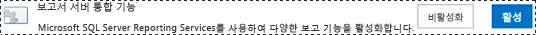
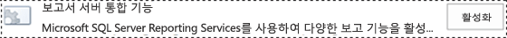
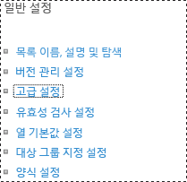
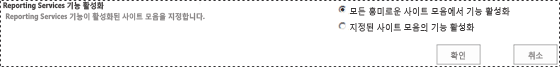

# Reporting Services 콘텐츠 형식을 SharePoint 라이브러리에 추가

[!INCLUDE[ssrs-appliesto](../../includes/ssrs-appliesto.md)] [!INCLUDE[ssrs-appliesto-2016](../../includes/ssrs-appliesto-2016.md)] [!INCLUDE[ssrs-appliesto-sharepoint-2013-2016i](../../includes/ssrs-appliesto-sharepoint-2013-2016.md)] [!INCLUDE[ssrs-appliesto-not-pbirsi](../../includes/ssrs-appliesto-not-pbirs.md)]

[!INCLUDE [ssrs-previous-versions](../../includes/ssrs-previous-versions.md)]

[!INCLUDE[ssRSnoversion](../../includes/ssrsnoversion-md.md)] 공유 데이터 원본(.rsds) 파일, 보고서 모델(.smdl) 및 보고서 작성기 보고서 정의(.rdl) 파일을 관리하는 데 사용되는 미리 정의된 SharePoint 콘텐츠 형식을 제공합니다. **보고서 작성기 보고서**, **보고서 모델**및 **보고서 데이터 원본** 콘텐츠 형식을 라이브러리에 추가하면 해당 유형의 새 문서를 만들 수 있도록 **새로 만들기** 명령이 활성화됩니다.

> [!NOTE]
> SQL Server 2016 후 SharePoint와 reporting Services 통합을 사용할 수 없습니다.

 라이브러리에 콘텐츠 형식을 추가하려면 사이트 관리자이거나 모든 권한 수준의 사용 권한이 있어야 합니다.  
  
 [!INCLUDE[ssRSnoversion](../../includes/ssrsnoversion-md.md)] 콘텐츠 형식 및 콘텐츠 형식 관리가 다음 사이트 템플릿 형식에서 생성된 기존 사이트 모음의 모든 문서 라이브러리에서 자동으로 설정됩니다.  
  
-   **비즈니스 인텔리전스 센터**  
  
 [!INCLUDE[ssRSnoversion](../../includes/ssrsnoversion-md.md)] 통합 후에 생성된 사이트에는 [!INCLUDE[ssRSnoversion](../../includes/ssrsnoversion-md.md)] 콘텐츠 형식이 설정되어 있지 않습니다.  
  
> [!TIP]  
>  라이브러리에 이전에 구성한 콘텐츠 형식이 **없는** 경우 먼저 콘텐츠 형식 관리를 설정한 다음 [!INCLUDE[ssRSnoversion](../../includes/ssrsnoversion-md.md)] 콘텐츠 형식을 설정합니다. 단일 문서 라이브러리에서 콘텐츠 형식 관리 설정에 대한 절차를 참조하세요.  
  
 **짧은 비디오:** [(SSRS) Enabling Content Types in SharePoint2010.wmv](http://www.youtube.com/watch?v=yqhm3DrtT1w) (http://www.youtube.com/watch?v=yqhm3DrtT1w).  
  
 **항목 내용**  
  
-   [기존 BI 센터에서 모든 문서 라이브러리의 콘텐츠 형식 설정](#bkmk_enable_all)  
  
-   [단일 문서 라이브러리에 대해 콘텐츠 형식 관리를 설정하려면(SharePoint 2013)](#bkmk_enable_content_management)  
  
-   [Reporting Services 콘텐츠 형식을 추가하려면(SharePoint 2013)](#bkmk_add_single)  
  
-   [단일 문서 라이브러리에 대해 콘텐츠 형식 관리를 설정하려면(SharePoint 2010)](#bkmk_enable_content_management_2010)  
  
-   [보고서 서버 콘텐츠 형식을 추가하려면(SharePoint 2010)](#bkmk_add_single_2010)  
  
-   [여러 BI 사이트에 대해 콘텐츠 형식 및 콘텐츠 관리를 설정하려면](#bkmk_enable_multiple_sites)  
  
##   기존 BI 센터에서 모든 문서 라이브러리의 콘텐츠 형식 설정  
  
1.  기존 **비즈니스 인텔리전스 센터** 사이트의 모든 문서 라이브러리에서 콘텐츠 형식 및 콘텐츠 관리를 설정하려면 [!INCLUDE[ssRSnoversion](../../includes/ssrsnoversion-md.md)] 통합 기능을 설정/해제하면 됩니다.  
  
2.  **사이트 설정**으로 이동합니다.  
  
    -   SharePoint 2013에서 **설정** 아이콘을 클릭합니다.   
  
    -   SharePoint 2010에서 **사이트 동작**을 클릭한 다음 **사이트 설정**을 클릭합니다.  
  
3.  **사이트 모음 기능**을 클릭합니다.  
  
4.  **보고서 서버 통합 기능** 을 찾고 **비활성화**를 클릭합니다.  
  
       
  
5.  브라우저를 새로 고친 다음 **보고서 서버 통합 기능** 에 대해 **활성화**를 클릭합니다.  
  
       
  
##   단일 문서 라이브러리에 대해 콘텐츠 형식 관리를 설정하려면(SharePoint 2013)  
  
1.  여러 개의 콘텐츠 형식을 설정할 라이브러리를 엽니다.  
  
2.  리본에서 **라이브러리** 를 클릭합니다.  
  
       
  
3.  **라이브러리** 리본에서 **라이브러리 설정**을 클릭합니다. **라이브러리 설정** 이 표시되지 않거나 단추가 비활성화되는 경우 콘텐츠 형식을 비롯하여 라이브러리 설정을 구성할 수 있는 권한이 없습니다.  
  
       
  
4.  **일반 설정** 섹션에서 **고급 설정**을 클릭합니다.  
  
       
  
5.  **콘텐츠 형식** 섹션에서 **예** 를 선택하여 콘텐츠 형식 관리를 허용합니다.  
  
6.  **확인**을 클릭합니다.  
  
##   Reporting Services 콘텐츠 형식을 추가하려면(SharePoint 2013)  
  
1.  Reporting Services 콘텐츠 형식을 추가할 라이브러리를 엽니다.  
  
2.  리본에서 **라이브러리**를 클릭합니다.  
  
3.  **라이브러리 설정**을 클릭합니다.  
  
4.  **콘텐츠 형식**에서 **기존 사이트 콘텐츠 형식에서 추가**를 클릭합니다.  
  
5.  **사이트 콘텐츠 형식을 선택**에서 **SQL Server Reporting Services 콘텐츠 형식**을 선택합니다.  
  
6.  **사용 가능한 사이트 콘텐츠 형식** 목록에서 **보고서 작성기**를 클릭한 다음 **추가** 를 클릭하여 선택한 콘텐츠 형식을 **추가할 콘텐츠 형식** 목록으로 이동합니다.  
  
7.  **보고서 모델** 및 **보고서 데이터 원본** 콘텐츠 형식을 추가하려면 이전 단계를 반복합니다.  
  
8.  콘텐츠 형식 추가를 완료하면 **확인**을 클릭합니다.  
  
    > [!NOTE]  
    >  [!INCLUDE[ssRSnoversion](../../includes/ssrsnoversion-md.md)] 콘텐츠 형식 그룹 **SQL Server Reporting Services 콘텐츠 형식** 이 **콘텐츠 형식 추가** 페이지에 표시되지 않는 경우 다음 조건 중 하나에 해당하는 것입니다.  
  
    -   SharePoint 제품의 [!INCLUDE[ssRSnoversion](../../includes/ssrsnoversion-md.md)] 추가 기능이 설치되지 않았습니다. 자세한 내용은 [SharePoint용 Reporting Services 추가 기능 설치 또는 제거](../../reporting-services/install-windows/install-or-uninstall-the-reporting-services-add-in-for-sharepoint.md)를 참조하세요. 이 항목에는 문제를 해결하기 위한 추가 기능 설치 및 추가 기능 설치 파일의 단계별 실행에 대한 정보가 포함됩니다.  
  
    -   추가 기능은 설치되지만 사이트 모음 기능 **보고서 서버 통합 기능** 은 활성화되지 않습니다. **사이트 설정**에서 사이트 모음 기능을 확인합니다.  
  
    -   모든 [!INCLUDE[ssRSnoversion](../../includes/ssrsnoversion-md.md)] 콘텐츠 형식이 라이브러리에 이미 추가되었습니다. 모든 콘텐츠 유형이 라이브러리의 일부인 경우 그룹이 **콘텐츠 형식 추가** 페이지에서 제거됩니다. [!INCLUDE[ssRSnoversion](../../includes/ssrsnoversion-md.md)] 콘텐츠 형식 중 하나 이상을 제거하는 경우 **SQL Server Reporting Services 콘텐츠 형식** 그룹이 **콘텐츠 형식 추가** 페이지에 표시됩니다.  
  
##   단일 문서 라이브러리에 대해 콘텐츠 형식 관리를 설정하려면(SharePoint 2010)  
  
1.  여러 개의 콘텐츠 형식을 설정할 라이브러리를 엽니다. 라이브러리 메뉴 모음에 **새로 만들기**, **업로드**, **동작**및 **설정**메뉴가 표시됩니다. **설정**이 표시되지 않는 경우 콘텐츠 형식을 추가할 권한이 없습니다.  
  
2.  **라이브러리 도구** 리본에서 **라이브러리**를 클릭합니다.  
  
       
  
3.  **설정** 리본 그룹에서 **라이브러리 설정**을 클릭합니다.  
  
4.  **일반 설정**에서 **고급 설정**을 클릭합니다.  
  
5.  **콘텐츠 형식** 섹션에서 **예** 를 선택하여 콘텐츠 형식 관리를 허용합니다.  
  
6.  **확인**을 클릭합니다.  
  
##   보고서 서버 콘텐츠 형식을 추가하려면(SharePoint 2010)  
  
1.  Reporting Services 콘텐츠 형식을 추가할 라이브러리를 엽니다.  
  
2.  **라이브러리 도구** 리본 탭에서 **라이브러리 탭**을 클릭합니다.  
  
3.  **설정** 리본 그룹에서 **라이브러리 설정**을 클릭합니다.  
  
4.  **콘텐츠 형식**에서 **기존 사이트 콘텐츠 형식에서 추가**를 클릭합니다.  
  
5.  **콘텐츠 형식 선택** 섹션의 **사이트 콘텐츠 형식 선택**에서 화살표를 클릭하여 **SQL Server Reporting Services 콘텐츠 형식**을 선택합니다.  
  
6.  **사용 가능한 사이트 콘텐츠 형식** 목록에서 **보고서 작성기**를 클릭한 다음 **추가** 를 클릭하여 선택한 콘텐츠 형식을 **추가할 콘텐츠 형식** 목록으로 이동합니다.  
  
7.  **보고서 모델** 및 **보고서 데이터 원본** 콘텐츠 형식을 추가하려면 이전 단계를 반복합니다.  
  
8.  콘텐츠 형식 추가를 완료하면 **확인**을 클릭합니다.  
  
##  콘텐츠 형식 및 여러 BI 사이트에 대 한 콘텐츠 관리를 사용 하도록 설정 하려면  
  
1.  SQL Server Reporting Services 2008 및 2008 R2 보고서 서버의 경우 여러 비즈니스 인텔리전스 센터 사이트에 대한 콘텐츠 형식 및 콘텐츠 관리를 설정할 수 있습니다.  
  
2.  SharePoint 중앙 관리에서 **일반 응용 프로그램 설정**을 클릭합니다. **SQL Server Reporting Services(2008 및 2008 R2)** 섹션에서 **Reporting Services 통합**을 클릭합니다.  
  
       
  
3.  **모든 흥미로운 사이트 모음에서 기능 활성화**를 클릭합니다.  
  
       
  
4.  **확인**을 클릭합니다.  
  
## 참고 항목  
 [보고서 서버 항목에 대한 SharePoint 사이트 및 목록 사용 권한 참조](../../reporting-services/security/sharepoint-site-and-list-permission-reference-for-report-server-items.md)   
 [보고서 작성기 시작](../../reporting-services/report-builder/start-report-builder.md)  
  
  

