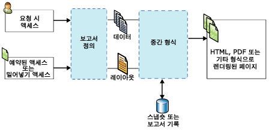

# Reporting Services 개념(SSRS)
  이 항목에서는 [!INCLUDE[ssNoVersion](../includes/ssnoversion-md.md)] [!INCLUDE[ssRSnoversion](../includes/ssrsnoversion-md.md)] 개념에 대해 간략하게 설명합니다.  
  
 **[!INCLUDE[applies](../includes/applies-md.md)]**  [!INCLUDE[ssRSnoversion](../includes/ssrsnoversion-md.md)] 기본 모드 | [!INCLUDE[ssRSnoversion](../includes/ssrsnoversion-md.md)] SharePoint 모드   
  
##   보고서 서버 개념  
 보고서 서버는 [!INCLUDE[ssRSnoversion](../includes/ssrsnoversion-md.md)] 인스턴스가 설치된 컴퓨터를 말하며 페이지 매김 처리한 보고서와 모바일 보고서, 보고서 관련 항목 및 리소스, 일정, 구독 등의 항목을 내부적으로 저장합니다. 보고서 서버는 독립 실행형 단일 서버로 구성하거나 확장형 팜으로 구성할 수 있으며 SharePoint Server와 통합할 수도 있습니다. 보고서 서버 항목과의 상호 작용은 [!INCLUDE[ssRSnoversion](../includes/ssrsnoversion-md.md)] 웹 서비스, WMI 공급자, URL 액세스를 통해서 수행하거나 프로그래밍 방식으로 스크립트를 통해 수행합니다. 보고서 서버와 상호 작용하는 방식은 배포 토폴로지 및 구성에 따라 다릅니다.  
  
### 기본 모드 보고서 서버
 기본 모드로 구성된 보고서 서버는 [!INCLUDE[ssNoVersion](../includes/ssnoversion-md.md)] [!INCLUDE[ssRSnoversion](../includes/ssrsnoversion-md.md)] 가 설치되고 독립 실행형 서버로 구성된 컴퓨터를 말합니다. 보고서 서버, 보고서 및 보고서 관련 항목과의 상호 작용은 [!INCLUDE[ssRSWebPortal](../includes/ssrswebportal.md)] 나 URL 액세스 명령을 통해 브라우저를 사용하거나 SQL Server Management Studio에서 수행하거나 프로그래밍 방식으로 스크립트를 통해 수행합니다. 자세한 내용은 [Reporting Services 보고서 서버&#40;기본 모드&#41;](../reporting-services/report-server/reporting-services-report-server-native-mode.md)을 참조하세요.  
  
### SharePoint 모드 보고서 서버  
 SharePoint와 통합된 보고서 서버는 두 가지 구성이 가능합니다. [!INCLUDE[ssRSCurrent](../includes/ssrscurrent-md.md)]에서는 [!INCLUDE[ssRSnoversion](../includes/ssrsnoversion-md.md)] 에 SharePoint Server가 SharePoint 공유 서비스로 설치되어 있습니다. 이전 릴리스에서는 [!INCLUDE[ssRSnoversion](../includes/ssrsnoversion-md.md)] SharePoint 추가 기능을 설치하여 보고서 서버가 SharePoint Server와 통합됩니다. 두 경우 모두 SharePoint 사이트에서 애플리케이션 페이지를 사용하여 보고서 서버, 보고서, 보고서 관련 항목과 상호 작용합니다. SharePoint 문서 라이브러리 및 생성한 기타 라이브러리를 사용하여 보고서와 관련된 콘텐츠 형식을 저장합니다. 자세한 내용은 [Reporting Services 보고서 서버&#40;SharePoint 모드&#41;](../reporting-services/report-server-sharepoint/reporting-services-report-server-sharepoint-mode.md)를 참조하세요.  
  
### 보고서 서버 항목 
 보고서 서버 항목에는 페이지 매김 처리한 보고서와 모바일 보고서, KPI, 공유 데이터 원본, 공유 데이터 세트뿐 아니라 보고서 서버에 게시하거나 업로드하거나 저장할 수 있는 기타 항목도 포함됩니다. 항목은 기본 보고서 서버에 보고서 서버 계층형 폴더 구조로 구성되거나 SharePoint 사이트의 SharePoint 콘텐츠 라이브러리에 구성됩니다, 자세한 내용은 [보고서 서버 콘텐츠 관리&#40;SSRS 기본 모드&#41;](../reporting-services/report-server/report-server-content-management-ssrs-native-mode.md)를 참조하세요.  
  
### 폴더
 기본 보고서 서버의 폴더는 보고서 서버에 저장된 모든 주소 지정 가능 항목의 계층형 탐색 구조와 경로를 제공합니다. 폴더 계층과 사이트 및 폴더 사용 권한을 사용하여 보고서 서버 항목에 대한 액세스를 제어하며, 이를 *항목 수준 보안*이라고 합니다. 기본적으로 특정 폴더에 대해 정의한 역할 할당은 폴더 계층 내의 자식 폴더에 상속됩니다. 특정 역할을 폴더에 할당하는 경우 상속 규칙이 더 이상 적용되지 않습니다. 폴더 구조는 **홈**이라는 루트 노드와 선택적인 **내 보고서** 기능을 지원하는 예약된 폴더로 구성됩니다. 브라우저에서 루트 노드는 보고서 서버 가상 디렉터리 주소의 이름입니다(예: `https://myreportserver/reports`). 자세한 내용은 [Folders](../reporting-services/report-server/report-server-content-management-ssrs-native-mode.md#bkmk_Folders)을(를) 참조하세요.  
  
 SharePoint 사이트에서 문서 라이브러리 및 콘텐츠 라이브러리의 SharePoint 폴더를 사용하여 항목을 구성할 수 있습니다.  
  
### 역할 및 권한
 기본 보고서 서버에서 보고서 서버 시스템 관리자는 액세스 권한을 관리하며 보고서 요청을 처리하고, 스냅숏 기록을 유지 관리하고, 보고서, 데이터 원본, 데이터 세트 및 구독에 대한 사용 권한을 관리하도록 보고서 서버를 구성합니다. 예를 들어 게시된 보고서는 [!INCLUDE[ssRSnoversion](../includes/ssrsnoversion-md.md)] 역할 기반 보안 모델을 사용하여 역할 할당을 통해 보안이 유지됩니다. 자세한 내용은 [역할 및 사용 권한&#40;Reporting Services&#41;](../reporting-services/security/roles-and-permissions-reporting-services.md)을 참조하세요.  
  
 SharePoint 사이트에서 SharePoint 사이트 관리자 페이지를 사용하여 보고서 및 보고서 관련 사이트 콘텐츠에 대한 액세스 권한을 관리할 수 있습니다.  
  
### 일정
 기본 보고서 서버에서 보고서 관리자에서 페이지 매김 처리한 보고서, 공유 데이터 세트 및 구독을 특정 시간이나 사용량이 적은 시간에 데이터를 검색하고 보고서 및 데이터 세트 쿼리를 배달하도록 예약할 수 있습니다. 일정은 한 번 실행하거나 시간, 일, 주 또는 월 간격으로 계속 실행할 수 있습니다. 자세한 내용은 [Schedules](../reporting-services/subscriptions/schedules.md)을(를) 참조하세요.  
  
### 구독 및 배달  
 구독은 특정 시간이나 이벤트에 대한 응답으로 구독에서 지정하는 애플리케이션 파일 형식으로 보고서를 배달하라는 요청입니다. 요청 시 보고서를 실행하는 대신 구독할 수 있습니다. 요청 시 실행 보고서는 볼 때마다 사용자가 보고서를 선택해야 합니다. 반면 구독을 사용하면 일정을 예약한 다음 보고서 배달을 자동화할 수 있습니다. 전자 메일 받은 편지함이나 파일 공유 위치에 보고서를 배달할 수 있습니다. 자세한 내용은 [구독 및 배달&#40;Reporting Services&#41;](../reporting-services/subscriptions/subscriptions-and-delivery-reporting-services.md)을 참조하세요.  
  
### 확장 프로그램
 [!INCLUDE[ssNoVersion](../includes/ssnoversion-md.md)] [!INCLUDE[ssRSnoversion](../includes/ssrsnoversion-md.md)] 는 보고서 솔루션을 사용자 지정하는 데 사용할 수 있는 확장형 아키텍처를 제공합니다. 보고서 서버는 사용자 지정 인증 확장 프로그램, 데이터 처리 확장 프로그램, 보고서 처리 확장 프로그램, 렌더링 확장 프로그램, 배달 확장 프로그램 및 RSReportServer.config 구성 파일에서 사용자가 구성할 수 있는 확장 프로그램을 지원합니다. 예를 들어, 보고서 뷰어에서 사용할 수 있는 내보내기 형식을 제한할 수 있습니다. 배달 및 보고서 처리 확장 프로그램은 선택적이지만 보고서 배포 또는 사용자 지정 컨트롤을 지원하려는 경우에는 반드시 필요합니다. 자세한 내용은 [Reporting Services 확장 프로그램 &#40;SSRS&#41;](../reporting-services/extensions-ssrs.md)를 참조하세요.  
  
### 보고서 액세스 
 요청 시 액세스 방법을 사용할 경우 보고서 보기 도구에서 보고서를 선택할 수 있습니다. 보고서 서버 구성에 따라 [!INCLUDE[ssRSWebPortal](../includes/ssrswebportal.md)], [!INCLUDE[msCoName](../includes/msconame-md.md)] SharePoint 2.0 웹 파트, SharePoint 라이브러리(SharePoint 통합 모드에서 [!INCLUDE[ssRSnoversion](../includes/ssrsnoversion-md.md)] 가 설치된 경우), 포함된 ReportViewer 컨트롤, URL 액세스를 사용한 브라우저 등을 사용할 수 있습니다. 요청 시 보고서 액세스에 대한 자세한 내용은 [보고서 찾기, 보기 및 관리&#40;보고서 작성기 및 SSRS&#41;](../reporting-services/report-builder/finding-viewing-and-managing-reports-report-builder-and-ssrs.md)를 참조하세요.  
  
 요청 시 보고서를 실행하는 대신 구독할 수 있습니다. 자세한 내용은 [구독 및 배달&#40;Reporting Services&#41;](../reporting-services/subscriptions/subscriptions-and-delivery-reporting-services.md)을 참조하세요.  
  
 보고서 서버와 상호 작용하는 데 사용하는 도구 목록은 [Reporting Services 도구](../reporting-services/tools/reporting-services-tools.md)를 참조하세요.  
  
  
##   보고서 및 관련 항목 개념  
### 보고서 및 보고서 정의

 **RDL** 
 
 보고서 정의는 RDL(Report Definition Language)이라는 XML 문법에 맞는 XML 파일입니다. [!INCLUDE[ssRSnoversion](../includes/ssrsnoversion-md.md)]에서 보고서 작성기나 보고서 디자이너와 같은 도구에서 보고서 정의를 만듭니다. 이 파일은 데이터 원본 연결을 정의하는 요소, 데이터 검색에 사용되는 쿼리, 식, 매개 변수, 이미지, 입력란, 테이블 및 기타 디자인 타임 레이아웃을 제공합니다. 자세한 내용은 [RDL(Report Definition Language)&#40;SSRS&#41;](../reporting-services/reports/report-definition-language-ssrs.md)을 참조하세요.  
  
 **RSMOBILE**

SQL Server 모바일 보고서 게시자에서 Reporting Services 모바일 보고서(.rsmobile 파일)를 만들 수 있습니다. Reporting Services 모바일 보고서는 다양한 형태로 데이터 시각화될 뿐 아니라 모바일 디바이스에 최적화되고 온-프레미스 데이터에 연결됩니다. [Reporting Services 모바일 보고서](../reporting-services/mobile-reports/create-mobile-reports-with-sql-server-mobile-report-publisher.md)에 대해 자세히 알아봅니다. 
  
 **RDLC** 
 
 Visual Studio 보고서 디자이너는 ReportViewer 컨트롤에 사용할 XML 형식의 클라이언트 보고서 정의 파일(.rdlc)을 생성합니다.  
  
### 보고서 데이터 연결 및 데이터 원본 
 보고서는 쿼리가 실행되거나 보고서가 처리될 때 데이터 연결을 사용하여 보고서에 대한 데이터를 검색합니다. 보고서 정의에서 데이터 연결은 데이터 원본과 동일합니다. 기본 제공 데이터 연결 형식 목록에서 선택하여 관계형 데이터베이스, 다차원 데이터베이스, 웹 서비스 또는 다른 데이터 원본에 연결할 수 있습니다. 데이터 연결 설명에는 다음과 같은 용어가 사용됩니다.  
  
-   **데이터 연결** *데이터 원본*이라고도 합니다. 데이터 연결에는 연결 형식에 따라 달라지는 이름 및 연결 속성이 포함되어 있습니다. 기본적으로 데이터 연결에는 자격 증명이 포함되지 않습니다. 데이터 연결은 외부 데이터 원본에서 어떤 데이터를 검색할 것인지 지정하지 않습니다. 이렇게 하려면 데이터 세트를 만들 때 쿼리를 지정합니다.  
  
-   **데이터 원본 정의.** 보고서 데이터 원본의 XML 표현을 포함하는 파일입니다. 보고서를 게시할 때 해당 데이터 원본은 보고서 정의와는 별도로 보고서 서버 또는 SharePoint 사이트에 데이터 원본 정의로 저장됩니다. 예를 들어 보고서 서버 관리자가 연결 문자열이나 자격 증명을 업데이트할 수 있습니다. 기본 보고서 서버의 파일 형식은 .rds입니다. SharePoint 사이트의 파일 형식은 .rsds입니다.  
  
-   **연결 문자열.** 연결 문자열은 데이터 원본에 연결하는 데 필요한 연결 속성의 문자열 버전입니다. 연결 속성은 데이터 연결 형식에 따라 다릅니다.  
  
-   **공유 데이터 원본.** 여러 보고서에서 사용할 수 있도록 보고서 서버 또는 SharePoint 사이트에 제공되는 데이터 원본입니다.  
  
     공유 데이터 원본은 자주 사용하는 데이터 원본이 있는 경우에 유용합니다. 가능한 한 공유 데이터 원본을 사용하는 것이 좋습니다. 공유 데이터 원본을 사용하면 보고서 및 보고서 액세스 관리가 더 쉬울 뿐만 아니라 보고서 및 보고서에서 액세스하는 데이터 원본을 보다 안전하게 유지할 수 있습니다. 공유 데이터 원본이 필요한 경우에는 공유 데이터 원본을 만들어 주도록 시스템 관리자에게 요청하세요.  
  
     보고서 작성기에서는 공유 데이터 원본을 만들 수 없습니다. 보고서 서버에서 공유 데이터 원본을 찾아보고 선택할 수 있습니다.  
  
     보고서 디자이너에서는 보고서 서버에 있는 공유 데이터 원본을 찾아볼 수 없습니다. 솔루션 탐색기에서 프로젝트의 일부로 공유 데이터 원본을 만들고 보고서 서버에 배포할지 여부를 선택할 수 있습니다. 사용자 컴퓨터와 보고서 서버에서 필요한 자격 증명의 차이로 인해 로컬에서만 사용하도록 선택할 수도 있습니다.  
  
-   **포함된 데이터 원본.** 포함된 데이터 원본은 *보고서별 데이터 원본*이라고도 하며 보고서에서 정의되고 해당 보고서에서만 사용됩니다.  
  
     포함된 데이터 원본은 보고서 정의에 저장되는 데이터 연결입니다. 포함된 데이터 원본 연결 정보는 해당 정보가 포함된 보고서에서만 사용될 수 있습니다.  
  
-   **자격 증명.** 자격 증명은 외부 데이터 액세스를 위해 제공해야 하는 인증 정보입니다.  
  
     자격 증명은 포함된 데이터 원본을 만들거나 쿼리를 실행하거나 보고서 처리 중 데이터를 검색하는 데 사용합니다. 데이터 원본의 소유자는 데이터에 액세스할 때 사용해야 하는 자격 증명의 유형을 결정합니다. 자격 증명은 보고서 서버, SharePoint 사이트 또는 보고서 제작 환경의 로컬 컴퓨터의 데이터 연결과 독립적으로 관리됩니다. 데이터 원본 유형에 따라 자격 증명을 사용자에게 요청하지 않도록 저장하거나 각 사용자에게 자격 증명을 요청하도록 설정할 수 있습니다. 사용자 컴퓨터에 있는 데이터 원본에 연결하는지 보고서 서버에 있는 데이터 원본에 연결하는지에 따라 필요한 자격 증명은 다를 수 있습니다. 자세한 내용은 [보고서 작성기에 자격 증명 지정](https://msdn.microsoft.com/library/7412ce68-aece-41c0-8c37-76a0e54b6b53)을 참조하세요.  
  
### 보고서 데이터 세트 
 보고서에서 데이터 세트는 외부 데이터 원본에 대해 쿼리를 실행할 때 반환되는 보고서 데이터를 나타냅니다. 데이터 세트는 외부 데이터 원본에 대한 정보를 포함하는 데이터 연결에 따라 달라집니다. 이때 데이터 자체가 보고서 정의에 포함되지는 않습니다. 데이터 세트에는 쿼리 명령, 필드 컬렉션, 매개 변수, 필터 및 대/소문자 구분, 데이터 정렬 등의 데이터 옵션이 포함됩니다. 데이터 세트에는 두 가지 유형이 있습니다.  
  
-   **공유 데이터 세트.** 공유 데이터 세트는 보고서 서버에 게시되며 여러 보고서에서 사용할 수 있습니다. 공유 데이터 세트는 공유 데이터 원본을 기반으로 해야 합니다. 공유 데이터 세트는 캐시 새로 고침 계획을 만들어 캐시하고 예약할 수 있습니다.  
  
-   **포함된 데이터 세트.** 포함된 데이터 세트는 단일 보고서에서 정의되고 사용됩니다.  
  
 자세한 내용은 [보고서 포함된 데이터 세트 및 공유 데이터 세트&amp;#40;보고서 작성기 및 SSRS&amp;#41;](../reporting-services/report-data/report-embedded-datasets-and-shared-datasets-report-builder-and-ssrs.md)을 참조하세요.  
  
### 보고서 매개 변수 
 보고서 매개 변수는 보고서 정의의 일부입니다. Reporting Services에서 페이지 매김 처리한 보고서와 모바일 보고서에 매개 변수를 추가하여 관련 보고서를 연결하거나 보고서 모양을 제어하거나 보고서 데이터를 필터링하거나 보고서 범위를 특정 사용자나 위치로 좁힐 수 있습니다. 페이지 매김 처리한 보고서가 기본 보고서 서버 또는 SharePoint 사이트에 게시되면 보고서 매개 변수가 별도의 보고서 서버 항목으로 저장됩니다. 매개 변수는 보고서 정의와 별도로 관리할 수 있습니다. 동일 보고서에 대해 여러 매개 변수 집합을 만들려면 *링크된 보고서*를 만듭니다.  
  
### 보고서 항목 
 보고서 항목은 Reporting Services에서 페이지 매김 처리한 보고서의 정의에 한정되기는 하지만 기본 개념이기도 합니다. 보고서 항목의 속성은 데이터 영역, 지도, 입력란, 이미지 및 보고서에 추가한 기타 디자인 요소에 적용됩니다. 보고서 항목의 속성을 이해하면 사용자 지정된 내용 및 모양을 갖춘 보고서를 디자인하는 데 유용합니다. 예를 들어 모든 보고서 항목에는 표시 여부를 제어하는 Hidden 속성이 있습니다.  
  
### 데이터 영역 및 지도 
 데이터 영역은 Reporting Services에서 페이지 매김 처리한 보고서의 단일 데이터 세트에 있는 데이터를 표시하는 레이아웃 요소입니다. 데이터 영역 유형에는 테이블릭스, 차트, 계기 및 표시기가 포함됩니다. 지도는 두 가지 데이터 세트의 데이터를 표시하는 특수 유형의 데이터 영역입니다. 여기서 두 가지 데이터 세트란 공간 데이터를 포함한 데이터 세트와 분석 데이터를 포함한 데이터 세트입니다.  
  
 데이터 영역을 사용하여 일반적인 데이터를 시각화할 수 있습니다. 여기에는 테이블, 행렬 또는 목록의 숫자 및 텍스트, 차트 또는 계기의 그래픽 표시 및 지도에 대한 지리적 표시가 포함됩니다. 테이블, 행렬 및 목록은 모두 데이터 세트의 모든 데이터를 표시하기 위해 필요에 따라 확장되는 테이블릭스 데이터 영역을 기반으로 합니다. 테이블릭스 데이터 영역은 정적 행과 열 및 동적 행과 열이 모두 포함된 여러 행 및 열 그룹을 지원합니다. 차트는 여러 계열 및 범주 그룹을 다양한 차트 형식으로 표시하고, 계기는 데이터 세트의 단일 값 또는 집계 값을 표시합니다. 또한 지도는 공간 데이터를 데이터 세트에서 집계한 데이터를 기반으로 모양이 변하는 지도 요소로 표시합니다.  
  
-   **테이블.** 테이블은 데이터를 행 단위로 표시하는 데이터 영역입니다. 테이블의 열은 고정되어 있습니다. 열의 개수는 보고서를 디자인할 때 결정합니다. 그러나 테이블 행은 고정되지 않고 데이터에 맞게 아래쪽으로 확장됩니다. 테이블에 그룹을 추가하여 선택한 필드나 식으로 데이터를 구성할 수 있습니다. 자세한 내용은 [테이블, 행렬 및 목록(보고서 작성기 및 SSRS)](https://msdn.microsoft.com/9dcf3fc8-bf9c-4a14-a03d-e78254aa4098)을 참조하세요.  
  
-   **행렬.** 행렬은 크로스탭이라고도 합니다. 행렬 데이터 영역에는 동적 열과 행이 모두 포함되며 데이터에 맞게 확장됩니다. 또한 행렬에는 동적 열과 행 및 정적 열과 행이 있을 수 있습니다. 열이나 행에 다른 열이나 행을 넣을 수 있으며 데이터를 그룹화하는 데 열이나 행을 사용할 수 있습니다. 자세한 내용은 [테이블, 행렬 및 목록(보고서 작성기 및 SSRS)](https://msdn.microsoft.com/9dcf3fc8-bf9c-4a14-a03d-e78254aa4098)을 참조하세요.  
  
-   **목록.** 목록은 자유로운 형태로 정렬된 데이터를 표시하는 데이터 영역입니다. 보고서 항목을 정렬하여 목록 내의 어느 위치에나 입력란, 이미지 및 기타 데이터 영역을 포함하는 양식을 만들 수 있습니다. 자세한 내용은 [테이블, 행렬 및 목록(보고서 작성기 및 SSRS)](https://msdn.microsoft.com/9dcf3fc8-bf9c-4a14-a03d-e78254aa4098)을 참조하세요.  
  
-   **차트.** 차트는 데이터를 그래픽으로 표시합니다. 차트에는 가로 막대형, 원형 및 꺾은선형 차트가 있으며 이외에도 많은 스타일이 지원됩니다. 자세한 내용은 [차트&#40;보고서 작성기 및 SSRS&#41;](../reporting-services/report-design/charts-report-builder-and-ssrs.md)를 참조하세요.  
  
-   **계기.** 계기는 범위 내의 특정 값을 가리키는 표시기가 있는 범위로 데이터를 나타냅니다. 계기는 KPI(핵심 성과 지표)와 기타 메트릭을 표시하는 데 사용됩니다. 계기의 예로는 선형 계기와 원형 계기가 있습니다. 자세한 내용은 [계기&#40;보고서 작성기 및 SSRS&#41;](../reporting-services/report-design/gauges-report-builder-and-ssrs.md)를 참조하세요.  
  
-   **지도.** 지도를 사용하여 지리적 배경에 대한 데이터를 제공할 수 있습니다. 지도 데이터는 [!INCLUDE[ssNoVersion](../includes/ssnoversion-md.md)] 쿼리의 공간 데이터, ESRI 셰이프 파일 또는 [!INCLUDE[msCoName](../includes/msconame-md.md)] Bing 지도 타일일 수 있습니다. 공간 데이터는 모양이나 영역을 나타내는 다각형, 경로나 길을 나타내는 선, 표식으로 나타내는 점 등을 정의하는 좌표 집합으로 구성됩니다. 집계 데이터와 지도 요소를 연결하면 지도 요소의 색과 크기를 자동으로 변경할 수 있습니다. 예를 들어 판매액을 기준으로 상점의 표식 유형을 변경하거나 속도 제한을 기준으로 길의 색을 변경할 수 있습니다. 자세한 내용은 [지도&#40;보고서 작성기 및 SSRS&#41;](../reporting-services/report-design/maps-report-builder-and-ssrs.md)를 참조하세요.  
  
 그 밖에 다음과 같은 방법으로 데이터 영역에 연결되지 않은 데이터 세트의 값을 포함할 수 있습니다.  
  
-   예를 들어 다른 데이터 세트를 범위 매개 변수로 지정하고 있는 집계 함수 호출이 있는 식은 `=Max(Fields!Sales.Value, "AnnualSales")`입니다.  
  
-   **Lookup** 함수를 사용하여 다른 데이터 세트의 이름/값 쌍에서 값을 조회할 수 있습니다.  
  
### 보고서 파트
 보고서 파트 정의(.rsc)는 보고서 정의 파일의 XML 조각인 보고서 서버 항목입니다. 보고서 정의를 만든 다음 보고서의 보고서 항목을 선택하여 별도의 보고서 파트로 게시하는 방법으로 보고서 파트를 만들 수 있습니다. 보고서 파트에는 데이터 영역, 사각형과 이에 포함된 항목 및 이미지가 포함됩니다. 보고서 파트를 종속 데이터 세트 및 공유 데이터 원본 참조와 함께 저장하여 다른 보고서에서 다시 사용할 수 있습니다. 자세한 내용은 [보고서 디자이너의 보고서 파트&#40;SSRS&#41;](../reporting-services/report-design/report-parts-in-report-designer-ssrs.md)를 참조하세요.  
  
### 데이터 경고 
 데이터 경고는 경고 데이터베이스에 내부적으로 저장되는 항목입니다. 데이터 경고 정의에는 기존 보고서 데이터 피드에서 사용할 데이터, 충족해야 하는 조건, 일정, 경고를 받는 사람이 포함됩니다. 데이터 경고는 SharePoint Server 통합 보고서 서버에 게시된 보고서에 대해서만 사용할 수 있습니다. 기본 보고서 서버 설치에서는 데이터 경고를 사용할 수 없습니다. 자세한 내용은 [Reporting Services 데이터 경고](../reporting-services/reporting-services-data-alerts.md)를 참조하세요.  
  
  
##   Reporting Services에서 페이지 매김 처리한 보고서의 유형  
 [!INCLUDE[ssRSnoversion](../includes/ssrsnoversion-md.md)]에서 *보고서* 라는 용어는 특정 유형의 보고서 서버 항목, 레이아웃 디자인 또는 솔루션 디자인에 적용할 수 있습니다. Reporting Services에서 페이지 매김 처리한 단일 보고서에는 여러 유형의 특징이 있을 수 있습니다. 예를 들어 하나의 보고서가 독립 실행형 보고서인 동시에 주 보고서에서 참조되는 하위 보고서, 다른 주 보고서의 드릴스루 보고서 대상, 링크된 보고서일 수도 있습니다.  
  
### 드릴다운 보고서 
 드릴다운 보고서는 처음에 복잡한 항목을 숨기고 사용자가 경우에 따라 숨겨진 보고서 항목을 보이거나 숨기는 방식으로 보려는 데이터의 양을 조절할 수 있도록 지원하는 레이아웃 디자인입니다. 드릴다운 보고서는 보고서에 표시할 수 있는 가능한 모든 데이터를 검색해야 합니다. 대량 데이터가 사용되는 보고서의 경우에는 드릴다운 보고서 대신 드릴스루 보고서를 사용하는 것이 좋습니다. 자세한 내용은 [드릴다운 동작&#40;보고서 작성기 및 SSRS&#41;](../reporting-services/report-design/drilldown-action-report-builder-and-ssrs.md)을 참조하세요.  
  
### 하위 보고서
 하위 보고서는 보고서에 레이아웃 요소로 추가하는 보고서 항목입니다. 하위 보고서는 다른 보고서를 가리키며 이를 주 보고서 본문 안에 하위 보고서 인스턴스로 표시합니다. 하위 보고서는 주 보고서 이외에도 여러 데이터 원본을 사용할 수 있습니다. 하위 보고서의 각 인스턴스에서 데이터를 필터링하는 매개 변수를 사용하여 데이터 영역 내에서 하위 보고서를 반복할 수도 있지만 하위 보고서는 일반적으로 주 보고서에서 요약 책 또는 관련 보고서의 모음에 대한 컨테이너로 사용됩니다. 각 하위 보고서 인스턴스는 보고서 처리를 위해 주 보고서와 하위 보고서 간에 컨텍스트를 전환합니다. 하위 보고서 인스턴스가 많은 보고서의 경우 드릴다운 보고서 대신 드릴스루 보고서를 사용하는 것이 좋습니다. 자세한 내용은 [하위 보고서&#40;보고서 작성기 및 SSRS&#41;](../reporting-services/report-design/subreports-report-builder-and-ssrs.md)를 참조하세요.  
  
 ### 주 보고서/세부 정보 보고서 및 드릴스루 보고서
 주 보고서/세부 정보 보고서 솔루션에는 하나 이상의 세부 정보 보고서로 연결되는 하이퍼링크와 함께 요약 정보를 표시하는 주 보고서가 포함됩니다.  세부 정보 보고서는 보고서를 읽는 사람이 해당 링크를 클릭하는 경우에만 실행됩니다. 드릴스루 보고서는 주 보고서와 별도로 열립니다. 하이퍼링크는 입력란, 자리 표시자 텍스트 또는 차트 계열과 같은 동작 속성이 있는 모든 보고서 항목에 정의할 수 있습니다. 자세한 내용은 [드릴스루 보고서&#40;보고서 작성기 및 SSRS&#41;](../reporting-services/report-design/drillthrough-reports-report-builder-and-ssrs.md)를 참조하세요.  
  
### 링크된 보고서 
 링크된 보고서는 보고서 정의에 대한 포인터를 포함하는 동시에 고유한 보고서 설정 및 속성 집합을 가진 보고서 서버 항목입니다. 보안, 매개 변수, 위치, 구독 및 일정 포함됩니다. 매개 변수는 서버에서 독립적으로 관리되므로 새 매개 변수 설정을 사용하는 주 보고서를 다시 게시하더라도 주 보고서 또는 링크된 보고서에 대한 기존 매개 변수 설정을 덮어쓰지 않습니다.  
  
 자세한 내용은 [연결된 보고서 만들기](../reporting-services/reports/create-a-linked-report.md)를 참조하세요.  
  
### 기록 보고서
 보고서 기록은 보고서 스냅숏의 모음입니다. 보고서 기록을 사용하여 시간에 따른 보고서 기록을 유지 관리할 수 있습니다. 보고서 기록은 기밀이나 개인 데이터가 포함된 보고서에 대해서는 사용할 수 없습니다. 이런 이유로 보고서 기록은 단일 자격 증명 집합을 사용하여 데이터 원본을 쿼리하는 보고서만 포함할 수 있습니다. 또는 내보내기 파일 형식의 보고서를 파일 공유 위치에 배달하도록 일정 및 구독을 정의하여 보고서의 기록을 만들 수 있습니다. 자세한 내용은 [성능, 스냅숏, 캐싱&#40;Reporting Services&#41;](../reporting-services/report-server/performance-snapshots-caching-reporting-services.md)을 참조하세요.  
  
### 캐시된 보고서 
 캐시된 보고서는 컴파일된 보고서 및 보고서 데이터의 저장된 복사본입니다. 캐시된 보고서를 사용하면 보고서 처리기에 대한 처리 요청 수를 줄이고 용량이 큰 보고서 데이터 세트를 검색하는 데 필요한 시간을 줄여 성능을 개선할 수 있습니다. 캐시된 보고서에는 필수 만료 기간(대개 분 단위)이 있습니다. 캐시된 보고서를 사용하는 방법은 [보고서 캐시&#40;SSRS&#41;](../reporting-services/report-server/caching-reports-ssrs.md)를 참조하세요.  
  
 공유 데이터 세트 쿼리 결과를 캐시할 수도 있습니다. 자세한 내용은 msdn.microsoft.com의 [공유 데이터 세트 캐시&amp;#40;SSRS&amp;#41;](../reporting-services/report-server/cache-shared-datasets-ssrs.md)을 참조하세요.  
  
### 스냅숏
 보고서 스냅숏은 레이아웃 정보 및 특정 시점에 검색된 쿼리 결과가 들어 있는 보고서입니다. 보고서를 볼 때 최신 쿼리 결과를 가져오는 요청 시 실행 보고서와 달리, 보고서 서버가 스냅숏이 만들어진 시점의 최신 보고서 데이터 및 컴파일된 보고서를 검색합니다. 보고서 스냅숏은 특정 렌더링 형식으로 저장되지 않으며 사용자나 애플리케이션이 보고서 스냅숏을 요청할 때만 HTML과 같은 최종 보기 형식으로 렌더링됩니다. 자세한 내용은 [성능, 스냅숏, 캐싱&#40;Reporting Services&#41;](../reporting-services/report-server/performance-snapshots-caching-reporting-services.md)을 참조하세요.  
   
### 저장된 보고서  
 페이지 매김 처리한 저장된 보고서는 보고서 정의 파일(.rdl)입니다. 보고서 정의는 로컬에 저장하거나 보고서 서버에 업로드할 수 있습니다. 보고서 정의를 게시하는 대신 업로드하는 경우 버전 유효성 검사 또는 식 유효성 검사가 발생하지 않습니다. 보고서라 실행될 때까지 오류가 표시되지 않습니다. 자세한 내용은 [Reporting Services 보고서 저장 및 배포](../reporting-services/tools/design-reporting-services-paginated-reports-with-report-designer-ssrs.md#bkmk_SaveandDeploy)를 참조하세요.  
  
### 게시된 보고서
 게시된 보고서는 [!INCLUDE[ssRSnoversion](../includes/ssrsnoversion-md.md)] 도구에서 보고서 서버로 게시하는 보고서 서버 항목입니다. 기본 보고서 서버에서 사용 권한을 가진 폴더로 보고서를 게시할 수 있습니다. SharePoint 보고서 서버에서 보고서 콘텐츠 형식을 사용하도록 설정된 문서 라이브러리에 보고서를 게시할 수 있습니다. 다른 항목을 사용하는 보고서를 공유하려면 보고서를 볼 수 있는 권한이 있어야 합니다. 자세한 내용은 [Reporting Services 보고서 저장 및 배포](../reporting-services/tools/design-reporting-services-paginated-reports-with-report-designer-ssrs.md#bkmk_SaveandDeploy)를 참조하세요.  
  
### 업그레이드된 보고서
 업그레이드된 보고서는 보고서 서버가 특정 버전의 [!INCLUDE[ssRSnoversion](../includes/ssrsnoversion-md.md)] 에서 최신 버전으로 업그레이드되면 최신 스키마로 전환되는 게시된 보고서 정의입니다. 원래 보고서 정의는 유지됩니다. 보고서는 메모리가 업그레이드되고 컴파일되며 컴파일된 버전이 내부적으로 저장됩니다. 자세한 내용은 [Reporting Services 보고서 업그레이드](../reporting-services/install-windows/upgrade-reports.md)를 참조하세요.  
  
  
##   Reporting Services에서 보고서에 페이지 매김 처리하는 단계  
 보고서 정의를 만들고, 게시하거나 저장하고, 컴파일하고, 처리하고, 캐시하고, 렌더링하고, 보고, 내보내고, 기록으로 저장할 수 있습니다. 보고서를 실행할 때 보고서 서버는 보고서 처리, 데이터 처리 및 렌더링의 3단계에 따라 보고서를 처리합니다. 데이터 및 보고서 처리는 보고서 정의에서 수행되며 결과는 내부적인 중간 형식으로 만들어집니다. 중간 형식의 보고서는 이후에 특정 보기 형식으로 렌더링됩니다. 다음 다이어그램에서는 보고서 처리의 단계 및 요소를 보여 줍니다.  
  
   
보고서 처리 다이어그램  
  
### 보고서 정의  
 보고서 정의 파일(.rdl)은 보고서 서버에 저장됩니다. 자세한 내용은 [RDL(Report Definition Language)&#40;SSRS&#41;](../reporting-services/reports/report-definition-language-ssrs.md)을 참조하세요.  
  
### 컴파일된 보고서 및 중간 보고서 형식 
 계산된 식, 계산된 매개 변수 및 매개 변수 속성을 사용하는 보고서입니다.  

### 스냅숏 또는 보고서 기록
 스냅숏은 특정 시점의 보고서 데이터 집합으로, 보고서 레이아웃 정보가 포함된 중간 형식입니다. 자세한 내용은 [성능, 스냅숏, 캐싱&#40;Reporting Services&#41;](../reporting-services/report-server/performance-snapshots-caching-reporting-services.md)을 참조하세요.  
  
### 처리된 보고서  
 데이터와 레이아웃 정보가 모두 들어 있는 완전히 처리된 보고서입니다.  
  
### 렌더링된 보고서
 완전히 처리된 보고서는 보고서 렌더러로 전송되어 대상 렌더링 형식의 데이터와 레이아웃을 각 페이지에서 결합합니다. 렌더링 확장 프로그램은 사용자 지정이 가능하며 확장할 수 있습니다. 보고서의 기본 렌더링 형식은 HTML 4.0입니다. 자세한 내용은 [페이지 레이아웃 및 렌더링&#40;보고서 작성기 및 SSRS&#41;](../reporting-services/report-design/page-layout-and-rendering-report-builder-and-ssrs.md) 및 [확장&#40;SSRS&#41;](../reporting-services/extensions-ssrs.md)를 참조하세요.  
  
### 내보낸 보고서
 내보낸 보고서는 특정 파일 형식으로 저장되고 완전히 페이지 매김된 보고서입니다. 내보내기 형식은 설치된 렌더링 확장 프로그램에 따라 다르며 사용자 지정할 수 있습니다. 기본적으로 내보내기 형식은 Excel, Word, XML, PDF, TIFF 및 CSV입니다. 자세한 내용은 [보고서 내보내기&#40;보고서 작성기 및 SSRS&#41;](../reporting-services/report-builder/export-reports-report-builder-and-ssrs.md)에서 페이지 매김을 제어하는 데 사용되는 규칙을 이해해야 합니다.  
  
  
## 참고 항목  
 [Reporting Services 기능 및 태스크&#40;SSRS&#41;](../reporting-services/reporting-services-features-and-tasks-ssrs.md)   
 [기술 참조&#40;SSRS&#41;](../reporting-services/technical-reference-ssrs.md)   
 [Reporting Services&#40;SSRS&#41;](../reporting-services/create-deploy-and-manage-mobile-and-paginated-reports.md)  
  
  
