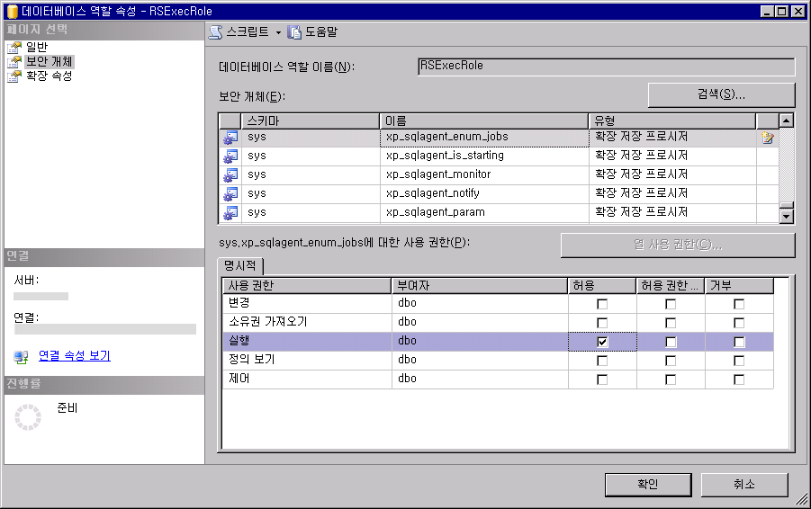

# RSExecRole 만들기

  [!INCLUDE[ssRSnoversion](../../includes/ssrsnoversion-md.md)] 는 **RSExecRole** 이라는 미리 정의된 데이터베이스 역할을 사용하여 보고서 서버 데이터베이스에 대한 보고서 서버 사용 권한을 부여합니다. **RSExecRole** 역할은 보고서 서버 데이터베이스와 함께 자동으로 만들어집니다. 일반적으로 이 역할을 수정하거나 다른 사용자를 이 역할에 할당해서는 안 됩니다. 그러나 보고서 서버 데이터베이스를 새 [!INCLUDE[ssNoVersion](../../includes/ssnoversion-md.md)] [!INCLUDE[ssDE](../../includes/ssde-md.md)]또는 다른 설치로 이동하는 경우에는 Master 및 MSDB 시스템 데이터베이스에서 해당 역할을 다시 만들어야 합니다.  
  
 아래 지침에 따라 다음 단계를 수행합니다.  
  
-   Master 시스템 데이터베이스에서 **RSExecRole** 을 만들고 제공합니다.  
  
-   MSDB 시스템 데이터베이스에서 **RSExecRole** 을 만들고 제공합니다.  
  
> [!NOTE]  
>  이 항목의 지침은 보고서 서버 데이터베이스를 제공하기 위해 WMI 코드를 작성하거나 스크립트를 실행하지 않으려는 사용자를 위한 것입니다. 큰 배포를 관리하며 데이터베이스를 정기적으로 이동하는 경우에는 스크립트를 작성하여 이러한 단계를 자동화해야 합니다. 자세한 내용은 [Reporting Services WMI 공급자 액세스](../../reporting-services/tools/access-the-reporting-services-wmi-provider.md)를 참조하세요.  
  
## 시작하기 전 주의 사항  
  
-   데이터베이스를 이동한 후 암호화 키를 복원할 수 있도록 해당 키를 백업합니다. 이 단계는 **RSExecRole**을 만들고 제공하는 기능에 직접적인 영향을 주지는 않지만 작업을 확인하려면 해당 키의 백업이 있어야 합니다. 자세한 내용은 [Back Up and Restore Reporting Services Encryption Keys](../../reporting-services/install-windows/ssrs-encryption-keys-back-up-and-restore-encryption-keys.md)을 참조하세요.  
  
-   **인스턴스에 대한** sysadmin [!INCLUDE[ssNoVersion](../../includes/ssnoversion-md.md)] 권한이 있는 사용자 계정으로 로그온했는지 확인합니다.  
  
-   사용할 [!INCLUDE[ssNoVersion](../../includes/ssnoversion-md.md)] 인스턴스에 [!INCLUDE[ssDE](../../includes/ssde-md.md)] 에이전트 서비스가 설치되어 실행되고 있는지 확인합니다.  
  
-   reportservertempdb 데이터베이스와 reportserver 데이터베이스를 연결합니다. 이러한 데이터베이스를 연결하지 않고도 실제 역할을 만들 수 있지만 작업을 테스트하려면 해당 데이터베이스를 연결해야 합니다.  
  
 **RSExecRole** 을 수동으로 만드는 작업에 대한 지침은 보고서 서버 설치를 마이그레이션하는 컨텍스트 내에서 사용해야 합니다. 보고서 서버 데이터베이스 백업 및 이동과 같은 중요한 태스크는 이 항목에서 다루지 않지만 데이터베이스 엔진 설명서에 문서화되어 있습니다.  
  
## Master에서 RSExecRole 만들기  
 [!INCLUDE[ssRSnoversion](../../includes/ssrsnoversion-md.md)] 는 예약된 작업을 지원하기 위해 [!INCLUDE[ssNoVersion](../../includes/ssnoversion-md.md)] 에이전트 서비스에 대해 확장 저장 프로시저를 사용합니다. 다음 단계에서는 해당 프로시저에 대한 Execute 권한을 **RSExecRole** 역할에 부여하는 방법을 설명합니다.  
  
#### Management Studio를 사용하여 Master 시스템 데이터베이스에서 RSExecRole을 만들려면  
  
1.  [!INCLUDE[ssNoVersion](../../includes/ssnoversion-md.md)] [!INCLUDE[ssManStudio](../../includes/ssmanstudio-md.md)] 를 시작하고 보고서 서버 인스턴스를 호스팅하는 [!INCLUDE[ssDE](../../includes/ssde-md.md)] 인스턴스에 연결합니다.  
  
2.  **데이터베이스**를 엽니다.  
  
3.  **시스템 데이터베이스**를 엽니다.  
  
4.  **master**를 엽니다.  
  
5.  **보안**을 엽니다.  
  
6.  **역할**을 엽니다.  
  
7.  **데이터베이스 역할**을 마우스 오른쪽 단추로 클릭하고 **새 데이터베이스 역할**을 선택합니다. 일반 페이지가 표시됩니다.  
  
8.  **역할 이름**에 **RSExecRole**을 입력합니다.  
  
9. **소유자**에 **DBO**를 입력합니다.  
  
10. **보안 개체**를 클릭합니다.  
  
11. **검색**을 클릭합니다. **개체 추가** 대화 상자가 표시됩니다. 기본적으로 **특정 개체** 옵션이 선택되어 있습니다.  
  
12. **확인**을 클릭합니다. **개체 선택** 대화 상자가 표시됩니다.  
  
13. **개체 유형**을 클릭합니다.  
  
14. **확장 저장 프로시저**를 클릭합니다.  
  
15. **확인**을 클릭합니다.  
  
16. **찾아보기**를 클릭합니다.  
  
17. 확장 저장 프로시저 목록을 아래로 스크롤하여 다음을 선택합니다.  
  
    1.  xp_sqlagent_enum_jobs  
  
    2.  xp_sqlagent_is_starting  
  
    3.  xp_sqlagent_notify  
  
18. **확인**을 클릭하고 **확인** 한번 더 클릭합니다.  
  
19. **Execute** 행의 **허용** 열에서 확인란을 클릭한 다음 **확인**을 클릭합니다.  
  
20. 나머지 저장 프로시저 각각에 대해 반복합니다. 3개의 저장 프로시저 모두에 대해**RSExecRole** 에 Execute 권한을 부여해야 합니다.  
  
   
  
## MSDB에서 RSExecRole 만들기  
 Reporting Services는 예약된 작업을 지원하기 위해 SQL Server 에이전트 서비스에 대해 저장 프로시저를 사용하고 시스템 테이블에서 작업 정보를 검색합니다. 다음 단계에서는 해당 프로시저에 대한 Execute 권한과 해당 테이블에 대한 Select 권한을 RSExecRole에 부여하는 방법을 설명합니다.  
  
#### MSDB 시스템 데이터베이스에서 RSExecRole을 만들려면  
  
1.  MSDB에서 저장 프로시저 및 테이블에 대한 사용 권한을 부여하기 위해 유사한 단계를 반복합니다. 이 단계를 간소화하려면 저장 프로시저와 테이블을 별도로 제공합니다.  
  
2.  **MSDB**를 엽니다.  
  
3.  **보안**을 엽니다.  
  
4.  **역할**을 엽니다.  
  
5.  **데이터베이스 역할**을 마우스 오른쪽 단추로 클릭하고 **새 데이터베이스 역할**을 선택합니다. 일반 페이지가 표시됩니다.  
  
6.  역할 이름에 **RSExecRole**을 입력합니다.  
  
7.  소유자에 **DBO**를 입력합니다.  
  
8.  **보안 개체**를 클릭합니다.  
  
9. **추가**를 클릭합니다. **개체 추가** 대화 상자가 표시됩니다. 기본적으로 **특정 개체** 옵션이 선택되어 있습니다.  
  
10. **확인**을 클릭합니다.  
  
11. **개체 유형**을 클릭합니다.  
  
12. **저장 프로시저**를 클릭합니다.  
  
13. **확인**을 클릭합니다.  
  
14. **찾아보기**를 클릭합니다.  
  
15. 항목 목록을 아래로 스크롤하여 다음을 선택합니다.  
  
    1.  sp_add_category  
  
    2.  sp_add_job  
  
    3.  sp_add_jobschedule  
  
    4.  sp_add_jobserver  
  
    5.  sp_add_jobstep  
  
    6.  sp_delete_job  
  
    7.  sp_help_category  
  
    8.  sp_help_job  
  
    9. sp_help_jobschedule  
  
    10. sp_verify_job_identifiers  
  
16. **확인**을 클릭하고 **확인** 한번 더 클릭합니다.  
  
17. 첫 번째 저장 프로시저인 sp_add_category를 선택합니다.  
  
18. **Execute** 행의 **허용** 열에서 확인란을 클릭한 다음 **확인**을 클릭합니다.  
  
19. 나머지 저장 프로시저 각각에 대해 반복합니다. 10개의 저장 프로시저 모두에 대해 RSExecRole에 Execute 권한을 부여해야 합니다.  
  
20. 보안 개체 탭에서 **추가** 를 다시 클릭합니다. **개체 추가** 대화 상자가 표시됩니다. 기본적으로 **특정 개체** 옵션이 선택되어 있습니다.  
  
21. **확인**을 클릭합니다.  
  
22. **개체 유형**을 클릭합니다.  
  
23. **테이블**을 클릭합니다.  
  
24. **확인**을 클릭합니다.  
  
25. **찾아보기**를 클릭합니다.  
  
26. 항목 목록을 아래로 스크롤하여 다음을 선택합니다.  
  
    1.  syscategories  
  
    2.  sysjobs  
  
27. **확인**을 클릭하고 **확인** 한번 더 클릭합니다.  
  
28. 첫 번째 테이블인 syscategories를 선택합니다.  
  
29. **Select** 행의 **허용** 열에서 확인란을 클릭한 다음 **확인**을 클릭합니다.  
  
30. sysjobs 테이블에 대해 반복합니다. 두 테이블 모두에 대해 RSExecRole에 Select 권한을 부여해야 합니다.  
  
## 보고서 서버 데이터베이스 이동  
 역할을 만든 후에는 보고서 서버 데이터베이스를 새 SQL Server 인스턴스로 이동할 수 있습니다. 자세한 내용은 [다른 컴퓨터로 보고서 서버 데이터베이스 이동](../../reporting-services/report-server/moving-the-report-server-databases-to-another-computer-ssrs-native-mode.md)을 참조하세요.  
  
 [!INCLUDE[ssDE](../../includes/ssde-md.md)]을 SQL Server 2016으로 업그레이드하는 경우 데이터베이스를 이동하기 전이나 후에 업그레이드할 수 있습니다.  
  
 보고서 서버 데이터베이스는 보고서 서버를 연결할 때 자동으로 업그레이드됩니다. 데이터베이스를 업그레이드하는 데 필요한 특별한 단계는 없습니다.  
  
## 암호화 키 복원 및 작업 확인  
 보고서 서버 데이터베이스를 연결한 후에는 다음 단계를 완료하여 작업을 확인할 수 있습니다.  
  
#### 데이터베이스 이동 후 보고서 서버가 작동하는지 확인하려면  
  
1.  Reporting Services 구성 도구를 시작한 후 보고서 서버에 연결합니다.  
  
2.  **데이터베이스**를 클릭합니다.  
  
3.  **데이터베이스 변경**을 클릭합니다.  
  
4.  **기존 보고서 서버 데이터베이스 선택**을 클릭합니다.  
  
5.  데이터베이스 엔진의 서버 이름을 입력합니다. 보고서 서버 데이터베이스를 명명된 인스턴스에 연결한 경우 인스턴스 이름을 \<servername>\\<instancename\> 형식으로 입력해야 합니다.  
  
6.  **연결 테스트**를 클릭합니다.  
  
7.  **다음**을 클릭합니다.  
  
8.  데이터베이스에서 보고서 서버 데이터베이스를 선택합니다.  
  
9. **다음** 을 클릭하고 마법사를 완료합니다.  
  
10. **암호화 키**를 클릭합니다.  
  
11. **복원**을 클릭합니다.  
  
12. 보고서 서버 데이터베이스의 저장된 자격 증명 및 연결 정보를 해독하는 데 사용되는 대칭 키의 백업 복사본이 있는 강력한 파일(.snk)을 선택합니다.  
  
13. 암호를 입력하고 **확인**을 클릭합니다.  
  
14. **보고서 관리자 URL**을 클릭합니다.  
  
15. 링크를 클릭하여 보고서 관리자를 엽니다. 보고서 서버 데이터베이스의 보고서 서버 항목이 표시되어야 합니다.  

## 다음 단계

[다른 컴퓨터로 보고서 서버 데이터베이스 이동&#40;SSRS 기본 모드&#41;](../../reporting-services/report-server/moving-the-report-server-databases-to-another-computer-ssrs-native-mode.md)   
[Reporting Services 구성 관리자&#40;기본 모드&#41;](../../reporting-services/install-windows/reporting-services-configuration-manager-native-mode.md)   
[기본 모드 보고서 서버 데이터베이스 만들기&#40;SSRS 구성 관리자&#41;](../../reporting-services/install-windows/ssrs-report-server-create-a-native-mode-report-server-database.md)   
[Reporting Services 암호화 키 백업 및 복원](../../reporting-services/install-windows/ssrs-encryption-keys-back-up-and-restore-encryption-keys.md)  

추가 질문이 있으신가요? [Reporting Services 포럼에서 질문하기](http://go.microsoft.com/fwlink/?LinkId=620231)
