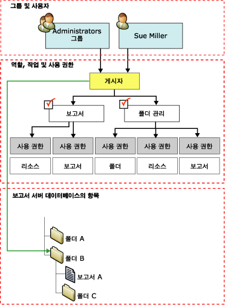

# 역할 할당
  [!INCLUDE[ssRSnoversion](../../includes/ssrsnoversion-md.md)]에서 *역할 할당* 은 저장된 항목 및 보고서 서버 자체에 대한 액세스 권한을 결정합니다. 역할 할당은 다음과 같은 요소로 구성됩니다.  
  
-   액세스 권한을 제어하려는 보안 개체 항목. 보안 개체 항목의 예로는 폴더, 보고서, 리소스 등이 있습니다.  
  
-   Windows 보안 또는 기타 인증 메커니즘을 통해 인증할 수 있는 사용자 또는 그룹 계정  
  
-   태스크 집합을 정의하는 역할 정의. 역할 정의의 예로는 **시스템 관리자**, **내용 관리자**, **게시자**등이 있습니다.  
  
 역할 할당은 폴더 계층에서 상속됩니다. 폴더에 대해 정의된 역할 정의는 해당 폴더에 포함된 모든 보고서, 공유 데이터 원본, 리소스 및 하위 폴더로 자동으로 상속됩니다. 개별 항목에 대해 역할 할당을 정의하면 상속된 보안은 무시됩니다. 폴더 계층의 모든 부분에 대해 하나 이상의 역할 할당으로 보안을 설정해야 합니다. 보안되지 않은 항목을 만들 수 없으며 보안되지 않은 항목을 생성하도록 설정할 수 없습니다.  
  
 다음 다이어그램에서는 B 폴더의 **게시자** 역할에 그룹 및 특정 사용자를 매핑하는 역할 할당을 보여 줍니다.  
  
   
역할 할당 다이어그램  
  
## 시스템 수준 및 항목 수준 역할 할당  
 [!INCLUDE[ssRSnoversion](../../includes/ssrsnoversion-md.md)] 의 역할 기반 보안은 다음 수준으로 구성됩니다.  
  
-   항목 수준 역할 할당은 보고서 서버 폴더 계층의 보고서, 폴더, 보고서 모델, 공유 데이터 원본 및 리소스에 대한 액세스를 제어하며 특정 항목이나 홈 폴더에 대한 역할 할당을 만들 때 정의합니다.  
  
-   시스템 역할 할당은 서버 전체를 범위로 하는 작업 권한을 부여합니다. 예를 들어 작업 관리 기능은 시스템 수준 작업입니다. 시스템 역할 할당은 시스템 관리자와 동등한 것은 아니며 보고서 서버에 대한 모든 권한을 부여하는 고급 사용 권한을 제공하지 않습니다.  
  
 시스템 역할 할당은 폴더 계층의 항목에 대한 액세스 권한을 부여하지 않습니다. 시스템 보안과 항목 보안은 함께 사용할 수 없습니다. 지정한 사용자 또는 그룹에 대해 시스템 수준 및 항목 수준 역할 할당을 모두 만들어서 보고서 서버에 대한 충분한 액세스 권한을 제공해야 할 수도 있습니다.  
  
## 역할 할당의 사용자 및 그룹  
 역할 할당에 지정된 사용자 계정 또는 그룹 계정은 도메인 계정입니다. 보고서 서버는 [!INCLUDE[msCoName](../../includes/msconame-md.md)] Windows 도메인 또는 다른 보안 모델(사용자 지정 보안 확장 프로그램을 사용하는 경우)에서 사용자 및 그룹을 만들거나 관리하지 않고 참조하기만 합니다.  
  
 지정된 항목에 적용되는 모든 역할 할당 중에서 두 개의 역할 할당이 동일한 사용자 또는 그룹을 지정할 수는 없습니다. 사용자 계정이 그룹 계정의 멤버이고 두 계정 모두에 대한 역할 할당을 가지고 있는 경우 해당 사용자는 두 역할 할당에 대한 모든 태스크를 사용할 수 있습니다.  
  
 이미 역할 할당의 일부인 그룹에 사용자를 추가하는 경우 새 역할 할당이 사용자에게 적용되려면 인터넷 정보 서비스(IIS)를 다시 설정해야 합니다.  
  
## 미리 정의된 역할 할당  
 기본적으로 로컬 관리자가 보고서 서버를 관리할 수 있도록 미리 정의된 역할 할당이 구현됩니다. 다른 사용자에게 액세스 권한을 부여하려면 역할 할당을 추가해야 합니다.  
  
 기본 보안을 제공하는 미리 정의된 역할 할당에 대한 자세한 내용은 [미리 정의된 역할](../../reporting-services/security/role-definitions-predefined-roles.md)을 참조하세요.  
  
## 참고 항목  
 [역할 만들기, 삭제 또는 수정&#40;Management Studio&#41;](../../reporting-services/security/role-definitions-create-delete-or-modify.md)   
 [사용자에게 보고서 서버에 대한 액세스 권한 부여&#40;보고서 관리자&#41;](../../reporting-services/security/grant-user-access-to-a-report-server-report-manager.md)   
 [역할 할당 수정 또는 삭제&#40;보고서 관리자&#41;](../../reporting-services/security/role-assignments-modify-or-delete.md)   
 [SharePoint 사이트의 보고서 서버 항목에 대한 사용 권한 설정&#40;SharePoint 통합 모드의 Reporting Services&#41;](../../reporting-services/security/set-permissions-for-report-server-items-on-a-sharepoint-site.md)   
 [기본 모드 보고서 서버에 대한 사용 권한 부여](../../reporting-services/security/granting-permissions-on-a-native-mode-report-server.md)  
  
  
