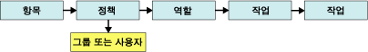

# 태스크 및 권한
  [!INCLUDE[ssRSnoversion](../../includes/ssrsnoversion-md.md)]에서 *태스크* 는 사용자 또는 관리자가 수행할 수 있는 동작을 말하며 태스크는 미리 정의됩니다. 태스크는 사용자 지정할 수 없으며 프로그래밍 방식이나 도구를 통해 제공된 태스크를 수정할 수 없습니다. 모두 25가지의 태스크가 있습니다. 이러한 태스크는 역할 기반 보안에서 사용할 수 있는 전체 작업 집합을 구성합니다. "보고서 보기", "보고서 관리", "보고서 서버 속성 관리" 등과 같은 태스크가 있습니다.  
  
 각 태스크는 미리 정의되는 권한 집합으로 구성됩니다. 예를 들어 "폴더 관리" 태스크는 폴더 만들기 및 삭제 권한과 폴더 속성 보기 및 업데이트 권한을 포함합니다. 각 태스크에 대한 사용 권한은 문서화되어 각 작업에 대해 보다 정확한 설명을 제공합니다. 사용 권한과 직접 상호 작용하거나 역할 할당에 사용 권한을 지정할 수는 없습니다. 사용 권한은 역할 정의에 포함된 태스크를 통해 사용자에게 간접적으로 부여됩니다.  
  
 태스크는 역할의 일부이고 해당 역할이 역할 할당에 포함되어 있는 경우에만 수행할 수 있습니다. 따라서 모델 보기 태스크가 역할에 포함되어 있지 않거나 해당 역할이 역할 할당에 포함되어 있지 않은 경우 사용자는 보고서 모델을 볼 수 없습니다. 다음 다이어그램에서는 사용 권한이 태스크에 결합되는 방법과 특정 역할 할당에 사용할 수 있는 역할에 태스크가 결합되는 방법을 보여 줍니다.  
  
   
사용 권한 및 태스크 다이어그램  
  
## 시스템 및 항목 수준 태스크  
 태스크는 시스템 수준 아니면 항목 수준 범주에 속합니다. 역할은 단일 범주의 태스크만 포함할 수 있습니다. 다음 표에서는 각 태스크 범주를 설명합니다.  
  
|범주|Description|  
|--------------|-----------------|  
|[항목 수준의 태스크](../../reporting-services/security/tasks-and-permissions-item-level-tasks.md)|폴더, 보고서, 보고서 모델, 리소스 등 보고서 서버에서 관리되는 항목에 대해 수행하는 동작입니다.   항목 수준 태스크의 범위는 보고서 서버 폴더 네임스페이스로 한정됩니다. 보고서 서버의 폴더 또는 URL 액세스를 통해 액세스하는 모든 항목의 보안은 항목 수준 태스크를 포함하는 역할 할당에 의해 설정됩니다.|  
|[시스템 수준 태스크](../../reporting-services/security/tasks-and-permissions-system-level-tasks.md)|많은 항목에 사용할 수 있는 작업 또는 공유 일정 관리와 같이 시스템 수준에서 수행하는 동작입니다. 시스템 수준 태스크의 범위는 보고서 서버 폴더 네임스페이스 외부로 한정됩니다.|  
  
## 관련 항목:  
 [역할 정의](../../reporting-services/security/role-definitions.md)   
 [미리 정의된 역할](../../reporting-services/security/role-definitions-predefined-roles.md)   
 [기본 모드 보고서 서버에 대한 사용 권한 부여](../../reporting-services/security/granting-permissions-on-a-native-mode-report-server.md)  
  
  
