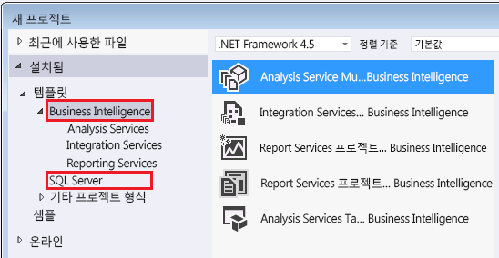

# <a name="reporting-services-in-sql-server-data-tools-ssdt"></a>SQL Server Data Tools의 Reporting Services(SSDT)

  [!INCLUDE[ssBIDevStudioFull](../../includes/ssbidevstudiofull-md.md)] 비즈니스 인텔리전스 솔루션을 만들기 위한 [!INCLUDE[msCoName](../../includes/msconame-md.md)] [!INCLUDE[vsprvs](../../includes/vsprvs-md.md)] 환경입니다. SSDT에서는 페이지를 매긴 [!INCLUDE[ssRSnoversion_md](../../includes/ssrsnoversion-md.md)] 보고서 정의, 공유 데이터 원본, 공유 데이터 집합 및 보고서 파트를 열고 수정하고 미리 보고 저장하고 배포할 수 있는 보고서 디자이너 제작 환경을 사용할 수 있습니다. [!INCLUDE[ssBIDevStudioFull](../../includes/ssbidevstudiofull-md.md)]는 SQL Server에 포함되어 있지 않습니다. [SQL Server Data Tools](http://go.microsoft.com/fwlink/?LinkID=616714)를 다운로드합니다. 
  
 이 항목에서는 [!INCLUDE[ssBIDevStudio](../../includes/ssbidevstudio-md.md)] 에 사용되는 [!INCLUDE[ssRSnoversion](../../includes/ssrsnoversion-md.md)]솔루션, 프로젝트, 프로젝트 템플릿 및 구성과 보고서 디자이너에서 사용할 수 있는 뷰, 메뉴, 도구 모음 및 바로 가기에 대해 설명합니다.  
  
 보고서 디자인을 시작하려면 [보고서 디자이너로 보고서 디자인&#40;SSRS&#41;](../../reporting-services/tools/design-reporting-services-paginated-reports-with-report-designer-ssrs.md)을 참조하세요.  
  
##  <a name="bkmk_SolutionsandProjects"></a> 솔루션 및 프로젝트  
 보고서 프로젝트는 보고서 정의 및 리소스에 대한 컨테이너 역할을 합니다. 보고서 프로젝트의 모든 파일은 프로젝트를 배포할 때 보고서 서버에 게시됩니다. 처음 프로젝트를 만들면 해당 프로젝트의 컨테이너 역할을 하는 솔루션도 만들어집니다. 하나의 솔루션에 여러 프로젝트를 추가할 수 있습니다.  
  
  
##  <a name="bkmk_Configurations"></a> 구성  
 엔터프라이즈 테스트 및 프로덕션 보고서 서버와 같은 배포 변형을 위한 여러 프로젝트 속성 집합을 만들려면 구성 관리자를 사용합니다. 자세한 내용은 [SQL Server Data Tools의 배포 및 버전 지원&#40;SSRS&#41;](../../reporting-services/tools/deployment-and-version-support-in-sql-server-data-tools-ssrs.md)에 포함되지 않습니다.  
  
##  <a name="bkmk_ReportServerProjects"></a> 보고서 서버 프로젝트  
 [!INCLUDE[ssRSnoversion](../../includes/ssrsnoversion-md.md)]를 설치하면 [!INCLUDE[ssBIDevStudioFull](../../includes/ssbidevstudiofull-md.md)]에서 다음 프로젝트 템플릿을 사용할 수 있습니다.  
  
-   **보고서 서버 프로젝트** 보고서 서버 프로젝트를 선택하면 보고서 디자이너가 열립니다. 보고서 서버 프로젝트는 [!INCLUDE[vsprvs](../../includes/vsprvs-md.md)] 에 의해 설치되며 **새 프로젝트** 대화 상자에서 사용할 수 있는 비즈니스 인텔리전스 프로젝트 템플릿입니다. 자세한 내용은 [보고서 프로젝트에 새 보고서 또는 기존 보고서 추가&#40;SSRS&#41;](../../reporting-services/tools/add-a-new-or-existing-report-to-a-report-project-ssrs.md)를 참조하세요. 보고서 서버 프로젝트 속성은 [!INCLUDE[ssBIDevStudioFull](../../includes/ssbidevstudiofull-md.md)] 프로젝트의 모든 보고서 및 모든 공유 데이터 원본에 적용됩니다. 이러한 속성에는 보고서 서버의 URL과 보고서 및 공유 데이터 원본의 폴더 이름이 포함됩니다. **프로젝트 속성 페이지** 대화 상자를 사용하여 현재 속성 값을 볼 수 있습니다. 이 대화 상자를 열려면 **프로젝트** 메뉴에서 **속성**을 클릭합니다.  
  
-   **보고서 서버 프로젝트 마법사** 보고서 서버 마법사 프로젝트를 선택하면 보고서 서버 프로젝트가 자동으로 만들어지고 보고서 마법사가 열립니다. 마법사에서는 각 페이지의 지침을 따라 데이터 원본에 대한 연결 문자열을 만들고, 데이터 원본 자격 증명을 설정하고, 쿼리를 디자인하고, 테이블 또는 행렬 데이터 영역을 추가하고, 보고서 데이터 및 그룹을 지정하고, 글꼴 및 색 스타일을 선택하고, 보고서 서버에 보고서를 게시하고, 보고서를 로컬에서 미리 보는 방법으로 보고서를 만들 수 있습니다. 마법사로 보고서를 만든 후에는 보고서 서버 프로젝트의 보고서 디자이너를 사용하여 보고서 데이터 및 보고서 디자이너를 변경할 수 있습니다.  
  
   
  
  
##  <a name="bkmk_ReportDesignerWindowsandPanes"></a> 보고서 디자이너 창 및 하위 창  
 보고서 디자이너는 두 가지 뷰를 지원합니다. **디자인** 은 보고서 데이터 및 보고서 레이아웃을 정의하기 위한 뷰이고 **미리 보기** 는 보고서의 렌더링된 뷰를 표시하기 위한 뷰입니다. 각 뷰에서 여러 창을 표시하면 렌더링된 보고서를 디자인하거나 보는 데 도움이 됩니다.  
  
###  <a name="bkmk_ReportDataPane"></a> 보고서 데이터 창  
 보고서 데이터 창에는 기본 제공 필드, 데이터 원본, 데이터 집합, 필드 컬렉션, 보고서 매개 변수 및 이미지가 표시됩니다.  
  
 보고서 데이터 창을 사용하여 볼 수 있는 항목은 다음과 같습니다.  
  
-   **기본 제공 필드** 보고서 이름 또는 보고서가 처리된 시간과 같은 미리 정의된 보고서 정보입니다.  
  
-   **데이터 원본** 데이터 원본은 데이터 원본의 이름 및 이 원본에 대한 연결을 나타냅니다.  
  
-   **데이터 집합** 각 데이터 집합은 데이터 원본에서 검색할 데이터를 지정하는 쿼리를 포함합니다. 데이터 집합을 확장하여 데이터 집합 쿼리로 지정된 필드 컬렉션을 볼 수 있습니다.  
  
     다차원 데이터 집합에 대해 사용할 수 있는 일부 쿼리 디자이너에서는 필터 창의 필터를 지정하고 보고서 매개 변수를 만들지 여부를 나타낼 수 있습니다. 보고서 매개 변수 옵션을 지정하면 매개 변수의 유효값 목록을 채우기 위해 특별한 데이터 집합이 자동으로 만들어집니다.  기본적으로 이러한 데이터 집합은 보고서 데이터 창에 나타나지 않습니다. 자세한 내용은 [다차원 데이터의 매개 변수 값에 대해 숨겨진 데이터 집합 표시&#40;보고서 작성기 및 SSRS&#41;](../../reporting-services/report-data/show-hidden-datasets-for-parameter-values-multidimensional-data.md)를 참조하세요.  
  
-   **보고서 매개 변수** 보고서 매개 변수 목록입니다. 매개 변수는 데이터 집합 쿼리에 쿼리 매개 변수가 포함되면 수동이나 자동으로 만들어질 수 있습니다.  
  
-   **이미지** 보고서에 이미지 보고서 항목으로 포함할 수 있는 이미지의 목록입니다.  
  
 보고서 데이터 창의 데이터 원본 및 데이터 집합은 보고서 정의의 요소를 나타냅니다. 보고서 데이터 창은 여러 보고서 제작 환경에서 지원되는 기능입니다. 보고서 작성기에서 데이터 원본 및 데이터 집합 관리를 위해 사용할 수 있는 유일한 창입니다. 보고서 디자이너의 보고서 데이터 창은 공유 데이터 원본과 공유 데이터 집합을 파일 형태로 나열하는 솔루션 탐색기와 함께 작동합니다. 보고서 데이터 창의 공유 데이터 원본과 공유 데이터 집합은 솔루션 탐색기에 있는 해당 공유 데이터 원본 및 공유 데이터 집합을 가리켜야 합니다. 또한 보고서 데이터 창의 요소가 솔루션 탐색기의 데이터 파일에 대한 참조를 포함해야 합니다. 프로젝트 속성은 공유 데이터 원본 및 공유 데이터 집합을 보고서 서버나 SharePoint 사이트에 배포할지 여부를 결정합니다. 자세한 내용은 [데이터 원본 변환&#40;보고서 작성기 및 SSRS&#41;](../../reporting-services/report-data/convert-data-sources-report-builder-and-ssrs.md)를 참조하세요.  
  
> [!NOTE]  
>  보고서 데이터 창이 표시되지 않는 경우 디자인 영역을 클릭한 다음 **보기** 메뉴에서 **보고서 데이터**를 클릭합니다. 보고서 데이터 창이 부동 창인 경우 고정할 수 있습니다. 자세한 내용은 [보고서 디자이너에서 보고서 데이터 창 도킹&#40;SSRS&#41;](../../reporting-services/tools/dock-the-report-data-pane-in-report-designer-ssrs.md)을 참조하세요.  
  
  
###  <a name="bkmk_GroupingPane"></a> 그룹화 창  
 그룹화 창을 사용하여 테이블릭스 데이터 영역에 대한 그룹을 정의할 수 있습니다. 테이블의 경우 행 그룹 및 세부 그룹을 정의하고 행렬의 경우 행 및 열 그룹을 정의할 수 있습니다. 그룹화 창을 사용하여 차트 또는 다른 데이터 영역에 대한 그룹을 정의할 수 없습니다. 자세한 내용은 [그룹 이해&#40;보고서 작성기 및 SSRS&#41;](../../reporting-services/report-design/understanding-groups-report-builder-and-ssrs.md)를 참조하세요.  
  
 그룹화 창에는 다음과 같은 두 가지 모드가 있습니다.  
  
-   **기본.** **기본** 모드를 사용하여 부모 그룹, 자식 그룹, 인접 그룹 및 세부 그룹의 관계를 보여 주는 계층 구조 형식으로 모든 행 및 열 그룹을 표시할 수 있습니다. 자식 그룹은 해당 부모 그룹 아래와 다음 들여쓰기 수준에 나타납니다. 인접 그룹은 해당 피어 또는 형제 그룹과 같은 들여쓰기 수준에 나타납니다.  
  
     기본 모드를 사용하여 그룹을 추가, 편집 또는 삭제할 수 있습니다. 단일 데이터 집합 필드를 기반으로 하는 그룹의 경우 해당 필드를 행 그룹 또는 열 그룹 창으로 끕니다. 그룹을 기존 그룹의 위 또는 아래에 삽입할 수 있습니다. 인접 그룹을 추가하려면 형제 그룹을 마우스 오른쪽 단추로 클릭하고 바로 가기 메뉴를 사용합니다. 그룹에 포함할 테이블릭스 셀을 표시하려면 그룹화 창에서 해당 그룹을 선택합니다.  
  
-   **고급** **고급** 모드를 사용하여 선택한 테이블릭스 데이터 영역의 정적/동적 행 및 열 그룹 멤버를 표시할 수 있습니다.  그룹 또는 그룹 멤버에 연결된 행 및 열의 표시 여부를 제어하는 속성을 설정하려면 그룹 멤버를 사용하거나 페이지에서 그룹이 함께 유지되도록 렌더러에 사용되는 규칙을 사용해야 합니다. 그룹 멤버는 디자인 화면에 행 그룹 및 열 그룹 영역의 셀로 나타납니다.  
  
> [!NOTE]  
>  **기본** 모드와 **고급** 모드 사이를 토글하려면 **열 그룹** 아이콘의 오른쪽에 있는 아래쪽 화살표를 마우스 오른쪽 단추로 클릭합니다.  
  
 자세한 내용은 [Grouping Pane](../../reporting-services/tools/grouping-pane.md)을 참조하세요.  
  
  
###  <a name="bkmk_Toolbox"></a> 도구 상자  
 도구 상자는 디자인 화면으로 끌 수 있는 보고서 항목을 포함합니다. 데이터 영역은 보고서에서 데이터를 구성하는 데 사용하는 보고서 항목입니다. 테이블, 행렬, 목록, 차트, 계기, 데이터 막대, 스파크라인 및 표시기가 데이터 영역입니다. 다른 보고서 항목에는 지도, 입력란, 사각형, 선, 이미지 및 하위 보고서가 있습니다. 사용자 지정 보고서 항목은 시스템 관리자가 설치 및 등록한 경우 이 목록에도 나타날 수 있습니다.  
  
###  <a name="bkmk_PropertiesPane"></a> 속성 창  
 속성 창은 속성 이름과 디자인 화면에서 현재 선택된 보고서 항목의 값을 보여 주는 표준 [!INCLUDE[vsprvs](../../includes/vsprvs-md.md)] 창입니다. 대부분의 경우 속성 이름은 RDL(Report Definition Language) 파일의 요소 및 특성에 해당합니다. 자주 사용하는 속성은 선택한 항목의 속성 대화 상자를 사용하여 설정할 수 있습니다. 해당 대화 상자를 열려면 속성 창 도구 모음에서 **속성 페이지** 단추를 클릭합니다. 고급 사용자는 속성 창에서 직접 속성 값을 설정할 수 있습니다.  
  
 속성 창을 사용하여 다음을 수행할 수 있습니다.  
  
-   디자인 화면에서 현재 선택한 항목의 속성을 설정합니다. 일부 속성은 값이 포함된 드롭다운 목록을 제공합니다. 셀에 직접 값을 입력할 수도 있습니다. 일부 속성은 값 컬렉션을 포함하며 이는 값 **(컬렉션)**으로 표시됩니다. 대부분의 속성에는 식이 허용될 수 있으며 복합 식은 **\<Expression>** 값으로 표시됩니다. **\<Expression>**을 클릭하면 **식** 대화 상자가 열립니다. 자세한 내용은 [Expression Dialog Box](http://msdn.microsoft.com/library/e6c74ccb-4594-4d4f-b958-618d710e34eb)을 참조하세요.  
  
-   속성 창의 도구 모음 단추를 사용하여 종류별 보기에서 사전순 보기로 표 형태 창을 변경할 수 있습니다. 종류별 보기에서는 범주 내의 모든 속성을 보기 위해 해당 범주를 확장해야 할 수 있습니다. 항목의 속성 대화 상자를 열려면 도구 모음에서 **속성 페이지** 단추를 클릭하거나 항목을 마우스 오른쪽 단추로 클릭하고 **속성**을 클릭합니다.  
  
-   그룹화 창에서 현재 선택 된 그룹 멤버에 대한 속성을 설정합니다. 그룹 멤버 속성은 정적 그룹 머리글 및 바닥글 행을 각 그룹 인스턴스에 대해 반복하는 방식을 제어하는 데 유용합니다. 자세한 내용은 [그룹과 함께 헤더 및 바닥글 표시&#40;보고서 작성기 및 SSRS&#41;](../../reporting-services/report-design/display-headers-and-footers-with-a-group-report-builder-and-ssrs.md)를 참조하세요.  
  
 속성 창을 표시하려면 **보기** 메뉴에서 **속성 창**을 클릭합니다. 이 창의 도킹을 해제하여 [!INCLUDE[ssBIDevStudio](../../includes/ssbidevstudio-md.md)]창의 다른 영역으로 이동하거나 디자인 화면에서 해당 창을 탭 뷰로 표시할 수 있습니다.  
  
  
###  <a name="bkmk_SolutionExplorer"></a> 솔루션 탐색기  
 솔루션 탐색기는 프로젝트에 있는 모든 항목을 표시하는 표준 [!INCLUDE[vsprvs](../../includes/vsprvs-md.md)] 구성 요소입니다. 보고서 서버 프로젝트의 경우 이 구성 요소에는 공유 데이터 원본, 공유 데이터 집합, 보고서 및 리소스를 구성하는 폴더가 포함됩니다. 폴더 항목은 솔루션 파일을 열 때 사전순으로 자동 정렬됩니다. 속성 창에서 항목 속성을 보려면 해당 항목을 선택합니다.  
  
###  <a name="bkmk_Output"></a> 출력  
 출력 창은 보고서를 미리 볼 때에는 처리 오류를 표시하고 보고서 또는 공유 데이터 원본을 배포할 때에는 게시 오류를 표시합니다.  
  
 출력 및 문서 개요 창을 사용하여 식에서 오류를 디버그할 수 있습니다.  
  
  
###  <a name="bkmk_DocumentOutline"></a> 문서 개요  
 문서 개요 창은 보고서 정의에 있는 모든 보고서 항목의 계층 목록을 표시합니다. 문서 개요 창을 열려면 **보기** 메뉴에서 **다른 창** 을 가리키고 **문서 창**을 클릭합니다.  
  
 문서 개요 창을 사용하여 입력란 및 기타 보고서 항목을 이름으로 식별할 수 있습니다. 문서 개요 창에서 항목을 선택하면 해당 항목은 디자인 화면에서도 선택됩니다.  
  
###  <a name="bkmk_TaskList"></a> 작업 목록  
 태스크 목록 창은 [!INCLUDE[msCoName](../../includes/msconame-md.md)] Access와 같은 다른 응용 프로그램에서 보고서를 가져올 때 지원되지 않는 기능에 대한 빌드 오류를 표시합니다.  
  
  
##  <a name="bkmk_ReportDesignerDesignView"></a> 보고서 디자이너 디자인 뷰  
 기본적으로 보고서 서버 프로젝트를 만들면 보고서 디자이너가 디자인 뷰에서 열리고 디자인 화면을 표시합니다. 기본적으로 디자인 화면에는 보고서 본문 및 배경이 표시됩니다.  
  
 배경에 있는 바로 가기 메뉴는 페이지 머리글 및 페이지 바닥글을 추가하는 옵션을 제공하며 보기 메뉴를 통해 눈금자 및 그룹화 창을 표시하는 옵션을 제공합니다.  
  
 확대/축소 컨트롤을 사용하여 보고서의 배율을 늘리거나 줄일 수 있습니다.  
  
 보고서를 디자인하려면 보고서 항목을 도구 상자에서 끌어 디자인 화면에 놓은 다음 보고서에서 해당 속성을 구성하고 정렬을 변경합니다.  
  
  
##  <a name="bkmk_ReportDesignerPreview"></a> 보고서 디자이너 미리 보기  
 미리 보기를 사용하여 보고서를 실행하고 렌더링된 보고서를 보고서 뷰어에서 볼 수 있습니다. 미리 보기는 보고서 데이터를 로컬로 캐시합니다. 구성 속성을 설정하여 브라우저를 통해 디버그 뷰로 보고서를 실행할 수도 있습니다.  
  
 보고서를 미리 보면 보고서 디자이너는 보고서 데이터 원본에 연결하고, 데이터 집합 쿼리를 실행하고, 로컬 컴퓨터에 데이터를 캐시하고, 보고서를 처리하여 데이터와 레이아웃을 결합하고, 보고서를 렌더링합니다. 보고서를 미리 보기 탭에서 보거나 보고서를 디버그 모드로 표시하는 프로젝트 속성을 설정하여 보고서를 브라우저에서 직접 볼 수 있습니다.  
  
-   **매개 변수가 있는 보고서 미리 보기** 보고서를 미리 보면 모든 보고서 매개 변수에 유효한 기본값이 있는 경우 해당 보고서가 자동으로 처리됩니다. 하나 이상의 보고서 매개 변수에 유효한 기본값이 없는 경우에는 할당되지 않은 각 매개 변수의 값을 선택한 다음 보고서 도구 모음에서 **보고서 보기**를 클릭해야 합니다.  
  
-   **로컬 데이터 캐시 이해** 보고서를 미리 보면 보고서 처리기는 현재 매개 변수 기본값을 사용하여 보고서에 있는 데이터 집합에 대한 모든 쿼리를 실행하고 결과를 로컬 데이터 캐시 파일(.rdl.data)로 저장합니다. 보고서 데이터 집합 쿼리 또는 보고서 매개 변수를 변경하지 않을 경우 이 데이터를 다시 검색하는 오버헤드를 발생시키지 않고 계속해서 보고서를 디자인할 수 있습니다.  
  
-   **구성 관리자 및 디버깅을 사용하여 보고서 미리 보기** [!INCLUDE[ssBIDevStudioFull](../../includes/ssbidevstudiofull-md.md)]에서는 프로젝트 속성으로 보고서 배포 및 디버깅 방법을 정의합니다. 이러한 속성은 프로젝트에 있는 모든 보고서 및 공유 데이터 원본에 적용됩니다. 프로젝트 속성을 설정하려면 **프로젝트** 메뉴에서 **속성**을 클릭합니다. 이러한 속성을 사용하여 보고서를 테스트하고 보고서 서버에 게시할 수 있습니다.  
  
-   **출력 창에서 오류 메시지 모니터링** 보고서를 미리 보고 보고서 처리기가 문제를 검색하면 출력 창에 오류 메시지가 기록됩니다.  
  
  
##  <a name="bkmk_ReportDesignerMenus"></a> 보고서 디자이너 메뉴  
 [!INCLUDE[ssBIDevStudioFull](../../includes/ssbidevstudiofull-md.md)]에서 보고서 디자이너 프로젝트가 활성화되어 있으면 주 메뉴 모음에 다음 도구 모음이 추가됩니다. 보고서 디자이너 메뉴는 디자인 뷰에 있을 때만 표시됩니다.  
  
###  <a name="FormatMenu"></a> 서식 메뉴  
 디자인 화면에서 항목을 선택하면 **서식** 메뉴에 다음 옵션이 포함됩니다.  
  
-   **전경색** 텍스트 색을 선택합니다. 기본 텍스트 색은 검정입니다.  
  
-   **배경색** 입력란과 데이터 영역의 배경색을 선택합니다.  
  
-   **글꼴** 텍스트에 굵게, 기울임꼴 또는 밑줄 서식을 적용합니다.  
  
-   **양쪽 맞춤** 텍스트를 오른쪽에 맞출지, 가운데에 맞출지 또는 왼쪽에 맞출지 지정합니다.  
  
-   **맞춤** 선택한 개체의 맞춤 방법을 보고서 내의 다른 개체를 기준으로 지정합니다.  
  
-   **같은 크기로** 선택한 개체의 크기를 보고서 크기에 맞춰서 조정합니다.  
  
-   **가로 간격 조정** 보고서 내에서 선택한 개체 간에 가로 간격을 조정합니다.  
  
-   **세로 간격 조정** 보고서 내에서 선택한 개체 간에 세로 간격을 조정합니다.  
  
-   **폼 가운데 맞춤** 선택한 개체를 보고서 디자이너 창의 가로 및 세로를 기준으로 가운데에 맞춥니다.  
  
-   **순서** 선택한 개체를 배경이나 전경으로 이동합니다.  
  
###  <a name="ReportMenu"></a> 보고서 메뉴  
 보고서 디자인 화면에 포커스가 있으면 **보고서** 메뉴에 다음 옵션이 포함됩니다.  
  
-   **보고서 속성**   **보고서 속성** 대화 상자를 열려면 선택합니다. 이 대화 상자에서 작성자 이름, 눈금 간격 등의 일반 보고서 속성을 할당하고 열 개수 및 페이지 크기와 같은 보고서 레이아웃 속성을 지정할 수 있습니다. 또한 데이터 출력 요소, 데이터 변환 및 데이터 스키마의 이름과 사용자 지정 코드, 어셈블리와 클래스에 대한 참조를 포함할 수 있습니다.  
  
-   **뷰** 보고서 디자이너의 디자인 탭과 미리 보기 탭 간에 전환합니다.  
  
-   **페이지 머리글** 보고서에서 페이지 머리글을 추가하거나 삭제합니다. 페이지 머리글을 삭제하면 페이지 머리글의 모든 항목이 삭제됩니다.  
  
-   **페이지 바닥글** 보고서에서 페이지 바닥글을 추가하거나 삭제합니다. 페이지 바닥글을 삭제하면 페이지 바닥글의 모든 항목이 삭제됩니다.  
  
-   **그룹화 창** 그룹화 창을 표시하거나 숨깁니다.  
  
###  <a name="ViewMenu"></a> 보기 메뉴  
 **보기** 메뉴를 사용하여 보고서 디자이너 창 및 도구 모음을 표시할 수 있습니다.  
  
-   **오류 목록** 보고서를 게시하거나 미리 볼 때 검색된 오류를 표시하려면 이 옵션을 사용합니다.  
  
-   **출력** 보고서를 게시하거나 처리할 때 검색된 오류를 표시하거나 보고서에 텍스트 "#오류"가 표시될 때의 식 오류에 대한 자세한 내용을 보려면 이 옵션을 사용합니다.  
  
-   **속성 창** 디자인 화면에서 현재 선택한 보고서 항목의 속성 값을 표시하려면 이 옵션을 사용합니다. 중첩된 보고서 항목의 속성을 보려면 보고서 항목을 여러 번 클릭하여 보고서 항목 및 중첩된 해당 멤버의 계층 간을 전환해야 합니다. 속성 창의 맨 위에 나타나는 항목의 이름을 확인하여 어떤 보고서 항목의 속성이 표시되는지 봅니다.  
  
-   **도구 상자** 도구 상자를 표시하려면 이 옵션을 사용합니다.  
  
-   **다른 창** 다음 창을 표시하려면 이 옵션을 사용합니다.  
  
    -   **문서 개요** 보고서에 있는 보고서 항목 및 해당 입력란 컬렉션의 계층 뷰를 표시하려면 이 옵션을 사용합니다.  
  
-   **도구 모음**   **보고서 테두리** 및 **보고서 서식**을 비롯한 보고서 디자이너 기능을 지원하는 도구 모음을 표시하려면 이 옵션을 사용합니다. 자세한 내용은 [보고서 디자이너 도구 모음](#bkmk_ReportDesignerToolbars)을 참조하십시오.  
  
-   **보고서 데이터** 보고서 매개 변수, 데이터 원본, 데이터 집합, 이미지를 추가할 수 있는 보고서 데이터 창을 표시하려면 이 옵션을 사용합니다.  
  
###  <a name="ProjectMenu"></a> 프로젝트 메뉴  
 **프로젝트** 메뉴를 사용하여 프로젝트에 있는 공유 데이터 원본 및 보고서를 관리할 수 있습니다. 프로젝트에서 항목을 추가하거나 제거하면 솔루션 탐색기에서 프로젝트 항목의 계층 표시가 자동으로 업데이트됩니다.  
  
-   **새 항목 추가** 프로젝트에 새 공유 데이터 원본 또는 새 보고서를 추가합니다.  
  
-   **기존 항목 추가** 프로젝트에 기존 공유 데이터 원본 또는 기존 보고서를 추가합니다.  
  
-   **보고서 가져오기** Microsoft Access와 같은 다른 응용 프로그램에서 보고서를 가져옵니다.  
  
-   **프로젝트에서 제외** 프로젝트에서 항목을 제외합니다. 이 옵션을 사용해도 파일 시스템에서 해당 항목이 삭제되지는 않습니다.  
  
-   **모든 파일 표시** 프로젝트에 있는 모든 파일을 표시합니다.  
  
-   **프로젝트 도구 상자 항목 새로 고침** 프로젝트에 새로운 사용자 지정 보고서 항목을 설치할 때 도구 상자 캐시를 새로 고칩니다.  
  
-   **속성** 이 프로젝트의 **속성 페이지** 대화 상자를 엽니다. 자세한 내용은 [프로젝트 속성 페이지 대화 상자](../../reporting-services/tools/project-property-pages-dialog-box.md)를 참조하세요.  
  
  
##  <a name="bkmk_ReportDesignerToolbars"></a> 보고서 디자이너 도구 모음  
 보고서 디자이너는 보고서 디자인 시 사용할 수 있는 다음과 같은 특수화된 도구 모음을 제공합니다.  
  
-   **보고서** 페이지 머리글 또는 페이지 바닥글을 추가하거나, 보고서 속성을 설정하거나, 눈금자 또는 그룹화 창을 토글하거나, 확대/축소를 사용하여 보고서 뷰를 변경합니다.  
  
-   **보고서 테두리** 선택한 모든 보고서 항목의 모든 선택 선 및 테두리에 대한 색, 스타일 및 두께를 설정합니다.  
  
-   **보고서 서식** 선택한 보고서 항목의 서식을 설정합니다. 입력란의 경우 도구 모음을 사용하여 변경할 수 있는 서식 유형은 글꼴 속성 및 텍스트 색, 배경색, 텍스트 양쪽 맞춤입니다.  
  
-   **레이아웃** 데이터 영역 내에 있는 보고서 항목 및 병합 셀의 그리기 순서를 설정합니다.  
  
-   **표준** 프로젝트를 열거나 저장하고, 창을 표시하고, 디버그 구성을 선택합니다.  
  
 **보기** 메뉴를 사용하여 이러한 도구 모음을 표시할지 여부를 제어할 수 있습니다. 다른 [!INCLUDE[vsprvs](../../includes/vsprvs-md.md)] 도구 모음의 기능이 보고서 디자이너 기능에 적용되지 않을 경우 해당 도구 모음이 비활성화될 수 있습니다.  
  

##  <a name="bkmk_SourceControl"></a> 원본 제어  
 [!INCLUDE[ssBIDevStudio](../../includes/ssbidevstudio-md.md)] 는 원본 플러그 인과 통합할 수 있습니다. **옵션** 대화 상자의 프로젝트 및 솔루션 페이지를 사용하여 플러그 인 및 구성 속성을 지정할 수 있습니다.  
  
##  <a name="bkmk_CustomReportTemplates"></a> 사용자 지정 보고서 템플릿  
 사용자 지정 보고서를 새로운 보고서에 대한 템플릿으로 사용하려면 [!INCLUDE[ssBIDevStudio](../../includes/ssbidevstudio-md.md)] 가 설치된 컴퓨터의 ReportProject 폴더에 이를 복사하기만 하면 됩니다. 기본적으로 이 폴더는 다음 위치에 있습니다. `<drive>:\Program Files\Microsoft Visual Studio 14.0\Common7\IDE\Private Assemblies\ProjectItems\ReportProject`. 보고서 프로젝트에 새 항목을 추가하면 사용자 지정 보고서가 템플릿 창에 표시됩니다.  
  
 보고서 마법사에 사용자 지정 스타일을 추가할 수도 있습니다.  
  
  
##  <a name="bkmk_CommandLineSupportForssdt"></a> SQL Server Data Tools에 대한 명령줄 지원  
 [!INCLUDE[ssBIDevStudio](../../includes/ssbidevstudio-md.md)] 는 [!INCLUDE[msCoName](../../includes/msconame-md.md)] [!INCLUDE[vsprvs](../../includes/vsprvs-md.md)] 및 기본 devenv.exe 응용 프로그램을 기반으로 합니다. 이러한 옵션을 사용하려면 먼저 다음 두 항목에 대한 올바른 값을 설정해야 합니다.  
  
-   OverwriteDataSources, TargetDataSourceFolder, TargetReportFolder 및 TargetServerURL의 프로젝트 속성  
  
-   디버그 또는 릴리스와 같은 구성 속성 집합 중 최소한 하나 이상  
  
 자세한 내용은 [Publishing Data Sources and Reports](../../reporting-services/reports/publishing-data-sources-and-reports.md)을 참조하세요.  
  
 명령줄에서 보고서 서버 프로젝트에 대해 다음 옵션을 지정할 수 있습니다.  
  
-   **/deploy** 구성 파일에 지정된 프로젝트 속성을 사용해서 보고서를 배포합니다. 예를 들어 다음 명령은 프로젝트 속성에 지정된 릴리스 구성 설정을 사용하여 Reports.sln 솔루션 파일에 지정된 보고서를 배포합니다.  
  
    ```  
    devenv.exe "C:\Users\MyUser\Documents\Visual Studio 2015\Projects\Reports\Reports.sln" /deploy "Release"  
    ```  
  
-   **/build** 솔루션 파일을 빌드만 하고 배포하지는 않습니다. 예를 들어 다음 명령은 프로젝트 속성에 지정된 디버그 구성 설정을 사용하여 Reports.sln 솔루션 파일에 지정된 보고서를 빌드합니다.  
  
    ```  
    devenv.exe "C:\Users\MyUser\Documents\Visual Studio 2015\Projects\Reports\Reports.sln" /build "Debug"  
    ```  
  
-   **/out** 솔루션을 빌드하여 생성된 출력을 지정된 파일로 리디렉션합니다. 예를 들어 다음 명령은 이전 예의 빌드 출력을 mybuildlog.txt라는 파일로 리디렉션합니다.  
  
    ```  
    devenv.exe "C:\Users\MyUser\Documents\Visual Studio 2015\Projects\Reports\Reports.sln" /build "Debug" /out mybuildlog.txt  
    ```  
  
##  <a name="bkmk_KeyboardShortcuts"></a> Reporting Services의 바로 가기 키  
 바로 가기 키를 사용하여 다음을 수행할 수 있습니다.  
  
-   [!INCLUDE[ssBIDevStudio](../../includes/ssbidevstudio-md.md)]의 창 및 모드를 제어합니다.  
  
    |Description|키 조합|  
    |-----------------|---------------------|  
    |선택한 프로젝트 빌드|Ctrl+Shift+B|  
    |속성 창 표시|F4|  
    |데이터 창 표시|Ctrl+Alt+D|  
    |디버깅 시작|F5|  
    |열려 있는 특정 창에서 다음 창으로 이동|F6|  
  
-   보고서 디자인 화면에서 항목을 제어합니다.  
  
    |Description|키 조합|  
    |-----------------|---------------------|  
    |특정 보고서 항목에서 다음 보고서 항목으로 포커스 이동|Tab|  
    |선택한 보고서 항목 이동|화살표 키|  
    |선택한 보고서 항목 조금 이동|Ctrl+화살표 키|  
    |선택한 보고서 항목 크기 확대 또는 축소|Ctrl+Shift+화살표 키|  
    |입력란에서 표시되는 텍스트의 시작 부분으로 커서 이동|Ctrl+Home|  
    |입력란에서 표시되는 텍스트의 끝 부분으로 커서 이동|Ctrl+End|  
    |입력란에서 표시되는 텍스트의 현재 커서 위치에서 시작 부분에 이르는 텍스트 선택|Shift+Home|  
    |입력란에서 표시되는 텍스트의 현재 커서 위치에서 끝 부분에 이르는 텍스트 선택|Shift+End|  
    |입력란에서 식의 현재 커서 위치에서 시작 부분에 이르는 텍스트 선택|Ctrl+Shift+Home|  
    |입력란에서 식의 현재 커서 위치에서 끝 부분에 이르는 텍스트 선택|Ctrl+Shift+End|  
    |선택한 보고서 항목에 대한 바로 가기 메뉴를 엽니다.|Shift+F10+속성 키(최신 키보드에 있음)|
  
## <a name="next-steps"></a>다음 단계

[SQL Server Data Tools 다운로드](http://go.microsoft.com/fwlink/?LinkID=616714)
[솔루션 탐색기](http://msdn.microsoft.com/library/0df09843-0d4f-4925-bc6c-99265035a0c1)   
[Reporting Services 보고서](../../reporting-services/reports/reporting-services-reports-ssrs.md)   
[Report Definition Language](../../reporting-services/reports/report-definition-language-ssrs.md)   
[SQL Server Data Tools의 배포 및 버전 지원](../../reporting-services/tools/deployment-and-version-support-in-sql-server-data-tools-ssrs.md)  

추가 질문이 있으신가요? [Reporting Services 포럼에서 질문하기](http://go.microsoft.com/fwlink/?LinkId=620231)
