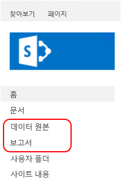

# <a name="sample-reporting-services-rsexe-script-to-copy-content-between-report-servers"></a>보고서 서버 간 콘텐츠 복사를 위한 예제 Reporting Services rs.exe 스크립트

[!INCLUDE[ssrs-appliesto](../../includes/ssrs-appliesto.md)] [!INCLUDE [ssrs-appliesto-2008r2-and-later](../../includes/ssrs-appliesto-2008r2-and-later.md)] [!INCLUDE [ssrs-appliesto-sharepoint-2013-2016](../../includes/ssrs-appliesto-sharepoint-2013-2016.md)] [!INCLUDE [ssrs-appliesto-pbirs](../../includes/ssrs-appliesto-pbirs.md)]

이 항목에는 **RS.exe** 유틸리티를 사용하여 [!INCLUDE[ssNoVersion](../../includes/ssnoversion-md.md)] [!INCLUDE[ssRSnoversion](../../includes/ssrsnoversion-md.md)] 보고서 서버에서 다른 보고서 서버로 콘텐츠 항목 및 설정을 복사하는 샘플 [!INCLUDE[ssRSnoversion](../../includes/ssrsnoversion-md.md)] RSS 스크립트가 포함되며, 이에 대해 설명합니다. RS.exe는 기본 및 SharePoint 모드에서 [!INCLUDE[ssRSnoversion](../../includes/ssrsnoversion-md.md)]와 함께 설치됩니다. 이 스크립트는 보고서 및 구독과 같은 [!INCLUDE[ssRSnoversion](../../includes/ssrsnoversion-md.md)] 항목을 한 서버에서 다른 서버로 복사합니다. 스크립트에서는 SharePoint 모드 및 기본 모드 보고서 서버가 모두 지원됩니다.  

##  <a name="bkmk_download_script"></a> ssrs_migration.rss 스크립트를 다운로드하려면  
 스크립트를 GitHub 사이트 [Reporting Services RS.exe 마이그레이션 스크립트](https://github.com/Microsoft/sql-server-samples/tree/master/samples/features/reporting-services/ssrs-migration-rss)에서 로컬 폴더로 다운로드합니다. 자세한 내용은 이 문서의 [스크립트 사용 방법](#bkmk_how_to_use_the_script) 섹션을 참조하세요.  
  
##  <a name="bkmk_supported_scenarios"></a> 지원되는 시나리오  
 스크립트에서는 SharePoint 모드 및 기본 모드 보고서 서버가 모두 지원됩니다. 스크립트는 보고서 서버 버전 [!INCLUDE[ssKilimanjaro](../../includes/sskilimanjaro-md.md)] 이상 및 Power BI Report Server를 지원합니다.  
  
스크립트를 사용하면 동일한 모드 또는 서로 다른 모드의 보고서 서버 사이에 콘텐츠를 복사할 수 있습니다. 예를 들어 스크립트를 실행해서 [!INCLUDE[ssKilimanjaro](../../includes/sskilimanjaro-md.md)] 기본 모드 보고서 서버에서 [!INCLUDE[ssSQL11SP1](../../includes/sssql11sp1-md.md)] SharePoint 모드 보고서 서버로 콘텐츠를 복사할 수 있습니다. 스크립트는 RS.exe가 설치된 모든 서버에서 실행할 수 있습니다. 예를 들어 배포에서 다음 작업을 수행할 수 있습니다.  
  
-   서버 A **상에서** RS.exe 및 스크립트를 실행합니다.  
  
-   서버 B **로부터**  
  
-   서버 C**쪽으로** 콘텐츠를 복사합니다.  
  
|서버 이름|보고서 서버 모드|  
|-----------------|------------------------|  
|서버 A|네이티브|  
|서버 B|SharePoint|  
|콘텐츠를 복사합니다.|SharePoint|  
  
 RS.exe 유틸리티에 대한 자세한 내용은 [RS.exe 유틸리티&#40;SSRS&#41;](../../reporting-services/tools/rs-exe-utility-ssrs.md)를 참조하세요.  
  
###  <a name="bkmk_what_is_migrated"></a> 스크립트가 마이그레이션하는 항목 및 리소스  
 스크립트는 이름이 동일한 기존 콘텐츠 항목을 덮어쓰지 않습니다.  스크립트가 대상 서버에서 원본 서버와 동일한 이름의 항목을 검색하면 개별 항목에서 "오류" 메시지가 발생되고 스크립트는 계속 실행됩니다. 다음 표에서는 스크립트가 대상 보고서 서버 모드로 마이그레이션할 수 있는 콘텐츠 및 리소스 유형을 보여줍니다.  
  
|항목|마이그레이션|SharePoint|설명|  
|----------|--------------|----------------|-----------------|  
|암호|**아니요**|**아니요**|암호는 마이그레이션되지 **않습니다** . 콘텐츠 항목이 마이그레이션된 다음에는 대상 서버에서 자격 증명 정보를 업데이트합니다. 예: 저장된 자격 증명이 포함된 데이터 원본.|  
|내 보고서|**아니오**|**아니요**|기본 모드의 "내 보고서" 기능은 개별 사용자 로그인을 기반으로 하므로, 스크립팅 서비스에는 rss 스크립트를 실행하는 데 사용된 **–u** 매개 변수 외에 사용자에 대해 "내 보고서" 폴더의 콘텐츠에 대한 액세스 권한이 없습니다. 또한 “내 보고서”는 [!INCLUDE[ssRSnoversion](../../includes/ssrsnoversion-md.md)] SharePoint 모드의 기능이 아니며, 해당 폴더의 항목을 SharePoint 환경으로 복사할 수 없습니다. 따라서 스크립트는 원본 기본 모드 보고서 서버에서 "내 보고서" 폴더에 있는 보고서 항목을 복사하지 않습니다.<br /><br /> 이 스크립트를 사용해서 “내 보고서” 폴더에 있는 콘텐츠를 마이그레이션하려면 다음 단계를 완료합니다.<br /><br /> 1.  웹 포털에서 새 폴더를 만듭니다. 필요에 따라 각 사용자에 대해 폴더 또는 하위 폴더를 만들 수 있습니다.<br />2.  “내 보고서” 콘텐츠가 있는 사용자 중 하나로 로그인합니다.<br />3.  웹 포털에서 **내 보고서** 폴더를 선택합니다.<br />4.  폴더에 대한 **세부 정보** 보기를 선택합니다.<br />5.  복사하려는 각 보고서를 선택합니다.<br />6.  웹 포털 도구 모음에서 **이동**을 선택합니다.<br />7.  원하는 대상 폴더를 선택합니다.<br />8.  각 사용자에 대해 2-7단계를 반복합니다.<br />9. 스크립트를 실행합니다.|  
|기록|**아니요**|**아니요**||  
|기록 설정|예|예|기록 설정이 마이그레이션되지만 기록 세부 정보는 마이그레이션되지 않습니다.|  
|일정|예|예|일정을 마이그레이션하려면 대상 서버에서 SQL Server 에이전트가 실행 중이어야 합니다. SQL Server 에이전트가 대상에서 실행 중이 아니면 다음과 비슷한 오류 메시지가 표시됩니다.<br /><br /> `Migrating schedules: 1 items found. Migrating schedule: theMondaySchedule ... FAILURE:  The SQL Agent service isn't running. This operation requires the SQL Agent service. ---> Microsoft.ReportingServices.Diagnostics.Utilities.SchedulerNotResponding Exception: The SQL Agent service isn't running. This operation requires the SQL Agent service.`|  
|역할 및 시스템 정책|예|예|기본적으로 스크립트에서는 서버 사이에 사용자 지정 권한 스키마가 복사되지 않습니다. 기본 동작에 따르면 해당 항목은 ‘부모 권한 상속’ 플래그가 TRUE로 설정되어 대상 서버로 복사됩니다. 스크립트가 개별 항목의 권한을 복사하도록 하려면 SECURITY 스위치를 사용합니다.<br /><br /> 원본 및 대상 서버가 **동일한 보고서 서버 모드가 아니고**(예: 기본 모드에서 SharePoint 모드로), SECURITY 스위치를 사용하는 경우, 스크립트는 [Reporting Services의 역할 및 작업과 SharePoint 그룹 및 사용 권한 비교](../../reporting-services/security/reporting-services-roles-tasks-vs-sharepoint-groups-permissions.md) 문서에 설명된 비교 방법을 기준으로 기본 역할 및 그룹을 매핑하려고 시도합니다. 사용자 지정 역할 및 그룹은 대상 서버로 복사되지 않습니다.<br /><br /> **동일한 모드**의 서버 사이에 스크립트를 복사하고 SECURITY 스위치를 사용하는 경우에는 스크립트가 새 역할(기본 모드) 또는 그룹(SharePoint 모드)을 대상 서버에 만듭니다.<br /><br /> 역할이 대상 서버에 이미 있을 경우 스크립트는 다음과 비슷한 “오류” 메시지를 만들고 다른 항목을 계속 마이그레이션합니다. 스크립트가 완료되면 대상 서버의 역할이 사용자 요구에 맞게 구성되었는지 확인합니다. 마이그레이션 역할: 8개 항목이 발견되었습니다.<br /><br /> `Migrating role: Browser ... FAILURE: The role 'Browser' already exists and cannot be created. ---> Microsoft.ReportingServices.Diagnostics.Utilities.RoleAlreadyExistsException: The role 'Browser' already exists and cannot be created.`<br /><br /> 자세한 내용은 [사용자에게 보고서 서버에 대한 액세스 권한 부여](../../reporting-services/security/grant-user-access-to-a-report-server.md)를 참조하세요.<br /><br /> **참고:** 원본 서버에 있는 사용자가 대상 서버에 없을 경우 스크립트가 역할 지정을 대상 서버에 적용할 수 없고, SECURITY 스위치가 사용되었어도 스크립트가 역할 지정을 적용할 수 없습니다.|  
|공유 데이터 원본|예|예|스크립트가 대상 서버에 있는 기존 항목을 덮어쓰지 않습니다. 대상 서버에 있는 항목이 동일한 이름으로 존재할 경우 다음과 비슷한 오류 메시지가 표시됩니다.<br /><br /> `Migrating DataSource: /Data Sources/Aworks2012_oltp ... FAILURE:The item '/Data Sources/Aworks2012_oltp' already exists. ---> Microsoft.ReportingServices.Diagnostics.Utilities.ItemAlreadyExistsException: The item '/Data Source s/Aworks2012_oltp' already exists.`<br /><br /> 자격 증명이 데이터 원본의 일부로서 복사되지 **않습니다** . 콘텐츠 항목이 마이그레이션된 다음에는 대상 서버에서 자격 증명 정보를 업데이트합니다.|  
|공유 데이터 세트|예|예|| 
|Folder|예|예|스크립트가 대상 서버에 있는 기존 항목을 덮어쓰지 않습니다. 대상 서버에 있는 항목이 동일한 이름으로 존재할 경우 다음과 비슷한 오류 메시지가 표시됩니다.<br /><br /> `Migrating Folder: /Reports ... FAILURE: The item '/Reports' already exists. ---> Microsoft.ReportingServices.Diagnostics.Utilities.ItemAlreadyExistsException: The item '/Reports' already exists.`|  
|보고서|예|예|스크립트가 대상 서버에 있는 기존 항목을 덮어쓰지 않습니다. 대상 서버에 있는 항목이 동일한 이름으로 존재할 경우 다음과 비슷한 오류 메시지가 표시됩니다.<br /><br /> `Migrating Report: /Reports/testThe item '/Reports/test' already exists. ---> Microsoft.ReportingServices.Diagnostics.Utilities.ItemAlreadyExistsException: The item '/Reports/test' already exists.`|  
|매개 변수|예|예||  
|구독|예|예||  
|기록 설정|예|예|기록 설정이 마이그레이션되지만 기록 세부 정보는 마이그레이션되지 않습니다.|  
|처리 옵션|예|예||  
|캐시 새로 고침 옵션|예|예|종속 설정은 카탈로그 항목의 일부로 마이그레이션됩니다. 다음은 보고서(.rdl) 및 캐시 새로 고침 옵션과 같은 관련 설정을 마이그레이션하는 스크립트의 예제입니다.<br /><br /> - TitleOnly.rdl 보고서에 대한 매개 변수를 마이그레이션하는 중: 0개 항목이 발견되었습니다.<br />- TitleOnly.rdl 보고서에 대한 구독을 마이그레이션하는 중: 1개 항목이 발견되었습니다.<br />- \\\server\public\savedreports에서 TitleOnly로 구독 저장을 마이그레이션하는 중... SUCCESS<br />- TitleOnly.rdl 보고서에 대한 기록 설정을 마이그레이션하는 중... SUCCESS<br />- TitleOnly.rdl 보고서에 대한 처리 옵션을 마이그레이션하는 중... 0개 항목이 발견되었습니다.<br />- TitleOnly.rdl 보고서에 대한 캐시 새로 고침 옵션을 마이그레이션하는 중... SUCCESS<br />- TitleOnly.rdl 보고서에 대한 캐시 새로 고침 계획을 마이그레이션하는 중: 1개 항목이 발견되었습니다.<br />- 캐시 새로 고침 계획 titleonly_refresh735amM2F를 마이그레이션하는 중... SUCCESS|  
|캐시 새로 고침 계획|예|예||  
|이미지|예|예||  
|보고서 파트|예|예||  
  
##  <a name="bkmk_required_permissions"></a> 필수 사용 권한  
 항목 및 리소스를 읽거나 쓰는 데 필요한 권한이 스크립트에 사용된 모든 메서드와 동일하지 않습니다. 다음 표에서는 각 항목 또는 리소스에 사용된 메서드 및 관련 내용에 대한 링크를 요약해서 보여줍니다. 필요한 권한을 보려면 개별 문서로 이동하세요. 예를 들어 ListChildren 메서드 항목에는 다음과 같은 필요 권한이 설명됩니다.  
  
-   **기본 모드에 필요한 권한:** 항목의 ReadProperties  
  
-   **SharePoint 모드에 필요한 권한:** ViewListItems  
  
|항목 또는 리소스|원본|대상|  
|----------------------|------------|------------|  
|카탈로그 항목|<xref:ReportService2010.ReportingService2010.ListChildren%2A><br /><br /> <xref:ReportService2010.ReportingService2010.GetProperties%2A><br /><br /> <xref:ReportService2010.ReportingService2010.GetItemDataSources%2A><br /><br /> <xref:ReportService2010.ReportingService2010.GetItemReferences%2A><br /><br /> <xref:ReportService2010.ReportingService2010.GetDataSourceContents%2A><br /><br /> <xref:ReportService2010.ReportingService2010.GetItemLink%2A>|<xref:ReportService2010.ReportingService2010.CreateCatalogItem%2A><br /><br /> <xref:ReportService2010.ReportingService2010.SetItemDataSources%2A><br /><br /> <xref:ReportService2010.ReportingService2010.GetItemReferences%2A><br /><br /> <xref:ReportService2010.ReportingService2010.CreateDataSource%2A><br /><br /> <xref:ReportService2010.ReportingService2010.CreateLinkedItem%2A><br /><br /> <xref:ReportService2010.ReportingService2010.CreateFolder%2A>|  
|역할|<xref:ReportService2010.ReportingService2010.ListRoles%2A><br /><br /> <xref:ReportService2010.ReportingService2010.GetRoleProperties%2A>|<xref:ReportService2010.ReportingService2010.CreateRole%2A>|  
|시스템 정책|<xref:ReportService2010.ReportingService2010.GetSystemPolicies%2A>|<xref:ReportService2010.ReportingService2010.SetSystemPolicies%2A>|  
|일정|<xref:ReportService2010.ReportingService2010.ListSchedules%2A>|<xref:ReportService2010.ReportingService2010.CreateSchedule%2A>|  
|구독|<xref:ReportService2010.ReportingService2010.ListSubscriptions%2A><br /><br /> <xref:ReportService2010.ReportingService2010.GetSubscriptionProperties%2A><br /><br /> <xref:ReportService2010.ReportingService2010.GetDataDrivenSubscriptionProperties%2A>|<xref:ReportService2010.ReportingService2010.CreateSubscription%2A><br /><br /> <xref:ReportService2010.ReportingService2010.CreateDataDrivenSubscription%2A>|  
|캐시 새로 고침 계획|<xref:ReportService2010.ReportingService2010.ListCacheRefreshPlans%2A><br /><br /> <xref:ReportService2010.ReportingService2010.GetCacheRefreshPlanProperties%2A>|<xref:ReportService2010.ReportingService2010.CreateCacheRefreshPlan%2A>|  
|매개 변수|<xref:ReportService2010.ReportingService2010.GetItemParameters%2A>|<xref:ReportService2010.ReportingService2010.SetItemParameters%2A>|  
|실행 옵션|<xref:ReportService2010.ReportingService2010.GetExecutionOptions%2A>|<xref:ReportService2010.ReportingService2010.SetExecutionOptions%2A>|  
|캐시 옵션|<xref:ReportService2010.ReportingService2010.GetCacheOptions%2A>|<xref:ReportService2010.ReportingService2010.SetCacheOptions%2A>|  
|기록 설정|<xref:ReportService2010.ReportingService2010.GetItemHistoryOptions%2A>|<xref:ReportService2010.ReportingService2010.SetItemHistoryOptions%2A>|  
|항목 정책|<xref:ReportService2010.ReportingService2010.GetPolicies%2A>|<xref:ReportService2010.ReportingService2010.SetPolicies%2A>|  
  
 자세한 내용은 [Reporting Services의 역할 및 작업과 SharePoint 그룹 및 사용 권한 비교](../../reporting-services/security/reporting-services-roles-tasks-vs-sharepoint-groups-permissions.md)을 참조하세요.  
  
##  <a name="bkmk_how_to_use_the_script"></a> 스크립트 사용 방법  
  
1.  스크립트 파일을 로컬 폴더에 다운로드합니다(예: **c:\rss\ssrs_migration.rss**).  
  
2.  **관리 권한**으로 명령 프롬프트를 엽니다.  
  
3.  ssrs_migration.rss 파일이 포함된 폴더로 이동합니다.  
  
4.  시나리오에 적합한 매개 변수를 사용해서 명령을 실행합니다.  
  
 **기본 예제, 기본 모드 보고서 서버에서 기본 모드 보고서 서버로:**  
  
 다음 예제에서는 기본 모드 **Sourceserver** 에서 기본 모드 **Targetserver**로 콘텐츠를 마이그레이션합니다.  
  
 `rs.exe -i ssrs_migration.rss -e Mgmt2010 -s https://SourceServer/ReportServer -u Domain\User -p password -v ts="https://TargetServer/reportserver" -v tu="Domain\Userser" -v tp="password"`  
  
 **사용 정보:**  
  
-   스크립트는 두 단계로 실행됩니다.  
  
     첫 번째 단계는 마이그레이션되는 항목 목록을 반환하는 감사 단계이고, 두 번째 단계는 마이그레이션 프로세스 단계입니다.  
  
     가능한 마이그레이션 목록만 보길 원하는 경우 또는 매개 변수를 수정하길 원하는 경우에는 **1단계 후에 스크립트를 취소** 할 수 있습니다. 종속 설정은 1단계에 나열되지 않습니다. 예를 들어 보고서의 캐시 옵션이 나열되지 않지만 보고서 자체는 나열됩니다.  
  
    > [!TIP]  
    > 단일 서버만 감사하려는 경우, 원본 및 대상에 대해 같은 서버를 사용하고 1단계 후 취소합니다.  
  
     1단계 감사 정보를 올바르게 활용하는 방법은 원본 및 대상 기본 모드 서버 모두에서 기존 역할을 검토하는 것입니다. 다음은 1단계 감사 목록의 예입니다. -v security="True" 스위치가 사용되었기 때문에 목록에 "역할" 섹션이 포함되어 있습니다.  
  
    -   `Retrieve and report the list of items that will be migrated. You can cancel the script after step 1 if you do not want to start the actual migration.`  
  
         `Retrieving roles:`  
  
         `Role: Browser`  
  
         `Role: Content Manager`  
  
         `Role: Model Item Browser`  
  
         `Retrieve and report the list of items that will be migrated. You can cancel the script after step 1 if you do not want to start the actual migration.`  
  
         `Retrieving roles:`  
  
         `Role: Browser`  
  
         `Role: Content Manager`  
  
         `Role: CustomRole`  
  
         `Role: Model Item Browser`  
  
         `Role: My Reports`  
  
         `Role: Publisher`  
  
         `Role: Report Builder`  
  
         `Role: System Administrator`  
  
         `Role: System User`  
  
         `Retrieving system policies:`  
  
         `Retrieving system policies:`  
  
         `System policy: BUILTIN\Administrators`  
  
         `System policy: domain\user1`  
  
         `System policy: domain\ueser2`  
  
         `Retrieving schedules:`  
  
         `Schedule: theMondaySchedule`  
  
         `Retrieving catalog items. This may take a while.`  
  
         `Folder: /Data Sources`  
  
         `DataSource: /Data Sources/Aworks2012_oltp`  
  
         `Folder: /images`  
  
         `Resource: /images/Boba Fett.png`  
  
         `Resource: /images/R2-D2.png`  
  
         `Folder: /Reports`  
  
         `Report: /Reports/products`  
  
         `Report: /Reports/test`  
  
         `Report: /Reports/TitleOnly`  
  
-   SOURCE_URL 및 TARGET_URL은 원본 및 대상 [!INCLUDE[ssRSnoversion](../../includes/ssrsnoversion-md.md)] 보고서 서버를 가리키는 올바른 보고서 서버 URL이어야 합니다. 기본 모드에서 보고서 서버 URL은 다음과 같이 표시됩니다.  
  
    -   `https://servername/reportserver`  
  
     SharePoint 모드에서는 URL이 다음과 같이 표시됩니다.  
  
    -   `https://servername/_vti_bin/reportserver`  
  
-   SharePoint에서 사용자에게 제공되는 가상 폴더 구조는 기본 구조와 다를 수 있습니다. 가상이 아닌 폴더 구조를 보려면 브라우저에서 `https://servername/_vti_bin/reportserver` 또는 `https://servername/sites/site_name/_vti_bin/reportserver` 를 엽니다. 이렇게 하면 SharePoint 모드의 서버에 대해 원본 폴더 및 대상 폴더를 "/" 이외의 다른 위치로 설정하는 데 유용합니다.  
  
-   저장된 자격 증명이 포함된 데이터 원본과 같은 경우 암호가 마이그레이션되지 않으며 다시 입력해야 합니다.  
  
##  <a name="bkmk_parameter_description"></a> 매개 변수 설명  
  
|매개 변수|설명|필수|  
|---------------|-----------------|--------------|  
|**-s** Source_URL|원본 보고서 서버의 URL|예|  
|**-u** Domain\password **–p** 암호|원본 서버의 자격 증명입니다.|선택 사항입니다. 누락된 경우 기본 자격 증명이 사용됩니다.|  
|**-v st**="SITE"||선택 사항입니다. 이 매개 변수는 SharePoint 모드 보고서 서버에서만 사용됩니다.|  
|**- v f**="SOURCEFOLDER"|모든 항목을 마이그레이션할 경우 "/"로 설정하고, 일부만 마이그레이션할 경우에는 "/folder/subfolder"와 같은 값으로 설정합니다. 이 폴더 내의 모든 항목이 복사됩니다.|선택 사항입니다. 기본값은 "/"입니다.|  
|**-v ts**="TARGET_URL"|'대상 RS 서버의 URL'||  
|**-v tu**="domain\username" **-v tp**="password"|'대상 서버의 자격 증명입니다.'|선택 사항입니다. 누락된 경우 기본 자격 증명이 사용됩니다. **참고:** 사용자가 공유 일정의 "생성자"로 나열되고 대상 서버에서 보고서 항목의 계정에 따라 "수정"됩니다.|  
|**-v tst**="SITE"||선택 사항입니다. 이 매개 변수는 SharePoint 모드 보고서 서버에서만 사용됩니다.|  
|**-v tf** ="TARGETFOLDER"|'루트 수준으로 마이그레이션하려면 "/"로 설정합니다. 존재하는 폴더로 복사하려면 “/folder/subfolder”로 설정합니다. "SOURCEFOLDER" 안의 모든 항목이 "TARGETFOLDER"에 복사됩니다.|선택 사항입니다. 기본값은 "/"입니다.|  
|**-v security**= "True/False"|“False”로 설정된 경우 대상 카탈로그 항목은 대상 시스템의 설정에 따라 보안 설정을 상속합니다. 이 설정은 기본 모드에서 SharePoint 모드로의 마이그레이션과 같이 서로 다른 보고서 서버 유형 사이의 마이그레이션에 대해 권장되는 설정입니다. “True”로 설정된 경우 스크립트가 보안 설정을 마이그레이션하려고 시도합니다.|선택 사항입니다. 기본값은 "False"입니다.|  
  
##  <a name="bkmk_more_examples"></a> 추가 예제  
  
###  <a name="bkmk_native_2_native"></a> 기본 모드 보고서 서버에서 기본 모드 보고서 서버로  
 다음 예제에서는 기본 모드 **Sourceserver** 에서 기본 모드 **Targetserver**로 콘텐츠를 마이그레이션합니다.  
  
```  
rs.exe -i ssrs_migration.rss -e Mgmt2010 -s https://SourceServer/ReportServer -u Domain\User -p password -v ts="https://TargetServer/reportserver" -v tu="Domain\Userser" -v tp="password"  
```  
  
 다음 예제는 보안 스위치를 추가합니다.  
  
```  
rs.exe -i ssrs_migration.rss -e Mgmt2010 -s https://SourceServer/ReportServer -u Domain\User -p password -v ts="https://TargetServer/reportserver" -v tu="Domain\Userser" -v tp="password" -v security="True"  
```  
  
###  <a name="bkmk_native_2_sharepoint_root"></a> 기본 모드에서 SharePoint 모드로 - 루트 사이트  
 다음 예제에서는 기본 모드 **SourceServer**에서 SharePoint 모드 서버 **TargetServer**의 "루트 사이트"로 콘텐츠를 마이그레이션합니다. 기본 모드 서버의 "보고서" 및 "데이터 원본" 폴더는 SharePoint 배포에서 새 라이브러리로 마이그레이션됩니다.  
  
   
  
```  
rs.exe -i ssrs_migration.rss -e Mgmt2010 -s https://SourceServer/ReportServer -u Domain\User -p Password -v ts="https://TargetServer/_vti_bin/ReportServer" -v tu="Domain\User" -v tp="Password"  
```  
  
###  <a name="bkmk_native_2_sharepoint_with_site"></a> 기본 모드에서 SharePoint 모드로 - 'bi' 사이트 컬렉션  
 다음 예제에서는 기본 모드 서버에서 "sites/bi"의 사이트 모음 및 공유 문서 라이브러리가 포함된 SharePoint 서버로 콘텐츠를 마이그레이션합니다. 스크립트는 문서 및 대상 라이브러리에 폴더를 만듭니다. 예를 들어 스크립트는 대상 문서 라이브러리에서 "보고서" 및 "데이터 원본" 폴더를 만듭니다.  
  
```  
rs.exe -i ssrs_migration.rss -e Mgmt2010 -s https://SourceServer/ReportServer -u Domain\User -p Password -v ts="https://TargetServer/sites/bi/_vti_bin/reportserver" -v tst="sites/bi" -v tf="Shared Documents" -v tu="Domain\User" -v tp="Password"  
```  
  
###  <a name="bkmk_sharepoint_2_sharepoint"></a> SharePoint 모드에서 SharePoint 모드로 - ‘bi’ 사이트 컬렉션  
 다음 예제는 다음과 같이 콘텐츠를 마이그레이션합니다.  
  
-   "sites/bi" 사이트 모음 및 공유 문서 라이브러리가 포함된 SharePoint 서버 **SourceServer** 에서  
  
-   "sites/bi"의 사이트 모음 및 공유 문서 라이브러리가 포함된 **TargetServer** SharePoint 서버로  
  
```  
rs.exe -i ssrs_migration.rss -e Mgmt2010 -s https://SourceServer/_vti_bin/reportserver -v st="sites/bi" -v f="Shared Documents" -u Domain\User1 -p Password -v ts="https://TargetServer/sites/bi/_vti_bin/reportserver" -v tst="sites/bi" -v tf="Shared Documents" -v tu="Domain\User" -v tp="Password"  
```  
  
###  <a name="bkmk_native_to_native_Azure_vm"></a> 기본 모드에서 기본 모드로 – Microsoft Azure Virtual Machine  
 다음 예제는 다음과 같이 콘텐츠를 마이그레이션합니다.  
  
-   기본 모드 보고서 서버 **SourceServer**에서  
  
-   Microsoft Azure 가상 머신에서 실행 중인 **TargetServer** 기본 모드 보고서 서버로 **TargetServer**는 **SourceServer**의 도메인에 가입하지 않으며, **User2**는 Windows Azure 가상 머신 **TargetServer**의 관리자입니다.  
  
```  
rs.exe -i ssrs_migration.rss -e Mgmt2010 -s https://SourceServer/ReportServer -u Domain\user1 -p Password -v ts="https://ssrsnativeazure.cloudapp.net/ReportServer" -v tu="user2" -v tp="Password2"  
```  
  
> [!TIP]  
> Microsoft Azure 가상 컴퓨터에서 Windows PowerShell을 사용해서 [!INCLUDE[ssRSnoversion](../../includes/ssrsnoversion-md.md)] 보고서 서버를 만드는 방법에 대한 자세한 내용은 [PowerShell을 사용해서 기본 모드 보고서 서버로 Microsoft Azure VM 만들기](https://docs.microsoft.com/azure/virtual-machines/windows/sqlclassic/virtual-machines-windows-classic-ps-sql-report)를 참조하세요.  
  
##  <a name="bkmk_sharepoint_site_to_native_Azure_vm"></a> SharePoint 모드 – ‘bi’ 사이트 컬렉션에서 Microsoft Azure Virtual Machine의 기본 모드 서버로 
 다음 예제는 다음과 같이 콘텐츠를 마이그레이션합니다.  
  
-   "sites/bi" 사이트 모음 및 공유 라이브러리가 포함된 SharePoint 모드 보고서 서버 **SourceServer** 에서  
  
-   Microsoft Azure 가상 머신에서 실행 중인 **TargetServer** 기본 모드 보고서 서버로 **TargetServer**는 **SourceServer**의 도메인에 가입하지 않으며, **User2**는 Windows Azure 가상 머신 **TargetServer**의 관리자입니다.  
  
```  
rs.exe -i ssrs_migration.rss -e Mgmt2010 -s https://uetesta02/_vti_bin/reportserver -u user1 -p Password -v ts="https://ssrsnativeazure.cloudapp.net/ReportServer" -v tu="user2" -v tp="Passowrd2"  
```  
  
##  <a name="bkmk_verification"></a> 확인  
 이 섹션에서는 콘텐츠 및 정책이 마이그레이션되었는지 확인하기 위해 대상 서버에서 수행할 몇 가지 단계를 요약해서 보여 줍니다.  
  
### <a name="schedules"></a>일정  
 대상 서버의 일정을 확인하려면  
  
 **Native Mode**  
  
1.  대상 서버의 웹 포털을 엽니다.  
  
2.  최상위 메뉴에서 **사이트 설정**을 선택합니다.  
  
3.  왼쪽 창에서 **일정**을 선택합니다.  
  
 **SharePoint 모드:**  
  
1.  **사이트 설정**으로 이동합니다.  
  
2.  **Reporting Services** 그룹에서 **공유 일정 관리**를 클릭합니다.  
  
### <a name="roles-and-groups"></a>역할 및 그룹  
 **Native Mode**  
  
1.  [!INCLUDE[ssManStudioFull](../../includes/ssmanstudiofull-md.md)] 를 열고 기본 모드 보고서 서버에 연결합니다.  
  
2.  **개체 탐색기** 에서 **보안**을 누릅니다.  
  
3.  **역할**을 누릅니다.  
  
##  <a name="bkmk_troubleshoot"></a> 문제 해결  
 추적 플래그 **–t**를 사용해서 추가 정보를 받습니다. 예를 들어 스크립트를 실행하면 다음과 비슷한 메시지가 표시됩니다.  
  
-   서버에 연결할 수 없습니다. https://\<servername>/ReportServer/ReportService2010.asmx  
  
 **–t** 플래그로 스크립트를 다시 실행하면 다음과 비슷한 메시지가 표시됩니다.  
  
-   System.Exception: 서버에 연결할 수 없습니다. https://\<servername>/ReportServer/ReportService2010.asmx ---> System.Net.WebException: **HTTP 상태 401 권한 없음으로 인해 요청이 실패했습니다**.   at System.Web.Services.Protocols.SoapHttpClientProtocol.ReadResponse (SoapClientMessage message, WebResponse response, Stream responseStream, Boolean asyncCall) at System.Web.Services.Protocols.SoapHttpClientProtocol.Invoke (String methodName, Object parameters) at Microsoft.sqlserver.reportingservices2010.reportingservice2010.issslrequired at Microsoft.ReportingServices.ScriptHost.Management2010Endpoint.PingService (String url, String userName, String password String domain, Int32 timeout) at Microsoft.reportingservices.scripthost.scripthost.determineserverurlsecurity---내부 예외 스택 추적 끝--  
  
## <a name="see-also"></a>관련 항목:  
 [RS.exe 유틸리티&#40;SSRS&#41;](../../reporting-services/tools/rs-exe-utility-ssrs.md)   
 [Reporting Services의 역할 및 작업과 SharePoint 그룹 및 사용 권한 비교](../../reporting-services/security/reporting-services-roles-tasks-vs-sharepoint-groups-permissions.md)  
  
  
