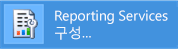
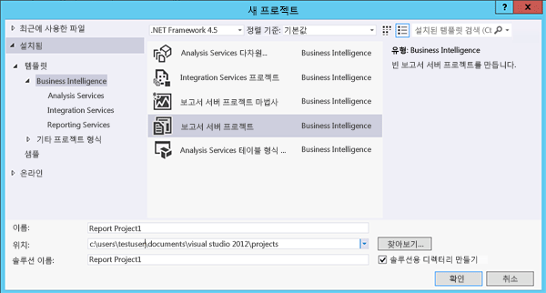

# 자습서: Reporting Services 도구를 찾고 시작하는 방법

  이 자습서에서는 보고서 서버를 구성하고, 보고서 서버 콘텐츠 및 작업을 관리하고, 페이지를 매긴 보고서 및 모바일 [!INCLUDE[ssRSnoversion](../../includes/ssrsnoversion-md.md)] 보고서를 만들어 게시하는 데 사용되는 도구를 소개합니다. 도구 사용법을 이미 잘 알고 있다면 [!INCLUDE[ssRSnoversion](../../includes/ssrsnoversion-md.md)]사용을 위한 기술을 배울 수 있는 다른 자습서로 이동할 수 있습니다. 다른 자습서는 [Reporting Services&#40;SSRS&#41; 자습서](../../reporting-services/reporting-services-tutorials-ssrs.md)사용을 위한 기술을 배울 수 있는 다른 자습서로 이동할 수 있습니다.  
  
  
##   Reporting Services 구성 관리자(기본 모드)  
 기본 모드 구성 관리자를 사용하여 다음 작업을 완료합니다.  
  
-   서비스 계정을 지정합니다.  
-   보고서 서버 데이터베이스를 만들거나 업그레이드합니다.  
-   연결 속성을 수정합니다.  
-   URL을 지정합니다.  
-   암호화 키를 관리합니다.  
-   무인 보고서 처리 및 전자 메일 보고서 배달을 구성합니다.  
  
 **설치:** [!INCLUDE[ssRSnoversion](../../includes/ssrsnoversion-md.md)] 구성 관리자는 [!INCLUDE[ssRSnoversion](../../includes/ssrsnoversion-md.md)] 기본 모드를 설치할 때 함께 설치됩니다. 자세한 내용은 [Reporting Services 기본 모드 보고서 서버 설치](assetid:///8f25e6dc-b753-400e-9e9a-50f4f35bf6c4)를 참조하세요.  
  
### Reporting Services 구성 관리자를 시작하려면  
  
1.  Windows 시작 화면에서 **reporting** 을 입력하고 **앱** 검색 결과에서 **Reporting Services 구성 관리자**를 클릭합니다.  
  
       
  
     **Or**  
  
     **시작**, **프로그램**, [!INCLUDE[ssCurrentUI](../../includes/sscurrentui-md.md)], **구성 도구**를 차례로 클릭한 다음 **Reporting Services 구성 관리자**를 클릭합니다.  
  
     구성할 보고서 서버 인스턴스를 선택할 수 있도록 **보고서 서버 설치 인스턴스 선택** 대화 상자가 나타납니다.  
  
2.  **서버 이름**에 보고서 서버 인스턴스가 설치된 컴퓨터의 이름을 지정합니다. 기본적으로 로컬 컴퓨터의 이름이 지정되지만 원격 [!INCLUDE[ssNoVersion](../../includes/ssnoversion-md.md)] 인스턴스의 이름을 입력할 수도 있습니다.  
  
     원격 컴퓨터를 지정하는 경우 **찾기** 를 클릭하여 연결을 설정합니다. 미리 보고서 서버를 원격 관리용으로 구성해야 합니다. 자세한 내용은 [원격 관리를 위한 보고서 서버 구성](../../reporting-services/report-server/configure-a-report-server-for-remote-administration.md)을 참조하세요.  
  
3.  **stance Name**에서 구성할 [!INCLUDE[ssNoVersion](../../includes/ssnoversion-md.md)] [!INCLUDE[ssRSnoversion](../../includes/ssrsnoversion-md.md)] 인스턴스를 선택합니다. SQL Server 2008 이상 보고서 서버 인스턴스만 목록에 표시됩니다. 이전 버전의 [!INCLUDE[ssRSnoversion](../../includes/ssrsnoversion-md.md)]는 구성할 수 없습니다.  
  
4.  **연결**을 클릭합니다.  
  
5.  도구가 시작되었는지 확인하려면 결과를 다음 이미지와 비교합니다.  
  
       
  
 **다음 단계:** [보고서 서버 구성 및 관리&#40;SSRS 기본 모드&#41;](../../reporting-services/report-server/configure-and-administer-a-report-server-ssrs-native-mode.md) 및 [Reporting Services 구성 관리자&#40;기본 모드&#41;](../../reporting-services/install-windows/reporting-services-configuration-manager-native-mode.md)  
  
##  웹 포털(기본 모드)  
 [Web portal (SSRS Native Mode)](../../reporting-services/web-portal-ssrs-native-mode.md) 을 사용하여 권한 설정, 구독 및 일정 관리, 보고서 작업을 수행할 수 있습니다. 또한 웹 포털을 사용하여 보고서를 볼 수 있습니다.  
  
 **설치:** 웹 포털은 [!INCLUDE[ssRSnoversion](../../includes/ssrsnoversion-md.md)] 기본 모드( [Reporting Services 기본 모드 보고서 서버 설치](assetid:///8f25e6dc-b753-400e-9e9a-50f4f35bf6c4)  
  
 웹 포털을 열려면 먼저 충분한 권한이 있어야 합니다. 처음에는 로컬 관리자 그룹의 멤버만 웹 포털 기능에 액세스할 수 있습니다. 웹 포털은 현재 사용자의 역할 할당에 따라 다양한 페이지와 옵션을 제공합니다. 사용 권한이 없는 사용자에게는 빈 페이지가 나타납니다. 보고서를 볼 권한이 있는 사용자에게는 클릭하여 보고서를 열 수 있는 링크가 나타납니다. 권한에 대한 자세한 내용은 [역할 및 권한&#40;Reporting Services&#41;](../../reporting-services/security/roles-and-permissions-reporting-services.md)를 참조하세요.  
  
### 웹 포털을 시작하려면  
  
1.  브라우저를 엽니다. 지원되는 브라우저 및 브라우저 버전에 대한 자세한 내용은 [Reporting Services 및 파워 뷰에 대한 브라우저 지원](../../reporting-services/browser-support-for-reporting-services-and-power-view.md)을 참조하세요.  
  
2.  웹 브라우저의 주소 표시줄에 웹 포털 URL을 입력합니다. 기본적으로 이 URL은 `http://<serverName>/reports`사용을 위한 기술을 배울 수 있는 다른 자습서로 이동할 수 있습니다. Reporting Services 구성 도구를 사용하여 서버 이름과 URL을 확인할 수 있습니다. [!INCLUDE[ssRSnoversion](../../includes/ssrsnoversion-md.md)]에서 사용되는 URL에 대한 자세한 내용은 [보고서 서버 URL 구성&#40;SSRS 구성 관리자&#41;](../../reporting-services/install-windows/configure-report-server-urls-ssrs-configuration-manager.md)를 참조하세요.  
  
3.  웹 포털이 브라우저 창에서 열립니다. 시작 페이지는 홈 폴더입니다. 사용 권한에 따라 추가 폴더, 보고서에 대한 하이퍼링크 및 시작 페이지 내의 리소스 파일을 볼 수 있습니다. 또한 도구 모음에서 추가적인 단추와 명령을 볼 수 있습니다.  
  
4.  로컬 보고서 서버에서 웹 포털을 실행하는 경우 [로컬 관리에 대해 기본 모드 보고서 서버 구성&#40;SSRS&#41;](../../reporting-services/report-server/configure-a-native-mode-report-server-for-local-administration-ssrs.md)을 참조하세요.  
   
##   Management Studio  
 보고서 서버 관리자는 [!INCLUDE[ssManStudio](../../includes/ssmanstudio-md.md)] 를 사용하여 다른 [!INCLUDE[ssNoVersion](../../includes/ssnoversion-md.md)] 구성 요소 서버와 함께 보고서 서버를 관리할 수 있습니다. 자세한 내용은 [Use SQL Server Management Studio](http://msdn.microsoft.com/library/f289e978-14ca-46ef-9e61-e1fe5fd593be)을 참조하세요.  
  
### SQL Server Management Studio를 시작하려면  
  
1.  Windows 시작 화면에서 **sql server** 를 입력한 다음 **앱** 검색 결과에서 **SQL Server Management Studio**를 클릭합니다.  
  
       
  
     **Or**  
  
     **시작**, **모든 프로그램**, [!INCLUDE[ssCurrentUI](../../includes/sscurrentui-md.md)]를 차례로 클릭한 후 **SQL Server Management Studio**를 클릭합니다. **서버에 연결** 대화 상자가 표시됩니다.  
  
2.  **서버에 연결** 대화 상자가 표시되지 않는 경우 **개체 탐색기**에서 **연결** 을 클릭한 다음 **Reporting Services**를 클릭합니다.  
  
3.  **서버 유형** 목록에서 **Reporting Services**를 선택합니다. [!INCLUDE[ssRSnoversion](../../includes/ssrsnoversion-md.md)] 가 목록에 없다면 설치되지 않은 것입니다.  
  
4.  **서버 이름** 목록에서 보고서 서버 인스턴스를 선택합니다. 목록에 로컬 인스턴스가 표시됩니다. 원격 [!INCLUDE[ssNoVersion](../../includes/ssnoversion-md.md)] 인스턴스의 이름을 입력할 수도 있습니다.  
  
5.  **연결**을 클릭합니다. 루트 노드를 확장하여 서버 속성을 설정하거나 역할 정의를 수정하거나 보고서 서버 기능을 해제할 수 있습니다.  
  
##   보고서 디자이너 및 보고서 마법사가 포함된 SQL Server Data Tools  
 보고서 디자이너 및 [!INCLUDE[ssNoVersion](../../includes/ssnoversion-md.md)] 고서 작성기 [의 두 가지 도구 중에서 선택하여 페이지를 매긴](#bkmk_report_builder)보고서를 만들 수 있습니다.  
  
 보고서 디자이너는 [!INCLUDE[ssBIDevStudioFull](../../includes/ssbidevstudiofull-md.md)] -Visual Studio에서 제공됩니다. 보고서 디자이너의 디자인 화면에는 보고서 제작 기능에 액세스하는 데 사용되는 탭 창, 마법사 및 메뉴가 있습니다. [!INCLUDE[ssBIDevStudioFull](../../includes/ssbidevstudiofull-md.md)]에서 보고서 서버 프로젝트 또는 보고서 서버 마법사 템플릿을 선택하면 보고서 디자이너 도구를 사용할 수 있습니다. 자세한 내용은 [SQL Server Data Tools의 Reporting Services&#40;SSDT&#41;](../../reporting-services/tools/reporting-services-in-sql-server-data-tools-ssdt.md)를 참조하세요. 
 
[SQL Server Data Tools](http://go.microsoft.com/fwlink/?LinkID=616714)를 다운로드합니다.  
  
### 보고서 디자이너를 시작하려면  
  
1.  **SQL Server Data Tools**를 엽니다.  
  
2.  **파일** 메뉴에서 **새로 만들기**를 가리킨 다음 **프로젝트**를 클릭합니다.  
  
3.  **프로젝트 형식** 목록에서 **비즈니스 인텔리전스 프로젝트**를 클릭합니다.  
  
4.  **템플릿** 목록에서 **보고서 서버 프로젝트**를 클릭합니다. 다음 다이어그램에서는 프로젝트 템플릿이 대화 상자에 표시되는 방법을 보여 줍니다.  
  
       
  
5.  프로젝트의 이름과 위치를 입력하거나 **찾아보기** 를 클릭하여 위치를 선택합니다.  
  
6.  [!INCLUDE[clickOK](../../includes/clickok-md.md)] [!INCLUDE[ssBIDevStudioFull](../../includes/ssbidevstudiofull-md.md)][!INCLUDE[vsprvs](../../includes/vsprvs-md.md)] 시작 페이지와 함께 열립니다. 솔루션 탐색기는 보고서 및 데이터 원본을 만드는 범주를 제공합니다. 이러한 범주를 사용하여 새 보고서 및 데이터 원본을 만들 수 있습니다. 보고서 정의를 만들면 탭 창이 표시됩니다. 탭 창은 데이터, 레이아웃 및 미리 보기입니다.  
  
 첫 번째 보고서를 시작하려면 [기본 테이블 보고서 만들기&#40;SSRS 자습서&#41;](../../reporting-services/create-a-basic-table-report-ssrs-tutorial.md)를 참조하세요. 보고서 디자이너에서 사용할 수 있는 쿼리 디자이너에 대한 자세한 내용은 [쿼리 디자인 도구&#40;SSRS&#41;](../../reporting-services/report-data/query-design-tools-ssrs.md)사용을 위한 기술을 배울 수 있는 다른 자습서로 이동할 수 있습니다.  
  
##   [!INCLUDE[ssRBnoversion](../../includes/ssrbnoversion.md)]  
 [SQL Server 2016의 보고서 작성기](../../reporting-services/report-builder/report-builder-in-sql-server-2016.md) 는 [!INCLUDE[ssNoVersion](../../includes/ssnoversion-md.md)]외부에서 페이지를 매긴 보고서를 만드는 데 사용할 수 있는 독립 실행형 응용 프로그램입니다. 보고서를 보고서 디자이너에서 만들었는지 아니면 이전 버전의 [!INCLUDE[ssRBnoversion](../../includes/ssrbnoversion.md)]에서 만들었는지에 상관없이 모든 기존 보고서를 사용자 지정하고 업데이트할 수 있습니다. [!INCLUDE[ssNoVersion](../../includes/ssnoversion-md.md)] 웹 포털 또는 Microsoft 다운로드 센터에서 보고서 작성기를 다운로드할 수 있습니다.  
  
 Microsoft 다운로드 센터에서[보고서 작성기를 다운로드](http://go.microsoft.com/fwlink/?LinkID=219138) 하세요.  
  
### 시작하려면 [!INCLUDE[ssRBnoversion](../../includes/ssrbnoversion.md)]  
  
1.  [!INCLUDE[ssNoVersion](../../includes/ssnoversion-md.md)] 웹 포털의  **새로 만들기** 메뉴에서 **페이지를 매긴 보고서**를 선택합니다.  
  
       
  
2.  이 컴퓨터에 [!INCLUDE[ssRBnoversion](../../includes/ssrbnoversion.md)]를 아직 설치하지 않은 경우 **[!INCLUDE[ssRBnoversion](../../includes/ssrbnoversion.md)] 가져오기**를 선택합니다.  
  
     또는  
  
     Microsoft 다운로드 센터에서[보고서 작성기를 다운로드](http://go.microsoft.com/fwlink/?LinkID=219138) 하세요.  
  
3.  [!INCLUDE[ssRBnoversion](../../includes/ssrbnoversion.md)] 가 열립니다. 이제 페이지를 매긴 보고서를 만들거나 열 수 있습니다.  
  
##   [!INCLUDE[SS_MobileReptPub_Long](../../includes/ss-mobilereptpub-long.md)]  
 [SQL Server Mobile 보고서 게시자](http://msdn.microsoft.com/library/e23cf095-cb9a-4631-ab46-10413d8e3a7c) 를 사용하여 [!INCLUDE[ssNoVersion](../../includes/ssnoversion-md.md)] 웹 포털 및 iPad, iPhone 등의 모바일 장치에서 볼 수 있는 모바일 보고서를 만듭니다.   [!INCLUDE[ssNoVersion](../../includes/ssnoversion-md.md)] 웹 포털 또는 Microsoft 다운로드 센터에서 모바일 보고서 게시자를 다운로드할 수 있습니다.  
  
 Microsoft 다운로드 센터에서[SQL Server 모바일 보고서 게시자를 다운로드](http://go.microsoft.com/fwlink/?LinkID=733527) 하세요.  
  
### 시작하려면 [!INCLUDE[SS_MobileReptPub_Short](../../includes/ss-mobilereptpub-short.md)]  
  
1.  [!INCLUDE[ssNoVersion](../../includes/ssnoversion-md.md)] 웹 포털의  **새로 만들기** 메뉴에서 **모바일 보고서**를 선택합니다.  
  
       
  
2.  이 컴퓨터에 [!INCLUDE[SS_MobileReptPub_Short](../../includes/ss-mobilereptpub-short.md)]를 아직 설치하지 않은 경우 **[!INCLUDE[SS_MobileReptPub_Short](../../includes/ss-mobilereptpub-short.md)] 가져오기**를 선택합니다.  
  
     또는  
  
     Microsoft 다운로드 센터에서[SQL Server 모바일 보고서 게시자를 다운로드](http://go.microsoft.com/fwlink/?LinkID=733527) 하세요.  
  
3.  [!INCLUDE[SS_MobileReptPub_Short](../../includes/ss-mobilereptpub-short.md)] 가 열립니다. 이제 모바일 보고서를 만들거나 열 수 있습니다.  

## 다음 단계

[SQL Server 모바일 보고서 게시자를 다운로드](http://go.microsoft.com/fwlink/?LinkID=733527)   
[보고서 작성기를 다운로드](http://go.microsoft.com/fwlink/?LinkID=219138)  
[SQL Server Data Tools 다운로드](http://go.microsoft.com/fwlink/?LinkID=616714) 
[Reporting Services SharePoint 모드 설치](../../reporting-services/install-windows/install-reporting-services-sharepoint-mode.md)   
[Reporting Services 보고서 서버](../../reporting-services/report-server-sharepoint/reporting-services-report-server.md)   
[쿼리 디자인 도구](../../reporting-services/report-data/query-design-tools-ssrs.md)   
[Reporting Services 자습서](../../reporting-services/reporting-services-tutorials-ssrs.md)  

추가 질문이 있으신가요? [Reporting Services 포럼에서 질문하기](http://go.microsoft.com/fwlink/?LinkId=620231)
