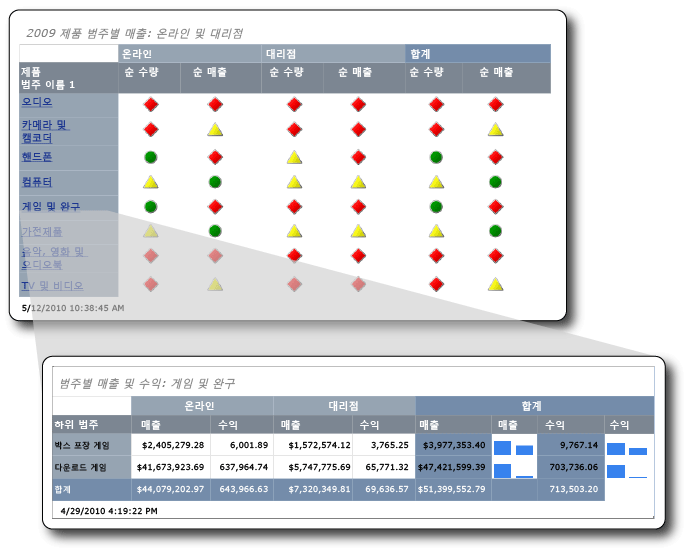

# <a name="tutorial-creating-drillthrough-and-main-reports-report-builder"></a>자습서: 드릴스루 보고서 및 주 보고서 만들기(보고서 작성기)
이 자습서에서는 두 종류의 페이지가 매겨진 [!INCLUDE[ssRSnoversion_md](../includes/ssrsnoversion-md.md)] 보고서인 드릴스루 보고서와 주 보고서를 만드는 방법을 알아봅니다. 이러한 보고서에서 사용되는 샘플 판매 데이터는 Analysis Services 큐브에서 검색됩니다. 

다음 그림에서는 만들려는 보고서 및 주 보고서의 필드 값인 Games and Toys가 드릴스루 보고서의 제목에 표시되는 방식을 보여 줍니다. 드릴스루 보고서의 데이터는 Games and Toys 제품 범주에 속합니다.  
  
  
   
이 자습서에 소요되는 예상 시간: 30분  
  
## <a name="requirements"></a>요구 사항  
이 자습서를 실행하려면 드릴스루 보고서 및 주 보고서 둘 다에서 Contoso Sales 큐브에 액세스할 수 있어야 합니다. 이 데이터 집합은 ContosoDW 데이터 웨어하우스와 Contoso_Retail OLAP(온라인 분석 처리) 데이터베이스로 구성되어 있습니다. 이 자습서에서 만들 보고서는 Contoso Sales 큐브에서 보고서 데이터를 검색합니다. Contoso_Retail OLAP 데이터베이스는 [Microsoft 다운로드 센터](https://go.microsoft.com/fwlink/?LinkID=191575)에서 다운로드할 수 있습니다. ContosoBIdemoABF.exe 파일만 다운로드하면 됩니다. 이 파일에 OLAP 데이터베이스가 포함되어 있습니다.  
  
다른 파일인 ContosoBIdemoBAK.exe는 ContosoDW 데이터 웨어하우스를 위한 것으로, 이 자습서에서는 사용되지 않습니다.  
  
ContosoRetail.abf 백업 파일을 추출하여 Contoso_Retail OLAP 데이터베이스로 복원하기 위한 지침은 이 웹 사이트에 포함되어 있습니다.  

사용자는 OLAP 데이터베이스를 설치할 [!INCLUDE[ssASnoversion](../includes/ssasnoversion-md.md)] 인스턴스에 액세스할 수 있어야 합니다.  
    
일반적인 요구 사항에 대한 자세한 내용은 [자습서의 필수 조건&#40;보고서 작성기&#41;](../reporting-services/prerequisites-for-tutorials-report-builder.md)을 참조하세요.  
  
## <a name="DMatrixAndDataset"></a>1. 테이블 또는 행렬 마법사에서 드릴스루 보고서 만들기  
시작 대화 상자에서 **테이블 또는 행렬 마법사**를 사용하여 행렬 보고서를 만듭니다. 마법사에서는 두 가지 모드인 보고서 디자인 모드와 공유 데이터 집합 디자인 모드를 사용할 수 있습니다. 이 자습서에서는 보고서 디자인 모드를 사용합니다.  
  
#### <a name="to-create-a-new-report"></a>새 보고서를 만들려면  
  
1.  컴퓨터,[웹 포털 또는 SharePoint 통합 모드에서](../reporting-services/report-builder/start-report-builder.md) 보고서 작성기를 시작 [!INCLUDE[ssRSnoversion_md](../includes/ssrsnoversion-md.md)] 합니다.  
  
    **새 보고서 또는 데이터 집합** 대화 상자가 열립니다.  
  
    **새 보고서 또는 데이터 집합** 대화 상자가 표시되지 않는 경우 **파일** 메뉴 > **새로 만들기**를 클릭합니다.  
  
2.  왼쪽 창에 **새 보고서** 가 선택되어 있는지 확인합니다.  
  
3.  오른쪽 창에서 **테이블 또는 행렬 마법사** 가 선택되어 있는지 확인합니다.  
  
## <a name="DConnection"></a>1a. 데이터 연결 지정  
데이터 연결은 Analysis Services 큐브 또는 [!INCLUDE[ssNoVersion](../includes/ssnoversion-md.md)] 데이터베이스와 같은 외부 데이터 원본에 연결하는 데 필요한 정보를 포함합니다. 데이터 연결을 지정하기 위해 보고서 서버의 공유 데이터 원본을 사용하거나 이 보고서에만 사용되는 포함된 데이터 원본을 만들 수 있습니다. 이 자습서에서는 포함된 데이터 원본을 사용합니다. 공유 데이터 원본 사용 방법에 대한 자세한 내용은 [데이터에 연결하는 다른 방법&#40;보고서 작성기&#41;](../reporting-services/alternative-ways-to-get-a-data-connection-report-builder.md)를 참조하세요.  
  
#### <a name="to-create-an-embedded-data-source"></a>포함된 데이터 원본을 만들려면  
  
1.  **데이터 집합 선택** 페이지에서 **데이터 집합 만들기**를 선택하고 **다음**을 클릭합니다. **데이터 원본에 대한 연결 선택** 페이지가 열립니다.  
  
2.  **새로 만들기**를 클릭합니다. **데이터 원본 속성** 대화 상자가 열립니다.  
  
3.  **이름**에 데이터 원본 이름으로 **Online and Reseller Sales Detail** 을 입력합니다.  
  
4.  **연결 형식 선택**에서 **Microsoft SQL Server Analysis Services**를 선택한 다음 **빌드**를 클릭합니다.  
  
5.  **데이터 원본**에서 데이터 원본이 **Microsoft SQL Server Analysis Services(AdomdClient)** 인지 확인합니다.  
  
6.  **서버 이름**에 Analysis Services 인스턴스가 설치된 서버의 이름을 입력합니다.  
  
7.  **데이터베이스 이름 선택 또는 입력**에서 Contoso 큐브를 선택합니다.  
  
8.  [!INCLUDE[clickOK](../includes/clickok-md.md)]  
  
9. **연결 문자열** 에 다음 구문이 포함되어 있는지 확인합니다.  
  
    ```  
    Data Source=<servername>; Initial Catalog = Contoso  
    ```  
  
    `<servername>` 은 Analysis Services가 설치된 [!INCLUDE[ssNoVersion](../includes/ssnoversion-md.md)] 인스턴스의 이름입니다.  
  
10. **자격 증명 유형**을 클릭합니다.  
  
    > [!NOTE]  
    > 데이터 원본에서 사용 권한이 구성된 방법에 따라 기본 인증 옵션을 변경해야 할 수 있습니다. 자세한 내용은 [보안&#40;보고서 작성기&#41;](../reporting-services/report-builder/security-report-builder.md)에서 만드는 모바일 보고서에서 보고서 매개 변수를 사용할 수 있습니다.  
  
11. [!INCLUDE[clickOK](../includes/clickok-md.md)]  
  
    **데이터 원본에 대한 연결 선택** 페이지가 나타납니다.  
  
12. 데이터 원본에 연결할 수 있는지 확인하려면 **연결 테스트**를 클릭합니다.  
  
    **연결되었습니다.** 라는 메시지가 나타납니다.  
  
13. [!INCLUDE[clickOK](../includes/clickok-md.md)]  
  
14. **다음**을 클릭합니다.  
  
## <a name="DMDXQuery"></a>1b. MDX 쿼리 만들기  
보고서에서는 미리 정의된 쿼리가 포함된 공유 데이터 집합을 사용하거나 해당 보고서에만 사용할 포함된 데이터 집합을 만들 수 있습니다. 이 자습서에서는 포함된 데이터 집합을 만듭니다.  
  
#### <a name="to-create-query-filters"></a>쿼리 필터를 만들려면  
  
1.  **쿼리 디자인** 페이지의 메타데이터 창에서 **(…)** 단추를 클릭합니다.  
  
2.  **큐브 선택** 대화 상자에서 Sales를 클릭한 다음 **확인**을 클릭합니다.  
  
    > [!TIP]  
    > MDX 쿼리를 수동으로 작성하지 않을 경우  아이콘을 클릭하고, 쿼리 디자이너를 쿼리 모드로 토글하고, 완료된 MDX를 쿼리 디자이너로 붙여 넣은 다음, [데이터 집합을 만들려면](#DSkip)의 6단계를 진행합니다.  
  
    ```  
    SELECT NON EMPTY { [Measures].[Sales Amount], [Measures].[Sales Return Amount] } ON COLUMNS, NON EMPTY { ([Channel].[Channel Name].[Channel Name].ALLMEMBERS * [Product].[Product Category Name].[Product Category Name].ALLMEMBERS * [Product].[Product Subcategory Name].[Product Subcategory Name].ALLMEMBERS ) } DIMENSION PROPERTIES MEMBER_CAPTION, MEMBER_UNIQUE_NAME ON ROWS FROM ( SELECT ( { [Date].[Calendar Year].&[2009] } ) ON COLUMNS FROM ( SELECT ( { [Sales Territory].[Sales Territory Group].&[North America] } ) ON COLUMNS FROM ( SELECT ( STRTOSET(\@ProductProductCategoryName, CONSTRAINED) ) ON COLUMNS FROM ( SELECT ( { [Channel].[Channel Name].&[2], [Channel].[Channel Name].&[4] } ) ON COLUMNS FROM [Sales])))) WHERE ( [Sales Territory].[Sales Territory Group].&[North America], [Date].[Calendar Year].&[2009] ) CELL PROPERTIES VALUE, BACK_COLOR, FORE_COLOR, FORMATTED_VALUE, FORMAT_STRING, FONT_NAME, FONT_SIZE, FONT_FLAGS  
    ```  
  
3.  측정값 그룹 창에서 Channel을 확장한 다음 Channel Name을 필터 창의 **계층** 열로 끕니다.  
  
    Channel이라는 차원 이름이 자동으로 **차원** 열에 추가됩니다. **차원** 또는 **연산자** 열을 변경하지 마세요.  
  
4.  **필터 식** 목록을 열려면 **필터 식** 열의 아래쪽 화살표를 클릭합니다.  
  
5.  필터 식 목록에서 **All Channel**을 확장하고, **Online**, **Reseller**를 차례로 클릭한 다음 **확인**을 클릭합니다.  
  
    이제 쿼리에는 온라인과 대리점 채널만 포함할 필터가 제공됩니다.  
  
6.  Sales Territory 차원을 확장한 다음 Sales Territory Group을 **Channel Name** 아래에 있는 **계층**열로 끕니다.  
  
7.  **필터 식** 목록을 열고 **All Sales Territory**를 확장한 다음 **North America**, **확인**을 차례로 클릭합니다.  
  
    이제 쿼리에는 북미의 판매만 포함할 필터가 제공됩니다.  
  
8.  측정값 그룹 창에서 Date를 확장한 다음 Calendar Year를 필터 창의 **계층** 열로 끕니다.  
  
    Date라는 차원 이름이 자동으로 **차원** 열에 추가됩니다. **차원** 또는 **연산자** 열을 변경하지 마세요.  
  
9. **필터 식** 목록을 열려면 **필터 식** 열의 아래쪽 화살표를 클릭합니다.  
  
10. 필터 식 목록에서 **All Date**를 확장하고, **Year 2009**를 클릭한 다음 **확인**을 클릭합니다.  
  
    이제 쿼리에는 2009년만 포함할 필터가 제공됩니다.  
  
#### <a name="to-create-the-parameter"></a>매개 변수를 만들려면  
  
1.  Product 차원을 확장한 다음 Product Category Name 멤버를 **Calendar Year** 아래의 **계층**열로 끕니다.  
  
2.  **필터 식** 목록에서 **All Products**를 클릭한 다음 **확인**을 클릭합니다.  
  
3.  **매개 변수** 확인란을 클릭합니다. 쿼리에는 이제 ProductProductCategoryName 매개 변수가 제공됩니다.  
  
    > [!NOTE]  
    > 매개 변수에는 제품 범주의 이름이 포함됩니다. 주 보고서에서 제품 범주 이름을 클릭하면 해당 이름이 이 매개 변수를 사용하여 드릴스루 보고서로 전달됩니다.  
  
### <a name="DSkip"></a>데이터 집합을 만들려면  
  
1.  Channel 차원에서 Channel Name을 데이터 창으로 끕니다.  
  
2.  Product 차원에서 Product Category Name을 데이터 창으로 끌어 Channel Name의 오른쪽에 놓습니다.  
  
3.  Product 차원에서 Product Subcategory Name을 데이터 창으로 끌어 Product Category Name의 오른쪽에 놓습니다.  
  
4.  메타데이터 창에서 **측정값**을 확장한 다음 Sales를 확장합니다.  
  
5.  Sales Amount 측정값을 데이터 창으로 끌어 Product Subcategory Name의 오른쪽에 놓습니다.  
  
6.  쿼리 디자이너 도구 모음에서 **실행(!)** 을 클릭합니다.  
  
7.  **다음**을 클릭합니다.  
  
## <a name="DLayout"></a>1c. 데이터를 그룹으로 구성  
데이터를 그룹화할 필드를 선택할 때 세부 데이터와 집계 데이터가 표시되는 행과 열이 포함된 행렬을 디자인합니다.  
  
#### <a name="to-organize-data-into-groups"></a>데이터를 그룹으로 구성하려면  
  
1.  디자인 뷰로 전환하려면 **디자인**을 클릭합니다.  
  
2.  **필드 정렬** 페이지에서 Product_Subcategory_Name을 **행 그룹**으로 끌어옵니다.  
  
    > [!NOTE]  
    > 이름의 공백이 밑줄(_)로 바뀝니다. 예를 들어 Product Category Name이 Product_Category_Name이 됩니다.  
  
3.  Channel_Name을 **열 그룹**으로 끌어옵니다.  
  
4.  Sales_Amount를 **값**으로 끌어옵니다.  
  
    Sales_Amount는 숫자 필드에 대한 기본 집계 함수인 Sum 함수를 통해 자동으로 집계됩니다. 값이 `[Sum(Sales_Amount)]`입니다.  
  
    사용 가능한 다른 집계 함수를 보려면 집계 함수를 변경하지 않고 드롭다운 목록을 엽니다.  
  
5.  Sales_Return_Amount를 **값**으로 끌어 `[Sum(Sales_Amount)]`아래에 놓습니다.  
  
    4 ~ 5단계에서는 행렬에 표시할 데이터를 지정했습니다.  
  
6.  **다음**을 클릭합니다.  
  
## <a name="DTotals"></a>1d. 부분합 및 합계 추가  
그룹을 만든 후 필드에 대한 집계 값을 표시할 행을 추가하고 행 서식을 지정할 수 있습니다. 또한 모든 데이터를 표시할지 또는 사용자가 그룹화된 데이터를 대화형으로 확장하거나 축소할 수 있도록 할지 여부를 선택할 수 있습니다.  
  
#### <a name="to-add-subtotals-and-totals"></a>부분합 및 합계를 추가하려면  
  
1.  **레이아웃 선택** 페이지의 **옵션**에서 **부분합 및 총합계 표시** 가 선택되어 있는지 확인합니다.  
  
    마법사 미리 보기 창에 4개의 행이 있는 행렬이 표시됩니다.  
  
2.  **다음**을 클릭합니다.  
  
2.  **마침**을 클릭합니다.  
  
    디자인 화면에 테이블이 추가됩니다.  
  
3.  보고서를 미리 보려면 **실행(!)** 을 클릭합니다.  
  
## <a name="DFormat"></a>2. 데이터 형식을 통화로 지정  
드릴스루 보고서의 판매량 필드에 통화 서식을 적용합니다.  
  
#### <a name="to-format-data-as-currency"></a>데이터 서식을 통화로 지정하려면  
  
1.  디자인 뷰로 전환하려면 **디자인**을 클릭합니다.  
  
2.  한 번에 여러 셀을 선택하고 서식 지정하려면 Ctrl 키를 누른 다음 숫자 판매 데이터가 들어 있는 셀을 선택합니다.  
  
3.  **홈** 탭의 **숫자** 그룹에서 **통화**를 클릭합니다.  
  
## <a name="DSparkline"></a>3. 스파크라인에 판매 값을 표시하는 열 추가  
보고서는 판매량 및 판매 수익을 통화 값으로 표시하는 대신 스파크라인에서 값을 표시합니다.  
  
#### <a name="to-add-sparklines-to-columns"></a>열에 스파크라인을 추가하려면  
  
1.  디자인 뷰로 전환하려면 **디자인**을 클릭합니다.  
  
2.  행렬의 Total 그룹에서 **Sales Amount** 열을 마우스 오른쪽 단추로 클릭하고 **열 삽입**을 클릭한 다음 **오른쪽**을 클릭합니다.  
  
    **Sales Amount**의 오른쪽에 빈 열이 추가됩니다.  
  
3.  리본에서 **사각형**을 클릭한 다음 [Product_Subcategory] 행 그룹의 `[Sum(Sales_Amount)]` 셀 오른쪽에 있는 빈 셀을 클릭합니다.  
  
4.  리본에서 **스파크라인** 아이콘을 클릭한 다음 사각형이 추가된 셀을 클릭합니다.  
  
5.  **스파크라인 유형 선택** 대화 상자에서 **열** 유형이 선택되어 있는지 확인합니다.  
  
6.  [!INCLUDE[clickOK](../includes/clickok-md.md)]  
  
7.  스파크라인을 마우스 오른쪽 단추로 클릭합니다.  
  
8.  차트 데이터 창에서 **필드 추가** 아이콘을 클릭한 다음 Sales_Amount를 클릭합니다.  
  
9. `Sales_Return_Amount` 열을 마우스 오른쪽 단추로 클릭한 다음 이 열의 오른쪽에 열을 추가합니다.  
  
10. 2 ~ 6단계를 반복합니다.  
  
11. 스파크라인을 마우스 오른쪽 단추로 클릭합니다.  
  
12. 차트 데이터 창에서 **필드 추가** 아이콘을 클릭한 다음 Sales_Return_Amount를 클릭합니다.  
  
13. 보고서를 미리 보려면 **실행**을 클릭합니다.  
  
## <a name="DReportTitle"></a>4. 제품 범주 이름의 보고서 제목 추가  
보고서 제목은 보고서 맨 위에 나타납니다. 보고서 제목을 보고서 머리글에 배치하거나, 보고서 머리글이 사용되지 않을 경우 보고서 본문의 맨 위에 있는 입력란에 배치할 수 있습니다. 이 자습서에서는 보고서 본문의 맨 위에 자동으로 표시되는 입력란을 사용합니다.  
  
#### <a name="to-add-a-report-title"></a>보고서 제목을 추가하려면  
  
1.  디자인 뷰로 전환하려면 **디자인**을 클릭합니다.  
  
2.  디자인 화면에서 **제목을 추가하려면 클릭하십시오.** 를 클릭합니다.  
  
3.  **Sales and Returns for Category:** 를 입력합니다.  
  
4.  마우스 오른쪽 단추를 클릭한 다음 **자리 표시자 만들기**를 클릭합니다.  
  
5.  **값** 목록의 오른쪽에 있는 **(fx)** 단추를 클릭합니다.  
  
6.  **식** 대화 상자의 범주 창에서 **데이터 집합**을 클릭한 다음 **값** 목록에서 `First(Product_Category_Name)`를 두 번 클릭합니다.  
  
    **식** 입력란에 다음 식이 포함됩니다.  
  
    ```  
    =First(Fields!Product_Category_Name.Value, "DataSet1")  
    ```  
  
7.  보고서를 미리 보려면 **실행**을 클릭합니다.  
  
보고서 제목에 첫 번째 제품 범주의 이름이 포함됩니다. 나중에 이 보고서를 드릴스루 보고서로 실행하면 제품 범주 이름이 주 보고서에서 클릭된 제품 범주의 이름을 반영하도록 동적으로 변경됩니다.  
  
## <a name="DParameter"></a>5. 매개 변수 속성 업데이트  
기본적으로 매개 변수가 표시되는데 이는 이 보고서의 경우 적합하지 않습니다. 따라서 드릴스루 보고서에 대한 매개 변수 속성을 업데이트할 것입니다.  
  
#### <a name="to-hide-a-parameter"></a>매개 변수를 숨기려면  
  
1.  보고서 데이터 창에서 **매개 변수**를 확장합니다.  
  
2.  \@ProductProductCategoryName을 마우스 오른쪽 단추로 클릭한 다음 **매개 변수 속성**을 클릭합니다.  
  
    > [!NOTE]  
    > 이름 옆에 있는 \@ 문자는 이것이 매개 변수임을 나타냅니다.  
  
3.  **일반** 탭에서 **숨김**을 클릭합니다.  
  
4.  **프롬프트** 상자에 **Product Category**를 입력합니다.  
  
    > [!NOTE]  
    > 매개 변수가 숨겨져 있기 때문이 이 프롬프트는 사용되지 않습니다.  
  
5.  필요에 따라 **사용 가능한 값** 및 **기본값** 을 클릭하고 해당 옵션을 검토합니다. 이러한 탭에 대한 어떤 옵션도 변경하지 마십시오.  
  
6.  [!INCLUDE[clickOK](../includes/clickok-md.md)]  
  
## <a name="DSave"></a>6. SharePoint 라이브러리에 보고서 저장  
보고서를 SharePoint 라이브러리, 보고서 서버 또는 컴퓨터에 저장할 수 있습니다. 보고서를 컴퓨터에 저장하면 보고서 파트 및 하위 보고서와 같은 여러 [!INCLUDE[ssRSnoversion](../includes/ssrsnoversion-md.md)] 기능을 사용할 수 없습니다. 이 자습서에서는 이 보고서를 SharePoint 라이브러리에 저장합니다.  
  
#### <a name="to-save-the-report"></a>보고서를 저장하려면  
  
1.  보고서 작성기 단추에서 **저장**을 클릭합니다. **보고서로 저장** 대화 상자가 열립니다.  
  
    > [!NOTE]  
    > 보고서를 다시 저장하는 경우 보고서가 이전 위치에 자동으로 다시 저장됩니다. 위치를 변경하려면 **다른 이름으로 저장** 옵션을 사용합니다.  
  
2.  최근에 사용한 보고서 서버와 SharePoint 사이트의 목록을 표시하려면 **최근에 사용한 사이트 및 서버**를 클릭합니다.  
  
3.  보고서를 저장할 수 있는 권한을 가진 SharePoint 사이트의 이름을 선택하거나 입력합니다.  
  
    SharePoint 라이브러리의 URL에 다음 구문이 있습니다.  
  
    ```  
    Http://<ServerName>/<Sites>/  
    ```  
  
4.  **저장**을 클릭합니다.  
  
    **최근에 사용한 사이트 및 서버** 는 SharePoint 사이트의 라이브러리를 나열합니다.  
  
5.  보고서를 저장할 라이브러리로 이동합니다.  
  
6.  **이름** 상자에서 기본 이름을 **ResellerVSOnlineDrillthrough**로 바꿉니다.  
  
    > [!NOTE]  
    > 주 보고서를 동일한 위치에 저장합니다. 주 보고서 및 드릴스루 보고서를 다른 사이트 또는 라이브러리에 저장할 경우 주 보고서에서 **보고서로 이동** 동작의 경로를 업데이트해야 합니다.  
  
7.  **저장**을 클릭합니다.  
  
## <a name="MMatrixAndDataset"></a>1. 테이블 또는 행렬 마법사에서 주 보고서 만들기  
**시작** 대화 상자에서 **테이블 또는 행렬 마법사**를 사용하여 행렬 보고서를 만듭니다.  
  
#### <a name="to-create-the-main-report"></a>주 보고서를 만들려면  
  
1.  컴퓨터,[웹 포털 또는 SharePoint 통합 모드에서](../reporting-services/report-builder/start-report-builder.md) 보고서 작성기를 시작 [!INCLUDE[ssRSnoversion_md](../includes/ssrsnoversion-md.md)] 합니다.  
  
    **새 보고서 또는 데이터 집합** 대화 상자가 열립니다.  
  
    **새 보고서 또는 데이터 집합** 대화 상자가 표시되지 않는 경우 **파일** 메뉴 > **새로 만들기**를 클릭합니다.  
 
2.  **시작** 대화 상자에서 **새 보고서** 가 선택되어 있는지 확인한 다음 **테이블 또는 행렬 마법사**를 클릭합니다.  
  
## <a name="MConnection"></a>1a. 데이터 연결 지정  
포함된 데이터 원본을 주 보고서에 추가합니다.  
  
#### <a name="to-create-an-embedded-data-source"></a>포함된 데이터 원본을 만들려면  
  
1.  **데이터 집합 선택** 페이지에서 **데이터 집합 만들기**를 선택하고 **다음**을 클릭합니다.  
  
2.  **새로 만들기**를 클릭합니다.  
  
3.  **이름**에 데이터 원본 이름으로 **Online and Reseller Sales Main** 을 입력합니다.  
  
4.  **연결 형식 선택**에서 **Microsoft SQL Server Analysis Services**를 선택한 다음 **빌드**를 클릭합니다.  
  
5.  **데이터 원본**에서 데이터 원본이 **Microsoft SQL Server Analysis Services(AdomdClient)** 인지 확인합니다.  
  
6.  **서버 이름**에 [!INCLUDE[msCoName](../includes/msconame-md.md)][!INCLUDE[ssASnoversion](../includes/ssasnoversion-md.md)] 인스턴스가 설치된 서버의 이름을 입력합니다.  
  
7.  **데이터베이스 이름 선택 또는 입력**에서 Contoso 큐브를 선택합니다.  
  
8.  [!INCLUDE[clickOK](../includes/clickok-md.md)]  
  
9. **연결 문자열** 에 다음 구문이 포함되어 있는지 확인합니다.  
  
    ```  
    Data Source=<servername>; Initial Catalog = Contoso  
    ```  
  
10. **자격 증명 유형**을 클릭합니다.  
  
    데이터 원본에서 사용 권한이 구성된 방법에 따라 기본 인증을 변경해야 할 수 있습니다.  
  
11. [!INCLUDE[clickOK](../includes/clickok-md.md)]  
  
12. 데이터 원본에 연결할 수 있는지 확인하려면 **연결 테스트**를 클릭합니다.  
  
13. [!INCLUDE[clickOK](../includes/clickok-md.md)]  
  
14. **다음**을 클릭합니다.  
  
## <a name="MMDXQuery"></a>1b. MDX 쿼리 만들기  
다음으로, 포함된 데이터 집합을 만듭니다. 이렇게 하려면 쿼리 디자이너를 사용하여 필터, 매개 변수 및 계산 멤버는 물론 데이터 집합 자체를 만듭니다.  
  
#### <a name="to-create-query-filters"></a>쿼리 필터를 만들려면  
  
1.  **쿼리 디자인** 페이지의 메타데이터 창에 있는 큐브 섹션에서 줄임표 **(…)** 를 클릭합니다.  
  
2.  **큐브 선택** 대화 상자에서 Sales를 클릭한 다음 **확인**을 클릭합니다.  
  
    > [!TIP]  
    > MDX 쿼리를 수동으로 작성하지 않을 경우  아이콘을 클릭하고, 쿼리 디자이너를 쿼리 모드로 토글하고, 완료된 MDX를 쿼리 디자이너로 붙여 넣은 다음, [데이터 집합을 만들려면](#MSkip)의 5단계를 진행합니다.  
  
    ```  
    WITH MEMBER [Measures].[Net QTY] AS [Measures].[Sales Quantity] -[Measures].[Sales Return Quantity] MEMBER [Measures].[Net Sales] AS [Measures].[Sales Amount] - [Measures].[Sales Return Amount] SELECT NON EMPTY { [Measures].[Net QTY], [Measures].[Net Sales] } ON COLUMNS, NON EMPTY { ([Channel].[Channel Name].[Channel Name].ALLMEMBERS * [Product].[Product Category Name].[Product Category Name].ALLMEMBERS ) } DIMENSION PROPERTIES MEMBER_CAPTION, MEMBER_UNIQUE_NAME ON ROWS FROM ( SELECT ( { [Date].[Calendar Year].&[2009] } ) ON COLUMNS FROM ( SELECT ( STRTOSET(\@ProductProductCategoryName, CONSTRAINED) ) ON COLUMNS FROM ( SELECT ( { [Sales Territory].[Sales Territory Group].&[North America] } ) ON COLUMNS FROM ( SELECT ( { [Channel].[Channel Name].&[2], [Channel].[Channel Name].&[4] } ) ON COLUMNS FROM [Sales])))) WHERE ( [Sales Territory].[Sales Territory Group].&[North America], [Date].[Calendar Year].&[2009] ) CELL PROPERTIES VALUE, BACK_COLOR, FORE_COLOR, FORMATTED_VALUE, FORMAT_STRING, FONT_NAME, FONT_SIZE, FONT_FLAGSQuery text: Code.  
    ```  
  
3.  측정값 그룹 창에서 Channel을 확장한 다음 Channel Name을 필터 창의 **계층** 열로 끕니다.  
  
    Channel이라는 차원 이름이 자동으로 **차원** 열에 추가됩니다. **차원** 또는 **연산자** 열을 변경하지 마세요.  
  
4.  **필터 식** 목록을 열려면 **필터 식** 열의 아래쪽 화살표를 클릭합니다.  
  
5.  필터 식 목록에서 **All Channel**을 확장하고, **Online** , **Reseller**를 차례로 클릭한 다음 **확인**을 클릭합니다.  
  
    이제 쿼리에는 온라인과 대리점 채널만 포함할 필터가 제공됩니다.  
  
6.  Sales Territory 차원을 확장한 다음 Sales Territory Group을 **Channel Name** 아래에 있는 **계층**열로 끕니다.  
  
7.  **필터 식** 목록을 열고 **All Sales Territory**를 확장한 다음 **North America**, **확인**을 차례로 클릭합니다.  
  
    이제 쿼리에는 북미의 판매만 포함할 필터가 제공됩니다.  
  
8.  측정값 그룹 창에서 Date를 확장한 다음 Calendar Year를 필터 창의 **계층** 열로 끕니다.  
  
    Date라는 차원 이름이 자동으로 **차원** 열에 추가됩니다. **차원** 또는 **연산자** 열을 변경하지 마세요.  
  
9. **필터 식** 목록을 열려면 **필터 식** 열의 아래쪽 화살표를 클릭합니다.  
  
10. 필터 식 목록에서 **All Date**를 확장하고, **Year 2009**를 클릭한 다음 **확인**을 클릭합니다.  
  
    이제 쿼리에는 2009년만 포함할 필터가 제공됩니다.  
  
#### <a name="to-create-the-parameter"></a>매개 변수를 만들려면  
  
1.  Product 차원을 확장한 다음 Product Category Name 멤버를 **Sales Territory Group** 아래의 **계층**열로 끕니다.  
  
2.  **필터 식** 목록에서 **All Products**를 클릭한 다음 **확인**을 클릭합니다.  
  
3.  **매개 변수** 확인란을 클릭합니다. 쿼리에는 이제 ProductProductCategoryName 매개 변수가 제공됩니다.  
  
#### <a name="to-create-calculated-members"></a>계산 멤버를 만들려면  
  
1.  계산 멤버 창 내에 커서를 놓고 마우스 오른쪽 단추를 클릭한 다음 **새 계산 멤버**를 클릭합니다.  
  
2.  메타데이터 창에서 **측정값** 을 확장한 다음 Sales를 확장합니다.  
  
3.  Sales Quantity 측정값을 **식** 상자로 끌고, 빼기 문자(-)를 입력한 다음 Sales Return Quantity 측정값을 **식** 상자로 끌어 빼기 문자 뒤에 놓습니다.  
  
    다음 코드에서는 식을 보여 줍니다.  
  
    ```  
    [Measures].[Sales Quantity] - [Measures].[Sales Return Quantity]  
    ```  
  
4.  이름 상자에 **Net QTY**를 입력한 다음 **확인**을 클릭합니다.  
  
    계산 멤버 창에 **Net QTY** 계산 멤버가 나열됩니다.  
  
5.  **계산 멤버**를 마우스 오른쪽 단추로 클릭한 다음 **새 계산 멤버**를 클릭합니다.  
  
6.  메타데이터 창에서 **측정값**을 확장한 다음 Sales를 확장합니다.  
  
7.  Sales Amount 측정값을 **식** 상자로 끌고, 빼기 문자(-)를 입력한 다음 Sales Return Amount 측정값을 **식** 상자로 끌어 빼기 문자 뒤에 놓습니다.  
  
    다음 코드에서는 식을 보여 줍니다.  
  
    ```  
    [Measures].[Sales Amount] - [Measures].[Sales Return Amount]  
    ```  
  
8.  **이름** 상자에  **Net Sales**를 입력한 다음 **확인**을 클릭합니다. 계산 멤버 창에 **Net Sales** 계산 멤버가 나열됩니다.  
  
### <a name="MSkip"></a>데이터 집합을 만들려면  
  
1.  Channel 차원에서 Channel Name을 데이터 창으로 끕니다.  
  
2.  Product 차원에서 Product Category Name을 데이터 창으로 끌어 Channel Name의 오른쪽에 놓습니다.  
  
3.  **계산 멤버**에서 `Net QTY` 를 데이터 창으로 끌어 Product Category Name의 오른쪽에 놓습니다.  
  
4.  계산 멤버에서 Net Sales를 데이터 창으로 끌어 `Net QTY`의 오른쪽에 놓습니다.  
  
5.  쿼리 디자이너 도구 모음에서 **실행(!)** 을 클릭합니다.  
  
    쿼리 결과 집합을 검토합니다.  
  
6.  **다음**을 클릭합니다.  
  
## <a name="MLayout"></a>1c. 데이터를 그룹으로 구성  
데이터를 그룹화할 필드를 선택할 때 세부 데이터와 집계 데이터가 표시되는 행과 열이 포함된 행렬을 디자인합니다.  
  
#### <a name="to-organize-data-into-groups"></a>데이터를 그룹으로 구성하려면  
  
1.  **필드 정렬** 페이지에서 Product_Category_Name을 **행 그룹**으로 끌어옵니다.  
  
2.  Channel_Name을 **열 그룹**으로 끌어옵니다.  
  
3.  `Net_QTY` 를 **값**으로 끌어옵니다.  
  
    `Net_QTY` 는 숫자 필드에 대한 기본 집계 함수인 Sum 함수를 통해 자동으로 집계됩니다. 값이 `[Sum(Net_QTY)]`입니다.  
  
    사용 가능한 다른 집계 함수를 보려면 드롭다운 목록을 엽니다. 집계 함수를 변경하지 마십시오.  
  
4.  `Net_Sales_Return` 을 **값** 으로 끌어 `[Sum(Net_QTY)]`아래에 놓습니다.  
  
    3 ~ 4단계에서는 행렬에 표시할 데이터를 지정했습니다.  
  
## <a name="MTotals"></a>1d. 부분합 및 합계 추가  
보고서에서 부분합 및 총합계를 표시할 수 있습니다. 주 보고서의 데이터가 표시기로 표시됩니다. 사용자는 마법사를 완료한 후 총합계를 제거합니다.  
  
#### <a name="to-add-subtotals-and-grand-totals"></a>부분합 및 총합계를 추가하려면  
  
1.  **레이아웃 선택** 페이지의 **옵션**에서 **부분합 및 총합계 표시** 가 선택되어 있는지 확인합니다.  
  
    마법사 미리 보기 창에 4개의 행이 있는 행렬이 표시됩니다.  보고서를 실행하면 각 행이 다음과 같은 방식으로 표시됩니다. 첫 번째 행은 열 그룹이며, 두 번째 행은 열 제목을 포함하며, 세 번째 행은 제품 범주 데이터(`[Sum(Net_ QTY)]` 및 `[Sum(Net_Sales)]`)를 포함하며, 네 번째 행은 합계를 포함합니다.  
  
2.  **다음**을 클릭합니다.  
  
3.  **마침**을 클릭합니다.  
  
3.  보고서를 미리 보려면 **실행**을 클릭합니다.  
  
## <a name="MGrandTotal"></a>2. 총합계 행 제거  
데이터 값은 열 그룹 합계를 포함하여 표시기 상태로 표시됩니다. 총합계를 표시하는 행을 제거합니다.  
  
#### <a name="to-remove-the-grand-total-row"></a>총합계 행을 제거하려면  
  
1.  디자인 뷰로 전환하려면 **디자인**을 클릭합니다.  
  
2.  행렬의 마지막 행인 합계 행을 클릭하고 마우스 오른쪽 단추를 클릭한 다음 **행 삭제**를 클릭합니다.  
  
3.  보고서를 미리 보려면 **실행**을 클릭합니다.  
  
## <a name="MDrillthrough"></a>3. 드릴스루에 대한 입력란 동작 구성  
드릴스루를 활성화하려면 주 보고서에서 입력란에 대한 동작을 지정합니다.  
  
#### <a name="to-enable-an-action"></a>동작을 활성화하려면  
  
1.  디자인 뷰로 전환하려면 **디자인**을 클릭합니다.  
  
2.  Product_Category_Name이 들어 있는 셀을 마우스 오른쪽 단추로 클릭한 다음 **입력란 속성**을 클릭합니다.  
  
3.  **동작** 탭을 클릭합니다.  
  
4.  **보고서로 이동**을 선택합니다.  
  
5.  **보고서 지정**에서 **찾아보기**를 클릭한 다음 이름이 ResellerVSOnlineDrillthrough인 드릴스루 보고서를 찾습니다.  
  
6.  드릴스루 보고서를 실행할 매개 변수를 추가하려면 **추가**를 클릭합니다.  
  
7.  **이름** 목록에서 ProductProductCategoryName을 선택합니다.  
  
8.  **값**에 `[Product_Category_Name.UniqueName]`를 입력합니다.  
  
    Product_Category_Name은 데이터 집합의 필드입니다.  
  
    > [!IMPORTANT]  
    > 드릴스루 동작의 경우 고유한 값이 필요하므로 **UniqueName** 속성을 포함해야 합니다.  
  
9. [!INCLUDE[clickOK](../includes/clickok-md.md)]  
  
#### <a name="to-format-the-drillthrough-field"></a>드릴스루 필드의 서식을 지정하려면  
  
1.  `Product_Category_Name`이 들어 있는 셀을 마우스 오른쪽 단추로 클릭한 다음 **입력란 속성**을 클릭합니다.  
  
2.  **글꼴** 탭을 클릭합니다.  
  
3.  **효과** 목록에서 **밑줄**을 선택합니다.  
  
4.  **색** 목록에서 **파랑**을 선택합니다.  
  
5.  [!INCLUDE[clickOK](../includes/clickok-md.md)]  
  
6.  보고서를 미리 보려면 **실행**을 클릭합니다.  
  
제품 범주 이름은 파랑의 밑줄이 지정된 공통적인 링크 형식입니다.  
  
## <a name="MIndicators"></a>4. 숫자 값을 표시기로 바꾸기  
표시기를 사용하여 온라인 및 대리점 채널에 대한 수량 및 판매 상태를 표시합니다.  
  
#### <a name="to-add-an-indicator-for-net-qty-values"></a>Net QTY 값에 대한 표시기를 추가하려면  
  
1.  디자인 뷰로 전환하려면 **디자인**을 클릭합니다.  
  
2.  리본에서 **사각형** 아이콘을 클릭한 다음 `[Sum(Net QTY)]` 열 그룹의 `[Product_Category_Name]` 행 그룹에 있는 `Channel_Name` 셀을 클릭합니다.  
  
3.  리본에서 **표시기** 아이콘을 클릭한 다음 사각형 내부를 클릭합니다. **방향** 표시기가 선택된 **표시기 유형 선택** 대화 상자가 열립니다.  
  
4.  **3가지 모양** 유형을 클릭한 다음 **확인**을 클릭합니다.  
  
5.  표시기를 마우스 오른쪽 단추로 클릭하고 계기 데이터 창에서 **(지정하지 않음)** 옆에 있는 아래쪽 화살표를 클릭합니다. `Net_QTY`을(를) 선택합니다.  
  
6.  `[Sum(Net QTY)]` Total `[Product_Category_Name]` 내의 **행 그룹에 있는**셀에 대해 2 ~ 5단계를 반복합니다.  
  
#### <a name="to-add-an-indicator-for-net-sales-values"></a>Net Sales 값에 대한 표시기를 추가하려면  
  
1.  리본에서 **사각형** 아이콘을 클릭한 다음 `[Sum(Net_Sales)]` 열 그룹의 `[Product_Category_Name]` 행 그룹에 있는 `Channel_Name` 셀 안쪽을 클릭합니다.  
  
2.  리본에서 **표시기** 아이콘을 클릭한 다음 사각형 내부를 클릭합니다.  
  
3.  **3가지 모양** 유형을 클릭한 다음 **확인**을 클릭합니다.  
  
4.  표시기를 마우스 오른쪽 단추로 클릭하고 계기 데이터 창에서 **(지정하지 않음)** 옆에 있는 아래쪽 화살표를 클릭합니다. `Net_Sales`을(를) 선택합니다.  
  
5.  `[Sum(Net_Sales)]` Total `[Product_Category_Name]` 내의 **행 그룹에 있는**셀에 대해 1 ~ 4단계를 반복합니다.  
  
6.  보고서를 미리 보려면 **실행**을 클릭합니다.  
  
## <a name="MParameter"></a>5. 매개 변수 속성 업데이트  
기본적으로 매개 변수가 표시되는데 이는 이 보고서의 경우 적합하지 않습니다. 매개 변수를 내부 매개 변수로 만들도록 매개 변수 속성을 업데이트합니다.  
  
#### <a name="to-make-the-parameter-internal"></a>매개 변수를 내부 매개 변수로 만들려면  
  
1.  보고서 데이터 창에서 **매개 변수**를 확장합니다.  
  
2.  `@ProductProductCategoryName,` 을 마우스 오른쪽 단추로 클릭한 다음 **매개 변수 속성**을 클릭합니다.  
  
3.  **일반** 탭에서 **내부**를 클릭합니다.  
  
4.  필요에 따라 **사용 가능한 값** 및 **기본값** 탭을 클릭하고 해당 옵션을 검토합니다. 이러한 탭에 대한 어떤 옵션도 변경하지 마십시오.  
  
5.  [!INCLUDE[clickOK](../includes/clickok-md.md)]  
  
## <a name="MTitle"></a>6. 보고서 제목 추가  
주 보고서에 제목을 추가합니다.  
  
#### <a name="to-add-a-report-title"></a>보고서 제목을 추가하려면  
  
1.  디자인 화면에서 **제목을 추가하려면 클릭하십시오.** 를 클릭합니다.  
  
2.  **2009 Product Category Sales: Online and Reseller Category:** 를 입력합니다.  
  
3.  입력한 텍스트를 선택합니다.  
  
4.  리본의 **홈** 탭에 있는 글꼴 그룹에서 **Times New Roman** 글꼴, **16pt** 크기, **굵게** 및 **기울임꼴** 스타일을 선택합니다.  
  
5.  보고서를 미리 보려면 **실행**을 클릭합니다.  
  
## <a name="MSave"></a>7. SharePoint 라이브러리에 주 보고서 저장  
SharePoint 라이브러리에 주 보고서를 저장합니다.  
  
#### <a name="to-save-the-report"></a>보고서를 저장하려면  
  
1.  디자인 뷰로 전환하려면 **디자인**을 클릭합니다.  
  
2.  보고서 작성기 단추에서 **저장**을 클릭합니다.  
  
3.  필요한 경우 최근에 사용한 보고서 서버와 SharePoint 사이트의 목록을 표시하려면 **최근에 사용한 사이트 및 서버**를 클릭합니다.  
  
4.  보고서를 저장할 수 있는 권한을 가진 SharePoint 사이트의 이름을 선택하거나 입력합니다. SharePoint 라이브러리의 URL에 다음 구문이 있습니다.  
  
    ```  
    Http://<ServerName>/<Sites>/  
    ```  
  
5.  보고서를 저장할 라이브러리로 이동합니다.  
  
6.  **이름**에서 기본 이름을 **ResellerVSOnlineMain**으로 바꿉니다.  
  
    > [!IMPORTANT]  
    > 드릴스루 보고서를 저장한 동일한 위치에 주 보고서를 저장합니다. 주 보고서 및 드릴스루 보고서를 다른 사이트 또는 라이브러리에 저장하려면 주 보고서의 **보고서로 이동** 동작이 드릴스루 보고서의 올바른 위치를 가리키는지 확인합니다.  
  
7.  **저장**을 클릭합니다.  
  
## <a name="MRunReports"></a>8. 주 보고서 및 드릴스루 보고서 실행  
주 보고서를 실행한 다음 제품 범주 열의 값을 클릭하여 드릴스루 보고서를 실행합니다.  
  
#### <a name="to-run-the-reports"></a>보고서를 실행하려면  
  
1.  보고서가 저장된 SharePoint 라이브러리를 엽니다.  
  
2.  ResellerVSOnlineMain을 두 번 클릭합니다.  
  
    보고서에서 제품 범주 판매 정보를 실행하고 표시합니다.  
  
3.  제품 범주 이름이 들어 있는 열에서 **Games and Toys** 링크를 클릭합니다.  
  
    드릴스루 보고서가 실행되어 Games and Toys 제품 범주에 대한 값만 표시합니다.  
  
4.  주 보고서로 돌아가려면 Internet Explorer에서 뒤로 단추를 클릭합니다.  
  
5.  필요에 따라 다른 제품 범주의 이름을 클릭하여 해당 제품 범주를 탐색합니다.  
  
## <a name="see-also"></a>참고 항목  
[보고서 작성기 자습서](../reporting-services/report-builder-tutorials.md)  
  
