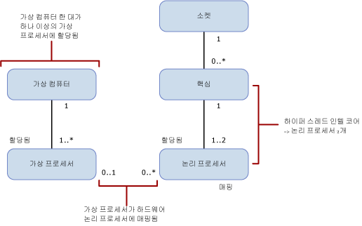

# SQL Server의 버전별 컴퓨팅 용량 제한
[!INCLUDE[appliesto-ss-xxxx-xxxx-xxx-md](../includes/appliesto-ss-xxxx-xxxx-xxx-md.md)]
  이 항목에서는 [!INCLUDE[ssCurrent](../includes/sscurrent-md.md)]의 버전별 컴퓨팅 용량 제한과 이들 버전이 하이퍼 스레드 프로세서가 있는 물리적 환경 및 가상화된 환경에서 서로 어떻게 다른지에 대해 설명합니다.  
  
   
  
 이 표에서는 위 다이어그램의 표기법에 대해 설명합니다.  
  
|값|Description|  
|-----------|-----------------|  
|0..1|없거나 1개|  
|1|정확히 1개|  
|1..\*|1개 이상|  
|0..\*|없거나 1개 이상|  
|1..2|1개 또는 2개|  
  
> [!IMPORTANT]  
> 보다 중점적으로 설명하면  
>   
> - 가상 머신(VM)에 하나 이상의 가상 프로세서가 있습니다.  
> - 하나 이상의 가상 프로세서가 정확히 가상 머신 한 대에 할당됩니다.  
> - 0 또는 1개의 가상 프로세서가 0개 이상의 논리적 프로세서에 매핑됩니다. 가상 프로세서 대 논리 프로세서의 매핑이 
>     -   1대 0인 경우, 바인딩되지 않은 논리적 프로세서가 게스트 운영 체제에서 사용되지 않은 것을 나타냅니다.  
>     -   1대 다인 경우, 오버 커밋을 나타냅니다.  
>     -   0대 다인 경우, 호스트 시스템에 가상 머신이 없음을 나타냅니다. 따라서 VM은 어떠한 논리 프로세서도 사용하지 않습니다.  
> - 소켓은 0 이상의 코어에 매핑됩니다. 소켓 대 코어의 매핑이  
>     -   1대 0인 경우, 빈 소켓을 나타냅니다. 칩이 설치되지 않았습니다.  
>     -   1대 1인 경우, 단일 코어 칩이 소켓에 설치되었음을 나타냅니다. 이 매핑은 요즘 거의 없습니다.  
>     -   1대 다인 경우, 다중 코어 칩이 소켓에 설치되었음을 나타냅니다. 일반적인 값은 2, 4, 8입니다.  
> - 코어 하나는 0 또는 2개의 논리적 프로세서에 매핑됩니다. 코어 대 논리 프로세서의 매핑이  
>     -   1대 1인 경우, 하이퍼 스레딩이 해제되어 있습니다.  
>     -   1대 2인 경우, 하이퍼 스레딩이 설정되어 있습니다.  
  
 다음 정의는 이 항목에서 사용된 용어에 적용됩니다.  
  
-   스레드 또는 논리적 프로세서는 [!INCLUDE[ssNoVersion](../includes/ssnoversion-md.md)]의 큐브 뷰, 운영 체제, 애플리케이션 또는 드라이버의 단일 논리적 컴퓨팅 엔진입니다.  
  
-   코어는 프로세서 단위입니다. 이는 하나 이상의 논리 프로세서로 구성될 수 있습니다.  
  
-   실제 프로세서는 하나 이상의 코어로 구성될 수 있습니다. 실제 프로세서는 프로세서 패키지 또는 소켓과 동일합니다.  
  
하나 이상의 실제 프로세서가 포함된 시스템이나 여러 코어 및/또는 하이퍼 스레드가 있는 실제 프로세서가 포함된 시스템은 운영 체제에서 여러 태스크를 동시에 실행할 수 있도록 합니다. 각 실행 스레드는 논리적 프로세서로 나타납니다. 예를 들어 하이퍼스레딩을 사용하고 코어당 스레드 두 개인 쿼드 코어 프로세서 두 개가 컴퓨터에 있는 경우, 논리 프로세서 수는 프로세서 2개 x 프로세서당 코어 4개 x 코어당 스레드 2개로 16개가 됩니다. 주의해야 할 사항은 다음과 같습니다.  
  
-   하이퍼 스레드 코어의 단일 스레드에서 논리적 프로세서의 컴퓨팅 용량은 하이퍼 스레딩을 사용하지 않은 동일한 코어에서 논리적 프로세서의 컴퓨팅 용량보다 적습니다.  
  
-   하이퍼 스레드 코어에서 논리적 프로세서 두 개의 컴퓨팅 용량은 하이퍼 스레딩을 사용하지 않은 동일한 코어의 컴퓨팅 용량보다 큽니다.  
  
각 [!INCLUDE[ssNoVersion](../includes/ssnoversion-md.md)] 버전은 다음과 같은 두 가지 컴퓨팅 용량 제한을 갖습니다.  
  
- 최대 소켓 수(또는 실제 프로세서 또는 프로세서 패키지)  
  
- 운영 체제에서 보고한 최대 코어 수  
  
이러한 제한은 [!INCLUDE[ssNoVersion](../includes/ssnoversion-md.md)]의 단일 인스턴스에 적용됩니다. 또한 단일 인스턴스에서 사용할 최대 컴퓨팅 용량을 나타냅니다. 이는 인스턴스가 배포될 수 있는 서버를 제한하지 않습니다. 실제로 [!INCLUDE[ssNoVersion](../includes/ssnoversion-md.md)]의 여러 인스턴스를 동일한 실제 서버에 배포하는 것은 허용된 용량 제한보다 더 많은 소켓 및/또는 코어가 있는 실제 서버의 컴퓨팅 용량을 사용할 수 있는 효율적인 방법입니다.  
  
다음 표에서는 각 [!INCLUDE[ssCurrent](../includes/sscurrent-md.md)]버전의 단일 인스턴스에 대한 컴퓨팅 용량 제한을 보여 줍니다.  
  
|[!INCLUDE[ssNoVersion](../includes/ssnoversion-md.md)] 버전|단일 인스턴스의 최대 컴퓨팅 용량([!INCLUDE[ssNoVersion](../includes/ssnoversion-md.md)][!INCLUDE[ssDE](../includes/ssde-md.md)])|단일 인스턴스의 최대 컴퓨팅 용량(AS, RS)|  
|---------------------------------------|--------------------------------------------------------------------------------------------------------|-------------------------------------------------------------------|  
|Enterprise Edition: 코어 기반 라이선스\*|운영 체제가 지원하는 최대 크기|운영 체제가 지원하는 최대 크기|  
|Developer|운영 체제가 지원하는 최대 크기|운영 체제가 지원하는 최대 크기|  
|Standard|소켓 4개 또는 코어 24개 미만으로 제한됨|소켓 4개 또는 코어 24개 미만으로 제한됨|  
|Express|소켓 1개 또는 코어 4개 미만으로 제한됨|소켓 1개 또는 코어 4개 미만으로 제한됨|  

\*Server + CAL(클라이언트 액세스 라이선스) 라이선싱이 있는 Enterprise Edition은 [!INCLUDE[ssNoVersion](../includes/ssnoversion-md.md)] 인스턴스당 20개의 코어로 제한됩니다. (새로운 계약에는 이 라이선싱을 사용할 수 없습니다.) 코어 기반 서버 라이선스 모델에서는 제한이 없습니다.  
  
가상화된 환경에서 컴퓨팅 용량 제한은 코어가 아닌 논리 프로세서의 수를 기반으로 합니다. 그 이유는 프로세서 아키텍처가 게스트 애플리케이션에서 볼 수 없기 때문입니다. 

예를 들어, 쿼드 코어 프로세서 및 코어당 하이퍼 스레드 두 개를 사용할 수 있는 기능이 있는 소켓 4개짜리 서버에는 하이퍼 스레딩을 사용하는 논리적 프로세서가 32개 포함되어 있습니다. 그러나 하이퍼 스레딩을 사용하지 않는 논리 프로세서는 16개만 포함합니다. 이러한 논리 프로세서는 서버의 가상 컴퓨터에 매핑될 수 있습니다. 해당 논리 프로세서의 가상 머신 컴퓨팅 로드는 호스트 서버의 실제 프로세서에서 실행 스레드에 매핑됩니다.  
  
각각의 가상 프로세서 성능이 중요한 경우 하이퍼 스레딩을 해제할 수 있습니다. BIOS 설정 도중 프로세서에 대해 BIOS 설정을 사용하여 하이퍼 스레딩을 활성화 또는 비활성화할 수 있습니다. 그러나 일반적으로 서버에서 실행되는 모든 작업 부하에 영향을 주는 서버 범위 작업입니다. 이는 물리적 운영 체제 환경에서 하이퍼 스레딩 성능을 향상시킬 수 있는 워크로드로부터 가상화된 환경에서 실행되는 워크로드를 분리할 것을 제안할 수 있습니다.  
  
## 참고 항목  
 [SQL Server 2016 버전 및 구성 요소](../sql-server/editions-and-components-of-sql-server-2016.md)   
 [SQL Server 2016 버전에서 지원하는 기능](~/sql-server/editions-and-supported-features-for-sql-server-2016.md)   
 [SQL Server의 최대 용량 사양](../sql-server/maximum-capacity-specifications-for-sql-server.md)   
 [SQL Server 2016 빠른 시작 설치](https://msdn.microsoft.com/library/672afac9-364d-4946-ad5d-8a2d89cf8d81)  

[!INCLUDE[get-help-options](../includes/paragraph-content/get-help-options.md)]

[!INCLUDE[contribute-to-content](../includes/paragraph-content/contribute-to-content.md)]
