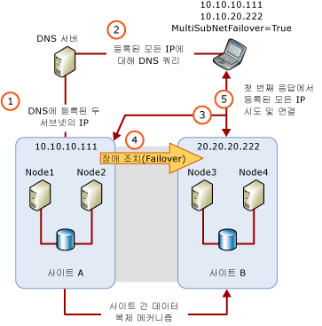

# SQL Server 다중 서브넷 클러스터링(SQL Server)
  [!INCLUDE[ssNoVersion](../../../includes/ssnoversion-md.md)] 다중 서브넷 장애 조치(failover) 클러스터는 각 장애 조치(failover) 클러스터 노드가 다른 서브넷 또는 서브넷 집합에 연결된 구성입니다. 이러한 서브넷은 같은 위치에 있을 수도 있고 지리적으로 분산된 사이트에 있을 수도 있습니다. 지리적으로 분산된 사이트의 클러스터링을 늘이기 클러스터라고도 합니다. 모든 노드에서 액세스할 수 있는 공유 저장소가 없기 때문에 여러 서브넷의 데이터 저장소 간에 데이터를 복제해야 합니다. 데이터 복제에서는 둘 이상의 데이터 복사본을 사용할 수 있습니다. 따라서 다중 서브넷 장애 조치(Failover) 클러스터는 고가용성과 함께 재해 복구 솔루션을 제공합니다.  
  
   
##   SQL Server 다중 서브넷 장애 조치 클러스터(2노드, 2서브넷)  
 다음 그림에서는 [!INCLUDE[ssCurrent](../../../includes/sscurrent-md.md)]에서 노드와 서브넷이 각각 두 개인 FCI(장애 조치(failover) 클러스터 인스턴스)를 보여 줍니다.  
  
   
  
  
##   다중 서브넷 장애 조치(Failover) 클러스터 인스턴스 구성  
 다음은 여러 서브넷을 사용하는 [!INCLUDE[ssNoVersion](../../../includes/ssnoversion-md.md)] FCI의 몇 가지 예입니다.  
  
-   [!INCLUDE[ssNoVersion](../../../includes/ssnoversion-md.md)] FCI SQLCLUST1에는 Node1과 Node2가 포함됩니다. Node1은 Subnet1에 연결되고, Node2는 Subnet2에 연결됩니다. [!INCLUDE[ssNoVersion](../../../includes/ssnoversion-md.md)] 설치 프로그램에서는 이 구성을 다중 서브넷 클러스터로 인식하여 IP 주소 리소스 종속성을 **OR**로 설정합니다.  
  
-   [!INCLUDE[ssNoVersion](../../../includes/ssnoversion-md.md)] FCI SQLCLUST1에는 Node1, Node2 및 Node3이 포함됩니다. Node1과 Node2는 Subnet1에 연결되고, Node3은 Subnet2에 연결됩니다. [!INCLUDE[ssNoVersion](../../../includes/ssnoversion-md.md)] 설치 프로그램에서는 이 구성을 다중 서브넷 클러스터로 인식하여 IP 주소 리소스 종속성을 **OR**로 설정합니다. Node1과 Node2는 같은 서브넷에 있기 때문에 이 구성은 추가적인 로컬 고가용성을 제공합니다.  
  
-   [!INCLUDE[ssNoVersion](../../../includes/ssnoversion-md.md)] FCI SQLCLUST1에는 Node1과 Node2가 포함됩니다. Node1은 Subnet1에 있고, Node2는 Subnet1과 Subnet2에 있습니다. [!INCLUDE[ssNoVersion](../../../includes/ssnoversion-md.md)] 설치 프로그램에서는 이 구성을 다중 서브넷 클러스터로 인식하여 IP 주소 리소스 종속성을 **OR**로 설정합니다.  
  
-   [!INCLUDE[ssNoVersion](../../../includes/ssnoversion-md.md)] FCI SQLCLUST1에는 Node1과 Node2가 포함됩니다. Node1은 Subnet1과 Subnet2에 연결되고, Node2도 Subnet1과 Subnet2에 연결됩니다. IP 주소 리소스 종속성은 **설치 프로그램에서** AND [!INCLUDE[ssNoVersion](../../../includes/ssnoversion-md.md)] 로 설정됩니다.  
  
    > **참고:** 이 구성은 클러스터형 노드가 동일한 서브넷 집합에 있기 때문에 다중 서브넷 장애 조치(Failover) 클러스터 구성으로 간주되지 않습니다.  
  
##   IP 주소 리소스 고려 사항  
 다중 서브넷 장애 조치(Failover) 클러스터 구성에서는 장애 조치(Failover) 클러스터의 일부 노드에서 IP 주소를 소유하지 않으므로 [!INCLUDE[ssNoVersion](../../../includes/ssnoversion-md.md)] 시작 중에 일부 IP 주소가 온라인 상태가 되지 않을 수도 있습니다. [!INCLUDE[ssSQL11](../../../includes/sssql11-md.md)]부터 IP 주소 리소스 종속성을 **OR**로 설정할 수 있습니다. 이를 통해 바인딩할 수 있는 유효한 IP 주소가 하나 이상 있는 경우 [!INCLUDE[ssNoVersion](../../../includes/ssnoversion-md.md)] 를 온라인 상태로 만들 수 있습니다.  
  
> **참고:** [!INCLUDE[ssNoVersion](../../../includes/ssnoversion-md.md)] 이전의 [!INCLUDE[ssSQL11](../../../includes/sssql11-md.md)]버전에서는 다중 사이트 클러스터 구성에 V-LAN 늘이기 기술을 사용하여 사이트 간 장애 조치(Failover)에 단일 IP 주소를 제공했습니다. 이제 여러 서브넷의 노드를 클러스터링하는 [!INCLUDE[ssNoVersion](../../../includes/ssnoversion-md.md)] 의 새 기능을 사용하면 V-LAN 늘이기 기술을 구현하지 않고도 다중 사이트에서 [!INCLUDE[ssNoVersion](../../../includes/ssnoversion-md.md)] 장애 조치(Failover) 클러스터를 구성할 수 있습니다.  
  
### IP 주소 리소스 OR 종속성 고려 사항  
 IP 주소 리소스 종속성을 **OR**로 설정한 경우 다음 장애 조치(Failover) 동작을 고려할 수 있습니다.  
  
-   현재 [!INCLUDE[ssNoVersion](../../../includes/ssnoversion-md.md)] 클러스터 리소스 그룹을 소유한 노드에서 IP 주소 중 하나에 오류가 발생한 경우 이 노드의 유효한 모든 IP 주소가 실패할 때까지 장애 조치(Failover)가 자동으로 트리거되지 않습니다.  
  
-   장애 조치(Failover)가 발생하면 현재 노드에서 유효한 IP 주소를 하나 이상 바인딩할 수 있는 경우 [!INCLUDE[ssNoVersion](../../../includes/ssnoversion-md.md)] 가 온라인 상태로 전환됩니다. 시작 시 [!INCLUDE[ssNoVersion](../../../includes/ssnoversion-md.md)] 에 바인딩되지 않은 IP 주소는 오류 로그에 나열됩니다.  
  
   
 [!INCLUDE[ssNoVersion](../../../includes/ssnoversion-md.md)] FCI가 [!INCLUDE[ssDEnoversion](../../../includes/ssdenoversion-md.md)]의 독립 실행형 인스턴스와 함께 설치되는 경우 IP 주소의 TCP 포트 번호가 충돌하지 않도록 주의합니다. 일반적으로 충돌은 [!INCLUDE[ssDE](../../../includes/ssde-md.md)] 의 두 인스턴스가 모두 기본 TCP 포트(1433)를 사용하도록 구성되는 경우 발생합니다. 충돌을 방지하려면 한 인스턴스가 기본이 아닌 고정 포트를 사용하도록 구성합니다. 고정 포트는 일반적으로 독립 실행형 인스턴스에서 더 쉽게 구성할 수 있습니다. [!INCLUDE[ssDE](../../../includes/ssde-md.md)] 이 다른 포트를 사용하도록 구성하면 [!INCLUDE[ssNoVersion](../../../includes/ssnoversion-md.md)] FCI가 실패하여 대기 노드가 될 때 인스턴스 시작을 차단하는 예기치 않은 IP 주소/TCP 포트 충돌이 방지됩니다.  
  
##   장애 조치(Failover) 중의 클라이언트 복구 대기 시간  
 기본적으로 다중 서브넷 FCI는 해당 네트워크 이름에 대해 RegisterAllProvidersIP 클러스터 리소스를 사용하도록 설정합니다. 다중 서브넷 환경에서는 네트워크 이름의 온라인 및 오프라인 IP 주소가 모두 DNS 서버에 등록됩니다. 그런 다음 클라이언트 응용 프로그램은 DNS 서버에서 등록된 모든 IP 주소를 검색하여 순서대로 또는 병렬로 주소에 연결하려고 시도합니다. 즉, 다중 서브넷 장애 조치(failover) 시 클라이언트 복구 시간은 더 이상 DNS 업데이트 대기 시간에 의존하지 않습니다. 기본적으로 클라이언트는 순서대로 IP 주소를 시도합니다. 클라이언트가 연결 문자열에 새로운 선택적인 **MultiSubnetFailover=True** 매개 변수를 사용할 경우 대신 IP 주소를 동시에 시도하고 처음 응답한 서버에 연결합니다. 그러면 장애 조치(failover)가 발생할 때 클라이언트 복구 대기 시간을 최소화할 수 있습니다. 자세한 내용은 [Always On 클라이언트 연결(SQL Server)](../../../database-engine/availability-groups/windows/always-on-client-connectivity-sql-server.md) 및 [가용성 그룹 수신기 만들기 또는 구성(SQL Server)](../../../database-engine/availability-groups/windows/create-or-configure-an-availability-group-listener-sql-server.md)을 참조하세요.  
  
 레거시 클라이언트 라이브러리 또는 타사 데이터 공급자를 사용할 경우 연결 문자열에 **MultiSubnetFailover** 매개 변수를 사용할 수 없습니다. 클라이언트 응용 프로그램이 [!INCLUDE[ssCurrent](../../../includes/sscurrent-md.md)]에서 다중 서브넷 FCI와 최적으로 작동하도록 하기 위해서는 클라이언트 연결 문자열에서 각각의 추가 IP 주소에 대해 연결 제한 시간을 21초로 조정하십시오. 그러면 다중 서브넷 FCI에서 모든 IP 주소를 시도해보기 전에 클라이언트의 재연결 시도가 시간 초과되지 않습니다.  
  
 [!INCLUDE[ssNoVersion](../../../includes/ssnoversion-md.md)] Management Studio 및 **sqlcmd** 에 대한 기본 클라이언트 연결 제한 시간은 15초입니다.  
  
   
##   관련 내용  
  
|콘텐츠 설명|항목|  
|-------------------------|-----------|  
|SQL Server 장애 조치(Failover) 클러스터 설치|[새 SQL Server 장애 조치(Failover) 클러스터 만들기(설치)](../../../sql-server/failover-clusters/install/create-a-new-sql-server-failover-cluster-setup.md)|  
|SQL Server 장애 조치(Failover) 클러스터의 전체 업그레이드|[SQL Server 장애 조치(failover) 클러스터 인스턴스 업그레이드&#40;설치 프로그램&#41;](../../../sql-server/failover-clusters/windows/upgrade-a-sql-server-failover-cluster-instance-setup.md)|  
|기존 SQL Server 장애 조치(Failover) 클러스터 유지 관리|[SQL Server 장애 조치(failover) 클러스터에서 노드 추가 또는 제거&#40;설치 프로그램&#41;](../../../sql-server/failover-clusters/install/add-or-remove-nodes-in-a-sql-server-failover-cluster-setup.md)|  
|장애 조치(Failover) 클러스터 관리 스냅인을 사용하여 WSFC 이벤트 및 로그 보기|[장애 조치(Failover) 클러스터에 대한 이벤트 및 로그 보기](http://technet.microsoft.com/library/cc772342\(WS.10\).aspx)|  
|Windows PowerShell을 사용하여 WSFC 장애 조치(Failover) 클러스터에 모든 노드나 특정 노드에 대한 로그 파일 만들기|[Get-ClusterLog 장애 조치(Failover) 클러스터 Cmdlet](http://technet.microsoft.com/library/ee461045.aspx)|  
  

  
  
