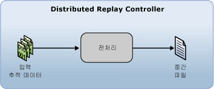

# 입력 추적 데이터 준비

[!INCLUDE[appliesto-ss-xxxx-xxxx-xxx-md](../../includes/appliesto-ss-xxxx-xxxx-xxx-md.md)]

[!INCLUDE[msCoName](../../includes/msconame-md.md)] [!INCLUDE[ssNoVersion](../../includes/ssnoversion-md.md)] Distributed Replay 기능을 사용하여 분산 재생을 시작하려면 Distributed Replay Administration Tool에서 전처리 단계를 시작하여 입력 추적 데이터를 준비해야 합니다. 전처리 단계에서는 Distributed Replay Controller가 추적 데이터를 전처리하고 중간 파일을 생성합니다.  
  
   
  
 전처리 단계에 대한 자세한 내용은 [SQL Server Distributed Replay](../../tools/distributed-replay/sql-server-distributed-replay.md)을 참조하십시오.  
  
> [!NOTE]  
>  Distributed Replay와 호환되는 [!INCLUDE[ssNoVersion](../../includes/ssnoversion-md.md)] 버전에서 입력 추적 데이터를 캡처해야 합니다. 또한 입력 추적 데이터가 추적 데이터를 재생할 대상 서버와 호환되어야 합니다. 버전 요구 사항에 대한 자세한 내용은 [Distributed Replay Requirements](../../tools/distributed-replay/distributed-replay-requirements.md)을 참조하십시오.  
  
### 입력 추적 데이터를 준비하려면  
  
1.  **(선택 사항) 전처리 구성 설정 수정**: 시스템 세션 필터링 여부 또는 최대 유휴 시간 구성 여부 등의 전처리 구성 설정을 수정하려면 XML 기반 전처리 구성 파일인 `<PreprocessModifiers>` 의 `DReplay.exe.preprocess.config`요소를 수정해야 합니다. 전처리 구성 파일을 수정하는 경우 원래 파일 대신 복사본을 수정하는 것이 좋습니다. 설정을 수정하려면 다음 단계를 수행합니다.  
  
    1.  기본 전처리 구성 파일인 `DReplay.exe.preprocess.config`를 복사한 후 복사한 파일의 이름을 바꿉니다. 기본 전처리 구성 파일은 관리 도구 설치 폴더에 있습니다.  
  
    2.  새 구성 파일에서 전처리 구성 설정을 수정합니다.  
  
    3.  전처리 단계(다음 단계)를 시작할 때 *preprocess* 옵션의 **config_file** 매개 변수를 사용하여 수정된 구성 파일의 위치를 지정합니다.  
  
     전처리 구성 파일에 대한 자세한 내용은 [Distributed Replay 구성](../../tools/distributed-replay/configure-distributed-replay.md)을 참조하세요.  
  
2.  **전처리 단계 시작**: 입력 추적 데이터를 준비하려면 **preprocess** 옵션을 사용하여 관리 도구를 실행해야 합니다.하 자세한 내용은 [전처리 옵션&#40;Distributed Replay Administration Tool&#41;](../../tools/distributed-replay/preprocess-option-distributed-replay-administration-tool.md)을 참조하세요.  
  
    1.  Windows 명령 프롬프트 유틸리티(**CMD.exe**)를 열고 Distributed Replay Administration Tool의 설치 위치(**DReplay.exe**)로 이동합니다.  
  
    2.  (선택 사항) 컨트롤러 서비스가 관리 도구와 다른 컴퓨터에서 실행 중인 경우 *controller* 매개 변수 **-m**을 사용하여 컨트롤러를 지정합니다.  
  
    3.  *input_trace_file* 매개 변수 **-i**를 사용하여 입력 추적 파일의 위치와 이름을 지정합니다.  
  
    4.  *controller_working_directory* 매개 변수 **-d**를 사용하여 컨트롤러에서 중간 파일을 저장할 위치를 지정합니다.  
  
    5.  (선택 사항) *config_file* 매개 변수 **-c**를 사용하여 전처리 구성 파일의 위치를 지정합니다. 기본 전처리 구성 파일을 복사하고 복사본을 수정한 경우 이 매개 변수를 사용하여 새 구성 파일을 가리킬 수 있습니다.  
  
    6.  (선택 사항) *status_interval* 매개 변수 **-f**를 사용하여 관리 도구가 30초가 아닌 다른 빈도로 상태 메시지를 표시하도록 지정합니다.  
  
     예를 들어 컨트롤러 서비스와 동일한 컴퓨터에서 `c:\trace1.trc`에 있는 추적 파일 및 `c:\WorkingDir` 에 있는 컨트롤러 작업 디렉터리에 대해 전처리 단계를 시작하고 기본값인 30초 간격으로 상태 메시지가 표시되도록 하려면 `dreplay preprocess -i c:\trace1.trc -d c:\WorkingDir`  
  
3.  전처리 단계가 완료되면 중간 파일이 컨트롤러 작업 디렉터리에 저장됩니다. 이벤트 재생 단계를 시작하려면 **replay** 옵션을 사용하여 관리 도구를 실행해야 합니다. 자세한 내용은 [추적 데이터 재생](../../tools/distributed-replay/replay-trace-data.md)을 참조하세요.  
  
## 참고 항목  
 [SQL Server Distributed Replay](../../tools/distributed-replay/sql-server-distributed-replay.md)   
 [Distributed Replay Requirements](../../tools/distributed-replay/distributed-replay-requirements.md)   
 [관리 도구 명령줄 옵션&#40;Distributed Replay Utility&#41;](../../tools/distributed-replay/administration-tool-command-line-options-distributed-replay-utility.md)   
 [Distributed Replay 구성](../../tools/distributed-replay/configure-distributed-replay.md)  
  
  
