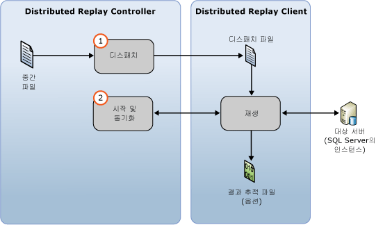

# 추적 데이터 재생
[!INCLUDE[appliesto-ss-xxxx-xxxx-xxx-md](../../includes/appliesto-ss-xxxx-xxxx-xxx-md.md)]
  입력 추적 데이터를 준비한 후 [!INCLUDE[msCoName](../../includes/msconame-md.md)] [!INCLUDE[ssNoVersion](../../includes/ssnoversion-md.md)] Distributed Replay 기능을 사용하여 분산 재생을 시작할 수 있습니다. 자세한 내용은 [입력 추적 데이터 준비](../../tools/distributed-replay/prepare-the-input-trace-data.md)를 참조하세요.  
  
 관리 도구 **replay** 옵션을 사용하여 Distributed Replay의 이벤트 재생 단계를 시작할 수 있습니다. 이 단계는 추적 데이터 디스패치와 분산 재생 시작 및 동기화의 두 부분으로 구성됩니다.  
  
   
  
 추적 데이터는 두 가지 시퀀스 모드(스트레스 모드 또는 동기화 모드) 중 하나로 재생할 수 있습니다. 기본 동작은 스트레스 모드로 추적 데이터를 재생하는 것입니다. 이벤트 재생 단계 및 시퀀스 모드에 대한 자세한 내용은 [SQL Server Distributed Replay](../../tools/distributed-replay/sql-server-distributed-replay.md)을 참조하십시오.  
  
> [!NOTE]  
>  Distributed Replay와 호환되는 [!INCLUDE[ssNoVersion](../../includes/ssnoversion-md.md)] 버전에서 입력 추적 데이터를 캡처해야 합니다. 또한 입력 추적 데이터가 추적 데이터를 재생할 대상 서버와 호환되어야 합니다. 버전 요구 사항에 대한 자세한 내용은 [Distributed Replay Requirements](../../tools/distributed-replay/distributed-replay-requirements.md)을 참조하십시오.  
  
### 추적을 재생하려면  
  
1.  **(선택 사항) 재생 구성 설정 수정:** : 시퀀스 모드 및 다양한 비율 값 등 재생 구성 설정을 수정하려면 XML 기반 재생 구성 파일인 `DReplay.exe.replay.config`의 `<ReplayOptions>` 요소를 수정해야 합니다. `<OutputOptions>` 요소를 수정하여 행 수를 기록할지 여부 등의 출력 설정을 지정할 수도 있습니다. 재생 구성 파일을 수정하는 경우 원래 파일 대신 복사본을 수정하는 것이 좋습니다. 설정을 수정하려면 다음 단계를 수행합니다.  
  
    1.  기본 재생 구성 파일인 `DReplay.exe.replay.config`를 복사한 후 복사한 파일의 이름을 바꿉니다. 기본 재생 구성 파일은 관리 도구 설치 폴더에 있습니다.  
  
    2.  새 구성 파일에서 재생 구성 설정을 수정합니다.  
  
    3.  이벤트 재생 단계(다음 단계)를 시작할 때 *replay* 옵션의 **config_file** 매개 변수를 사용하여 수정한 구성 파일의 위치를 지정합니다.  
  
     재생 구성 파일에 대한 자세한 내용은 [Distributed Replay 구성](../../tools/distributed-replay/configure-distributed-replay.md)을 참조하세요.  
  
2.  **이벤트 재생 단계 시작**: 분산 재생을 시작하려면 **replay** 옵션을 사용하여 관리 도구를 실행해야 합니다. 자세한 내용은 [재생 옵션&#40;Distributed Replay Administration Tool&#41;](../../tools/distributed-replay/replay-option-distributed-replay-administration-tool.md)을 참조하세요.  
  
    1.  Windows 명령 프롬프트 유틸리티(**CMD.exe**)를 열고 Distributed Replay Administration Tool의 설치 위치(**DReplay.exe**)로 이동합니다.  
  
    2.  (선택 사항) 컨트롤러 서비스가 관리 도구와 다른 컴퓨터에서 실행 중인 경우 *controller* 매개 변수 **-m**을 사용하여 컨트롤러를 지정합니다.  
  
    3.  *controller_working_directory* 매개 변수 **-d**를 사용하여 전처리 단계 동안 컨트롤러에서 중간 파일이 저장되는 위치를 지정합니다.  
  
    4.  (선택 사항) **-o** 매개 변수를 사용하여 각 클라이언트에서 결과 추적 파일의 재생 활동을 캡처합니다.  
  
    5.  (선택 사항) *target_server* 매개 변수 **-s**를 사용하여 Distributed Replay 클라이언트가 추적 작업을 재생할 [!INCLUDE[ssNoVersion](../../includes/ssnoversion-md.md)] 인스턴스를 지정합니다. 재생 구성 파일의 `<Server>` 요소에서 `<ReplayOptions>` 요소를 사용하여 대상 서버를 지정한 경우에는 이 매개 변수가 필요하지 않습니다.  
  
    6.  재생에 참가할 Distributed Replay 클라이언트를 지정하려면 *clients* 매개 변수 **-w**를 사용합니다. 클라이언트 컴퓨터 이름은 쉼표로 구분하여 입력합니다. 참고: IP 주소는 허용되지 않습니다.  
  
    7.  (선택 사항) *config_file* 매개 변수 **-c**를 사용하여 재생 구성 파일의 위치를 지정합니다. 기본 재생 구성 파일의 복사본을 수정한 경우 이 매개 변수를 사용하여 새 구성 파일을 가리킬 수 있습니다.  
  
    8.  (선택 사항) *status_interval* 매개 변수 **-f**를 사용하여 관리 도구가 30초가 아닌 다른 빈도로 상태 메시지를 표시하도록 지정합니다.  
  
     예를 들어 다음 구문은 컨트롤러 서비스와 같은 컴퓨터에서 재생 단계를 시작하고, `c:\WorkingDir`에 있는 컨트롤러 작업 디렉터리를 사용하고, 참가하는 각 클라이언트의 재생 활동을 캡처하고, 클라이언트 `client1` 및 `client2` 를 사용하여 재생을 수행하고, `c:\modifiedreplay.config`에 있는 수정된 재생 구성 파일에서 나머지 재생 구성 설정을 가져옵니다.  
  
     `dreplay replay -d c:\WorkingDir -o -w client1,client2 -c c:\modifiedreplay.config`  
  
3.  분산 재생이 완료되면 관리 도구에서 요약 정보가 반환됩니다. **-o** 옵션을 지정한 경우 재생 활동이 각 클라이언트의 결과 추적 파일에 저장됩니다. 결과 추적 파일에 대한 자세한 내용은 [재생 결과 검토](../../tools/distributed-replay/review-the-replay-results.md)를 참조하세요.  
  
## 참고 항목  
 [Distributed Replay Requirements](../../tools/distributed-replay/distributed-replay-requirements.md)   
 [관리 도구 명령줄 옵션&#40;Distributed Replay Utility&#41;](../../tools/distributed-replay/administration-tool-command-line-options-distributed-replay-utility.md)   
 [Distributed Replay 구성](../../tools/distributed-replay/configure-distributed-replay.md)  
  
  
