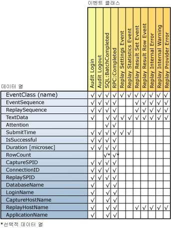

# 재생 결과 검토
[!INCLUDE[appliesto-ss-xxxx-xxxx-xxx-md](../../includes/appliesto-ss-xxxx-xxxx-xxx-md.md)] [!INCLUDE[msCoName](../../includes/msconame-md.md)] [!INCLUDE[ssNoVersion](../../includes/ssnoversion-md.md)] Distributed Replay 기능이 분산 재생을 완료하면 각 클라이언트에 대한 재생 작업을 캡처하여 각 클라이언트의 결과 추적 파일에 저장할 수 있습니다. 이 작업을 캡처하려면 **replay** 옵션을 사용하여 관리 도구를 실행할 때 **-o** 매개 변수를 사용해야 합니다. 재생 옵션에 대한 자세한 내용은 [재생 옵션&#40;Distributed Replay Administration Tool&#41;](../../tools/distributed-replay/replay-option-distributed-replay-administration-tool.md)을 참조하세요.  
  
 결과 추적 파일이 저장되는 위치는 각 클라이언트에 있는 클라이언트 구성 파일 `<ResultDirectory>`의 `DReplayClient.xml` XML 요소에 지정됩니다. 클라이언트 결과 디렉터리의 추적 파일은 각 재생 시 덮어씁니다.  
  
 결과 추적 파일에 캡처할 출력의 종류를 지정하려면 재생 구성 파일 `DReplay.exe.replay.config`를 수정합니다. `<OutputOptions>` XML 요소를 사용하여 행 개수나 결과 집합의 내용을 기록할지 여부를 지정할 수 있습니다.  
  
 이러한 구성 설정에 대한 자세한 내용은 [Distributed Replay 구성](../../tools/distributed-replay/configure-distributed-replay.md)을 참조하세요.  
  
## 결과 추적 파일에 캡처되는 이벤트 클래스  
 다음 표에서는 결과 추적 데이터에 캡처되는 이벤트 클래스를 모두 나열합니다.  
  
|범주|EventClass 이름|캡처 빈도|캡처 시점|  
|--------------|---------------------|-----------------------|----------------------|  
|Replayable Events|Audit Login|원래 추적 데이터의 각 Audit Login 이벤트에 대해 한 번|이벤트가 성공적으로 완료되거나 실패할 때|  
||Audit Logout|원래 추적 데이터의 각 Audit Logout 이벤트에 대해 한 번|이벤트가 성공적으로 완료되거나 실패할 때|  
||SQL:BatchCompleted|원래 추적 데이터의 각 SQL:BatchStarting 이벤트에 대해 한 번|이벤트가 성공적으로 완료되거나 실패할 때|  
||RPC:Completed|원래 추적 데이터의 각 RPC:Starting 이벤트에 대해 한 번|이벤트가 성공적으로 완료되거나 실패할 때|  
|Statistics and Results|Replay Settings Event|한 번|결과 추적의 첫 번째 이벤트|  
||Replay Statistics Event|한 번|결과 추적의 마지막 이벤트|  
||Replay Result Set Event|각 SQL:BatchStarting 및 RPC:Starting 이벤트에 대해 한 번   재생 구성 파일의 `<RecordResultSet>` 옵션 값이 `Yes`로 설정된 경우에만 캡처됩니다.||  
||Replay Result Row Event|결과 집합에서 SQL:BatchStarting 및 RPC:Starting 이벤트에 대한 각 행에 대해 한 번   재생 구성 파일의 `<RecordResultSet>` 옵션 값이 `Yes`로 설정된 경우에만 캡처됩니다.||  
|오류 및 경고|Replay Internal Error|각 내부 오류에 대해 한 번|내부 오류 조건이 발생할 때|  
||Replay Provider Error|각 공급자 오류에 대해 한 번|공급자 오류 조건이 발생할 때|  
  
 다음에 유의하세요.  
  
-   대상 서버에서 성공적으로 재생된 각 이벤트에 해당하는 출력 이벤트 클래스가 하나씩 있습니다.  
  
-   각 이벤트 실패나 취소의 경우 오류가 여러 개 생성될 수도 있습니다.  
  
## 이벤트 클래스 열 매핑  
 다음 표에서는 재생 중 캡처되는 각 이벤트 클래스 유형에 사용할 수 있는 결과 추적 열을 나열합니다.  
  
   
  
## 결과 추적의 열에 대한 설명  
 다음 표에서는 결과 추적 데이터의 열에 대해 설명합니다.  
  
|데이터 열 이름|데이터 형식|Description|열 ID|  
|----------------------|---------------|-----------------|---------------|  
|EventClass|**nvarchar**|이벤트 클래스의 이름입니다.|1|  
|EventSequence|**bigint**|공급자 오류 및 내부 오류와 경고의 경우 오류나 경고에 해당하는 캡처 이벤트 순서입니다.   다른 모든 이벤트 클래스의 경우 원래 추적 데이터의 이벤트 순서입니다.|2|  
|ReplaySequence|**bigint**|공급자 오류 및 내부 오류와 경고의 경우 오류나 경고에 해당하는 재생 이벤트 순서입니다.   다른 모든 이벤트 클래스의 경우 재생 중 할당된 이벤트 순서입니다.|3|  
|TextData|**ntext**|TextData의 내용은 EventClass에 따라 달라집니다.   Audit Login 및 ExistingConnection의 경우 연결에 대한 집합 옵션입니다.   SQL:BatchStarting의 경우 일괄 처리 요청의 본문입니다.   RPC:Starting의 경우 호출된 저장 프로시저입니다.   Replay Settings Event의 경우 재생 구성 파일에 정의된 설정이 이 열에 포함됩니다.   Replay Statistics Event의 경우 이 열에 다음 정보가 포함됩니다.   -재생 대상 SQL Server   -재생된 총 이벤트 수   -공급자 오류 수   -내부 오류 수   -내부 경고 수   -총 오류 수   -전체 통과율   -재생 시간(HH:MM:SS:MMM)   Replay Result Set Event의 경우 반환 결과의 열 머리글 목록을 보여 줍니다.   Replay Result Row Event의 경우 해당 행에 대한 모든 열의 반환 값을 보여 줍니다.   Replay Internal Warning 및 Replay Provider Error의 경우 공급자 경고나 오류가 이 열에 포함됩니다.|4|  
|Attention|**bigint**|이벤트의 주의 기간(마이크로초)입니다. 이 값은 캡처 추적의 Attention 이벤트에서 계산됩니다. 이벤트에 대해 쿼리 제한 시간이 지정되어 있지 않으면 이 열이 채워지지 않습니다(Null).|5|  
|SubmitTime|**datetime**|이벤트가 [!INCLUDE[ssNoVersion](../../includes/ssnoversion-md.md)]에 전송된 시간입니다.|6|  
|IsSuccessful|**int**|특정 이벤트가 성공적으로 실행되었는지 여부 및 결과 집합이 클라이언트 쪽에 반환되었는지 여부를 나타내는 부울 플래그입니다.   경고를 생성하는 이벤트(예: Attention 또는 사용자가 지정한 제한 시간으로 인해 이벤트가 취소되는 경우)는 성공한 것으로 간주됩니다.   IsSuccessful은 다음 중 하나일 수 있습니다.   1 = 성공   0 = 실패|7|  
|Duration [microsec]|**bigint**|이벤트의 응답 기간(마이크로초)입니다. 측정은 logon/log off/RPC/Language 이벤트가 [!INCLUDE[ssNoVersion](../../includes/ssnoversion-md.md)]로 전송될 때 시작됩니다.   이벤트가 이어지는 경우 전체 결과 집합이 모두 사용되었을 때 측정이 끝납니다.   이벤트가 이어지지 않는 경우 이벤트가 실패하거나 취소될 때 측정이 끝납니다.|8|  
|RowCount|**bigint**|재생 구성 파일의 `<RecordRowCount>` 값에 따라 채워집니다.   `<RecordRowCount>` 가 Yes이면 [!INCLUDE[ssNoVersion](../../includes/ssnoversion-md.md)]가 반환한 결과 집합의 행 수가 이 셀에 포함됩니다.   `<RecordRowCount>` 가 No이면 이 셀이 채워지지 않습니다(Null).|9|  
|CaptureSPID|**int**|이벤트 캡처 세션의 ID입니다.|10|  
|ConnectionID|**int**|이벤트 캡처 연결의 ID입니다.|11|  
|ReplaySPID|**int**|이벤트 재생 세션의 ID입니다.|12|  
|DatabaseName|**nvarchar**|사용자 문이 실행되는 데이터베이스의 이름입니다.|13|  
|LoginName|**nvarchar**|사용자 로그인 이름입니다. [!INCLUDE[ssNoVersion](../../includes/ssnoversion-md.md)] domain_name *user_name*\\*형식의 Microsoft Windows 로그인 자격 증명 또는*보안 로그인일 수 있습니다.|14|  
|CaptureHostName|**nvarchar**|캡처하는 동안 클라이언트 서비스를 실행 중인 컴퓨터의 이름입니다.|15|  
|ReplayHostName|**nvarchar**|재생하는 동안 클라이언트를 실행 중인 컴퓨터의 이름입니다.|16|  
|ApplicationName|**nvarchar**|캡처하는 동안 [!INCLUDE[ssNoVersion](../../includes/ssnoversion-md.md)] 연결을 만든 클라이언트 응용 프로그램의 이름입니다.|17|  
  
## 참고 항목  
 [SQL Server Distributed Replay](../../tools/distributed-replay/sql-server-distributed-replay.md)   
 [Distributed Replay Requirements](../../tools/distributed-replay/distributed-replay-requirements.md)   
 [관리 도구 명령줄 옵션&#40;Distributed Replay Utility&#41;](../../tools/distributed-replay/administration-tool-command-line-options-distributed-replay-utility.md)   
 [Distributed Replay 구성](../../tools/distributed-replay/configure-distributed-replay.md)  
  
  
