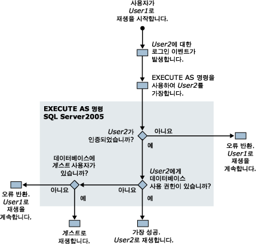

# SQL Server 프로파일러 실행에 필요한 권한
[!INCLUDE[appliesto-ss-xxxx-xxxx-xxx-md](../../includes/appliesto-ss-xxxx-xxxx-xxx-md.md)]
  기본적으로 [!INCLUDE[ssSqlProfiler](../../includes/sssqlprofiler-md.md)] 를 실행하려면 추적 작성에 사용된 Transact-SQL 저장 프로시저와 같은 동일한 사용자 권한이 있어야 합니다. [!INCLUDE[ssSqlProfiler](../../includes/sssqlprofiler-md.md)]를 실행하려면 사용자에게 ALTER TRACE 권한이 있어야 합니다. 자세한 내용은 [GRANT 서버 사용 권한&#40;Transact-SQL&#41;](../../t-sql/statements/grant-server-permissions-transact-sql.md)을 참조하세요.  
  
> [!IMPORTANT]  
>  SHOWPLAN, ALTER TRACE 또는 VIEW SERVER STATE 권한이 있는 사용자는 실행 계획 출력에 캡처된 쿼리를 볼 수 있습니다. 이러한 쿼리에는 암호 같은 중요한 정보가 포함되어 있을 수 있습니다. 따라서 db_owner 고정 데이터베이스 역할의 멤버나 sysadmin 고정 서버 역할의 멤버 같이 중요한 정보를 볼 지위에 있는 사용자에게만 이러한 권한을 부여하는 것이 좋습니다. 또한 실행 계획 파일을 저장하거나 실행 계획 관련 이벤트가 포함된 파일을 추적할 때는 NTFS 파일 시스템이 적용된 위치만 사용하고 중요한 정보를 볼 지위에 있는 사용자에게만 해당 위치에 대한 액세스 권한을 부여하는 것이 좋습니다.  
  
## 추적 재생에 사용되는 권한  
 추적을 재생할 때도 추적을 재생하는 사용자에게 ALTER TRACE 권한이 있어야 합니다.  
  
 그러나 추적을 재생하는 동안 재생 중인 추적에 로그인 감사 이벤트가 발생하는 경우 [!INCLUDE[ssSqlProfiler](../../includes/sssqlprofiler-md.md)] 에서 EXECUTE AS 명령을 사용합니다. [!INCLUDE[ssSqlProfiler](../../includes/sssqlprofiler-md.md)] 에서는 EXECUTE AS 명령을 사용하여 로그인 이벤트와 연관된 사용자를 가장합니다.  
  
 [!INCLUDE[ssSqlProfiler](../../includes/sssqlprofiler-md.md)] 에서 재생 중인 추적에 로그인 이벤트가 발생하는 경우 다음 권한 검사가 수행됩니다.  
  
1.  사용자1(ALTER TRACE 권한 보유)이 추적 재생을 시작합니다.  
  
2.  사용자2에 대한 로그인 이벤트가 재생된 추적에서 발생합니다.  
  
3.  [!INCLUDE[ssSqlProfiler](../../includes/sssqlprofiler-md.md)] 에서 EXECUTE AS 명령을 사용하여 사용자2를 가장합니다.  
  
4.  [!INCLUDE[ssNoVersion](../../includes/ssnoversion-md.md)] 에서 사용자2에 대한 인증을 시도하고 그 결과에 따라 다음 중 하나가 발생합니다.  
  
    1.  사용자2가 인증 받지 못한 경우 [!INCLUDE[ssSqlProfiler](../../includes/sssqlprofiler-md.md)] 는 오류를 반환하고 사용자1로 추적 재생을 계속합니다.  
  
    2.  사용자2가 성공적으로 인증 받은 경우 사용자2로 추적 재생을 계속합니다.  
  
5.  대상 데이터베이스에 대해 사용자2에 대한 권한을 검사하고 그 결과에 따라 다음 중 하나가 발생합니다.  
  
    1.  사용자2가 대상 데이터베이스에 권한을 갖는 경우 가장이 성공적으로 수행되고 추적은 사용자2로 재생됩니다.  
  
    2.  사용자2가 대상 데이터베이스에 권한을 갖지 않는 경우 서버에서 해당 데이터베이스의 게스트 사용자에 대해 검사합니다.  
  
6.  대상 데이터베이스에 대해 게스트 사용자의 존재를 검사하고 그 결과에 따라 다음 중 하나가 발생합니다.  
  
    1.  게스트 계정이 있으면 추적이 게스트 계정으로 재생됩니다.  
  
    2.  대상 데이터베이스에 게스트 계정이 없으면 오류가 반환되고 추적이 사용자1로 재생됩니다.  
  
 다음 다이어그램은 추적 재생 시 이러한 권한의 검사 프로세스를 보여 줍니다.  
  
   
  
## 참고 항목  
 [SQL Server Profiler 저장 프로시저&#40;Transact-SQL&#41;](../../relational-databases/system-stored-procedures/sql-server-profiler-stored-procedures-transact-sql.md)   
 [추적 재생](../../tools/sql-server-profiler/replay-traces.md)   
 [추적 만들기&#40;SQL Server Profiler&#41;](../../tools/sql-server-profiler/create-a-trace-sql-server-profiler.md)   
 [추적 테이블 재생&#40;SQL Server Profiler&#41;](../../tools/sql-server-profiler/replay-a-trace-table-sql-server-profiler.md)   
 [추적 파일 재생&#40;SQL Server Profiler&#41;](../../tools/sql-server-profiler/replay-a-trace-file-sql-server-profiler.md)  
  
  
